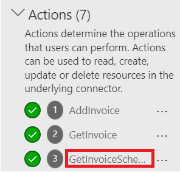

**Atelier 1 - Création d'un connecteur personnalisé pour l'API existante
et utilisation de celui-ci dans l'application canvas**

**Durée estimée :** 35 min

**Objectif :** Dans cet atelier, vous allez apprendre à créer votre
premier connecteur personnalisé pour une API existante appelée Contoso
Invoicing, à créer une application canevas et à utiliser le connecteur
dans l'application canevas.

**Tâche 1 : Examiner l'API**

Pour examiner l'API, procédez comme suit :

1.  Allez à +++<https://contosoinvoicing.azurewebsites.net/>+++.

2.  Pour sélectionner le lien de la documentation, cliquez **Here** à
    côté de ‘ Vous pouvez trouver la documentation de l'API ‘.

> 

3.  Passez en revue les opérations disponibles.

> 

4.  Fermez l'onglet ou la fenêtre du navigateur de documentation.

5.  Sélectionnez le lien **Open API definition** .

> 

6.  L'image suivante montre un exemple de la version OpenAPI de ce qui a
    été montré sur la page de documentation. Cliquez avec le bouton
    droit de la souris et sélectionnez **Save as** .

> 

7.  Enregistrez le fichier localement sur le bureau de la machine
    virtuelle. Vous utiliserez ce fichier plus loin dans l'exercice.

8.  Fermez l'onglet ou la fenêtre du navigateur de définitions.

9.  Sélectionnez le lien **API Key** .

> 

10. Copiez et enregistrez votre clé API dans le bloc-notes de votre
    machine virtuelle, car vous en aurez besoin plus tard.

> 

11. Sélectionnez **Return to home**.

> 

12. Sélectionnez **Download Logo**.

> 

13. Enregistrez l'image du logo localement sur le bureau de la machine
    virtuelle ; Vous l'utiliserez plus tard.

**Tâche 2 : Créer une solution**

Pour créer une solution, procédez comme suit :

1.  Accédez à <https://make.powerapps.com/> et assurez-vous que vous
    êtes dans l' environnement **Dev One**.

> 

2.  Dans le volet de navigation de gauche, sélectionnez **Solutions**.

> 

3.  Sélectionnez **+New solution** dans le ruban supérieur.

> 

4.  Entrez +++**Contoso invoicing**+++ pour le **Display name**  et
    sélectionnez **+ New publisher**.

> 

5.  Entrez +++**Contoso**+++ pour Nom d'affichage, +++**Contoso**+++
    pour Nom, +++**contoso**+++ pour Préfixe, puis sélectionnez
    **Save**.

> 
>
> **Remarque :** Si vous recevez un message ‘d'erreur indiquant qu'il
> existe déjà un enregistrement avec des valeurs de clé
> correspondantes‘, ignorez-le et fermez la fenêtre ‘Nouvel éditeur ‘.
>
> 

6.  Maintenant, dans la fenêtre **New solution**, sélectionnez
    **Contoso** pour **Publisher**, puis Créer. Lorsque vous travaillez
    sur un vrai projet, il est préférable de créer votre propre éditeur.

> 

7.  Ne quittez pas cette page après avoir sélectionné **Create**. Vous
    serez automatiquement redirigé vers la solution de facturation
    Contoso.

**Tâche 3 : Créer un connecteur**

Pour créer un connecteur, procédez comme suit :

1.  Assurez-vous que vous êtes dans la **s**olution **Contoso
    invoicing**  que vous avez créée.

> 

2.  Sélectionnez **+ New** | **Automation** | **Custom connector**.

> 

3.  Entrez +++**Contoso invoicing**+++ pour le **connector name**.

> 

4.  Sélectionnez **Télécharger** pour télécharger l'image.

> 

5.  Sélectionnez l'image du logo du connecteur que vous avez téléchargée
    dans **Task 1: Review the API**.

6.  Entrez +++**\#175497+++** pour **Icon background color**.

7.  Entrez +++**Custom connector for Contoso Invoicing
    API**+++ pour **Description**.

8.  Entrez +++**contosoinvoicingtest.azurewebsites.net+++** pour
    **Host**.

> 

9.  Sélectionnez **Create connector**.

> 

10. Ne vous éloignez pas de cette page.

**Tâche 4 : Importer la définition OpenAPI**

Pour importer la définition OpenAPI, procédez comme suit :

1.  Sélectionnez la flèche en regard de **Connector Name**.

> 

2.  Sélectionnez les points de suspension (**...**) du connecteur, puis
    sélectionnez **Update from OpenAPI file**

> 

3.  Sélectionnez **Import**.

> 

4.  Sélectionnez le **swagger.json**  que vous avez téléchargé dans
    **Task 1: Review the API** , puis sélectionnez **Open**.

> 

5.  Sélectionnez **Continue**.

> 

6.  Renseignez l'URL de l'hôte sous la forme
    +++**contosoinvoicingtest.azurewebsites.net+++,** puis sélectionnez
    **Security**.

> 

7.  Notez que les champs sont remplis à partir du fichier importé.

> 

8.  Ne vous éloignez pas de cette page.

**Tâche 5 : Examiner et ajuster les définitions**

Pour examiner et ajuster les définitions, procédez comme suit :

1.  Sélectionnez l' onglet **Définition**.

> 

2.  Prenez quelques minutes pour passer en revue les opérations qui ont
    été importées.

3.  Remarquez le cercle d'information bleu à côté de **GetInvoice**.

> 

4.  Sélectionnez l' opération **GetInvoice**.

> 

5.  Notez que l'opération indique un **summary** manquant.

> 

6.  Entrez **Get Invoice**  comme **summary** pour améliorer la
    convivialité.

> 

7.  Notez le cercle d'information bleu en regard de l' opération
    **PayInvoice** et qu'il indique une **description** manquante.

> 

8.  Sélectionnez l 'opération **PayInvoice.**

> 

9.  Entrez **Pay an invoice**  comme **Description**.

> 

10. Supprimez les deux opérations **NewInvoice**, car vous ne les
    utiliserez pas.

> 

11. Sélectionnez l' opération **GetInvoiceSchema**.

> 

12. Modifiez l' option **Visibility**sur **internal** afin que les
    utilisateurs ne la voient pas dans leur liste d'actions, puis
    sélectionnez **Update connector**.

> 

13. Ne vous éloignez pas de cette page.

**Tâche 6 : Tester le connecteur**

Pour tester le connecteur, procédez comme suit :

1.  Sélectionnez l' onglet **Test**.

> 

2.  Sélectionnez **+ New connection**.

> 

3.  Collez la **API key** que vous avez enregistrée dans **Task 1:
    Review the API** , puis sélectionnez **Create connection**.

> 

4.  Sélectionnez le bouton **Refresh**.

> 

5.  Sélectionnez **ListInvoiceTypes | Test Operation**.

> 

6.  Vous devriez voir les données des types de factures dans la zone du
    corps.

> 

7.  Sélectionnez **Close** pour fermer la fenêtre du connecteur
    personnalisé.

> 

**Tâche 7 : Utiliser un connecteur personnalisé dans l'application
canevas**

Dans cette tâche, vous allez créer une application canevas et utiliser
le connecteur personnalisé que vous avez créé pour afficher une liste de
factures.

1.  Revenez au portail du créateur Power Apps. Sélectionnez la fenêtre
    Qui surgit **Done** sur qui indique « En cours de création d'un
    connecteur personnalisé ». Assurez-vous que vous êtes dans l'
    environnement **Dev One**.

> 
>
> **Remarque :** Si le portail n'est pas déjà ouvert, accédez à
> +++<https://make.powerapps.com/>+++ et assurez-vous que vous êtes dans
> l' **environnement Dev One**.

2.  Assurez-vous que vous êtes dans la **solution de facturation
    Contoso** que vous avez créée. Si ce n'est pas le cas, sélectionnez
    **Solutions** et ouvrez la solution **Contoso invoicing**  que vous
    avez créée.

> 

3.  Sélectionnez **+ New**, puis \> **App \> Canvas app**.

> 

4.  Entrez **Contoso invoicing app**  pour Nom de l'application,
    sélectionnez **Phone**  pour Format, puis **Create**.

> 

5.  Sélectionnez **Skip** dans la fenêtre d'accueil.

> 

6.  Sélectionnez l' onglet **Data**, sélectionnez **+ Add data**..

> 

7.  développez **Connectors**, puis sélectionnez le connecteur
    personnalisé **de Contoso invoicing**  que vous avez créé.

> 

8.  Sélectionnez le **+ Add a connector**.

> 

9.  Collez la clé API que vous avez enregistrée dans la **Task 1: Review
    the API** , puis sélectionnez **connect**.

> 

10. Sélectionnez **Got it** dans la fenêtre contextuelle d'avertissement
    premium.

> 

11. Sélectionnez l' onglet **Tree view** 

> 

12. Sélectionnez **+ Insert**, puis Sélectionnez **Vertical gallery**.

> 

13. Sélectionnez **ContosoInvoicing** pour les données.

> 

14. Définissez les **Items**  sur la valeur ci-dessous.

> +++ContosoInvoicing.ListInvoices().invoices+++
>
> 

15. Développez la galerie et sélectionnez le **subtitle**.

> 

16. Définissez la valeur **Text** du sous-titre sur
    +++**ThisItem.amount**+++.

> 

17. Développez la galerie et sélectionnez le **title** à l'intérieur de
    la galerie.

> 

18. Définissez la valeur **Texte** du titre sur
    +++**ThisItem.accountName**+++.

> 

19. La galerie doit maintenant ressembler à l'image ci-dessous.

> 

**Résumé :** Dans cet atelier, vous avez appris à créer un connecteur
personnalisé pour une API existante, à importer la définition d'API et à
utiliser ce connecteur dans l'application canevas pour afficher une
liste de factures. Les connecteurs personnalisés sont basés sur des
fonctions, ils appellent des fonctions spécifiques dans le service
sous-jacent de l'API pour retourner les données correspondantes.
