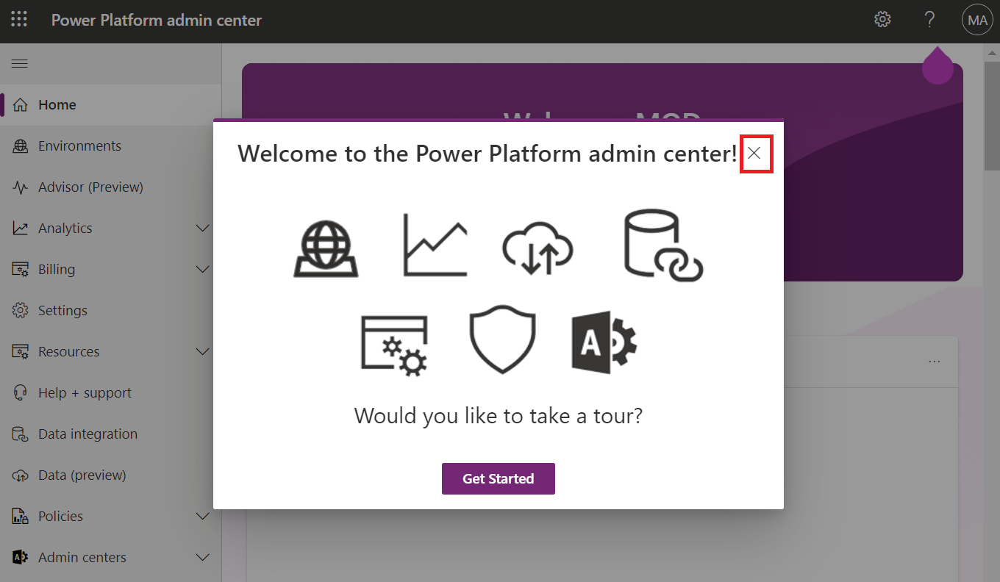

**실습 0: 실습 환경을 설정하기**

**예상 소요 시간:** 7분

**목표:** 이 실습에서 Power Apps 체험판 라이선스를 획득할 것입니다.

### **작업 1:** **Power Apps 체험판 라이선스를 할당하기** 

1.  VM에서 웹 브라우저를 열고
    <https://powerapps.microsoft.com/en-us/free/>를 이동하세요.

> 

2.  **Start free**를 선택하세요.

> 

3.  **Office 365 admin credential**를 입력하고 **accept the agreement**
    확인란을 선택하고**Start your free trial**를 클릭하세요.

> 

4.  **Password of your Office 365 tenant id**를 입력하고 **Sign in**을
    선택하세요.

> 

5.  **Stay signed in?** 팝업 창에서 **Yes**를 선택하세요.

> 

6.  팝업이 나타나면 다음 **Contact Information**을 제공하고 **Submit**를
    선택하세요.

> Email: **Office 365 admin tenant credentials**
>
> Country/region: **United States**
>
> Phone number: **Your phone number**
>
> 

7.  **Home page of Power Apps**을 볼 수 있습니다. 환경 선택기에서 개발자
    환경인 **Dev One**을 선택하세요.

> 

8.  새 탭을 열고 <https://admin.powerplatform.microsoft.com>로 이동하여
    Power Platform admin center로 이동한 후 필요한 경우 지정된 Office
    365 테넌트 관리자 자격 증명을 사용하여 로그인하세요. Welcome to the
    Power Platform admin center'라는 **Pop-up window**를
    **Close**하세요.

> 

1.  왼쪽 탐색 차에서 **Environments**를 선택하고 **Dev One**이 Dataverse
    환경을 볼 수 있습니다.

> 
>
> **요약:** 이 실습에서 Power Apps 체험판 라이선스를 획득했습니다.
