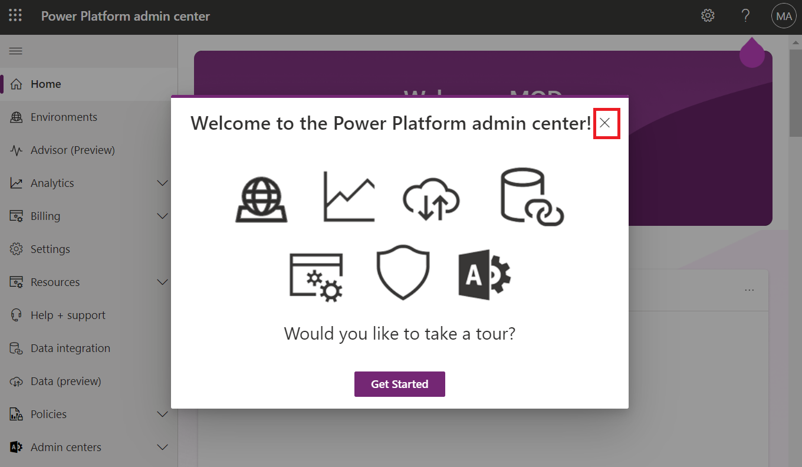

**Laboratório 0: Configurando o ambiente de laboratório**

**Duração estimada:** 7 minutos

**Objetivo:** Neste laboratório, você adquirirá uma licença de teste do
Power Apps.

### **Tarefa 1: Atribuir** **licença de teste do Power Apps**

1.  Abra um navegador da Web em sua VM e acesse
    [<https://powerapps.microsoft.com/en-us/free/>](https://powerapps.microsoft.com/en-us/free/).

> 

2.  Selecione **Start free**.

> 

3.  Insira suas **Office 365 admin credential**, marque a caixa de
    seleção para **accept the agreement** e clique em **Start your free
    trial**.

> 

4.  Digite a **password of your Office 365 tenant id** e selecione
    **Sign in**.

> 

5.  Selecione **Yes** na janela pop-up **Stay signed in?**

> 

6.  Se a janela pop-up aparecer, forneça **as Contact Information**
    conforme abaixo e selecione **Submit**.

> Email: **Office 365 admin tenant credentials**
>
> Country/region: **United States**
>
> Phone number: **Your phone number**
>
> 

7.  Agora você pode ver a **Home page of Power Apps.** No seletor de
    ambientes, selecione o ambiente de desenvolvedor – **Dev One –** que
    foi criado para você.

> 

8.  Abra a nova aba e acesse o centro de administração do Power Platform
    navegando até <https://admin.powerplatform.microsoft.com> E, se
    necessário, entre usando suas credenciais de administrador de
    locatário do Office 365. **Feche** a **janela pop-up** que diz "
    Welcome to the Power Platform admin center".

> 

9.  No painel de navegação esquerdo, selecione **Environments** e então
    você poderá ver que **Dev One** é seu ambiente Dataverse.

> 
>
> **Resumo:** Neste laboratório, você adquiriu uma licença de teste do
> Power Apps.
