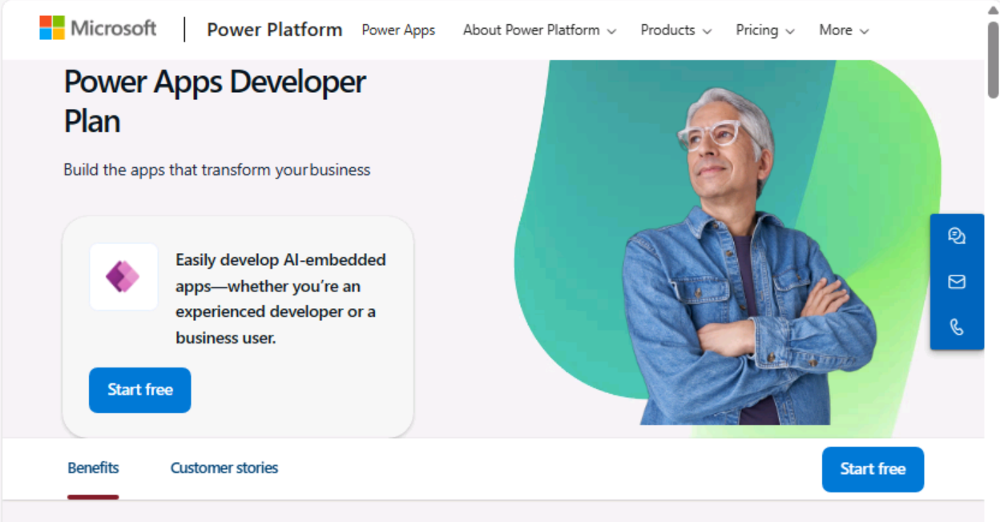

**Laboratorio 0: Configurar el entorno del laboratorio**

**Duración estimada:** 7 minutos

**Objetivo:** En este laboratorio, va a obtener una licencia de Power
Apps trial.

### **Tarea 1: Asigne el** **Power Apps trial license** 

1.  Abra un navegador en su VM y vaya a
    <https://powerapps.microsoft.com/en-us/free/> .

> 

2.  Seleccione **Start free**.

> 

3.  Introduzca sus **Office 365 admin credentials**, seleccione la
    casilla para **aceptar el acuerdo** y haga clic en **Start free**.

> 

4.  Introduzca **la contraseña de su Office 365 tenant id** y seleccione
    **Sign in**.

> 

5.  Seleccione **Yes** en la ventana emergente **Stay signed in?**.

> 

6.  Si aparece una ventana emergente, proporcione **Contact
    Information** como se ve a continuación y seleccione **Submit**.

> Email: **Office 365 admin tenant credentials**
>
> Country/region: **United States**
>
> Phone number: **su número de teléfono**
>
> 

7.  Ahora puede ver **Home page of Power Apps.** Desde el environment
    selector, seleccione el developer environment – **Dev One** que se
    ha creado para usted.

> 

8.  Abra una nueva pestaña y vaua a Power Platform admin center al
    navegar a <https://admin.powerplatform.microsoft.com> y si le pide,
    inicie sesión con sus Office 365 tenant admin credentials.
    **Cierre** el **Pop-up window** diciendo, ‘Welcome to the Power
    Platform admin center’.

> 

9.  Desde el panel de navegación izquierdo, seleccione **Environments**
    y puede ver, **Dev One** es su Dataverse environment.

> 
>
> **Resumen:** En este laboratorio, ha obtenido la licencia Power Apps
> trial.
