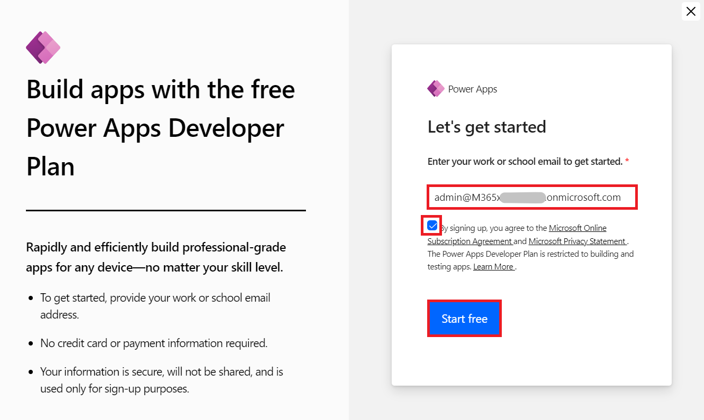

**实验 0：设置实验环境**

**预计持续时间：** 7 分钟

**目标：**在本实验中，您将获取 Power Apps 试用许可证。

### **任务 1：分配 Power Apps 试用许可证** 

1.  在 VM 上打开 Web 浏览器，然后转到
    <https://powerapps.microsoft.com/en-us/free/>。

> 

2.  选择 **Start free**。

> 

3.  输入您的 **Office 365
    管理员凭据**，选中复选框以**接受协议**，然后单击 **Start your free
    trial**。

> 

4.  输入 **Office 365 租户 ID 的密码**，然后选择 “**Sign in**”。

> 

5.  在 **Stay signed in?** 上选择 **Yes**，弹出窗口。

> 

6.  如果出现弹出窗口，请提供如下**联系信息**，然后选择 **Submit**。

> 电子邮件：**Office 365 管理员租户凭据**
>
> 国家/地区：**United States**
>
> 电话号码： **您的电话号码**
>
> 

7.  您现在可以看到 **Power Apps
    的主页**。从环境选择器中，选择为您创建的开发人员环境 – **Dev One**。

> 

8.  打开新选项卡，导航到 <https://admin.powerplatform.microsoft.com>
    转到 Power Platform 管理中心，如果需要，使用给定的 Office 365
    租户管理员凭据登录。**关闭**显示 “Welcome to the Power Platform
    admin center” 的**弹出窗口**。

> 

9.  从左侧导航窗格中，选择 **Environments**，然后您可以看到 **Dev One**
    是您的 Dataverse 环境。

> 
>
> **摘要：**在本实验中，您获得了 Power Apps 试用许可证。
