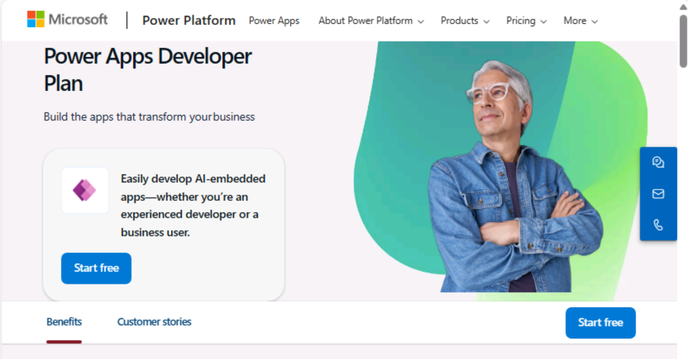
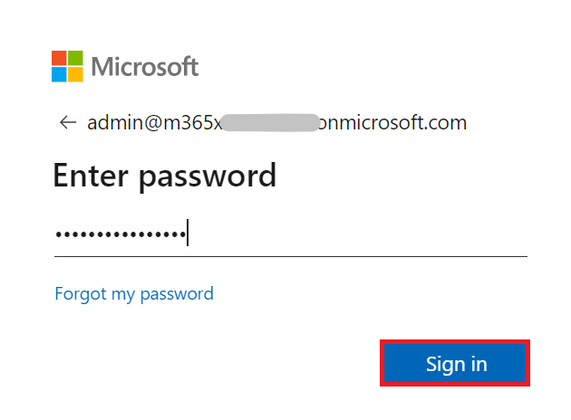
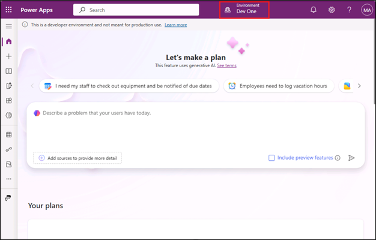
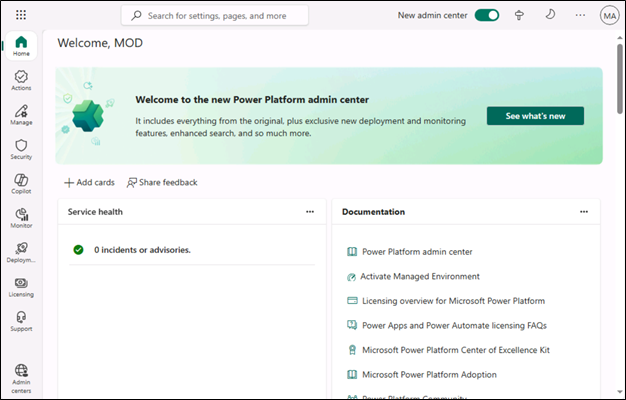
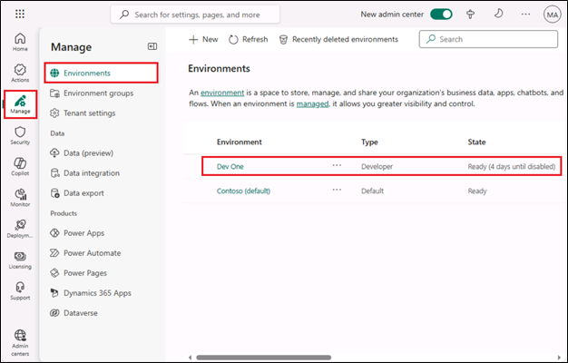

# **Lab 0: Setting up lab environment**

**Estimated Duration:** 7 min

**Objective:** In this lab, you will acquire Power Apps trial license.

### **Task 1: Assign** **Power Apps trial license** 

1.  Open a web browser on your VM and go to
    +++**https://powerapps.microsoft.com/en-us/free/**+++ .

     

2.  Select **Start free**.

   

3.  Enter your **Office 365 admin credential**, check the checkbox to
    **accept the agreement** and click on **Start free**.

    

4.  Enter **password of your Office 365 tenant id** and then select
    **Sign in**.

   

5.  Select **Yes** on **Stay signed in?** pop-up window.

     

6.  If a pop-up appears, provide **Contact Information** as below and then
    select **Submit**.

     Email: **Office 365 admin tenant credentials**
    
     Country/region: **United States**
    
     Phone number: **Your phone number**

    

7.  You can now see **Home page of Power Apps.** From the environment
    selector, select the developer environment – **Dev One** which is
    created for you.

     

8.  Open the new tab and go to Power Platform admin center by navigating
    to +++https://admin.powerplatform.microsoft.com+++ and if required, sign
    in using your given Office 365 tenant admin credentials. **Close**
    the **pop-up window** saying, ‘Welcome to the new Power Platform admin
    center’.

     

9.  From the left navigation pane, select **Manage** > **Environments** and then you
    can see, **Dev One** is your Dataverse environment.

     

     **Summary:** In this lab, you acquired Power Apps trial license.
