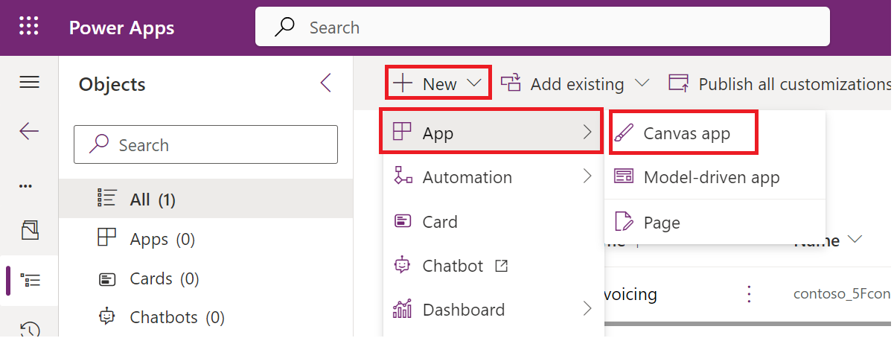

**실습 1 - 기존 API에 대한 사용자 지정 커넥터를 빌드하고 캔버스 앱에서
사용하기**

**예상 소요 시간:** 35분

**목표:** 이 실습에서는 Contoso Invoicing이라는 기존 API에 대한 첫 번째
사용자 지정 커넥터를 생성하고 캔버스 앱을 생성하고 캔버스 앱에서
커넥터를 사용하는 방법을 알아볼 것입니다.

**작업 1: API를 검토하기**

To review the API를 검토하려면 다음 단계를 수행하세요:

1.  +++<https://contosoinvoicing.azurewebsites.net/>+++로 이동하세요.

2.  설명서 링크를 선택하려면 ‘You can find the API documentation’옆의
    **here**를 클릭하세요.

> 

3.  사용 가능한 작업을 검토하세요.

> 

4.  설명서 브라우저 탭이나 창을 닫으세요.

5.  **Open API definition** 링크를 선택하세요.

> 

6.  다음 이미지는 설명서 페이지에 표시된 OpenAPI 버전의 예를 보여줍니다.
    마우스 오른쪽 버튼을 클릭하고 **Save as**을 선택하세요.

> 

7.  VM의 데스크톱에 파일을 로컬로 저장하세요. 이 파일은 연습의
    뒷부분에서 사용합니다.

8.  정의 브라우저 탭이나 창을 닫으세요.

9.  **API Key** 링크를 선택하세요.

> 

10. 나중에 필요하므로 API Key를 VM의 메모장에 복사하여 저장하세요.

> 

11. **Return to home**를 선택하세요.

> 

12. **Download Logo**를 선택하세요.

> 

13. 로고 이미지를 VM의 데스크톱에 로컬로 저장하세요. 나중에 사용하게
    됩니다.

**작업2: 새 솔루션을 생성하기**

새 솔루션을 생성하려면 다음 단계를 수행하세요:

1.  <https://make.powerapps.com/>로 이동하고 **Dev One** 환경에 있는지
    환인하세요.

> 

2.  왼쪽 탐색 창에서 **Solutions**을 선택하세요.

> 

3.  위쪽 리본에서 **+New solution**을 선택하세요.

> 

4.  **Display name**에 대한 +++**Contoso invoicing**+++을 입력하고 **+
    New publisher**를 선택하세요.

> 

5.  표시 이름에 +++**Contoso**+++, 이름에 +++**Contoso**+++ 접두사에
    +++**contoso**+++를 입력한 후 **Save**을 선택하세요.

> 
>
> **참고:** ‘A record with matching key values already exists'라는 오류
> 메시지가 표시되면 무시하고 'New publisher’s window' 창을 닫으세요.
>
> 

6.  **New solution** 창에서 **Publisher**에 대한 **Contoso**를 선택하고
    **Create**를 선택하세요. 실제 프로젝트를 진행할 때는 직접 게시자를
    생성하는 것이 가장 좋습니다.

> 

7.  **Create**를 선택한 후 이 페이지를 벗이나지 마세요. 자동으로
    'Contoso invoicing' 솔루션으로 이동합니다.

**작업 3: 새 커넥터를 생성하기**

새 커넥터를 생성하려면 다음 단계를 수행하세요:

1.  생성한 **Contoso invoicing **솔루션에 있는지 확인하세요.

> 

2.  **+ New** | **Automation** | **Custom connector**를 선택하세요.

> 

3.  **Connector name**에 대한 +++**Contoso invoicing**+++을 입력하세요.

> 

4.  이미지를 업로드하려면 **Upload**를 선택하세요.

> 

5.  **작업 1: Review the API를 검토하기**에 다운로드한 커넥터 로고
    이미지를 선택하세요.

6.  **Icon background color**에 +++**\#175497**+++를 입력하세요.

7.  **Description**에 +++**Custom connector for Contoso Invoicing
    API**+++를 입력하세요.

8.  **Host**에 +++**contosoinvoicingtest.azurewebsites.net**+++를
    입력하세요.

> 

9.  **Create connector**를 선택하세요.

> 

10. 이 페이지에서 벗이나지 마세요.

**작업 4: OpenAPI 정의를 가져오기**

OpenAPI 정의를 가져오려면 다음 단계를 수행하세요:

1.  **Connector Name** 옆의 화살표를 선택하세요.

> 

2.  커넥터의 줄임표(...) 버튼을 선택한 후 **Update from OpenAPI file**을
    선택하세요.

> 

3.  **Import**를 선택하세요.

> 

4.  **작업 1: Review the API를 검토하기**에 다운로드한
    **swagger.json** 파일을 선택하고 **Open**을 선택하세요.

> 

5.  **Continue**를 선택하세요.

> 

6.  호스트 URL을 +++**contosoinvoicingtest.azurewebsites.net**+++로
    입력한 후 **Security**를 선택하세요.

> 

7.  필드는 가져온 파일에서 채워지는 확인하세요.

> 

8.  이 페이지를 벗이나지 마세요.

**작업 5: 정의을 검토하고 조정하기**

정의를 검토하고 조정하려면 다음 단계를 수행하세요:

1.  **Definition** 탭을 선택하세요.

> 

2.  가져온 작업을 검토하려면 몇 분 정도 걸립니다.

3.  **GetInvoice** 옆에 있는 파란색 정보 원을 확인하세요.

> 

4.  **GetInvoice** 작업을 선택하세요.

> 

5.  이 작업은 누락된 **Summary**를 나타내는지 확인하세요.

> 

6.  사용성을 개선하기 이해 **Get Invoice**를 **Summary**로 입력하세요.

> 

7.  **PayInvoice** 작업 옆에 있는 파란색 정보 원은 누락된
    **Description**을 나타내는지 확인하세요.

> 

8.  **PayInvoice** 작업을 선택하세요.

> 

9.  **Description**에 **Pay an invoice**를 입력하세요.

> 

10. **NewInvoice** 작업을 모두 사용하지 않으므로 삭제하세요.

> 

11. **GetInvoiceSchema** 작업을 선택하세요.

> 

12. 사용자가 작업 목록에서 볼 수 없도록 **Visibility** 옵션을
    **internal** 로 수정한 후 **Update connector**를 선택하세요.

> 

13. 이 페이지에서 벗어나지 마세요.

**작업 6:** **커넥터를 테스트하기**

커넥터를 테스트하려면 다음 단계를 수행하세요:

1.  **Test** 탭을 선택하세요.

> 

2.  **+ New connection**을 선택하세요.

> 

3.  **작업 1: API를 검토하기**에 저장한 **API Key**를 붙여넣고 **Create
    connection**을 선택하세요.

> 

4.  **Refresh** 버튼을 선택하세요.

> 

5.  **ListInvoiceTypes | Test Operation**을 선택하세요.

> 

6.  본문 영역에 인보이스 유형 데이터가 표시되어야 합니다.

> 

7.  사용자 지정 커넥터 창을 닫으려면 **Close**를 선택하세요.

> 

**작업 7: 캔버스 앱에서 사용자 지정 커넥터를 사용하기**

이 작업에서는 캔버스 애플리케이션을 생성한 사용자 지정 커넥터를 사용하여
인보이스 목록을 표시할 것입니다

1.  Power Apps 제작자 포털로 돌아가세요. ‘Currently creating a new
    custom connector’라는 팝업에서 **Done**을 선택하세요. **Dev One**
    환경에 있는지 확인하세요.

> 
>
> **참고:** 포털이 아직 열려 있지 않은 경우
> +++<https://make.powerapps.com/>+++로 이동하여 **Dev One** 환경에
> 있는지 확인하세요.

2.  생성한 **Contoso invoicing**솔루션에 있는지 확인하세요. 그렇지 않은
    경우 **Solutions**을 선택하고 생성한 **Contoso invoicing**솔루션을
    여세요.

> 

3.  **+ New**을 선택하고 **App \> Canvas app**을 선택하세요.

> 

4.  App name에 대한 **Contoso invoicing app**을 입력하고 Format에 대한
    **Phone** 을 선택하고 **Create**를 선택하세요.

> 

5.  환영 창에서 **Skip**을 선택하세요.

> 

6.  **Data** 탭을 선택하고 **+ Add data**를 선택하세요.

> 

7.  **Connectors**를 확장하고 생성한 **Contoso invoicing** 사용자 지정
    커넥터를 선택하세요.

> 

8.  **+ Add a connector**를 선택하세요.

> 

9.  **작업 1: API를 검토하기**에 저장한 API Key를 붙여넣고 **Connect**를
    선택하세요.

> 

10. Premium 경고 팝업에서 **Got it**을 선택하세요.

> 

11. **Tree view** 탭을 선택하세요.

> 

12. **+ Insert**을 선택하고 **Vertical gallery**를 선택하세요.

> 

13. 데이터에 대한 **ContosoInvoicing**을 선택하세요.

> 

14. **Items**을 아래 값으로 설정하세요.

> +++ContosoInvoicing.ListInvoices().invoices+++
>
> 

15. 갤러리를 확장하고 **Subtitle**을 선택하세요.

> 

16. Subtitle의 **Text** 값을 +++**ThisItem.amount**+++로 설정하세요.

> 

17. 갤러리를 확장하고 갤러리 내에서 **Title**을 선택하세요.

> 

18. Title의 **Text** 값을 +++**ThisItem.accountName**+++로 설정하세요.

> 

19. 이제 갤러리가 아래 이미지와 같이 표시됩니다.

> 

**요약:** 이 실습에서는 기존 API에 대한 사용자 지정 커넥터를 생성하고
API 정의를 가져오고, 캔버스 앱에서 해당 커넥터를 사용하여 인보이스
목록을 표시하는 방법을 배웠습니다. 사용자 지정 커넥터는 함수 기반이며,
API의 기본 서비스에서 특정 함수를 호출하여 해당 데이터를 반환했습니다.
