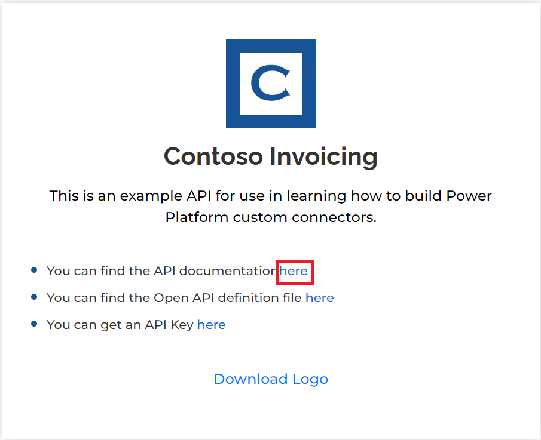
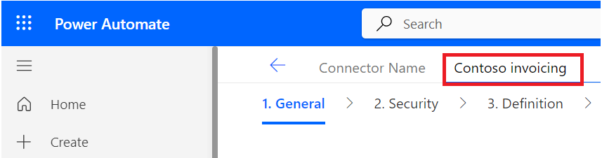
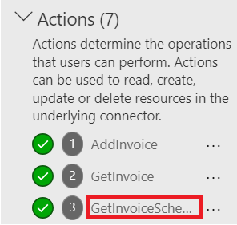
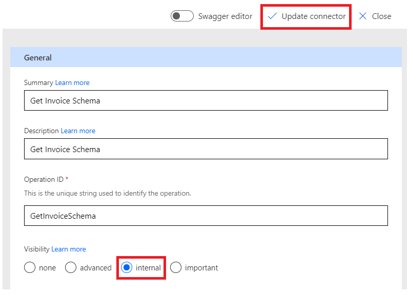
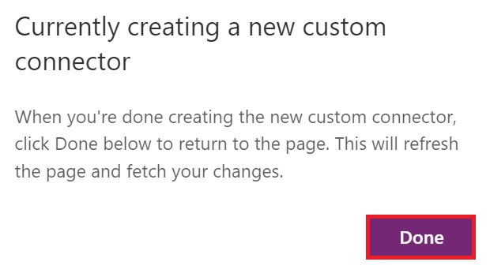
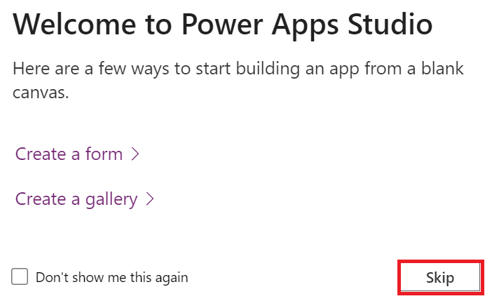

**Lab 1: Erstellen Sie einen benutzerdefinierten Connector für die
vorhandene API und verwenden Sie diesen in der Canvas-App**

**Geschätzte Dauer:** 35 Minuten

**Ziele:** In diesem Lab lernen Sie, Ihren ersten benutzerdefinierten
Konnektor für eine vorhandene API namens Contoso Invoicing zu erstellen,
eine Canvas-App zu erstellen und den Connector in der Canvas-App zu
verwenden.

**Aufgabe 1: Überprüfen der API**

Um die API zu überprüfen, führen Sie die folgenden Schritte aus:

1.  Gehen Sie zu +++<https://contosoinvoicing.azurewebsites.net/>+++.

2.  Um den Dokumentationslink auszuwählen, klicken Sie **here** neben
    „You can find the API documentation’.

> 

3.  Überprüfen Sie die verfügbaren Betriebe.

> 

4.  Schließen Sie die Registerkarte oder das Fenster des
    Dokumentationsbrowsers.

5.  Wählen Sie den Link „**Open API definition**“ aus.

> 

6.  Das folgende Bild zeigt ein Beispiel der OpenAPI-Version der
    Dokumentationsseite. Klicken Sie mit der rechten Maustaste und
    wählen Sie „**Save as**“.

> 

7.  Speichern Sie die Datei lokal auf dem Desktop der VM. Sie benötigen
    diese Datei später in der Übung.

8.  Schließen Sie die Registerkarte oder das Fenster des
    Definitionsbrowsers.

9.  Wählen Sie den **API Key**-Link.

> 

10. Kopieren Sie Ihren API-Key und speichern Sie ihn im Notizblock Ihrer
    VM, da Sie ihn später benötigen.

> 

11. Wählen Sie **Return to home**.

> 

12. Wählen Sie **Download Logo**.

> 

13. Speichern Sie das Logobild lokal auf dem Desktop der VM. Sie werden
    es später verwenden.

**Aufgabe 2: Erstellen einer neuen Lösung**

Um eine neue Lösung zu erstellen, führen Sie die folgenden Schritte aus:

1.  Gehen Sie zu <https://make.powerapps.com/> und stellen Sie sicher,
    dass Sie sich in der **Dev One**-Umgebung befinden.

> 

2.  Wählen Sie im linken Navigationsbereich „**Solutions**“ aus.

> 

3.  Wählen Sie im oberen Menüband „**+New solution**“ aus.

> 

4.  Geben Sie als **Display name** +++**Contoso invoicing**+++ ein und
    wählen Sie **+ New publisher** aus.

> 

5.  Geben Sie +++**Contoso**+++ für Display name, +++**Contoso**+++ für
    Name und +++**contoso**+++ für Prefix ein, und wählen Sie dann
    **Save** aus.

> 
>
> **Notiz:** Wenn Sie die Fehlermeldung „A record with matching key
> values already exists“ erhalten, ignorieren Sie diese und schließen
> Sie das Fenster „New publisher’.
>
> 

6.  Wählen Sie nun im Fenster „**New solution**“ als **Publisher**
    „**Contoso**“ und dann „**Create**“ aus. Wenn Sie an einem echten
    Projekt arbeiten, empfiehlt es sich, einen eigenen Herausgeber zu
    erstellen.

> 

7.  Verlassen Sie diese Seite nicht, nachdem Sie „**Create**“ ausgewählt
    haben. Sie werden automatisch zur Lösung „Contoso invoicing”
    weitergeleitet.

**Aufgabe 3: Einen neuen Connector erstellen**

Um einen neuen Connector zu erstellen, führen Sie die folgenden Schritte
aus:

1.  Stellen Sie sicher, dass Sie sich in der von Ihnen erstellten
    **Contoso invoicing** lösung befinden.

> 

2.  Wählen Sie **+ New** | **Automation** | **Custom connector**.

> 

3.  Geben Sie als **Connector name** +++**Contoso invoicing**+++ ein.

> 

4.  Wählen Sie „**Upload**“, um das Bild hochzuladen.

> 

5.  Wählen Sie das Connector-Logobild aus, das Sie in **Aufgabe 1:
    Überprüfen der API** heruntergeladen haben.

6.  Geben Sie +++#**175497**+++ als **Icon background color** ein.

7.  Geben Sie als **Description** +++ **Custom connector for Contoso
    Invoicing API** +++ ein.

8.  Geben Sie +++ **contosoinvoicingtest.azurewebsites.net** +++ als
    **Host** ein.

> 

9.  Wählen Sie „**Create connector**“ aus.

> 

10. Verlassen Sie diese Seite nicht.

**Aufgabe 4: Importieren der OpenAPI-Definition**

Um die OpenAPI-Definition zu importieren, führen Sie die folgenden
Schritte aus:

1.  Wählen Sie den Pfeil neben „**Connector-Name**“ aus.

> 

2.  Wählen Sie die Auslassungspunkte-Schaltfläche (...) des Connectors
    und dann „**Update from OpenAPI file**“ aus.

> 

3.  Wählen Sie **Import**.

> 

4.  Wählen Sie die Datei **swagger.json** aus, die Sie in **Aufgabe 1:
    Überprüfen der API** heruntergeladen haben, und wählen Sie dann
    **Open** aus.

> 

5.  Wählen Sie **Continue** aus.

> 

6.  Geben Sie die Host-URL als
    +++**contosoinvoicingtest.azurewebsites.net**+++ ein und wählen Sie
    dann **Security** aus.

> 

7.  Beachten Sie, dass die Felder aus der importierten Datei ausgefüllt
    werden.

> 

8.  Verlassen Sie diese Seite nicht.

**Aufgabe 5: Definitionen überprüfen und anpassen**

Um Definitionen zu überprüfen und anzupassen, gehen Sie folgendermaßen
vor:

1.  Wählen Sie die Registerkarte **Definition** aus.

> 

2.  Nehmen Sie sich ein paar Minuten Zeit, um die importierten Betriebe
    zu überprüfen.

3.  Beachten Sie den blauen Informationskreis neben **GetInvoice**.

> 

4.  Wählen Sie die Operation **GetInvoice** aus.

> 

5.  Beachten Sie, dass der Vorgang auf eine fehlende **Summary**
    hinweist.

> 

6.  Geben Sie „**Get Invoice**“ als **Summary** ein, um die
    Benutzerfreundlichkeit zu verbessern.

> 

7.  Beachten Sie den blauen Informationskreis neben der
    **PayInvoice**-Operation und dass dieser auf eine fehlende
    **Description** hinweist.

> 

8.  Wählen Sie den Vorgang „**PayInvoice**“ aus.

> 

9.  Geben Sie als **Description** „**Pay an invoice**“ ein.

> 

10. Löschen Sie beide **NewInvoice**-Betriebe, da Sie sie nicht
    verwenden werden.

> 

11. Wählen Sie die Operation **GetInvoiceSchema** aus.

> 

12. Ändern Sie die **Visibility** option in „**internal**“, damit die
    Benutzer sie nicht in ihrer Aktionsliste sehen, und wählen Sie dann
    „**Update connector**“ aus.

> 

13. Verlassen Sie diese Seite nicht.

**Aufgabe 6: Testen Sie den Connector**

Um den Connector zu testen, führen Sie die folgenden Schritte aus:

1.  Wählen Sie die Registerkarte **Test**.

> 

2.  Wählen Sie **+** **New connection**.

> 

3.  Fügen Sie den **API-Key** ein, den Sie in **Aufgabe 1: Überprüfen
    Sie die API** gespeichert haben, und wählen Sie dann **Create
    connection** aus.

> 

4.  Wählen Sie die Schaltfläche „**Refresh**“ aus.

> 

5.  Wählen Sie **ListInvoiceTypes | Test Operation**.

> 

6.  Sie sollten die Daten der Rechnungsarten im Body-Bereich sehen.

> 

7.  Wählen Sie „**Close**“ aus, um das Fenster des benutzerdefinierten
    Connectors zu schließen.

> 

**Aufgabe 7: Benutzerdefinierten Connector in der Canvas-App verwenden**

In dieser Aufgabe erstellen Sie eine Canvas-Anwendung und verwenden, den
von Ihnen erstellten benutzerdefinierten Connector, um eine Liste von
Rechnungen anzuzeigen.

1.  Kehren Sie zum Power Apps Maker-Portal zurück. Wählen Sie im
    Popup-Fenster „Currently creating a new custom connector“ „**Done**“
    aus. Stellen Sie sicher, dass Sie sich in der **Dev One**-Umgebung
    befinden.

> 
>
> **Notiz:** Falls das Portal noch nicht geöffnet ist, navigieren Sie zu
> +++<https://make.powerapps.com/>+++ und stellen Sie sicher, dass Sie
> sich in der **Dev One**-Umgebung befinden.

2.  Stellen Sie sicher, dass Sie sich in der von Ihnen erstellten
    **Contoso invoicing** lösung befinden. Wenn nicht, wählen Sie
    „**Solutions**“ aus und öffnen Sie die von Ihnen erstellte **Contoso
    invoicing** lösung.

> 

3.  Wählen Sie + **New** und dann **App \> Canvas app**

> 

4.  Geben Sie als App-Nam, die **Contoso invoicing app** ein, wählen Sie
    als Format „**Phone**“ und dann „**Create**“ aus.

> 

5.  Wählen Sie im welcome window „**Skip**“ aus.

> 

6.  Wählen Sie die Registerkarte „**Data**“ und dann **+ Add data** aus.

> 

7.  Erweitern Sie „**Connectors**“, und wählen Sie dann den
    benutzerdefinierten **Contoso invoicing** connector aus, den Sie
    erstellt haben.

> 

8.  Wählen Sie **+ Add a connector** aus.

> 

9.  Fügen Sie den API-Key ein, den Sie in **Aufgabe 1: Überprüfen Sie
    die API** gespeichert haben, und wählen Sie dann „**Connect**“ aus.

> 

10. Wählen Sie im Premium-Warn-Popup „**Got it**“ aus.

> 

11. Wählen Sie die Registerkarte „**Tree view**“.

> 

12. Wählen Sie **+ Insert** und dann **Vertical gallery**.

> 

13. Wählen Sie **ContosoInvoicing** für Daten aus.

> 

14. Stellen Sie **Items** auf den unten stehenden Wert ein.

> +++ContosoInvoicing.ListInvoices().invoices+++
>
> 

15. Erweitern Sie die Galerie und wählen Sie **Subtitle** aus.

> 

16. Setzen Sie den **Text** wert von Subtitle auf
    +++**ThisItem.amount**+++.

> 

17. Erweitern Sie die Galerie und wählen Sie den **Title** in der
    Galerie aus.

> 

18. Setzen Sie den **Text** wert des Titels auf
    +++**ThisItem.accountName**+++.

> 

19. Die Galerie sollte jetzt wie im Bild unten aussehen.

> 

**Zusammenfassung:** In diesem Lab, haben Sie gelernt, einen
benutzerdefinierten Connector für eine bestehende API zu erstellen, die
API-Definition zu importieren und diesen Konnektor in der Canvas-App zu
verwenden, um eine Liste von Rechnungen anzuzeigen. Benutzerdefinierte
Connectoren sind funktionsbasiert, sie rufen bestimmte Funktionen im
zugrunde liegenden Dienst der API auf, um die entsprechenden Daten
zurückzugeben.
