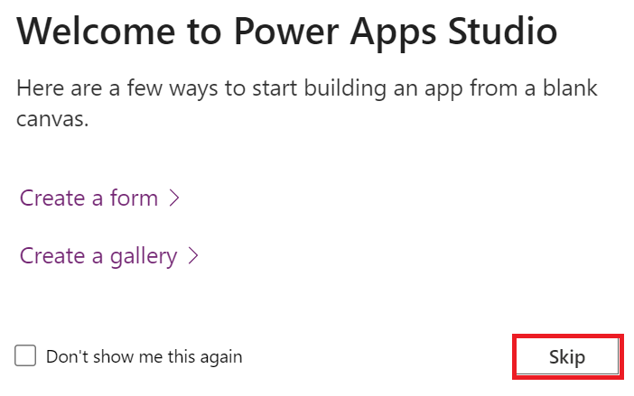

**ラボ１-既存の API にカスタムコネクタを作成してCanvas アプリで使う**

**所要時間:** 35分

**目的:　**このラボでは「Contoso Invoicing」という既存の API
に対して、はじめてのカスタムコネクタを作る方法を学んで、そのカスタムコネクタを使って
Canvas アプリを作る方法も学びます。

**タスク１: APIを確認**

API を確認するには、次の手順で行います:

1.   +++<https://contosoinvoicing.azurewebsites.net/>+++にクリックします。

2.  ドキュメント・リンクを選択するため「You can find the API
    documentation」の横にある「**here**」をクリックしてください。

> 

3.  利用できる操作内容を確認します。

> 

4.  ドキュメントのブラウザタブまたはウィンドウを閉じます。

5.  「Open API definition」のリンクを選択します。

> 

6.  以下の画像は、ドキュメントページに表示されていた内容の OpenAPI
    バージョンの例を示します。右クリックして「**Save
    as**」を選択します。

> 

7.  ファイルを VM
    デスクトップにローカル保存します。このファイルは後の演習で使用されます。

8.  定義が表示されているブラウザのタブまたはウィンドウを閉じます。

9.  **API Key** リンクをクリックします。

> 

10. 後でも使用するためにAPI Keyをコピーして、VM のメモ帳に保存します。

> 

11. **Return to home**を選択します。

> 

12.  **Download Logo**を選択します**。**

> 

13. ロゴ画像を VM のデスクトップにローカルで保存して、後で使用します。

**タスク２: 新しいソリューションを作成**

新しいソリューションを作成するため、次の手順に従います:

1.   <https://make.powerapps.com/>　にアクセスし、「**Dev
    One**」環境にいることを確認します。

> 

2.  右のナビゲーションペインから、**Solutions**を選択します。

> 

3.  上のリボンから**+New solution** を選択します。

> 

4.   **Display name**には「+++**Contoso invoicing**+++」と入力し、**+
    New publisher**をします。

> 

5.  表示名に「+++**Contoso**+++」、名前に「+++**Contoso**+++」、接頭辞に「+++**contoso**+++」を入力して**Save**を選択します。

> 
>
> **注意：**「A record with matching key values already
> exists.」というエラーメッセージが表示された場合は、それを無視して「New
> publisher」ウィンドウを閉じます。

6.  そして、**New solution** ウィンドウで**Publisher**
    に**Contoso** を選択、**Create**にクリックします。実際のプロジェクトで作業する時は、自分のpublisherを作成することをお勧めします。

> 

7.  「 **Create**」を選択した後、このページから離れることはありません。Contoso
    invoicingソリューションに自動的に移動されます。

**タスク３：新しいコネクタの作成**

新しいコネクタを作成するため以下の手順に従います：

1.  自分から作成された**Contoso
    invoicing** ソリューションにいることを確認します。

> 

2.  **+ New** |**Automation**| **Custom connector**にクリックします。

> 

3.  **Connector name**に+++**Contoso invoicing**+++を入力します。

> 

4.  画像をアップロードするため**Upload** を選択します。

> 

5.  **タスク１:**
    **APIを確認**でダウンロードしたコネクタのロゴ画像を選択します。

6.  **Icon background color**に+++**\#175497**+++ を入力します。

7.  **Description**に+++**Custom connector for Contoso Invoicing
    API**+++ 入力します。

8.  **Host**に+++**contosoinvoicingtest.azurewebsites.net**+++を入力します。

> 

9.  **Create connector**を選択します。

> 

10. このページから離れることはありません。

**タスク4：OpenAPI定義のインポート**

OpenAPI定義をインポートするため以下の手順に従います：

1.  コネクタ名の横にある矢印を選択します。

> 

2.  コネクタでの省略記号（...）ボタンを選択して**Update from OpenAPI
    file**にクリックします。

> 

3.   **Import**を選択します。

> 

4.  **タスク 1:「API
    の確認」**でダウンロードした**swagger.json** ファイルを選択し、「**Open**」を選択します。

> 

5.   **Continue**を選択します。

> 

6.  ホストURL
    として +++**contosoinvoicingtest.azurewebsites.net**+++ を入力して**Security**を選択します。

> 

7.  インポートしたファイルからフィールドが自動入力されていることを確認します。

> 

8.  このページから移動することはありません。

**タスク5：定義の確認と調整**

定義を確認して調整するには、以下の手順に従います：

1.  **Definition** タブを選択します。

> 

2.  インポートされた操作を数分かけて確認します。

3.  **GetInvoice**の横にある青い情報アイコンに注目します。

> 

4.  **GetInvoice** 操作にクリックします。

> 

5.  操作は**Summary**が欠落していることが表示されていることを確認します。

> 

6.  有用性を向上させるために、**Summary**に**Get Invoice**と入力します。

> 

7.  **PayInvoice**操作の横にある青い情報アイコン**Description**が欠落していることを示しています。

> 

8.  **PayInvoice**操作を選択します。

> 

9.  **Description**に**Pay an invoice**と入力します。

> 

10. 　**NewInvoice**操作は両方が使用しないため削除します。

> 

11. **　GetInvoiceSchema** 操作を選択します。

> 

12. 　アクション一覧に表示されないように**Visibility**オプションを**internal**に変更します。そして**Update
    connector**を選択します。

> 

13. 　このページから移動することはありません。

**タスク６：コネクタのテスト**

コネクタをテストするには、以下の手順に従います:

1.  **Test**タブを選択します。

> 

2.  **+ New connection**にクリックします。

> 

3.  **タスク１： APIの確認**に保存された**API
    Key** を貼り付け 、**Create connection**を選択します。

> 

4.  **Refresh**を選択します。

> 

5.   **ListInvoiceTypes| Test Operation**を選択します。

> 

6.  BodyエリアにInvoice Typesデータが表示されていることを確認します。

> 

7.  カスタムコネクタウィンドウを閉じるように**Close** にクリックします。

> 

**タスク７：canvasアプリでカスタムコネクタを使用する**

このタスクでは、canvasアプリケーションを作成し、作成したカスタムコネクタを使用してinvoicesのリストを表示します。

1.  Power Apps
    メーカーポータルに戻ります。「新しいカスタムコネクタを作成中」というポップアップが表示されたら「Done」を選択します。Dev
    One 環境にいることを確認する必要があります。

> 
>
> **Note:** ポータルが既に開いていない場合は、**Dev
> One**環境にいることを確認し、+++<https://make.powerapps.com/>+++にアクセスします。

2.  自分が作成したContoso
    invoicingソリューションにいることを確認します。もしない場合は、Solutionsを選択し、作成した
    Contoso invoicingソリューションを開きます。

3.   **+ New** にクリックして **App \> Canvas app**を選択します。

> 

4.   アプリ名前に**Contoso invoicing
    app** と入力し、フォーマットに**Phone** を選択します後**Create**を選択します。

> 

5.  ウェルカムウィンドウで**Skip** を選択します。

> 

6.   **Data** タブを選択し、**+ Add data**を選択します。

> 

7.  コネクタを拡大し、作成した
    Contoso　invoicingカスタムコネクタを選択します。

> 

8.  **+ Add a connector**選択します。

> 

9.  **タスク１： API** **の確認**に保存したAPI
    キーを貼り付け**Connect**を選択します。

> 

10. 　プレミアム警告のポップアップで「**Got it** 」を選択します。

> 

11. **Tree view** タブを選択します。

> 

12. 　**+ Insert**にクリックして**Vertical gallery**を選択します。

> 

13. データに**ContosoInvoicing**を選択します。

> 

14. **Items**を以下の値に設定します。

> +++ContosoInvoicing.ListInvoices().invoices+++
>
> 

15. ギャラリーを拡大して**Subtitle**を選択します。

> 

16. Subtitleの**Text**値を +++**ThisItem.amount**+++に設定します。

> 

17. ギャラリーを展開し、ギャラリーの中から**Title**を選択します。

> 

18. Titleの**Text** 値を+++**ThisItem.accountName**+++に設定します。

> 

19. ギャラリーは以下の画像のよになります。

> 

**まとめ:**このラボでは、既存のAPI用にカスタムコネクタを作成する方法、API定義をインポートする方法、およびそのコネクタをCanvas
Appで使用してinvoicesの一覧を表示する方法を学びました。カスタムコネクタはファンクション・ベースであり、APIの基盤となるサービス内の特定のファンクションを呼び出して対応するデータを返します。
