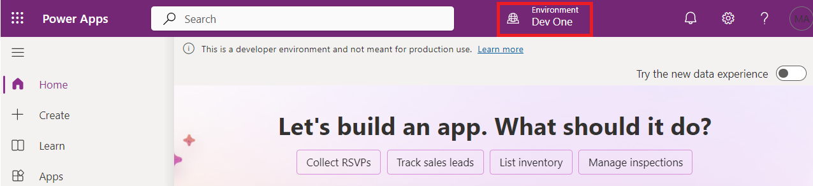
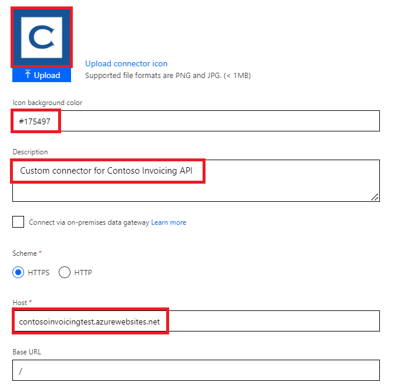
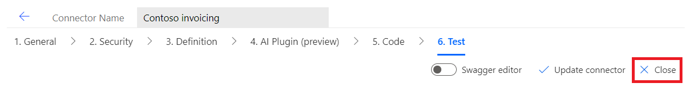
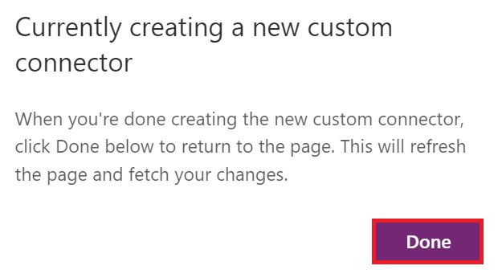
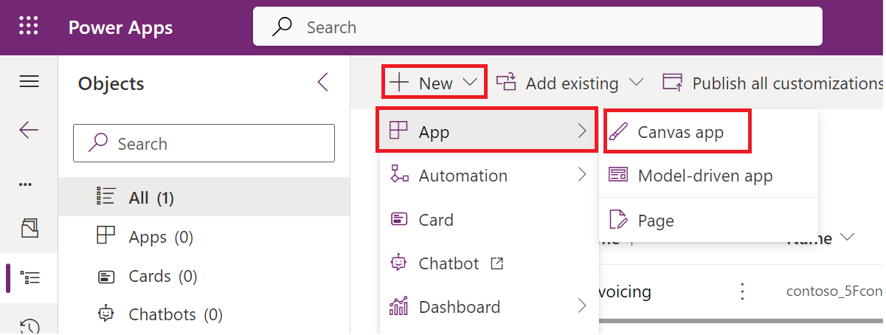

**Lab 1 - Creare un connettore personalizzato per l'API esistente e
usarlo nell'app canvas**

**Durata stimata:** 35 min

**Obiettivo:** In questo lab si apprenderà come creare il primo
connettore personalizzato per un'API esistente denominata Contoso
Invoicing, per creare un'app canvas e come usare il connettore nell'app
canvas.

**Attività 1: Esaminare l'API**

Per esaminare l'API, attenersi alla seguente procedura:

1.  Vai a +++<https://contosoinvoicing.azurewebsites.net/>+++.

2.  Per selezionare il link alla documentazione, clicca qui accanto a "
    **You can find the API documentation".**

> 

3.  Esaminare le operazioni disponibili.

> 

4.  Chiudere la scheda o la finestra del browser della documentazione.

5.  Selezionare il **Open API definition link**.

> 

6.  L'immagine seguente mostra un esempio della versione OpenAPI di
    quanto mostrato nella pagina della documentazione. Fare clic con il
    pulsante destro del mouse e selezionare **Save as**.

> 

7.  Salvare il file in locale sul desktop della VM. Questo file verrà
    utilizzato più avanti nell'esercizio.

8.  Chiudere la scheda o la finestra del browser delle definizioni.

9.  Seleziona il link **API Key**.

> 

10. Copiare e salvare la chiave API nel blocco note della macchina
    virtuale perché sarà necessaria in un secondo momento.

> 

11. Seleziona **Return to home**.

> 

12. Seleziona **Download Logo**.

> 

13. Salva l'immagine del logo localmente sul desktop della VM; Lo
    utilizzerai in seguito.

**Attività 2: Creare una nuova soluzione**

Per creare una nuova soluzione, attenersi alla seguente procedura:

1.  Vai su <https://make.powerapps.com/> e assicurati di essere
    nell'ambiente **Dev One**.

> 

2.  Nel riquadro di spostamento a sinistra, selezionare **Solutions**.

> 

3.  Selezionare **+New solution** dalla barra multifunzione superiore.

> 

4.  Immettere +++**Contoso invoicing**+++ per **Display name** e
    selezionare **+ New publisher**.

> 

5.  Immettere +++**Contoso**+++ per Nome visualizzato, +++**Contoso**+++
    per Nome, +++**contoso**+++ per Prefisso e quindi selezionare
    **Save**.

> 
>
> **Nota:** se ricevi un messaggio di errore come "Esiste già un record
> con valori di chiave corrispondenti", ignoralo e chiudi la finestra
> "**New publisher**".
>
> 

6.  A questo punto, nella finestra **New solution**, selezionare
    **Contoso** per **Publisher** e quindi selezionare **Create**.
    Quando si lavora a un progetto reale, è meglio creare il proprio
    editore.

> 

7.  Non uscire da questa pagina dopo aver selezionato **Create**. Verrà
    visualizzata automaticamente la soluzione "Fatturazione Contoso".

**Attività 3: Creare un nuovo connettore**

Per creare un nuovo connettore, attenersi alla seguente procedura:

1.  Assicurarsi di essere nella soluzione **Contoso invoicing** creata.

> 

2.  Seleziona **+ New** | **Automation** | **Custom connector**.

> 

3.  Immettere +++**Contoso invoicing**+++ per il **Connector name.**

> 

4.  Seleziona **Upload** per caricare l'immagine.

> 

5.  Selezionare l'immagine del logo del connettore scaricata
    nell**'attività 1: esaminare l'API**.

6.  Immettere +++**\#175497+++** per **il colore di sfondo dell'icona**.

7.  Immettere +++**Custom connector for Contoso Invoicing API**+++ per
    **la descrizione**.

8.  Immettere +++**contosoinvoicingtest.azurewebsites.net**+++ per
    **Host**.

> 

9.  Selezionare **Create connector**.

> 

10. Non uscire da questa pagina.

**Attività 4: Importare la definizione OpenAPI**

Per importare la definizione OpenAPI, attenersi alla seguente procedura:

1.  Selezionare la freccia accanto a **Connector Name**.

> 

2.  Seleziona i puntini di sospensione (**...**) del connettore, quindi
    selezionare **Update from OpenAPI File**.

> 

3.  Seleziona **Import**.

> 

4.  Selezionare il file **swagger.json** scaricato nell**'Attività 1:
    Esaminare l'API** e quindi selezionare **Open**.

> 

5.  Seleziona **Continue**.

> 

6.  Inserisci l'URL dell'host come
    +++**contosoinvoicingtest.azurewebsites.net**+++ e quindi seleziona
    **Security**.

> 

7.  Si noti che i campi vengono compilati dal file importato.

> 

8.  Non uscire da questa pagina.

**Attività 5: Rivedere e modificare le definizioni**

Per rivedere e modificare le definizioni, attenersi alla seguente
procedura:

1.  Selezionare la scheda **Definition**.

> 

2.  Dedicare alcuni minuti alla revisione delle operazioni importate.

3.  Si noti il cerchio blu di informazioni accanto a **GetInvoice**.

> 

4.  Selezionare l'operazione **GetInvoice**.

> 

5.  Si noti che l'operazione indica un **Summary** mancante.

> 

6.  Inserisci **Get Invoice** come **Summary** per migliorare
    l'usabilità.

> 

7.  Si noti che il cerchio blu di informazioni accanto all' operazione
    **PayInvoice** indica una **Description** mancante.

> 

8.  Selezionare l'operazione **PayInvoice**.

> 

9.  Immettere **Pay an invoice** come **Description**.

> 

10. Eliminare entrambe le operazioni **NewInvoice** perché non verranno
    utilizzate.

> 

11. Selezionare l'operazione **GetInvoiceSchema**.

> 

12. Modificare l'opzione **Visibility** in **internal** in modo che gli
    utenti non la vedano nell'elenco delle azioni, quindi selezionare
    **Update connector**.

> 

13. Non uscire da questa pagina.

**Attività 6: Testare il connettore**

Per testare il connettore, attenersi alla seguente procedura:

1.  Selezionare la scheda **Test**.

> 

2.  Selezionare **+ New connection**.

> 

3.  Incolla la **API Key** salvata nell**'Attività 1: Esamina l'API** e
    quindi seleziona **Create connection**.

> 

4.  Seleziona il pulsante **Refresh**.

> 

5.  Seleziona **ListInvoiceTypes | Test Operation**.

> 

6.  Dovresti vedere i data dei tipi di fattura nell'area del corpo.

> 

7.  Selezionare **Close** per chiudere la finestra del connettore
    personalizzato.

> 

**Attività 7: Usare il connettore personalizzato nell'app canvas**

In questa attività si creerà un'applicazione canvas e si userà il
connettore personalizzato creato per visualizzare un elenco di fatture.

1.  Torna al portale per la creazione di Power Apps. Seleziona **Done**
    nel popup che dice "Sto creando un nuovo connettore personalizzato".
    Assicurati di essere nell' ambiente **Dev One**.

> 
>
> **Nota:** se il portale non è già aperto, vai a
> +++<https://make.powerapps.com/>+++ e assicurati di essere nell'
> ambiente **Dev One**.

2.  Assicurarsi di essere nella soluzione **Contoso invoicing** creata.
    In caso contrario, selezionare **Solutions** e aprire la soluzione
    **Contoso** **invoicing** creata.

> 

3.  Seleziona **+ New**, quindi seleziona **App \>Canvas app**.

> 

4.  Immettere **Contoso invoicing app** per Nome app, selezionare
    **Phone** per Formato e quindi selezionare **Create**.

> 

5.  Seleziona **Skip** la finestra di benvenuto.

> 

6.  Seleziona la scheda **Data**, seleziona **+ Add data**.

> 

7.  Espandere **Connectors**, quindi selezionare il connettore
    personalizzato di **Contoso** **invoicing** creato.

> 

8.  Selezionare l'opzione **+ Add a connector**.

> 

9.  Incolla la chiave API salvata nell' **attività 1: esamina l'API** e
    quindi seleziona **Connect**.

> 

10. Seleziona **Got it** popup di avviso premium.

> 

11. Selezionare la scheda **Tree view**.

> 

12. Seleziona **+ Insert** e quindi seleziona **Vertical gallery**.

> 

13. Selezionare **ContosoInvoicing** per Data.

> 

14. Imposta gli **Items** sul valore seguente.

> +++ContosoInvoicing.ListInvoices().invoices+++
>
> 

15. Espandi la galleria e seleziona il **Subtitle**.

> 

16. Imposta il valore **Text** del sottotitolo su
    +++**ThisItem.amount**+++.

> 

17. Espandi la galleria e seleziona il **Title** all'interno della
    galleria.

> 

18. Imposta il valore **Text** del titolo su
    +++**ThisItem.accountName**+++.

> 

19. La galleria dovrebbe ora apparire come l'immagine qui sotto.

> 

**Riepilogo:** in questo lab si è appreso come creare un connettore
personalizzato per un'API esistente, importare la definizione dell'API e
usare tale connettore nell'app canvas per visualizzare un elenco di
fatture. I connettori personalizzati sono basati su funzioni, chiamano
funzioni specifiche nel servizio sottostante dell'API per restituire i
data corrispondenti.
