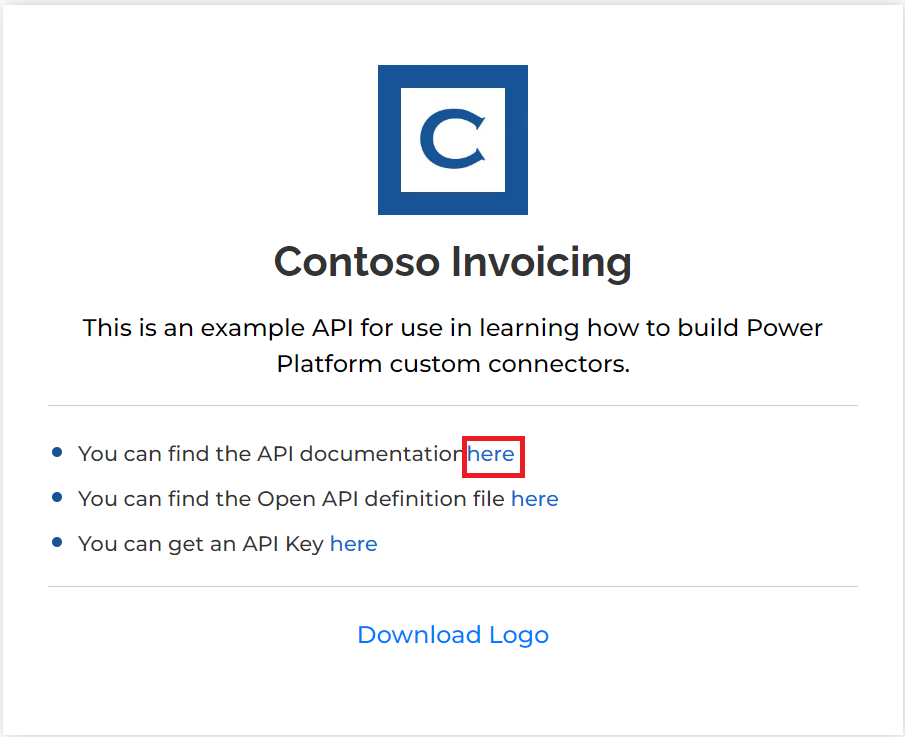

**實驗 1 - 為現有 API 構建自定義連接器並在畫布應用中使用該連接器**

**預計持續時間：** 35 分鐘

**目標：**在本實驗中，您將學習為名為 Contoso Invoicing 的現有 API
創建第一個自定義連接器，以創建畫布應用，以及如何在畫布應用中使用連接器。

**任務 1：查看 API**

要查看 API，請執行以下步驟：

1.  轉到 +++<https://contosoinvoicing.azurewebsites.net/>+++。

2.  要選擇文檔鏈接，請單擊“您可以找到 API 文檔”旁邊的 **here**。

> 

3.  查看可用的作。

> 

4.  關閉文檔瀏覽器選項卡或窗口。

5.  選擇 **Open API definition** （打開 API 定義） 鏈接。

> 

6.  下圖顯示了文檔頁面上顯示的 OpenAPI 版本的示例。右鍵單擊並選擇 **Save
    as** （另存為）。

> 

7.  將文件本地保存在 VM 的桌面上。您將在稍後的練習中使用此文件。

8.  關閉定義瀏覽器選項卡或窗口。

9.  選擇 **API Key** 鏈接。

> 

10. 將 API 密鑰複製並保存到 VM 上的記事本，因為以後需要它。

> 

11. 選擇 **Return to home**（返回主頁）。

> 

12. 選擇 **Download Logo** （下載徽標）。

> 

13. 將徽標圖像本地保存在 VM 的桌面上;您稍後會用到它。

**任務 2：創建新解決方案**

要創建新解決方案，請執行以下步驟：

1.  轉到  <https://make.powerapps.com/> 並確保您處於 **Dev One**
    環境中。

> 

2.  從左側導航窗格中，選擇 **Solutions**（解決方案）。

> 

3.  從上部功能區中選擇 **+New solution**。

> 

4.  輸入 +++**Contoso invoicing**+++ 作為 **顯示名稱**，然後選擇 **+ New
    publisher**。

> 

5.  輸入 +++**Contoso**+++ 作為 顯示名稱，輸入 +++**Contoso**+++ 作為
    名稱，+++**contoso**+++ 作為 前綴，然後選擇 **Save**。

> 
>
> **注意：**如果您收到“已存在具有匹配鍵值的記錄”的錯誤消息，請忽略該消息並關閉“新建發佈者”窗口。
>
> 

6.  現在，在 **New solution** 窗口上，為 “**Publisher**” 選擇
    “**Contoso**” ，然後選擇 “**Create**”
    。當您從事實際項目時，最好創建自己的發佈者。

> 

7.  選擇 **Create** （創建） 後，請勿離開此頁面。您將自動導航到“Contoso
    invoicing”解決方案。

**任務 3：創建新連接器**

要創建新的連接器，請執行以下步驟：

1.  確保您使用的是您創建的 **Contoso invoicing** 解決方案。

> 

2.  選擇 **+ New** | **Automation** | **Custom connector**。

> 

3.  輸入 +++**Contoso invoicing**+++ 作為**連接器名稱**。

> 

4.  選擇 **Upload** 上傳圖像。

> 

5.  選擇您在**任務 1：查看 API** 中下載的連接器徽標圖像。

6.  輸入 +++**\#175497**+++ 作為**圖標背景顏色**。

7.  輸入 +++**Custom connector for Contoso Invoicing API**+++ for
    **Description** （描述）。

8.  輸入 +++**contosoinvoicingtest.azurewebsites.net**+++ 作為**主機**。

> 

9.  選擇 **Create connector**（創建連接器）。

> 

10. 請勿離開此頁面。

**任務 4：導入 OpenAPI 定義**

要導入 OpenAPI 定義，請執行以下步驟：

1.  選擇 **Connector Name** 旁邊的箭頭。

> 

2.  選擇連接器的省略號 （...） 按鈕，然後選擇 **Update from OpenAPI
    file**。

> 

3.  選擇 **Import**。

> 

4.  選擇您在 **任務 1：查看 API** 中下載的 **swagger.json**
    文件，然後選擇 **Open**。

> 

5.  選擇 **Continue**（繼續）。

> 

6.  將主機 URL
    填寫為 +++**contosoinvoicingtest.azurewebsites.net**+++，然後選擇
    “**Security**”。

> 

7.  請注意，這些字段是從導入的文件中填寫的。

> 

8.  請勿離開此頁面。

**任務 5：查看和調整定義**

要查看和調整定義，請執行以下步驟：

1.  選擇 **Definition** 選項卡。

> 

2.  請花幾分鐘時間查看導入的作。

3.  請注意 **GetInvoice** 旁邊的藍色信息圓圈。

> 

4.  選擇 **GetInvoice**作。

> 

5.  請注意，該作指示缺少 **Summary**。

> 

6.  輸入 **Get Invoice** 作為 **Summary** 以提高可用性。

> 

7.  請注意 **PayInvoice**作旁邊的藍色信息圓圈，它表示缺少
    **Description**。

> 

8.  選擇 **PayInvoice**作。

> 

9.  輸入 **Pay an invoice** （支付發票） 作為 **Description**（描述）。

> 

10. 刪除這兩個 **NewInvoice**作，因為您不會使用它們。

> 

11. 選擇 **GetInvoiceSchema**作。

> 

12. 將 **Visibility** （可見性） 選項修改為 **internal**
    （內部），以便用戶不會在其作列表中看到它，然後選擇 **Update
    connector** （更新連接器）。

> 

13. 請勿離開此頁面。

**任務 6：測試連接器**

要測試連接器，請執行以下步驟：

1.  選擇 **Test** （測試） 選項卡。

> 

2.  選擇 **+ New connection**。

> 

3.  粘貼您在 **任務 1：查看 API** 中保存的 **API Key**，然後選擇
    **Create connection** （創建連接）。

> 

4.  選擇 **Refresh** （刷新） 按鈕。

> 

5.  選擇 **ListInvoiceTypes | Test Operation**。

> 

6.  您應該會在正文區域看到發票類型數據。

> 

7.  選擇 **Close** 關閉自定義連接器窗口。

> 

**任務 7：在畫布應用中使用自定義連接器**

在此任務中，您將創建一個畫布應用程序，並使用您創建的自定義連接器來顯示發票列表。

1.  返回 Power Apps
    製作者門戶。在顯示“當前創建新的自定義連接器”的彈出窗口中選擇
    “**Done**”。確保您位於 **Dev One** 環境中。

> 
>
> **注意：**如果門戶尚未打開，請導航到
> +++<https://make.powerapps.com/>+++， 並確保您處於 **Dev One**
> 環境中。

2.  確保您使用的是您創建的 **Contoso 開票**解決方案。如果沒有，請選擇
    **Solutions** 並打開您創建的 **Contoso 開票**解決方案。

> 

3.  選擇 **+ New**，然後選擇 **App \> Canvas app**。

> 

4.  在 “應用程序名稱” 中輸入 **Contoso invoicing app**，為 “格式” 選擇“
    **Phone**” ，然後選擇 “**Create**” 。

> 

5.  選擇 **Skip** on welcome window（在歡迎窗口跳過）。

> 

6.  選擇 **Data** 選項卡，選擇 **+ Add data**。

> 

7.  展開 **Connectors**，然後選擇您創建的 **Contoso invoicing**
    自定義連接器。

> 

8.  選擇  **+ Add a connector**。

> 

9.  粘貼您在 **任務 1：查看 API** 中保存的 API 密鑰，然後選擇
    **Connect**。

> 

10. 在高級警告彈出窗口中選擇 **Got it** （知道了）。

> 

11. 選擇 **Tree view** 選項卡。

> 

12. 選擇 **+ Insert**，然後選擇 **Vertical gallery**。

> 

13. 為數據選擇 **ContosoInvoicing**。

> 

14. 將 **Items** （項目） 設置為下面的值。

> +++ContosoInvoicing.ListInvoices().invoices+++
>
> 

15. 展開庫並選擇 **Subtitle**。

> 

16. 將 Subtitle 的 **Text** 值設置為 +++**ThisItem.amount**+++。

> 

17. 展開庫，然後選擇 **Title** 在庫內。

> 

18. 將 Title 的 **Text** 值設置為 +++**ThisItem.accountName**+++。

> 

19. 庫現在應如下圖所示。

> 

**摘要：**在本實驗中，您學習了如何為現有 API 創建自定義連接器、導入 API
定義以及在畫布應用程序中使用該連接器顯示發票列表。自定義連接器是基於函數的，它們調用
API 底層服務中的特定函數來返回相應的數據。
