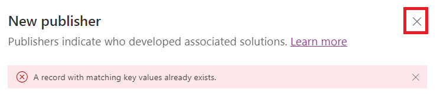

**Laboratorio 1 – Construya un conector personalizado para los APIs
existentes y úselo en la aplicación canvas**

**Duración estimada:** 35 minutos

**Objetivo:** En este laboratorio, aprenderá a crear su primer conector
personalizado para un API existente llamado Contoso Invoicing, para
crear una aplicación canvas y cómo usar este conector en el canvas app.

**Tarea 1: Revise el API**

Para revisar el API, siga estos pasos:

1.  Vaya a +++<https://contosoinvoicing.azurewebsites.net/>+++.

2.  Para seleccionar el enlace de documentación, haga clic en **here**
    junto a ‘You can find the API documentation’.

> 

3.  Revise las operaciones disponibles.

> 

4.  Cierre la pestaña o ventana del navegador de la documentación.

5.  Seleccione el enlace **Open API definition**.

> 

6.  La siguiente imagen muestra un ejemplo de la versión OpenAPI de lo
    que se mostró en la página de la documemtación. Haga clic derecho y
    seleccione **Save as**.

> 

7.  Guarde el archivo de forma local en el Desktop de VM. Usará este
    archivo más tarde en este ejercicio.

8.  Cierre la pestaña y ventana de definition browser.

9.  Seleccione el enlace **API Key**.

> 

10. Copie y guarde su API key en el notepad en su VM porque lo va a
    necesitar más tarde.

> 

11. Seleccione **Return to home**.

> 

12. Seleccione **Download Logo**.

> 

13. Guarde la imagen del logo localmente en el Desktop VM; lo va a usar
    más tarde.

**Tarea 2: Cree una nueva solución**

Para crear una nueva solución, siga estos pasos:

1.  Vaya a <https://make.powerapps.com/> y asegure que está en **Dev
    One** environment.

> 

2.  Desde el panel de navegación izquierdo, seleccione **Solutions**.

> 

3.  Seleccione **+New solution** desde la parte superior.

> 

4.  Itroduzca +++**Contoso invoicing**+++ como el **Display name** y
    seleccione **+ New publisher**.

> 

5.  Introduzca +++**Contoso**+++ en el Display name, +++**Contoso**+++ y
    como Name, +++**contoso**+++ como Prefix, y seleccione **Save**.

> 
>
> **Ojo:** Si obtiene un mensaje de error como ‘A record with matching
> key values already exists’, ignórelo y cierre la ventana ‘New
> publisher’.
>
> 

6.  Ahora, en la ventana **New solution**,
    seleccione **Contoso** para **Publisher**, y luego
    seleccione **Create**. Cuando trabaja en un proyecto real, es mejor
    crear su propio publicador.

> 

7.  No se vaya de esta página después de crear **Create**. Se le
    navegará automáticamente a la solución ‘Contoso invoicing’.

**Tarea 3: Cree un nuevo conector**

Para crear un nuevo conector, siga estos pasos:

1.  Asegure que está en la solución **Contoso invoicing** que ha creado.

> 

2.  Seleccione **+ New** | **Automation** | **Custom connector**.

> 

3.  Introduzca +++**Contoso invoicing**+++ para el **Connector name**.

> 

4.  Seleccione **Upload** para subir la imagen.

> 

5.  Seleccione la imagen de connector logo que descargó en **Task 1:
    Review the API**.

6.  Introduzca +++**\#175497**+++ para **Icon background color**.

7.  Introduzca +++**Custom connector for Contoso Invoicing
    API**+++ para **Description**.

8.  Introduzca +++**contosoinvoicingtest.azurewebsites.net**+++ para **Host**.

> 

9.  Seleccione **Create connector**.

> 

10. No se vaya de está página.

**Tarea 4: Importe el OpenAPI definition**

Para importar el OpenAPI definition, siga estos pasos:

1.  Seleccione la flecha junto a **Connector Name**.

> 

2.  Seleccione el botón (**...**) del conector y seleccione **Update
    from OpenAPI file**.

> 

3.  Seleccione **Import**.

> 

4.  Seleccione el archivo **swagger.json** que descargó en **Task 1:
    Review the API** y seleccione **Open**.

> 

5.  Seleccione **Continue**.

> 

6.  Rellene en el host URL
    como +++**contosoinvoicingtest.azurewebsites.net**+++ y
    seleccione **Security**.

> 

7.  Note que los campos se rellenan desde el archivo importado.

> 

8.  No se vaya de esta página.

**Tarea 5: Revise y ajuste los definitions**

Para revisar y ajustar los definitions, siga estos pasos:

1.  Seleccione la pestaña **Definition**.

> 

2.  Tome unos minutos para revisar las operaciones que se importó.

3.  Note el círculo de información azul junto a **GetInvoice**.

> 

4.  Seleccione la operación **GetInvoice**.

> 

5.  Note que la operación indica un **Summary** que falta.

> 

6.  Introduzca **Get Invoice** como el **Summary** para mejorar el
    usability.

> 

7.  Note el círculo de información azul junto a la
    operación **PayInvoice** y que indica un **Description** que falta.

> 

8.  Seleccione la operación **PayInvoice**.

> 

9.  Introduzca **Pay an invoice** como **Description**.

> 

10. Elimine ambas operaciones **NewInvoice** porque no lo va a usar.

> 

11. Seleccione la operación **GetInvoiceSchema**.

> 

12. Modifique la opción **Visibility** a **internal** para que la gente
    no lo vea en la lista de acción y luego seleccione **Update
    connector**.

> 

13. No se vaya de esta página.

**Tarea 6: Pruebe el conector**

Para probar el conector, siga estos pasos:

1.  Seleccione la pestaña **Test**.

> 

2.  Seleccione **+ New connection**.

> 

3.  Pegue en el **API Key** que guardó en **Task 1: Review the API** y
    seleccione **Create connection**.

> 

4.  Seleccione el botón **Refresh**.

> 

5.  Seleccione **ListInvoiceTypes | Test Operation**.

> 

6.  Puede ver los datos de tipos de facturas en el área principal.

> 

7.  Seleccione **Close** para cerrar la ventana de custom connector.

> 

**Tarea 7: Use el conector personalizado en la aplicación canvas**

En esta tarea, creará una aplicación canvas y use el conector
personalizado que creó para mostrar una lista de facturas.

1.  Vuelva a Power Apps maker portal. Seleccione **Done** en el pop-up
    que dice ‘Currently creating a new custom connector’. Asegure que
    está en el **Dev One** environment.

> 
>
> **Ojo:** Si no está abierto el portal ya, navegue
> a +++<https://make.powerapps.com/>+++ y asegure que está en el **Dev
> One** environment.

2.  Asegure que está en la solución **Contoso invoicing** que creó. Si
    no, seleccione **Solutions** y abra la solución **Contoso
    invoicing** que creó.

> 

3.  Seleccione **+ New** y seleccione **App \> Canvas app**.

> 

4.  Introduzca **Contoso invoicing app** como App name,
    seleccione **Phone** para Format, y luego seleccione **Create**.

> 

5.  Seleccione **Skip** en la ventana welcome.

> 

6.  Seleccione la pestaña **Data**, seleccione **+ Add data**.

> 

7.  Expanda **Connectors**, y seleccione el conector
    personalizado **Contoso invoicing** que creó.

> 

8.  Seleccione el **+ Add a connector**.

> 

9.  Pegue el the API Key que guardó en **Task 1: Review the API** y
    seleccione **Connect**.

> 

10. Seleccione **Got it** en el popup de premium warning.

> 

11. Seleccione la pestaña **Tree view**.

> 

12. Seleccione **+ Insert** y seleccione **Vertical gallery**.

> 

13. Seleccione **ContosoInvoicing** para Data.

> 

14. Establezca **Items** a los siguientes valores.

> +++ContosoInvoicing.ListInvoices().invoices+++
>
> 

15. Expanda el gallery y seleccione el **Subtitle**.

> 

16. Establezca el valor **Text** de Subtitle
    a +++**ThisItem.amount**+++.

> 

17. Expanda el gallery y seleccione el **Title** dentro de gallery.

> 

18. Establezca el valor **Text** del Title
    a +++**ThisItem.accountName**+++.

> 

19. El gallery ahora se ve como la siguiente imagen.

> 

**Resumen:** En este laboratorio, ha aprendido a crear un conector
personalizado para un API existente, para importar el API definition y
para usar este conector en la aplicación canvas para mostrar una lista
de facturas. Los conectores personalizados se basan en función, llaman a
las funciones específicas en los servicios subyacentes del API para
devolver los datos correspondientes.
