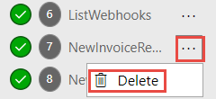
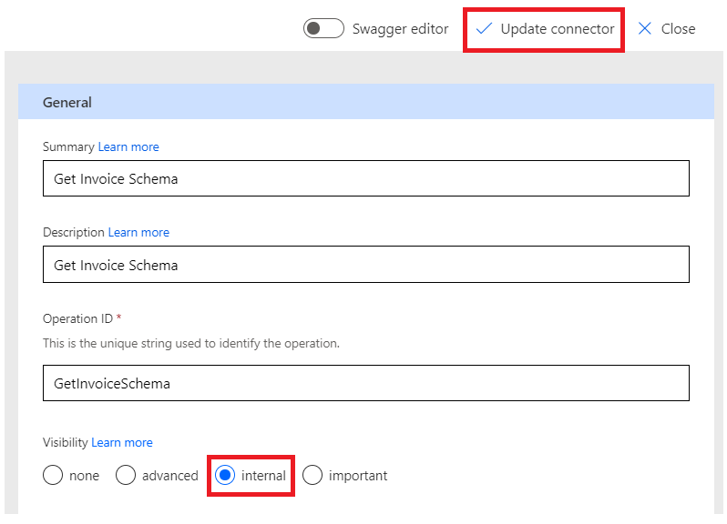

**Laboratório 1 - Crie um conector personalizado para uma API existente
e use-o no aplicativo Canvas**

**Duração estimada:** 35 minutos

**Objetivo:** Neste laboratório, você aprenderá a criar seu primeiro
conector personalizado para uma API existente chamada Contoso Invoicing,
a criar um aplicativo Canvas e como usar o conector no aplicativo
Canvas.

**Tarefa 1: Revisar a API**

Para revisar a API, siga estas etapas:

1.  Acesse +++<https://contosoinvoicing.azurewebsites.net/>+++.

2.  Para selecionar o link da documentação, clique em **here** ao lado
    de "You can find the API documentation".

> 

3.  Revise as operações disponíveis.

> 

4.  Feche a aba ou janela do navegador de documentação.

5.  Selecione o link **Open API definition**.

> 

6.  A imagem a seguir mostra um exemplo da versão OpenAPI do que foi
    mostrado na página de documentação. Clique com o botão direito e
    selecione **Save as**.

> 

7.  Salve o arquivo localmente no Desktop da VM. Você usará este arquivo
    mais tarde no exercício.

8.  Feche a aba ou janela do navegador de definições.

9.  Selecione o link **API Key**.

> 

10. Copie e salve sua chave de API no bloco de notas da sua VM porque
    você precisará dela mais tarde.

> 

11. Selecione **Return to home**.

> 

12. Selecione **Download Logo**.

> 

13. Salve a imagem do logotipo localmente no Desktop da VM; você a usará
    mais tarde.

**Tarefa 2: Criar uma nova solução**

Para criar uma nova solução, siga estas etapas:

1.  Acesse <https://make.powerapps.com/> e certifique-se de que você
    está no ambiente **Dev One.**

> 

2.  No painel de navegação esquerdo, selecione **Solutions**.

> 

3.  Selecione **+New solution** na faixa superior.

> 

4.  Insira +++**Contoso invoicing**+++ para **Display name** e selecione
    **+ New publisher**.

> 

5.  Digite +++**Contoso**+++ para Nome de exibição, +++**Contoso**+++
    para Nome, +++**contoso**+++ para Prefixo e selecione **Save**.

> 
>
> **Observação:** se você receber uma mensagem de erro como " A record
> with matching key values already exists ", ignore-a e feche a janela "
> New publisher ".
>
> 

6.  Agora, na janela **New solution**, selecione **Contoso** para
    **Publisher** e, em seguida, selecione **Create**. Quando estiver
    trabalhando em um projeto real, é melhor criar seu próprio editor.

> 

7.  Não saia desta página após selecionar **Create**. Você será
    automaticamente direcionado para a solução ‘Contoso invoicing’.

**Tarefa 3: Criar um novo conector**

Para criar um novo conector, siga estas etapas:

1.  Certifique-se de que você está na solução **Contoso invoicing** que
    você criou.

> 

2.  Selecione **+ New** | **Automation** | **Custom connector**.

> 

3.  Insira +++**Contoso invoicing**+++ para o **Connector name**.

> 

4.  Selecione **Upload** para carregar a imagem.

> 

5.  Selecione a imagem do logotipo do conector que você baixou na **Task
    1: Review the API**.

6.  Digite +++**\#175497**+++ para **Icon background color**.

7.  Insira +++**Custom connector for Contoso Invoicing API**+++ para
    **Description**.

8.  Digite +++**contosoinvoicingtest.azurewebsites.net**+++ para
    **Host**.

> 

9.  Selecione **Create connector**.

> 

10. Não saia desta página.

**Tarefa 4: Importar a definição OpenAPI**

Para importar a definição do OpenAPI, siga estas etapas:

1.  Selecione a seta ao lado de **Connector Name**.

> 

2.  Selecione o botão de reticências ( **...** ) do conector e selecione
    **Update from OpenAPI file**.

> 

3.  Selecione **Import**.

> 

4.  Selecione o arquivo **swagger.json** que você baixou na **Task 1:
    Review the API** e selecione **Open**.

> 

5.  Selecione **Continue**.

> 

6.  Preencha a URL do host como
    +++**contosoinvoicingtest.azurewebsites.net**+++ e selecione
    **Security**.

> 

7.  Observe que os campos são preenchidos a partir do arquivo importado.

> 

8.  Não saia desta página.

**Tarefa 5: Revisar e ajustar as definições**

Para revisar e ajustar as definições, siga estas etapas:

1.  Selecione a aba **Definition**.

> 

2.  Reserve alguns minutos para revisar as operações que foram
    importadas.

3.  Observe o círculo de informações azul ao lado de **GetInvoice**.

> 

4.  Selecione a operação **GetInvoice**.

> 

5.  Observe que a operação indica um **Summary** ausente.

> 

6.  Insira **Get Invoice** como **Summary** para melhorar a usabilidade.

> 

7.  Observe o círculo de informações azul ao lado da operação
    **PayInvoice** e que indica uma **Description** ausente.

> 

8.  Selecione a operação **PayInvoice**.

> 

9.  Insira **Pay an invoice** como **Description**.

> 

10. Exclua ambas as operações **NewInvoice** pois você não as utilizará.

> 

11. Selecione a operação **GetInvoiceSchema**.

> 

12. Modifique a opção **Visibility** para **internal** para que as
    pessoas não a vejam em sua lista de ações e selecione **Update
    connector**.

> 

13. Não saia desta página.

**Tarefa 6: Teste o conector**

Para testar o conector, siga estas etapas:

1.  Selecione a aba **Test**.

> 

2.  Selecione **+ New connection**.

> 

3.  Cole a **API Key** que você salvou na **Task 1: Review the API** e
    selecione **Create connection**.

> 

4.  Selecione o botão **Refresh**.

> 

5.  Selecione **ListInvoiceTypes | Test Operation**.

> 

6.  Você deverá ver os dados dos tipos de fatura na área body.

> 

7.  Selecione **Close** para fechar a janela do conector personalizado.

> 

**Tarefa 7: Usar conector personalizado no aplicativo Canvas**

Nesta tarefa, você criará um aplicativo Canvas e usará o conector
personalizado criado para exibir uma lista de faturas.

1.  Retorne ao portal do criador do Power Apps. Selecione **Done** no
    pop-up que diz ‘Currently creating a new custom connector’.
    Certifique-se de estar no ambiente **Dev One.**

> 
>
> **Observação:** Se o portal ainda não estiver aberto, navegue até
> +++<https://make.powerapps.com/>+++ e certifique-se de que você está
> no ambiente **Dev One.**

2.  Certifique-se de estar na solução **Contoso invoicing** que você
    criou. Caso contrário, selecione **Solutions** e abra a solução
    **Contoso invoicing** que você criou.

> 

3.  Selecione **+ New** e depois selecione **App \> Canvas app**.

> 

4.  Digite **Contoso invoicing app** como Nome do aplicativo, selecione
    **Phone** como Formato e, em seguida, selecione **Create**.

> 

5.  Selecione **Skip** na janela de boas-vindas.

> 

6.  Selecione a aba **Data**, selecione **+ Add data**.

> 

7.  Expanda **Connectors** e selecione o conector personalizado
    **Contoso invoicing** que você criou.

> 

8.  Selecione **+ Add a connector**.

> 

9.  Cole a chave de API que você salvou na **Task 1: Review the API** e
    selecione **Connect**.

> 

10. Selecione **Got it** no pop-up de aviso premium.

> 

11. Selecione a aba **Tree view**.

> 

12. Selecione **+ Insert** e depois selecione **Vertical gallery**.

> 

13. Selecione **ContosoInvoicing** para dados.

> 

14. Defina os **itens** para o valor abaixo.

> +++ContosoInvoicing.ListInvoices().invoices+++
>
> 

15. Expanda a galeria e selecione a **Subtitle**.

> 

16. Defina o valor do **Text** do subtítulo como
    +++**ThisItem.amount**+++.

> 

17. Expanda a galeria e selecione o **Title** dentro da galeria.

> 

18. Defina o valor de **Text** do Título como
    +++**ThisItem.accountName**+++.

> 

19. A galeria agora deve ficar como na imagem abaixo.

> 

**Resumo:** Neste laboratório, você aprendeu a criar um conector
personalizado para uma API existente, a importar a definição da API e a
usar esse conector no aplicativo Canvas para exibir uma lista de
faturas. Conectores personalizados são baseados em funções; chamando
operações específicas do serviço subjacente da API para retornar os
dados correspondentes.
