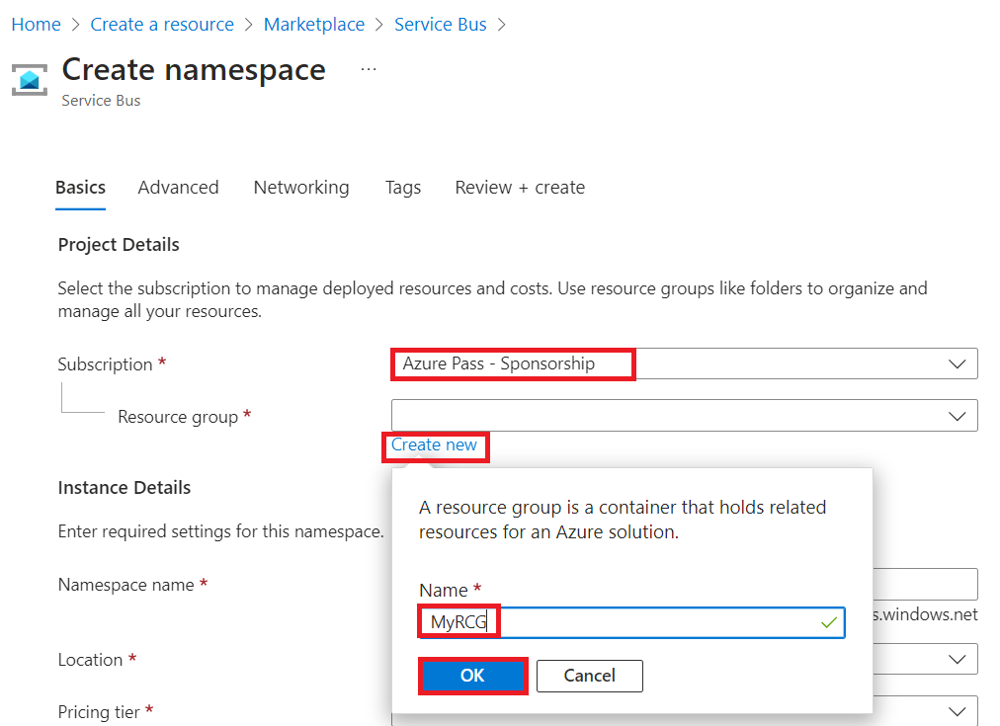
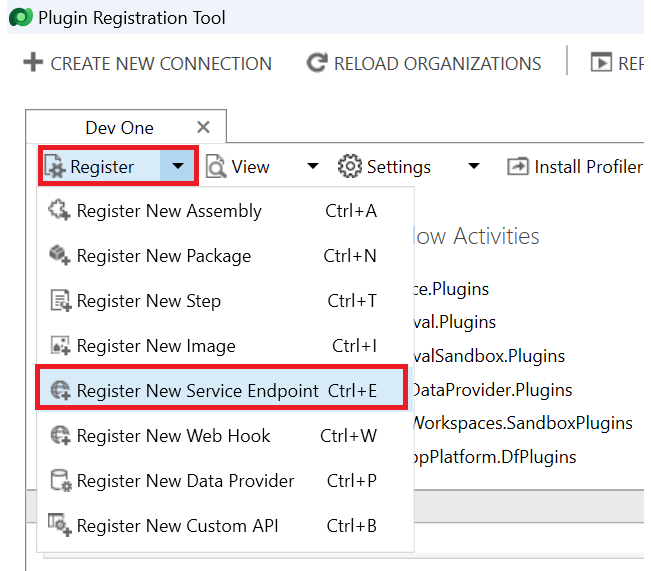
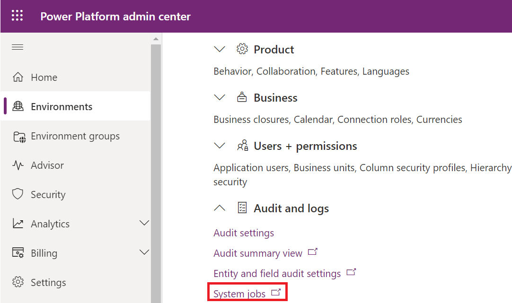

# **Lab 10: Write a Service Bus Event Listener that consumes Microsoft Dataverse messages (Optional)**

## **Task 1: Set up your Azure Service Bus environment**

Create your Azure Service Bus namespace and message queue with the
following steps.

1.  Sign in to the Azure portal using +++<https://portal.azure.com/>++
    with your Office 365 tenant credentials.

2.  Select **+ Create a resource**.

> 

3.  Search for service bus and select **Service Bus**.

> 

4.  Select **Create**.

> 

5.  Select your subscription – **Azure pass – Sponsorship**, from the
    **Resource group** dropdown, select **Create new**. Name the
    resource group as MyRCG (name should be unique) then select **OK**.

> 

6.  Enter the appropriate details for your namespace as given below and
    then select **Next**.

> **Namespace name**: Mytestinglab
>
> **Location**: West Central US
>
> **Pricing tier**: Basic (~0.05 USD per 1M Operations per Month)
>
> 

7.  Select **Review + create** again.

> 

8.  Select **Create**.

> 
>
> It might take a few minutes for your resource to provision. When it's
> finished, you should see something similar to the following image.
>
> 

9.  After your resource has been created, go to your newly created
    namespace by selecting Go to resource.

> 

10. To create a new queue, select **+Queue**. Give the name as
    **Mysamplequeue**. Select **Create**.

> 

11. Note a few items that are found in your namespace so that Dataverse
    has the correct credentials to connect to your new queue. For this
    procedure, use the existing Shared access policy that was auto
    created as part of your namespace. From left navigation pane, expand
    **Settings**, select **Shared access policy** and then click on
    **RootManageSharedAccessKey** policy.

> 

12. From within your Shared access policy, copy your **Primary
    Connection String** and store it for future use because you need
    this string as part of your Service Bus Endpoint configuration in
    Dataverse:

> 

## **Task 2: Register Service Bus endpoint in Dataverse**

Now that you have set up a message queue in Azure, you can provide
Dataverse with the required configuration information to access it.

**Note:** You use Dataverse's Plug-in Registration Tool to configure the
publishing of your Dataverse data to your Service Bus.

1.  To open the Plug-in Registration Tool, go to **Start** menu of your
    VM, type **Plugin Registration Tool** in the searchbox then select
    **Open** and make sure that you are in **Dev One** environment.

> 

2.  When connected to the environment, register your Service Bus
    Endpoint by selecting **Register** and then selecting **Register New
    Service Endpoint**.

> 

3.  Copy and paste the **Primary Connection String** value that you
    referenced earlier when setting up your Service Bus instance, and
    then select **Next**.

> 

4.  All the fields from your connection string should prepopulate on the
    form. For this example, you write a one-way queue publisher, so you
    can leave the **Designation Type** as **Queue**. Dataverse supports
    many other designation types to support various messaging protocols.

> 

5.  Enter your queue name into the **Queue Name - Mysamplequeue** field
    and specify **Message Format** as **JSON**. Dataverse supports the
    .NETBinary, JSON, and XML message formats. You're using JSON for
    this message because it's become an industry standard messaging
    format because of its portability and lightweight nature. Lastly, to
    have your user information sent to your queue, you can
    select **UserId** in the **User Information Sent** drop-down list.

> 

## **Task 3: Register a Service Bus integration step**

In this scenario, you register an integration step that publishes a
message to a Service Bus queue every time an account row is created. By
registering a step, you can define the table and message combination.
You can also define what conditions cause the message that is being
processed by Dataverse to be sent on the Service Bus to the Azure queue.

1.  Register a new step for your Service Endpoint by right-clicking and
    selecting **Register New Step**.

> 

2.  Enter the following details to register a new integration step that
    is started on creation of an account row. Make sure that you clear
    the **Delete AsyncOperation if StatusCode = Successful** flag.
    Clearing this flag is only for testing purposes so you can verify
    that the created System Job rows show that the Service Bus
    integration step has successfully started on creation of an account
    row. In a real-world production scenario, we recommend that you
    leave this value selected.

> 

3.  If you receive a **warning** – ‘No filter on attributes detected’,
    click on **Close**.

> 

## **Task 4: Test your Service Bus integration**

Test your Service Bus integration with the following steps:

1.  To test your Service Bus integration, go to Power Platform admin
    center using
    +++\*\*<https://admin.powerplatform.microsoft.com>\*\*+++. Select
    your Dataverse environment – **Dev One**.

> 

2.  Expand the **Audit and logs** section and **System jobs**.

> 

3.  Verify that your integration step ran successfully by viewing it in
    the **System Jobs** view. If it ran successfully, the **Status
    Reason** should be **Succeeded**. You also use this view to
    troubleshoot integration runs if an error occurs. If there's a
    failure, open the System Job record to view the error information.

> 

4.  Because the integration step ran successfully, you can now verify
    that the account creation message has arrived in your Service Bus
    queue. To verify that, go to the Azure portal, select your Resource
    group – **MyRCG** (in this case) and then select **Mytestinglab**
    resource.

5.  Scroll down on **Overview** page and then click on the
    **mysamplequeue** under the Queues.

> 

6.  You can see that the account creation message has arrived in your
    Service Bus queue.

> 
