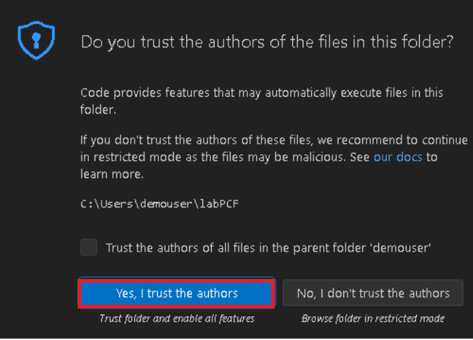

# **실습 2: Power Apps CLI를 사용하여 Power Apps Component Framework (PCF) 생성하기**

**예상 소요 시간:** 30분

**목표:** 이 실습에서는 Power Platform 도구를 설치하고 첫 번째 Power
Apps Component Framework (PCF) 구성 요소를 생성하는 방법을 배울
것입니다.

## **작업 1: Power Platform Tool을 설치하기**

1.  VM의 바탕 화면에 있는 바로 가기를 사용하여 Visual Studio Code를 열고
    탐색 모음에서 **Extensions** 아이콘을 선택하세요.

> 

2.  +++**power platform tools**+++를 검색하세요. 검색 결과의
    **Install** 버튼을 선택하세요.

> 

3.  설치가 완료 될 때까지 기다리세요.

> 

4.  **More option (…),** **Terminal**을 선택하고 **New Terminal**을
    선택하세요.

> **참고:** (... 3 점)은 표시되지 않으면 **hamburger | Terminal | New
> Terminal**을 선택하세요.
>
> 
>
> 

5.  사용 가능한 명령을 확인하려면 pac 명령을 실행하세요:

> +++pac+++
>
> 
>
> 
>
> 

6.  pac를 입력한 후 명령을 입략하여 어떤 옵션이 있는지 확인할 수
    있습니다 (예: 다음을 시도하세요).

> +++pac admin+++
>
> 
>
> **참고:** ‘Some keybindings don’t got to the terminal by default and
> are handled by Visual Studio Code instead’라는 팝업이 표시되면
> **Configure Terminal Settings**을 선택하세요.
>
> 

7.  관리자가 어떤 옵션을 가지고 있는지 볼 수 있습니다.

> 

8.  [https://make.powerapps.com/](https://make.powerapps.com/%20)
    사용하여 Power Apps 제작자 포털로 **Dev** **One** 환경이 선택되어
    있는지 확인하세요.

9.  화면의 오른쪽 위 모서리에서 **Settings** 아이콘을 선택하고 **Session
    details**을 선택하세요.

> 

10. Power Apps 세션 세부 정보 대화 상자에서 **Instance URL** 값을
    선택하고 나중에 연습에서 사용할 수 있도록 복사하세요.

> 

11. Visual Studio Code 터미널로 돌아가서 다음 명령을 입력하여 CLI에서
    연결을 설정하고 메시지가 표시되면 테스트 환경에 로그인하세요.

> +++pac auth create --name Lab --url **\<Your Instance URL\>**+++
>
> 

12. M365 관리자 자격 증명으로 로그인하세요.

> 

13. **Password**를 입력하고 **Sign in**을 클릭하세요.

> 

14. 인증이 성공적으로 완료되었다는 메시지를 볼 수 있습니다.

> 

15. 환경 및 사용자 정보를 표시할 다음 who 명령을 입력하세요. 이는 올바른
    환경에 있는지 확인하는 데 좋습니다

> +++pac org who+++
>
> 

## **작업 2: PCF 구성 요소를 생성하기**

1.  사용자의 폴더 내에 **labPCF**라는 새 폴더를 생성하려면 아래 명령을
    실행하세요.

> +++md labPCF+++
>
> 

2.  labPCF 폴더가 생성된 것을 볼 수 있습니다.

> 

3.  디렉토리를 생성한 폴더로 변경하세요.

> +++cd labPCF+++
>
> 

4.  구성 요소 프로젝트를 초기화하려면 아래 명령을 실행하세요.

> +++pac pcf init --namespace lab --name FirstControl --template
> field+++
>
> 

5.  다음 명령을 입력한 후 Enter 키를 누르세요. 이렇게 하면 npm
    저장소에서 모든 종속성이 풀다운됩니다.

> +++npm install+++
>
> 

6.  npm을 업데이트하라는 메시지가 표시되면 아래 이미지와 같이 지정된
    명령을 사용하세요. 이 경우 npm install -g npm@10.8.2가 사용됩니다.

> 

7.  다음 명령을 사용하여 Visual Studio Code에서 폴더를 여세요.

> +++code .+++

8.  Do you trust the authors of the file?라는 팝업이 표시되면 **Yes, I
    trust the authors**를 클릭하세요.

> 

9.  색상 테마를 선택하라는 메시지가 표시되면 Brows Color Themes를
    클릭하고 그렇지 않으면 이 단계와 다음 단계를 무시하세요.

> 

10. **Dark Modern** color theme을 선택하세요.

> 

11. 생성된 파일을 탐색하세요.

12. **FirstControl** 폴더를 확장하고 **Index.ts**를 선택하세요.

> 

**참고:** ‘Do you want to allow untrusted files in this window’라는
팝업에서 **Allow**을 선택하세요

> 

13. Import 내에 다음 두 변수를 붙여넣으세요.

> 

14. HTML 컨트롤을 생성하고 레이블 값을 설정하려면 **init()** 함수 내부에
    다음을 붙여넣으세요**.**

> this.label = document.createElement("input");
>
> this.label.setAttribute("type", "label");
>
> this.label.value = "My First PCF";
>
> this.\_container = document.createElement("div");
>
> this.\_container.appendChild(this.label);
>
> container.appendChild(this.\_container);
>
> 

15. 파일을 저장하려면 **File** 탭으로 이동하여 **Save**을 선택하세요.

> 

16. 터미널로 이동하여 다음 명령을 입력한 후 입력하세요. 그러면 이 단계의
    이 스크린샷과 같이 최신 코드로 테스트 프로그램이 시작됩니다.

> +++npm start+++
>
> 
>
> **참고:** Windows Defender Firewall이 일부 기능을 차단했다는 메시지가
> 표시되면 Allow access를 선택하세요.
>
> 
>
> 

17. 테스트 도구는 프로젝트 초기에 환경에 배포하지 않고도 컨트롤이
    시각적으로 어떻게 보이는지 확인하는 데 효과적입니다. 속성 값을
    설정하여 컨트롤 영역의 크기를 변경할 수 있습니다. Ctrl-C를 눌러
    테스트 하네스 실행을 종료하려면 테스트 하네스 탐색을 완료한 후
    터미널로 다시 전환하세요.

> 

18. **Y**를 입력하고 \[ENTER\].

> 

19. 사용자 환경의 솔루션을 나열하려면 다음 명령을 실행하세요.

> +++pac solution list+++
>
> 

20. 이러한 솔루션은 사용자 환경에 있는 현재 솔루션입니다. 다음
    단계에서는 구성 요소에 대해 하나를 추가합니다.

> 

21. 컨트롤을 환경으로 푸시하려면 다음 push 명령을 입력하세요.

> +++pac pcf push --publisher-prefix lab+++
>
> 

## **작업 3: 앱에서 구성 요소를 사용하기**

1.  +++<https://admin.powerplatform.microsoft.com/home>+++를 사용하여
    Microsoft Power Platform Admin Center로 이동하세요.

2.  환영 창을 닫으세요.

> 

3.  실습에 사용할 **Dev One** 환경을 선택하세요.

> 

4.  **Settings**를 선택하세요.

> 

5.  **Product** 영역을 확장하고 **Features**를 선택하세요.

> 

6.  오른쪽에 **Allow publishing of canvas apps with code
    components** 기능을 활성화하세요.

> 

7.  아래쪽에서 **Save**을 선택하세요.

> 

8.  +++<https://make.powerapps.com/>+++를 사용하여 Power Apps 메이커
    포털로 이동하고 올바른 환경, 즉 **Dev One**에 있는지 확인하세요.

> 

9.  왼쪽 탐색 창에서 **Solutions**을 선택하고 **Import solution**을
    선택하세요.

> 

10. Import a solution 대화상자에서 **Browse**를 선택하세요.

> 

11. labPCF\obj\PowerAppsToolsTemp_lab bin\Debug 경로에서 솔루션의 zip
    파일을 선택한 후 **Open**를 선택하세요.

> 

12. zip 파일을 가져온 후 **Next**을 클릭하세요.

> 

13. **Import**를 선택하세요.

> 

14. Solution "**PowerAppsToolsTemp_lab"** imported successfully라는
    메시지가 나타날 때까지 기다리세요.

> 

15. **PowerAppsTools_lab**을 열기 위해 새로 가져온 솔루션을 두 번
    클릭하세요.

> 

16. 구성 요소가 나열되어야 합니다.

> 

17. **+ New | App | Canvas app**을 선택하세요.

> 

18. Format에 대한 **Phone**을 선택하고 App name에 대한 **First PCF**를
    입력하고 **Create**를 선택하세요.

> 

19. 환영 창에서 **Skip**를 선택하세요.

> 

20. 왼쪽 창에서 **Add (+)**를 선택한 후 다음 이미지와 같이 인기 있는
    구성 요소 목록 위와 검색 상자 아래에 있는 더 많은 **Get more
    components** 아이콘을 선택하세요

> 

21. **Code** 탭을 선택하세요.

> 

22. 구성 요소 – **FirstControl**을 선택하세요. **Import**을 선택하세요.

> 

23. 왼쪽 두구 모음에서 **+**를 선택하고 **Code components**을 구성
    요소를 확인하세요.

> 

24. **FirstControl**을 선택하세요. 이제 캔버스에 **My First PCF**라는
    텍스트가 있는 컨트롤이 표시됩니다.

> 

25. 애플리케이션을 저장하려면 **Save**를 선택하세요.

> 

이제 첫 번째 PCF 구성 요소를 빌드하고 캔버스 앱에서 사용했습니다.

**요약:** 이 실습에서는 첫 번째 PCF 구성 요소에 빌드하고 캔버스 앱에서
사용하는 방법을 배웠습니다. Power Apps component framework는 모델 기반
및 캔버스 앱에 대한 코드 구성 요소를 생성합니다. 이러한 코드 구성 요소는
양식, 보기, 대시보드 및 캔버스 앱 화면에서 데이터로 작업하는 사용자의
사용자 환경을 개선하는 데 사용할 수 있습니다.
