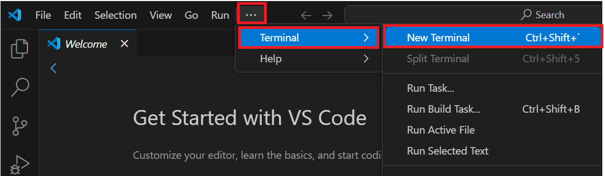
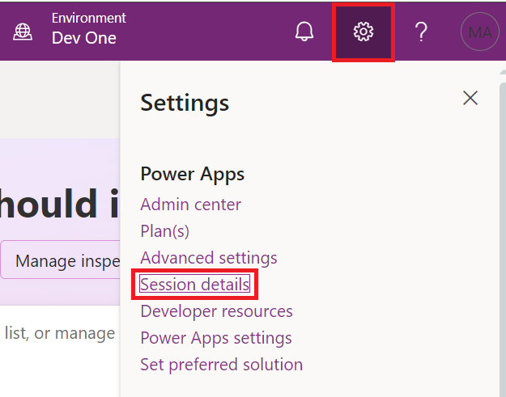
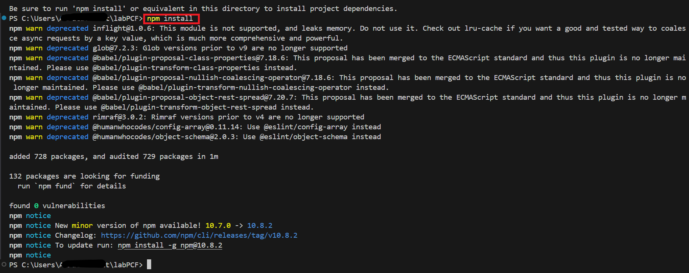
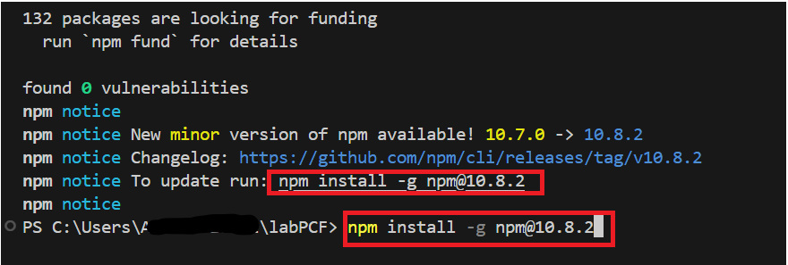
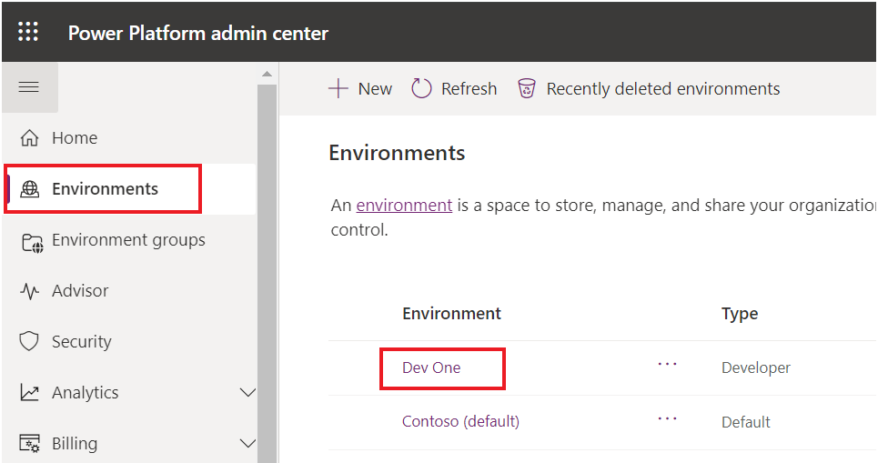

# **Lab 2: Verwenden Sie Power Apps CLI und erstellen Sie Power Apps Component Framework (PCF).**

**Geschätzte Dauer:**30 Minuten

**Ziele:** In diesem Lab lernen Sie, die Power Platform Tools zu
installieren und Ihre erste Power Apps Component Framework
(PCF)-Komponente zu erstellen.

## **Aufgabe 1: Installieren der Power Platform Tools**

1.  Öffnen Sie Visual Studio Code über die Verknüpfung auf dem Desktop
    der VM und wählen Sie das Symbol **Extensions** in der
    Navigationsleiste aus.

> 

2.  Suchen Sie nach +++**power platform tools**+++. Wählen Sie in den
    Suchergebnissen die Schaltfläche **Install** aus.

> 

3.  Warten Sie, bis die Installation abgeschlossen ist.

> 

4.  Wählen Sie „**more option (…),** **Terminal**“ und dann „**New
    Terminal**“.

> **Notiz:** Wenn Sie (… 3 Punkte) nicht sehen, wählen Sie **hamburger |
> Terminal | New Terminal.**
>
> 
>
> 

5.  Führen Sie den Befehl „pac“ aus, um zu sehen, welche Befehle
    verfügbar sind:

> +++pac+++
>
> 
>
> 
>
> 

6.  Sie können pac und dann einen Befehl eingeben, um zu sehen, welche
    Optionen verfügbar sind. Versuchen Sie beispielsweise Folgendes:

> +++pac admin+++
>
> 
>
> **Notiz:** Wenn Sie das Popup-Fenster „Some keybindings don’t got to
> the terminal by default and are handled by Visual Studio Code instead“
> sehen, wählen Sie „**Configure Terminal Settings**“ aus.
>
> 

7.  Sie können sehen, welche Optionen der Administrator hat.

> 

8.  Navigieren Sie zu Power Apps Maker-Portal mit
    <https://make.powerapps.com/> und stellen Sie sicher, dass Sie die
    **Dev One**-Umgebung ausgewählt haben.

9.  Wählen Sie in der oberen rechten Ecke des Bildschirms das Symbol
    „**Settings**“ und dann „**Session details**“ aus.

> 

10. Wählen Sie im Dialogfeld „Power Apps session details“ den Wert
    **Instance url** aus und kopieren Sie ihn zur späteren Verwendung in
    der Übung.

> 

11. Gehen Sie zurück zum Visual Studio Code-Terminal, geben Sie den
    folgenden Befehl ein, um eine Verbindung von der CLI herzustellen,
    und melden Sie sich bei der entsprechenden Aufforderung bei Ihrer
    Testumgebung an.

> +++pac auth create --name Lab --url **\<Your Instance URL**\>+++
>
> 

12. Melden Sie sich mit Ihren M365-Administrator-Anmeldeinformationen
    an.

> 

13. Geben Sie das **password** ein und klicken Sie auf **Sign in**.

> 

14. Sie können die Meldung sehen, dass die Authentifizierung erfolgreich
    abgeschlossen wurde.

> 

15. Geben Sie Folgendes Befehl who, der die Umgebung und die
    Benutzerinformationen anzeigt. So stellen Sie sicher, dass Sie sich
    in der richtigen Umgebung befinden.

> +++pac org who+++
>
> 

## **Aufgabe 2: Erstellen einer PCF-Komponente**

1.  Führen Sie den folgenden Befehl aus, um in Ihrem Benutzerordner
    einen neuen Ordner mit dem Namen **labPCF** zu erstellen.

> +++md labPCF+++
>
> 

2.  Sie können sehen, dass der Ordner labPCF erstellt wurde.

> 

3.  Wechseln Sie in das Verzeichnis, das Sie erstellt haben.

> +++cd labPCF+++
>
> 

4.  Führen Sie den folgenden Befehl aus, um das Komponentenprojekt zu
    initialisieren.

> +++pac pcf init --namespace lab --name FirstControl --template
> field+++
>
> 

5.  Geben Sie den folgenden Befehl ein und drücken Sie die Eingabetaste.
    Dadurch werden alle Abhängigkeiten aus dem npm-Repository
    heruntergeladen.

> +++npm install+++
>
> 

6.  Wenn Sie aufgefordert werden, npm zu aktualisieren, verwenden Sie
    den angegebenen Befehl wie im folgenden Bild gezeigt. In diesem Fall
    npm install -g npm@10.8.2 verwendet wird.

> 

7.  Öffnen Sie den Ordner in Visual Studio Code mit dem folgenden
    Befehl.

> +++code .+++

8.  Wenn Sie auf ein Popup mit der Frage „Do you trust the authors of
    the file stoßen, klicken Sie auf „**Yes, I thrust the authors**“.

> 

9.  Wenn Sie aufgefordert werden, ein Farbthema auszuwählen, klicken Sie
    auf „Browse Color Themes“, andernfalls ignorieren Sie diesen und den
    nächsten Schritt.

> 

10. Wählen Sie das Farbdesign „**Dark Modern**“ aus.

> 

11. Durchsuchen Sie die erstellten Dateien.

12. Erweitern Sie den Ordner **FirstControl** und wählen Sie
    **Index.ts** aus.

> 
>
> **Notiz:** Wählen Sie im Popup-Fenster mit der Frage „Do you want to
> allow untrusted files in this window“ die Option „**Allow**“ aus.
>
> 

13. Fügen Sie die folgenden zwei Variablen in den Export ein.

> 

14. Fügen Sie Folgendes in die Funktion **init()** ein, um die
    HTML-Steuerelemente zu erstellen und den Beschriftungswert
    festzulegen.

> this.label = document.createElement("input");
>
> this.label.setAttribute("type", "label");
>
> this.label.value = "My First PCF";
>
> this.\_container = document.createElement("div");
>
> this.\_container.appendChild(this.label);
>
> container.appendChild(this.\_container);
>
> 

15. Um die Datei zu speichern, gehen Sie zur Registerkarte „**File**“
    und wählen Sie „**Save**“.

> 

16. Rufen Sie das Terminal auf, geben Sie den folgenden Befehl ein und
    drücken Sie die Eingabetaste. Dadurch wird das Test-Harness mit dem
    neuesten Code gestartet, wie im dritten Screenshot dieses Schritts
    gezeigt.

> +++npm start+++
>
> 
>
> **Notiz:** Wenn Sie die Meldung erhalten, dass „Windows Defender
> Firewall has blocked some features“, wählen Sie „Allow access“ aus.
>
> 
>
> 

17. Der test harness eignet sich gut für den frühen Projektverlauf, um
    die visuelle Darstellung Ihres Steuerelements zu prüfen, ohne es in
    einer Umgebung bereitstellen zu müssen. Sie können Eigenschaftswerte
    festlegen, um die Größe des Steuerelementbereichs zu ändern. Nachdem
    Sie den test harness erkundet haben, wechseln Sie zurück zum
    Terminal und drücken Sie Ctrl-C, um die Ausführung des test harness
    zu beenden.

> 

18. Geben Sie **Y** ein und drücken Sie die \[EINGABE\]-Taste.

> 

19. Führen Sie den folgenden Befehl aus, um Lösungen in Ihrer Umgebung
    aufzulisten.

> +++pac solution list+++
>
> 

20. Dies sind die aktuellen Lösungen in Ihrer Umgebung. Im nächsten
    Schritt fügen Sie eine Lösung für die Komponente hinzu.

> 

21. Geben Sie den folgenden Push-Befehl ein, um unsere Steuerung in die
    Umgebung zu übertragen.

> +++pac pcf push --publisher-prefix lab+++
>
> 

## **Aufgabe 3: Verwenden der Komponente in einer App**

1.  Navigieren Sie zum Microsoft Power Platform Admin Center mit
    +++<https://admin.powerplatform.microsoft.com/home>+++.

2.  Schließen Sie das Welcome fenster.

> 

3.  Wählen Sie die **Dev One**-Environment aus, die Sie für das Lab
    verwenden.

> 

4.  Wählen Sie **Settings**.

> 

5.  Erweitern Sie den **Product** bereich und wählen Sie **Features**
    aus.

> 

6.  Aktivieren Sie auf der rechten Seite die Funktion „**Allow
    publishing of canvas apps with code components**“.

> 

7.  Wählen Sie unten **Save** aus.

> 

8.  Navigieren Sie zu [Power Apps maker
    portal](https://make.powerapps.com/) mit
    +++<https://make.powerapps.com/>+++ und stellen Sie sicher, dass Sie
    sich in der richtigen Umgebung befinden, d. h. **Dev One**.

> 

9.  Wählen Sie im linken Navigationsbereich „**Solutions**“ und dann
    „**Import solution**“ aus.

> 

10. Wählen Sie im Dialogfeld „Import a solution“ die Option „**Browse**“
    aus.

> 

11. Wählen Sie die ZIP-Datei der Lösung aus dem Pfad
    labPCF\obj\PowerAppsToolsTemp_lab\bin\Debug und wählen Sie dann
    „**Open**“ aus.

> 

12. Klicken Sie nach dem Importieren der ZIP-Datei auf **Next**.

> 

13. Wählen Sie **Import**.

> 

14. Warten Sie, bis die Meldung „Solution “**PowerAppsToolsTemp_lab**“
    imported successfully“ angezeigt wird.

> 

15. Doppelklicken Sie auf die neu importierte solution –
    **PowerAppsTools_lab**, um sie zu öffnen.

> 

16. Ihre Komponente sollte in der Liste angezeigt werden.

> 

17. Wählen Sie + **New | App | Canvas app**.

> 

18. Wählen Sie „**Phone**“ als Format aus, geben Sie „**First PCF** “
    als App-Name ein und wählen Sie „**Create**“ aus.

> 

19. Wählen Sie im Welcome Fenster „**Skip**“ aus.

> 

20. Wählen Sie im linken Bereich **Add (+)** und dann das Symbol „**Get
    more components**“ über der Liste der Popular components und unter
    dem Suchfeld aus, wie in der folgenden Abbildung gezeigt.

> 

21. Wählen Sie die Registerkarte **Code**.

> 

22. Wählen Sie Ihre Komponente – **FirstControl**. Wählen Sie
    **Import**.

> 

23. Wählen Sie in der linken Symbolleiste **+** aus und erweitern Sie
    **Code components**.

> 

24. Wählen Sie das **FirstControl** aus. Sie sollten nun Control mit dem
    Text **My First PCF** auf der Arbeitsfläche sehen.

> 

25. Wählen Sie **Save**, um die Anwendung zu speichern.

> 

Sie haben jetzt Ihre erste PCF-Komponente erstellt und in einer
Canvas-App verwendet.

**Zusammenfassung:** In diesem Lab haben Sie gelernt, wie Sie Ihre erste
PCF-Komponente erstellen und in einer Canvas-App verwenden. Power Apps
component framework erstellt Code komponenten für modellbasierte und
Canvas-Apps. Diese Codekomponenten verbessern die Benutzerfreundlichkeit
für Benutzer, die mit Daten in Formularen, Ansichten, Dashboards und
Canvas-App-Bildschirmen arbeiten.
