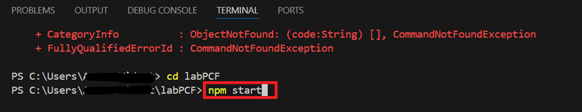
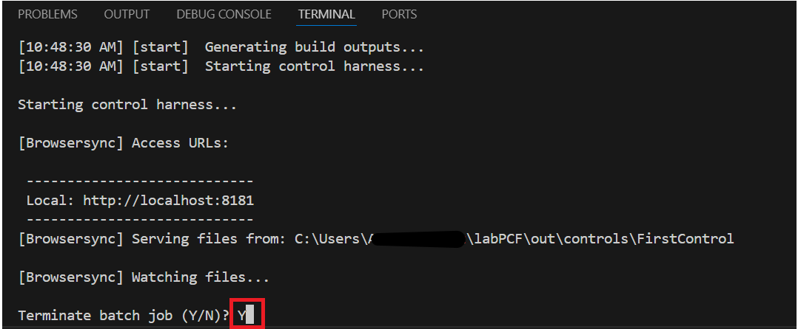

# **Laboratorio 2: Use el Power Apps CLI y cree Power Apps Component Framework (PCF)** 

**Duración estimada:** 30 minutos

**Objetivo:** En este laboratorio, aprenderá a instalar Power Platform
Tools y cree su primer componente Power Apps Component Framework (PCF).

## **Tarea 1: Instale el Power Platform Tools**

1.  Abra Visual Studio Code mediante el acceso directo en el Desktop VM,
    seleccione el ícono **Extensions** en la barra de navegación.

> 

2.  Busque +++**power platform tools**+++. Seleccioneel
    botón **Install** en los resultados de búsqueda.

> 

3.  Espere a que se complete la instalación.

> 

4.  Seleccione **más opciones (…),** **Terminal** y seleccione **New
    Terminal**.

> **Ojo:** Si no ve (… 3 puntos), seleccione **tres líneas | Terminal |
> New Terminal.**
>
> 
>
> 

5.  Ejecute el pac command para ver cúales commands están disponibles:

> +++pac+++
>
> 
>
> 
>
> 

6.  Puede introducir pac y un command para ver cúales opciones hay, por
    ejemplo, pruebe lo siguiente:

> +++pac admin+++
>
> 
>
> **Ojo:** Si ve un popup diciendo, ‘Some keybindings don’t got to the
> terminal by default and are handled by Visual Studio Code instead’,
> pues seleccione **Configure Terminal Settings**.
>
> 

7.  Puede ver cúales opciones admin tiene.

> 

8.  Navegue a Power Apps maker portal
    mediante <https://make.powerapps.com/> y asegúrese de tener
    seleccionado el **Dev One** environment.

9.  En la esquina superior derecha de la pantalla, seleccione el
    ícono **Settings** y elija **Session details**.

> 

10. En el diálogo Power Apps session details, seleccione el
    valor **Instance url** y copie para usarlo más tarde en el
    ejercicio.

> 

11. Vuelva al Visual Studio Code terminal, tecle el siguiente command
    para establecer una conexión del CLI e inicie sesión en su test
    environment cuando se le pide.

> +++pac auth create --name Lab --url **\<Your Instance URL\>**+++
>
> 

12. Inicie sesión con sus M365 Admin credentials.

> 

13. Introduzca la **contraseña** y haga clic en **Sign in**.

> 

14. Puede ver el mensaje de que la autenticación fue exitosa.

> 

15. Tecle el siguiente who command que mostrará su entorno y el user
    information. Esto sirve para asegurar si está en el entorno
    correcto.

> +++pac org who+++
>
> 

## **Tarea 2: Cree un PCF component**

1.  Ejecute el siguiente command para crear una nueva carpeta
    llamada **labPCF** dentro de la carpeta de su usuario.

> +++md labPCF+++
>
> 

2.  Puede ver que se ha creado la carpeta labPCF.

> 

3.  Cambie el directorio a la carpeta que acaba de crear.

> +++cd labPCF+++
>
> 

4.  Ejecute el siguiente command para iniciar el component project.

> +++pac pcf init --namespace lab --name FirstControl --template
> field+++
>
> 

5.  Tecle el siguiente command y presione enter. Esto elimina las
    dependencias del repositorio npm.

> +++npm install+++
>
> 

6.  Si se le pide actualizar el npm, use el siguiente command como se ve
    en la imagen. En este caso, se usa npm install -g npm@10.8.2.

> 

7.  Abra la carpeta en Visual Studio Code con el siguiente command.

> +++code .+++

8.  Si ve un popup diciendo Do you trust the authors of the file, haga
    clic en **Yes, I trust the authors**.

> 

9.  Si se le pide elegir un color theme, haga clic en Brows Color
    Themes, pero puede ignorar eso y continuar con el siguiente paso.

> 

10. Seleccione **Dark Modern** color theme.

> 

11. Explore los archivos que se crearon.

12. Expanda el **FirstControl** folder y seleccione **Index.ts**.

> 
>
> **Ojo:** En el popup diciendo, ‘Do you want to allow untrusted files
> in this window’, seleccione **Allow**.
>
> 

13. Pegue las siguientes dos variables en el export.

> 

14. Pegue lo siguiente dentro de la función **init()** para crear los
    controles HTML y establecer el label value.

> this.label = document.createElement("input");
>
> this.label.setAttribute("type", "label");
>
> this.label.value = "My First PCF";
>
> this.\_container = document.createElement("div");
>
> this.\_container.appendChild(this.label);
>
> container.appendChild(this.\_container);
>
> 

15. Para guardar el archivo, vaya a la pestaña **File** y seleccione
    **Save**.

> 

16. Vaya al terminal e introduzca el siguiente command y presione enter.
    Esto iniciará un test harness con el code más reciente como se ve en
    la tercera captura de pantalla de este paso.

> +++npm start+++
>
> 
>
> **Ojo:** Si recibe un mensaje como Windows Defender Firewall has
> blocked some features, seleccione Allow access.
>
> 
>
> 

17. El test harness es eficaz para usar más temprano en el proyecto para
    ver cómo se ve sin tener que implementarlo en un entorno. Puede
    establecer valores del property para cambiar el tamaño del control
    area. Después de terminar de explorar el test harness, vuelva al
    terminal y presione Ctrl-C para terminar la ejecución del test
    harness.

> 

18. Tecle **Y** y presione \[ENTER\].

> 

19. Ejecute el siguiente command para enlistar soluciones en su entorno.

> +++pac solution list+++
>
> 

20. Estas son las soluciones actuales en su entorno. El siguiente paso
    añadirá una para el componente.

> 

21. Tecle el siguiente push command para introducir nuestro control al
    entorno.

> +++pac pcf push --publisher-prefix lab+++
>
> 

## **Tarea 3: Use el component en una aplicación** 

1.  Navegue al Microsoft Power Platform Admin Center mediante
    +++<https://admin.powerplatform.microsoft.com/home>+++.

2.  Cierre la ventana welcome.

> 

3.  Seleccione el **Dev One** environment que está utilizando para el
    laboratorio.

> 

4.  Seleccione **Settings**.

> 

5.  Expanda **Product** y seleccione **Features**.

> 

6.  En la parte derecha, habilite el feature **Allow publishing of
    canvas apps with code components**.

> 

7.  Seleccione **Save** en la parte inferior.

> 

8.  Navegue a [Power Apps maker portal](https://make.powerapps.com/) con
    +++<https://make.powerapps.com/>+++ y asegúrese de estar en el
    entorno correcto **Dev One**.

> 

9.  Seleccione **Solutions** desde el panel de navegación izquierdo, y
    seleccione **Import solution**.

> 

10. Seleccione **Browse** en el diálogo Import a solution.

> 

11. Seleccione el zip file de la solución desde el path -
    labPCF\obj\PowerAppsToolsTemp_lab\bin\Debug y seleccione **Open**.

> 

12. Después de importar el zip file, haga clic en **Next**.

> 

13. Seleccione **Import**.

> 

14. Espere a que aparece el mensaje, Solution
    “**PowerAppsToolsTemp_lab**” imported successfully.

> 

15. Haga doble clic en la solución recién importada -
    **PowerAppsTools_lab** para abrirla.

> 

16. Debería ver su componente enlistado.

> 

17. Seleccione **+ New | App | Canvas app**.

> 

18. Seleccione **Phone** como Format, introduzca **First PCF** como App
    name, y seleccione **Create**.

> 

19. Seleccione **Skip** en la ventana welcome.

> 

20. En el panel izquierdo, seleccione **Add (+)**, y luego seleccione el
    ícono **Get more components** encima de la lista de Popular
    components y debajo del search box como se ve en la imagen.

> 

21. Seleccione la pestaña **Code**.

> 

22. Seleccione su componente – **FirstControl**. Seleccione **Import**.

> 

23. En la barra izquierda, seleccione **+** y expanda **Code
    components**.

> 

24. Seleccione **FirstControl**. Ahora debería ver el control con el
    texto **My First PCF** en el canvas.

> 

25. Seleccione **Save** para guardar la aplicación.

> 

Ha construido su primer PCF component y lo ha usado en un canvas app.

**Resumen:** En este laboratorio, ha aprendido a construir su primer PCF
component y lo ha usado en un canvas app. Power Apps component framework
crea los code components para aplicaciones canvas y basadas en modelos.
Estos code components se pueden usar a mejorar la experiencia del
usuario que trabaja con los datos en formularios, visualizaciones,
dashboards y pantallas de canvas apps.
