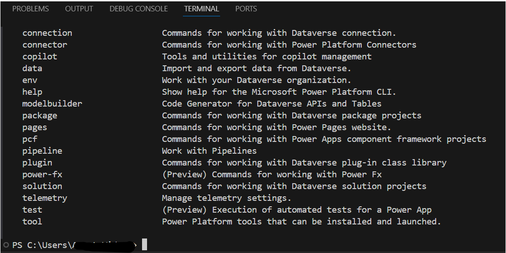

# **實驗 2：使用 Power Apps CLI 並創建 Power Apps Component Framework （PCF）** 

**預計持續時間：** 30 分鐘

**目標：**在本實驗中，您將學習安裝 Power Platform 工具並創建您的第一個
Power Apps Component Framework （PCF） 組件。

## **任務 1：安裝 Power Platform 工具**

1.  使用 VM 桌面上的快捷方式打開 Visual Studio Code，選擇導航欄中的
    **Extensions** 圖標。

> 

2.  搜索 +++**power platform tools**+++。在搜索結果中選擇 **Install**
    （安裝） 按鈕。

> 

3.  等待安裝完成。

> 

4.  選擇 **more option (…), Terminal**、終端，然後選擇 **New
    Terminal**。

> **注意：**如果您沒有看到 （...3 點）， **hamburger | Terminal | New
> Terminal.**
>
> 
>
> 

5.  運行 pac 命令以查看哪些命令可用：

> +++pac+++
>
> 
>
> 
>
> 

6.  您可以輸入
    pac，然後輸入一個命令來查看它有哪些選項，例如，嘗試以下作：

> +++pac admin+++
>
> 
>
> **注意：**如果您看到彈出窗口，顯示“默認情況下，某些鍵綁定不會進入終端，而是由
> Visual Studio Code 處理”，請選擇**“配置終端設置”。**
>
> 

7.  你可以看到，admin有哪些選項。

> 

8.  使用 <https://make.powerapps.com/> 導航到 Power Apps
    製作者門戶，確保您已選擇 **Dev One** 環境。

9.  在屏幕的右上角，選擇 **Settings** （設置） 圖標，然後選擇 **Session
    details** （會話詳細信息）。

> 

10. 在 Power Apps session details （Power Apps 會話詳細信息）
    對話框中，選擇 **Instance url** value （實例 url 值）
    並複製它以供稍後在練習中使用。

> 

11. 返回到 Visual Studio Code 終端，鍵入以下命令以從 CLI
    建立連接，並在出現提示時登錄到測試環境。

> +++pac auth create --name Lab --url **\<Your Instance URL\>**+++
>
> 

12. 使用您的 M365 管理員憑據登錄。

> 

13. 輸入**密碼**，然後單擊 **Sign in**（登錄）。

> 

14. 您可以看到身份驗證已成功完成的消息。

> 

15. 鍵入以下 who
    命令，該命令將顯示環境和用戶信息。這有助於確保您處於正確的環境中。

> +++pac org who+++
>
> 

## **任務 2：創建 PCF 組件**

1.  運行以下命令，在用戶文件夾中創建名為 **labPCF** 的新文件夾。.

> +++md labPCF+++
>
> 

2.  您可以看到 labPCF 文件夾已創建。

> 

3.  將 directory 更改為您創建的文件夾。

> +++cd labPCF+++
>
> 

4.  執行以下命令初始化組件工程。

> +++pac pcf init --namespace lab --name FirstControl --template
> field+++
>
> 

5.  鍵入以下命令，然後按 Enter。這將從 npm 存儲庫中拉取所有依賴項。

> +++npm install+++
>
> 

6.  如果系統要求您更新
    npm，請使用給定的命令，如下圖所示。在這種情況下，使用, npm install
    -g npm@10.8.2.

> 

7.  使用以下命令在 Visual Studio Code 中打開該文件夾。

> +++code .+++

8.  如果您遇到一個彈出窗口，說。Do you trust the authors of the file
    然後單擊 **Yes, I trust the authors**。

> 

9.  如果系統要求您選擇顏色主題，請單擊 Brows Color Themes
    否則，請忽略此步驟和下一步。

> 

10. 選擇 **Dark Modern** color theme （深色現代顏色主題）。

> 

11. 瀏覽已創建的文件。

12. 展開 **FirstControl** 文件夾，然後選擇 **Index.ts**。

> 
>
> **注意：**在彈出窗口中詢問“是否要允許此窗口中不受信任的文件”，選擇**“Allow”。**
>
> 

13. 將以下兩個變量粘貼到導出中。

> 

14. 將以下內容粘貼到 **init()** 函數中，以創建 HTML 控件並設置標簽值。

> this.label = document.createElement("input");
>
> this.label.setAttribute("type", "label");
>
> this.label.value = "My First PCF";
>
> this.\_container = document.createElement("div");
>
> this.\_container.appendChild(this.label);
>
> container.appendChild(this.\_container);
>
> 

15. 要保存文件，請轉到 **文件** 選項卡，然後選擇 **Save**。

> 

16. 轉到終端並輸入以下命令，然後輸入。這將使用最新代碼啟動測試框架，如此步驟的第三個屏幕截圖所示。

> +++npm start+++
>
> 
>
> **注意：**如果您收到 Windows Defender
> 防火牆阻止了某些功能的消息，請選擇 Allow access（允許訪問）。
>
> 
>
> 

17. 在項目早期使用測試工具可以有效地查看您的控件的視覺外觀，而不必將其部署到環境中。您可以設置
    property 的值來更改控制區域的大小。瀏覽完測試工具後，切換回終端並按
    Ctrl-C 終止測試工具的執行。

> 

18. 鍵入 **Y** 和 \[ENTER\]。

> 

19. 運行以下命令以列出環境中的解決方案。

> +++pac solution list+++
>
> 

20. 這些是您環境中的當前解決方案。下一步將為組件添加一個。

> 

21. 鍵入以下 push 命令，將控件推送到環境中。

> +++pac pcf push --publisher-prefix lab+++
>
> 

## **任務 3：在應用程序中使用組件**

1.  使用 +++<https://admin.powerplatform.microsoft.com/home>+++ 導航到
    Microsoft Power Platform 管理中心。

2.  關閉歡迎窗口。

> 

3.  選擇您用於實驗室的 **Dev One** 環境。

> 

4.  選擇 **Settings**。

> 

5.  展開 **Product** area （產品區域） 並選擇 **Features** （功能）。

> 

6.  在右側，啟用 **Allow publishing of canvas apps with code
    components** 功能。

> 

7.  選擇底部的 **Save** 。

> 

8.  使用 +++<https://make.powerapps.com/>+++ 導航到 Power Apps
    製作者門戶，並確保您位於正確的環境中，即 **Dev One**。

> 

9.  從左側導航窗格中選擇 **Solutions**，然後選擇 **Import solution**。

> 

10. 在“導入解決方案”對話框中選擇“**Browse**”。

> 

11. 從路徑 - labPCF\obj\PowerAppsToolsTemp_lab\bin\Debug
    中選擇解決方案的 zip 文件，然後選擇 **Open**。

> 

12. 導入 zip 文件後，單擊 **Next**。

> 

13. 選擇 **Import**。

> 

14. 等待消息顯示 Solution “**PowerAppsToolsTemp_lab**” imported
    successfully （已成功導入解決方案“”）。

> 

15. 雙擊新導入的解決方案 - **PowerAppsTools_lab**將其打開。

> 

16. 您應該會看到您的組件列出來。

> 

17. 選擇 **+ New | App | Canvas app**。

> 

18. 選擇 **Phone** （電話） 作為 Format （格式），輸入 **First PCF**
    （第一個 PCF） 作為 App name（應用程序名稱），然後選擇 **Create**
    （創建）。

> 

19. 在歡迎窗口中選擇 **Skip**。

> 

20. 在左側窗格中，選擇 **Add（+），**然後選擇 **Get more components**
    圖標，該圖標位於 常用組件 列表上方和搜索框下方，如下圖所示。

> 

21. 選擇 **Code** （代碼） 選項卡.

> 

22. 選擇您的組件 – **FirstControl**。選擇 **Import**。

> 

23. 在左側工具欄上，選擇 **+** 並展開 **代碼組件**。

> 

24. 選擇 **FirstControl**。現在，您應該會在畫布上看到帶有文本 **My First
    PCF** 的控件。

> 

25. 選擇 **Save** 以保存應用程序。

> 

您現在已經構建了第一個 PCF 組件並在畫布應用程序中使用了它。

**摘要：**在本實驗中，您學習了如何構建您的第一個 PCF
組件並在畫布應用中使用它。Power Apps
組件框架為模型驅動應用和畫布應用創建代碼組件。這些代碼組件可用於增強用戶在窗體、視圖、儀錶板和畫布應用程序屏幕上處理數據的用戶體驗。
