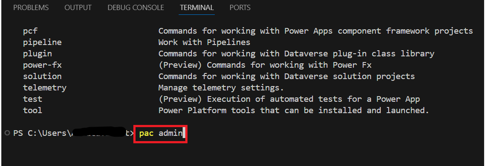
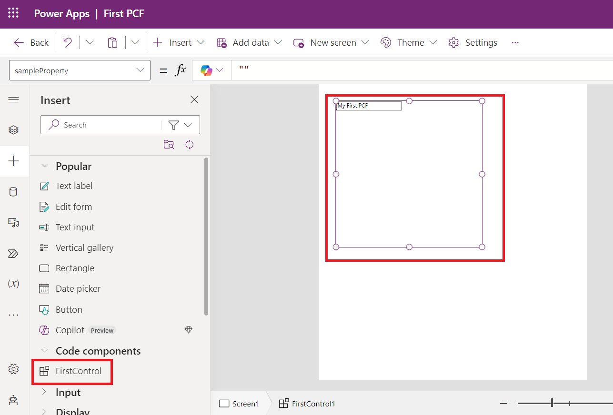

# **实验 2：使用 Power Apps CLI 并创建 Power Apps Component Framework （PCF）** 

**预计持续时间：** 30 分钟

**目标：**在本实验中，您将学习安装 Power Platform 工具并创建您的第一个
Power Apps Component Framework （PCF） 组件。

## **任务 1：安装 Power Platform 工具**

1.  使用 VM 桌面上的快捷方式打开 Visual Studio Code，选择导航栏中的
    **Extensions** 图标。

> 

2.  搜索 +++**power platform tools**+++。在搜索结果中选择 **Install**
    （安装） 按钮。

> 

3.  等待安装完成。

> 

4.  选择 **more option (…), Terminal**、终端，然后选择 **New
    Terminal**。

> **注意：**如果您没有看到 （...3 点）， **hamburger | Terminal | New
> Terminal.**
>
> 
>
> 

5.  运行 pac 命令以查看哪些命令可用：

> +++pac+++
>
> 
>
> 
>
> 

6.  您可以输入
    pac，然后输入一个命令来查看它有哪些选项，例如，尝试以下作：

> +++pac admin+++
>
> 
>
> **注意：**如果您看到弹出窗口，显示“默认情况下，某些键绑定不会进入终端，而是由
> Visual Studio Code 处理”，请选择**“配置终端设置”。**
>
> 

7.  你可以看到，admin有哪些选项。

> 

8.  使用 <https://make.powerapps.com/> 导航到 Power Apps
    制作者门户，确保您已选择 **Dev One** 环境。

9.  在屏幕的右上角，选择 **Settings** （设置） 图标，然后选择 **Session
    details** （会话详细信息）。

> 

10. 在 Power Apps session details （Power Apps 会话详细信息）
    对话框中，选择 **Instance url** value （实例 url 值）
    并复制它以供稍后在练习中使用。

> 

11. 返回到 Visual Studio Code 终端，键入以下命令以从 CLI
    建立连接，并在出现提示时登录到测试环境。

> +++pac auth create --name Lab --url **\<Your Instance URL\>**+++
>
> 

12. 使用您的 M365 管理员凭据登录。

> 

13. 输入**密码**，然后单击 **Sign in**（登录）。

> 

14. 您可以看到身份验证已成功完成的消息。

> 

15. 键入以下 who
    命令，该命令将显示环境和用户信息。这有助于确保您处于正确的环境中。

> +++pac org who+++
>
> 

## **任务 2：创建 PCF 组件**

1.  运行以下命令，在用户文件夹中创建名为 **labPCF** 的新文件夹。.

> +++md labPCF+++
>
> 

2.  您可以看到 labPCF 文件夹已创建。

> 

3.  将 directory 更改为您创建的文件夹。

> +++cd labPCF+++
>
> 

4.  执行以下命令初始化组件工程。

> +++pac pcf init --namespace lab --name FirstControl --template
> field+++
>
> 

5.  键入以下命令，然后按 Enter。这将从 npm 存储库中拉取所有依赖项。

> +++npm install+++
>
> 

6.  如果系统要求您更新
    npm，请使用给定的命令，如下图所示。在这种情况下，使用, npm install
    -g npm@10.8.2.

> 

7.  使用以下命令在 Visual Studio Code 中打开该文件夹。

> +++code .+++

8.  如果您遇到一个弹出窗口，说。Do you trust the authors of the file
    然后单击 **Yes, I trust the authors**。

> 

9.  如果系统要求您选择颜色主题，请单击 Brows Color Themes
    否则，请忽略此步骤和下一步。

> 

10. 选择 **Dark Modern** color theme （深色现代颜色主题）。

> 

11. 浏览已创建的文件。

12. 展开 **FirstControl** 文件夹，然后选择 **Index.ts**。

> 
>
> **注意：**在弹出窗口中询问“是否要允许此窗口中不受信任的文件”，选择**“Allow”。**
>
> 

13. 将以下两个变量粘贴到导出中。

> 

14. 将以下内容粘贴到 **init()** 函数中，以创建 HTML 控件并设置标签值。

> this.label = document.createElement("input");
>
> this.label.setAttribute("type", "label");
>
> this.label.value = "My First PCF";
>
> this.\_container = document.createElement("div");
>
> this.\_container.appendChild(this.label);
>
> container.appendChild(this.\_container);
>
> 

15. 要保存文件，请转到 **文件** 选项卡，然后选择 **Save**。

> 

16. 转到终端并输入以下命令，然后输入。这将使用最新代码启动测试框架，如此步骤的第三个屏幕截图所示。

> +++npm start+++
>
> 
>
> **注意：**如果您收到 Windows Defender
> 防火墙阻止了某些功能的消息，请选择 Allow access（允许访问）。
>
> 
>
> 

17. 在项目早期使用测试工具可以有效地查看您的控件的视觉外观，而不必将其部署到环境中。您可以设置
    property 的值来更改控制区域的大小。浏览完测试工具后，切换回终端并按
    Ctrl-C 终止测试工具的执行。

> 

18. 键入 **Y** 和 \[ENTER\]。

> 

19. 运行以下命令以列出环境中的解决方案。

> +++pac solution list+++
>
> 

20. 这些是您环境中的当前解决方案。下一步将为组件添加一个。

> 

21. 键入以下 push 命令，将控件推送到环境中。

> +++pac pcf push --publisher-prefix lab+++
>
> 

## **任务 3：在应用程序中使用组件**

1.  使用 +++<https://admin.powerplatform.microsoft.com/home>+++ 导航到
    Microsoft Power Platform 管理中心。

2.  关闭欢迎窗口。

> 

3.  选择您用于实验室的 **Dev One** 环境。

> 

4.  选择 **Settings**。

> 

5.  展开 **Product** area （产品区域） 并选择 **Features** （功能）。

> 

6.  在右侧，启用 **Allow publishing of canvas apps with code
    components** 功能。

> 

7.  选择底部的 **Save** 。

> 

8.  使用 +++<https://make.powerapps.com/>+++ 导航到 Power Apps
    制作者门户，并确保您位于正确的环境中，即 **Dev One**。

> 

9.  从左侧导航窗格中选择 **Solutions**，然后选择 **Import solution**。

> 

10. 在“导入解决方案”对话框中选择“**Browse**”。

> 

11. 从路径 - labPCF\obj\PowerAppsToolsTemp_lab\bin\Debug
    中选择解决方案的 zip 文件，然后选择 **Open**。

> 

12. 导入 zip 文件后，单击 **Next**。

> 

13. 选择 **Import**。

> 

14. 等待消息显示 Solution “**PowerAppsToolsTemp_lab**” imported
    successfully （已成功导入解决方案“”）。

> 

15. 双击新导入的解决方案 - **PowerAppsTools_lab**将其打开。

> 

16. 您应该会看到您的组件列出来。

> 

17. 选择 **+ New | App | Canvas app**。

> 

18. 选择 **Phone** （电话） 作为 Format （格式），输入 **First PCF**
    （第一个 PCF） 作为 App name（应用程序名称），然后选择 **Create**
    （创建）。

> 

19. 在欢迎窗口中选择 **Skip**。

> 

20. 在左侧窗格中，选择 **Add（+），**然后选择 **Get more components**
    图标，该图标位于 常用组件 列表上方和搜索框下方，如下图所示。

> 

21. 选择 **Code** （代码） 选项卡.

> 

22. 选择您的组件 – **FirstControl**。选择 **Import**。

> 

23. 在左侧工具栏上，选择 **+** 并展开 **代码组件**。

> 

24. 选择 **FirstControl**。现在，您应该会在画布上看到带有文本 **My First
    PCF** 的控件。

> 

25. 选择 **Save** 以保存应用程序。

> 

您现在已经构建了第一个 PCF 组件并在画布应用程序中使用了它。

**摘要：**在本实验中，您学习了如何构建您的第一个 PCF
组件并在画布应用中使用它。Power Apps
组件框架为模型驱动应用和画布应用创建代码组件。这些代码组件可用于增强用户在窗体、视图、仪表板和画布应用程序屏幕上处理数据的用户体验。
