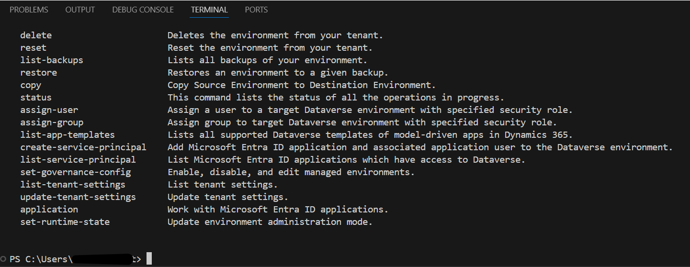
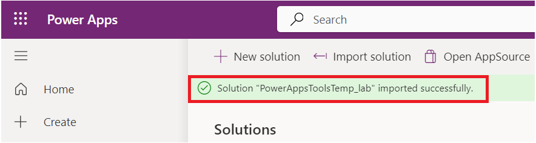
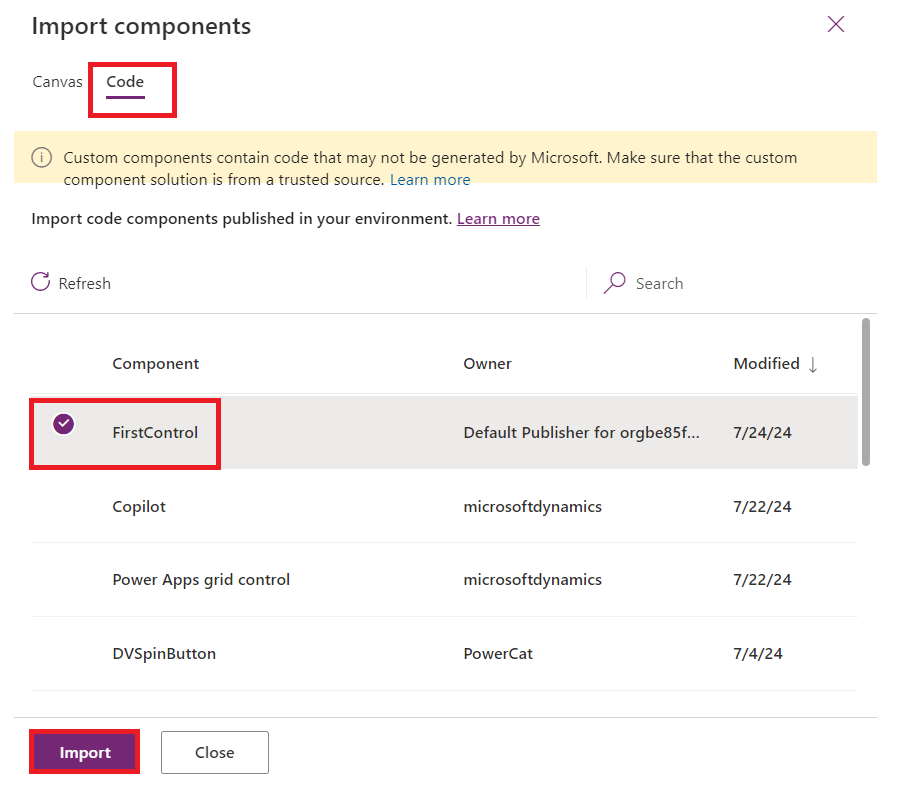

# **ラボ２：Power Apps CLIを使用してPower Apps Component Framework (PCF) を作成する**

**所要時間:** 30 分

**目的:** このラボでは、Power Platform Tools
をインストールし、最初のPower Apps Component
Framework(PCF)コンポーネントを作成する方法を学びます。

## **タスク１：Power Platform Toolsをインストールする**

1.  VMデスクトップでのショートカットからVisual Studio
    Codeを開き、ナビゲーションバーの**Extensions**アイコンを選択します。

> 

2.  +++**power platform
    tools**+++を検索し、検索結果から**Install** ボタンにクリックする。

> 

3.  インストールが完了するまで待ちます。

> 

4.  **more option (…)**を選択し、**Terminal** と**New
    Terminal**を選択します。

> 注意**:** (… 3つの点)が表示されない場合は、**hamburger | Terminal |
> New Terminal**を選択します。
>
> 
>
> 

5.  以下のpacコマンドを実行して、利用可能なコマンドを確認します:

> **+++pac+++**
>
> 
>
> 
>
> 

6.  そしてpac
    を入力してコマンドを付けてオプションを確認できます。例えば：以下を試してみてください:

> +++pac admin+++
>
> 
>
> **注意：**ポップアップで「一部のキーバインドはデフォルトでターミナルに送信されず、Visual
> Studio Code で処理されます」と表示された場合は、**Configure Terminal
> Settings**を選択してください。.
>
> 

7.  admin が持つオプションを確認できます。

> 

8.  <https://make.powerapps.com/> を使ってPower Apps
    メーカーポータルに移動し、**Dev
    One**環境を選択していることを確認します。

9.  画面右上に**Settings** アイコンをクリックし、**Session
    details**を選択します。

> 

10. Power Apps session detailsダイアログボックスで**Instance
    url** の値をクリックしてコピーし、後で使用します。

> 

11. Visual Studio
    Codeのターミナルにクリックして、CLIとの接続を確立するため以下のコマンドを入力し、プロンプトが表示された場合は自分のテスト環境にサインインします。

> +++pac auth create --name Lab --url **\<Your Instance URL\>**+++
>
> 

12. M365 Adminアカウントでサインインします。

> 

13. **password** を入力して**Sign in**にクリックしてください。

> 

14. 「認証が成功しました」と表示されます。

> 

15. 以下のwho コマンドを入力すると、環境とユーザーの情報が表示されます。これは正しい環境にいることを確認します。

> +++pac org who+++
>
> 

## **タスク2：PCF コンポーネントを作成する**

1.  ユーザー フォルダー内に\`**labPCF**\`
    フォルダーを作成するため以下のコマンドを実行します。

> +++md labPCF+++
>
> 

2.  labPCFフォルダーが作成されたことを確認します。

> 

3.  作成されたフォルダーにディレクトリを変更します。

> +++cd labPCF+++
>
> 

4.  以下のコマンドを実行してコンポーネントプロジェクトを初期化します。

> +++pac pcf init --namespace lab --name FirstControl --template
> field+++
>
> 

5.  次のコマンドを入力し、enterを押すとnpm
    リポジトリから依存関係がダウンロードされます。

> +++npm install+++
>
> 

6.  npmのアップデートであれば、以下の画像で指示されたコマンドを使用します。以下の場合はnpm
    install -g <npm@10.8.2>が使用します。　

> 

7.  以下のコマンドからフォルダーをVisual Studio Codeで開きます。

> +++code .+++

8.  もし「ファイルの作成者を信じますか。」というポップアップが出ると**Yes,
    I thrust the authors** にクリックしてください。

> 

9.  カラーテーマを選択するように求められた場合、Browse Color Themes
    にクリックし、それ以外の場合は無視して次のステップに続きます。

> 

10. **Dark Modern**テーマを選択します。

> 

11. 作成されてファイルを確認します。

12. **FirstControl** フォルダー内の**Index.ts**を開きます。

> 
>
> **注意:**「このウィンドウで信頼されていないファイルを許可しますか」というポップアップが出ると**Allow**を選択します。
>
> 

13. エクスポート部分に以下のように二つの変数を追加します。

> 

14.  **init()**関数内に以下を追加してHTMLコントロールとラベル値を作成します。

> this.label = document.createElement("input");
>
> this.label.setAttribute("type", "label");
>
> this.label.value = "My First PCF";
>
> this.\_container = document.createElement("div");
>
> this.\_container.appendChild(this.label);
>
> container.appendChild(this.\_container);
>
> 

15. ファイルを保存するため、**File** タブで**Save**を選択します。

> 

16. ターミナルに行って以下のコマンドを入力し、enterキーを押します。これで以下の赤いステップのスクリーンショットに表示されているように新しいコードでテストが起動します。

> +++npm start+++
>
> 
>
> **注意：**「Windows
> Defenderファイアウォールによって一部の機能がブロックされている」という警告が出た場合はAllow
> accessを選択します。
>
> 
>
> 

17. テストハーネスは、プロジェクトの早い段階でコントロールを環境に展開せず、視覚的にどのように見えるかを確認するため効果になります。プロパティの値を設定することでコントロール領域のサイズを変更できます。テストハーネスの操作を完了したら、ターミナルに戻り、Ctrl-C
    キーを押してテストハーネスの実行を完了します。

> 

18. **Y**を入力し、\[ENTER\]を押します。

> 

19. 次のコマンドを実行して環境の中のソリューションを一覧表示します。

> +++pac solution list+++
>
> 

20. これらは現在環境ソリューションです。次のステップでコンポーネントの一部が追加されます。

> 

21. 以下のpush コマンドを入力して制御を環境にプッシュします。

> +++pac pcf push --publisher-prefix lab+++
>
> 

## **タスク3：アプリでコンポーネントを使用する**

1.  +++<https://admin.powerplatform.microsoft.com/home>+++にクリックしてMicrosoft
    Power Platform管理センターに移動します。

2.  ウェルカムウィンドウを閉じます。

> 

3.  ラボで使用している「**Dev One**」環境を選択します。

> 

4.  **Settings**を選択します。

> 

5.  **Product** エリアを展開し、**Features**を選択します。

> 

6.  右側である**Allow publishing of canvas apps with code
    components** 機能を有効にします。

> 

7.  下部の**Save**ボタンを押します。

> 

8.  +++<https://make.powerapps.com/>+++ をクリックしてPower
    Appsメーカーポータル に移動します。正しい環境**Dev
    One**にいることを確認します。

> 

9.  左側のナビゲーションペインから**Solutions**を選択して、**Import
    solution**を選択します。

> 

10. ソリューションのインポートというダイアログで**Browse**を選択します。

> 

11. 　labPCF\obj\PowerAppsToolsTemp_lab\bin\Debugのパスからソリューションの
    zipファイルを選択し、**Open**にクリックします。

> 

12. ファイルをインポートした後、**Next**をクリックします。

> 

13. **Import**を選択します。

> 

14. ソリューション“**PowerAppsToolsTemp_lab**”
    が正常にインポートされましたと表示されるまで待ちます。

> 

15. インポートされたばかりのソリューション**PowerAppsTools_lab**
    をダブルクリックして開きます。

> 

16. コンポーネントがリストに表示されていることを確認します。

> 

17. **+ New | App | Canvas app**を選択します。

> 

18. フォーマットに**Phone**を選択し、アプリ名に**First
    PCF**と入力し**Create**を選択します。 

> 

19. ウェルカムウィンドウで**Skip**を選択します。

> 

20. 左側のペインで、**Add
    (+)**を選択し、次の画像に示すようにPopularコンポーネントのリストの上、検索ボックスの下にある**Get
    more components**アイコンを選択します。

> 

21. **Code**タブを選択します。

> 

22. コンポーネント– **FirstControl**を選択し、**Import**を選択します。

> 

23. 左ツールバーで**+**をクリックし、**Code components**を展開します。

> 

24. **FirstControl**を選択します。canvasに**My First
    PCF**というテキストを含むコントロールが表示されます。

> 

25. アプリケーションを保存しるように**Save**を選択します。

> 

これで、自分の初めてのPCFコンポーネントを作成し、キャンバスアプリで使用することができました。

**まとめ**：このラボでは、最初のPCFコンポーネントを構築し、それをキャンバスアプリで使用する方法を学習しました。Power
Apps コンポーネント
フレームワークは、モデル駆動型アプリとキャンバスアプリ用のコードコンポーネントを作成します。これらのコードコンポーネントは、フォーム、ビュー、ダッシュボード、およびキャンバスアプリ画面でのデータを操作時のユーザー体験を向上させるために使用できます。
