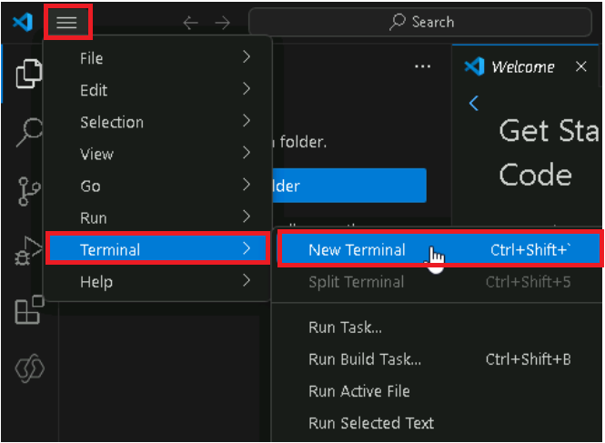
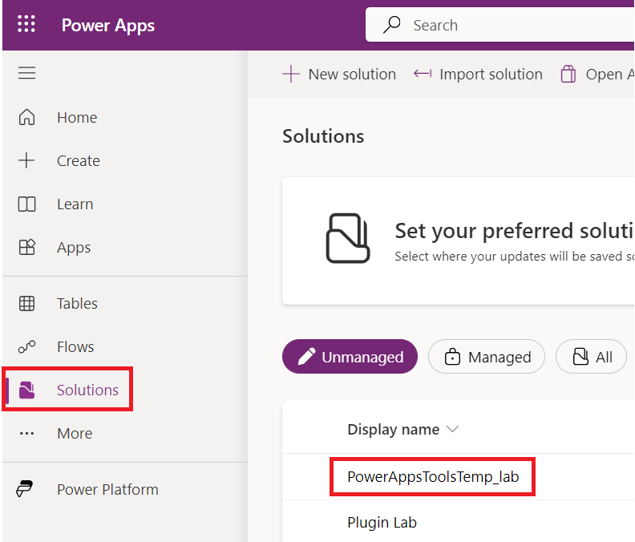

# **Atelier 2 : Utiliser Power Apps CLI et créer Power Apps Component Framework (PCF)** 

**Durée estimée :** 30 min

**Objectif :** Dans cet atelier, vous allez apprendre à installer les
outils Power Platform et à créer votre premier composant Power Apps
Component Framework (PCF).

## **Tâche 1 : Installer les outils de la plate-forme d'alimentation**

1.  Ouvrez Visual Studio Code à l'aide du raccourci présent sur le
    bureau de la machine virtuelle, sélectionnez l' icône **Extensions**
    dans la barre de navigation.

> 

2.  Recherchez +++ **power platform tools** +++. Sélectionnez le bouton
    **Install** dans les résultats de la recherche.

> 

3.  Attendez que l'installation soit terminée.

> 

4.  Sélectionnez **more option (...), Terminal**, puis sélectionnez
    **New terminal**.

> **Remarque :** Si vous ne voyez pas (... 3 points), sélectionnez
> **Hamburger | Terminal | New terminal.**
>
> 
>
> 

5.  Exécutez la commande pac pour voir quelles commandes sont
    disponibles :

> +++pac+++
>
> 
>
> 
>
> 

6.  Vous pouvez entrer pac puis une commande pour voir quelles options
    il a, par exemple, essayez ce qui suit :

> +++Pac admin+++
>
> 
>
> **Remarque :** Si la fenêtre contextuelle indique que ‘Certaines
> combinaisons de touches ne sont pas transmises au terminal par défaut
> et sont gérées par Visual Studio Code à la place’, sélectionnez
> **Configure Terminal Settings**.
>
> 

7.  Vous pouvez voir quelles options l'administrateur a.

> 

8.  Accédez au portail du créateur Power Apps à l'aide
    <https://make.powerapps.com/> et assurez-vous que l' environnement
    **Dev One** est sélectionné.

9.  Dans le coin supérieur droit de l'écran, sélectionnez l' **i**cône
    **Settings** et choisissez **Session details**.

> 

10. Dans la boîte de dialogue Détails de la session Power Apps,
    sélectionnez Valeur de **Instance url**  et copiez-la pour
    l'utiliser ultérieurement dans l'exercice.

> 

11. Revenez au terminal Visual Studio Code, tapez la commande suivante
    pour établir une connexion à partir de l'interface de ligne de
    commande et connectez-vous à votre environnement de test lorsque
    vous y êtes invité.

> +++pac auth create --name Lab --url **\<URL de votre instance\>+++**
>
> 

12. Connectez-vous avec vos identifiants M365 Admin .

> 

13. Entrez le **mot de passe** et cliquez sur **Sign in**.

> 

14. Vous pouvez voir le message indiquant que l'authentification a été
    effectuée avec succès.

> 

15. Tapez la commande who suivante qui affichera l'environnement et les
    informations sur l'utilisateur. C'est bien pour s'assurer que vous
    êtes dans le bon environnement.

> +++pac org who+++
>
> 

## **Tâche 2 : Création d'un composant PCF**

1.  Exécutez la commande ci-dessous pour créer un nouveau dossier nommé
    **labPCF** dans le dossier de votre utilisateur.

> +++md labPCF+++
>
> 

2.  Vous pouvez voir que le dossier labPCF a été créé.

> 

3.  Changez de répertoire pour le dossier que vous avez créé.

> +++cd labPCF+++
>
> 

4.  Exécutez la commande ci-dessous pour initialiser le projet de
    composant.

> +++pac pcf init --namespace lab --name FirstControl --template
> field+++
>
> 

5.  Tapez la commande suivante, puis appuyez sur Entrée. Cela supprime
    toutes les dépendances du référentiel npm.

> +++npm install+++
>
> 

6.  Si vous êtes demandé à mettre à jour le npm, utilisez la commande
    donnée comme indiqué dans l'image ci-dessous. Dans ce cas, npm
    install -g npm@10.8.2 est utilisé.

> 

7.  Ouvrez le dossier dans Visual Studio Code à l'aide de la commande
    suivante.

> +++code .+++

8.  Si vous tombez sur un pop-up disant. Faites-vous confiance aux
    auteurs du fichier puis cliquez sur **Yes, I thrust the authors**.

> 

9.  Si on vous demande de choisir le thème de couleur, cliquez sur
    Thèmes de couleur des sourcils, sinon, ignorez cette étape et
    l'étape suivante.

> 

10. Sélectionnez le thème de couleur **Dark Modern**.

> 

11. Explorez les fichiers qui ont été créés.

12. Développez le dossier **FirstControl** et sélectionnez **Index.ts**.

> 
>
> **Remarque :** Dans la fenêtre contextuelle demandant ‘Voulez-vous
> autoriser les fichiers non approuvés dans cette fenêtre’, sélectionnez
> **Allow**.
>
> 

13. Collez les deux variables suivantes à l'intérieur de l'exportation.

> 

14. Collez ce qui suit à l'intérieur de la fonction **init()** pour
    créer les contrôles HTML et définir la valeur de l'étiquette.

> this.label = document.createElement(“input“) ;
>
> this.label.setAttribute(“type “, “ label “) ;
>
> this.label.value = "My First PCF";
>
> this.\_container = document.createElement("div");
>
> this.\_container.appendChild(this.label);
>
> container.appendChild(this.\_container);
>
> 

15. Pour enregistrer le fichier, allez dans l' onglet **File** et
    sélectionnez **Save**.

> 

16. Allez dans le terminal et entrez la commande suivante, puis entrez.
    Cela démarrera le harnais de test avec le dernier code comme indiqué
    dans cette capture d'écran de cette étape.

> +++npm start+++
>
> 
>
> **Remarque :** Si vous recevez un message indiquant que le p Windows
> Defender Firewall a bloqué certaines fonctionnalités, sélectionnez
> Autoriser l'accès.
>
> 
>
> 

17. Le harness de test peut être utilisé au début du projet pour voir à
    quoi ressemble visuellement votre contrôle sans avoir à le déployer
    dans un environnement. Vous pouvez définir les valeurs de la
    propriété pour modifier la taille de la zone de contrôle. Une fois
    que vous avez terminé d'explorer le harness de test, revenez au
    terminal et appuyez sur Ctrl-C pour mettre fin à l'exécution du
    harness de test.

> 

18. Tapez **Y** et \[ENTER\].

> 

19. Exécutez la commande suivante pour répertorier les solutions de
    votre environnement.

> +++Liste des solutions PAC+++
>
> 

20. Il s'agit des solutions actuelles qui se trouvent dans votre
    environnement. L'étape suivante en ajoutera un pour le composant.

> 

21. Tapez la commande push suivante pour appliquer notre contrôle à
    l'environnement.

> +++pac pcf push --publisher-prefix lab+++
>
> 

## **Tâche 3 : Utiliser le composant dans une application** 

1.  Accédez au Microsoft Power Platform Admin Center à l'aide de
    +++<https://admin.powerplatform.microsoft.com/home>+++.

2.  Fermez la fenêtre d'accueil.

> 

3.  Sélectionnez l'environnement **Dev One** que vous utilisez pour
    l’Atelier .

> 

4.  Sélectionnez **Setting**.

> 

5.  Développez la zone **Product** et sélectionnez **Features**.

> 

6.  Sur le côté droit, activez la fonctionnalité **Allow publishing of
    canvas apps with code components**.

> 

7.  Sélectionnez **Save** en bas.

> 

8.  Accédez au [portail Power Apps maker](https://make.powerapps.com/) à
    l'aide de +++<https://make.powerapps.com/>+++ et assurez-vous que
    vous êtes dans le bon environnement, c'est-à-dire **Dev One**.

> 

9.  Sélectionnez **Solutions** dans le volet de navigation de gauche,
    puis sélectionnez **Import la solution**.

> 

10. Sélectionnez **Browse** dans la boîte de dialogue Importer une
    solution.

> 

11. Sélectionnez le fichier zip de la solution dans le chemin d'accès -
    labPCF\obj\PowerAppsToolsTemp_lab\bin\Debug, puis sélectionnez
    **Open**.

> 

12. Après avoir importé le fichier zip, cliquez sur **Next**.

> 

13. Sélectionnez **Import**.

> 

14. Attendez que le message indiquant que la solution
    “**PowerAppsToolsTemp_lab** “ importée avec succès s'affiche.

> 

15. Double-cliquez sur la solution nouvellement importée -
    **PowerAppsTools_lab** pour l'ouvrir.

> 

16. Votre composant devrait être répertorié.

> 

17. Sélectionnez **+ New | App | Canvas app**.

> 

18. Sélectionnez **Phone** pour Format, entrez **First PCF** pour Nom de
    l'application, puis sélectionnez **Create**.

> 

19. Sélectionnez **Skip** dans la fenêtre d'accueil.

> 

20. Dans le volet gauche, sélectionnez **Add (+),** puis sélectionnez
    l'icône **Get more components** située au-dessus de la liste des
    composants populaires et sous la zone de recherche, comme illustré
    dans l'image suivante.

> 

21. Sélectionnez l' onglet **Code**.

> 

22. Sélectionnez votre composant – **FirstControl**. Sélectionnez
    **Importer**.

> 

23. Dans la barre d'outils de gauche, sélectionnez **+** et développez
    **Code components**..

> 

24. Sélectionnez le **FirstControl**. Vous devriez maintenant voir le
    contrôle avec le texte **My First PCF** sur le canevas.

> 

25. Sélectionnez **Save** pour enregistrer l'application.

> 

Vous avez maintenant créé votre premier composant PCF et l'avez utilisé
dans une application canevas.

**Résumé :** Dans cet atelier, vous avez appris à créer votre premier
composant PCF et à l'utiliser dans une application canevas.
L'infrastructure de composants Power Apps crée des composants de code
pour les applications pilotées par modèle et canevas. Ces composants de
code peuvent être utilisés pour améliorer l'expérience utilisateur des
utilisateurs qui travaillent avec des données sur des formulaires, des
vues, des tableaux de bord et des écrans d'application canevas.
