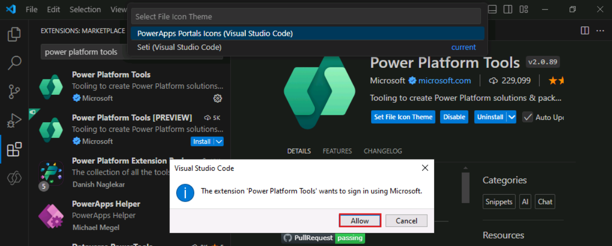
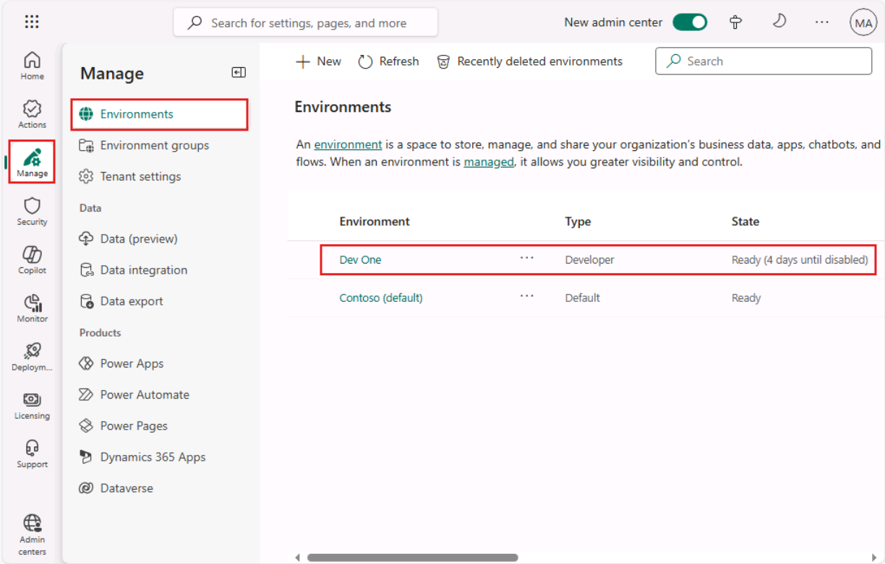
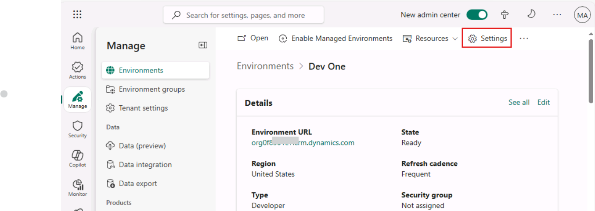
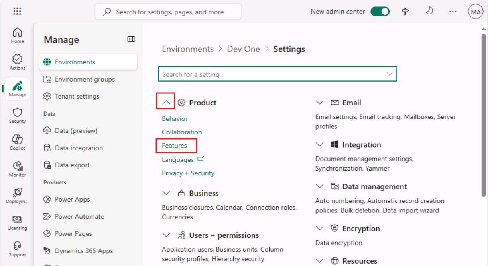
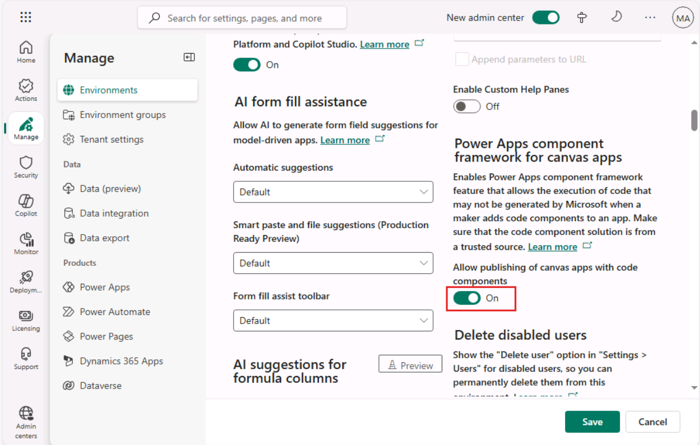
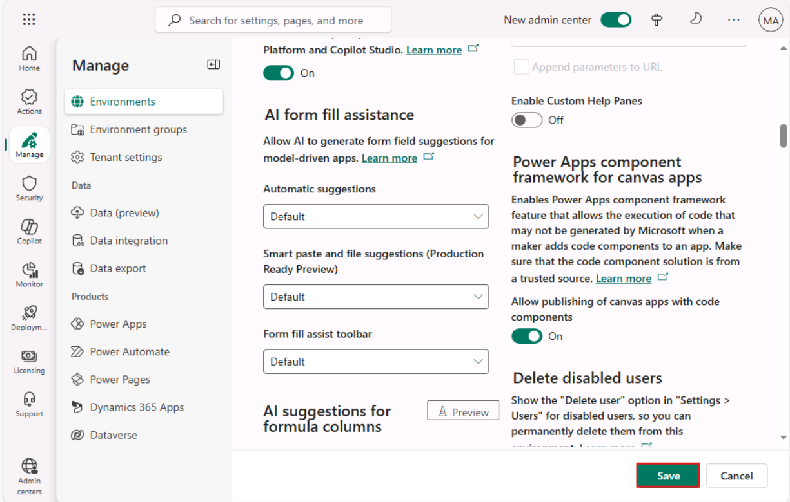
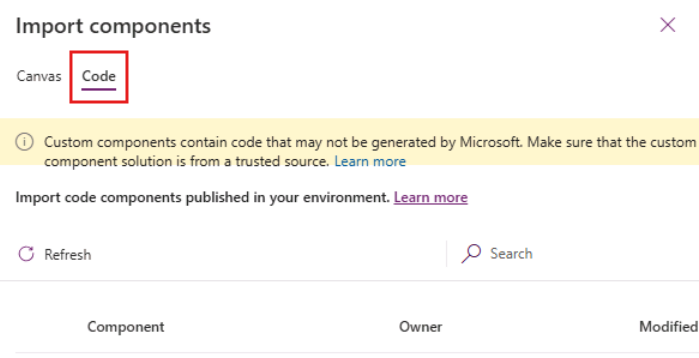

# **Lab 2: Use the Power Apps CLI and create Power Apps Component Framework (PCF)** 

**Estimated Duration:** 30 min

**Objective:** In this lab, you will learn to install the Power Platform
Tools and create your first Power Apps Component Framework (PCF)
component.

### **Task 1: Install the Power Platform Tools**

1.  Open Visual Studio Code using the shortcut present on VM’s Desktop,
    select the **Extensions** icon in the navigation bar.

    

2.  Search for +++**power platform tools**+++. Select
    the **Install** button in the search results.

     

3.  Wait till the installation is complete. After installation, if the propmt appears and asks you that the extension 'Power Platform Tool' wants to sign in using Microsoft then select **Allow**.

     

     
    
4.  Select **more option (…),** **Terminal** and then select **New
    Terminal**.

   **Note:** If you don’t see (… 3 dots), select **hamburger | Terminal | New Terminal.**
   
   
   
   

6.  Run the pac command to see what commands are available:

     +++pac+++

     

     

     

7.  You can enter pac and then a command to see what options it has, for
    example, try the following:

     +++pac admin+++

     

     **Note:** If you see the pop-up saying, ‘Some keybindings don’t got to
     the terminal by default and are handled by Visual Studio Code
     instead’, then select **Configure Terminal Settings**.

     

7.  You can see, what options admin has.

     

8.  Navigate to Power Apps maker portal
    using +++**https://make.powerapps.com/**+++ and make sure you have the **Dev
    One** environment selected.

9.  Go to **Home page**, from the upper right corner of the screen, select
    the **Settings** icon and choose **Session details**.

     

10. In the Power Apps session details dialog, select **Instance
    url** value and copy it for use later in the exercise.

     

11. Go back to the Visual Studio Code terminal, type the following
    command to establish a connection from the CLI and sign into your
    test environment when prompted.

     +++pac auth create --name Lab --environment **<Paste your Instance URL>**

     

12. Sign in with your M365 Admin credentials.

     

13. Enter the **password** and click on **Sign in**.

     

14. You can see the message that authentication is done successfully.

     

15. Type the following who command that will display the environment and
    the user information. This is good to ensure you are in the correct
    environment.

     +++pac org who+++

     

### **Task 2: Create a PCF component**

1.  Run the command below to create a new folder named **labPCF** inside
    your user's folder.

     +++md labPCF+++

     

2.  You can see that the labPCF folder has created.

     

3.  Change directory to the folder you created.

     +++cd labPCF+++

     

4.  Run the command below to initialize the component project.

     +++pac pcf init --namespace lab --name FirstControl --template field+++

     

5.  Type the following command and then press enter. This pulls down any
    dependencies from the npm repository.

     +++npm install+++

     

6.  If you are asked to update the npm, you can ignore the message. 

7.  Open the folder in Visual Studio Code using the following command.

     +++code .+++

8.  If you come across a pop-up saying. Do you trust the authors of the
    file then click **Yes, I thrust the authors**.

     

9.  If you are asked to choose color theme, click on Brows Color Themes
    otherwise, ignore this and next step.

     

10. Select **Dark Modern** color theme.

     

11. Explore the files that have been created.

12. Expand **FirstControl** folder and select **Index.ts**.

     

     **Note:** On the pop-up asking, ‘Do you want to allow untrusted files in this window’, select **Allow**.

     

14. Paste the following two variables inside the export.

    +++private label: HTMLInputElement;+++

    +++private _container: HTMLDivElement;+++

     

16. Paste the following inside the **init()** function to create the
    HTML controls and set the label value.

     +++this.label = document.createElement("input");+++

     +++this.label.setAttribute("type", "label");+++

     +++this.label.value = "My First PCF";+++

     +++this._container = document.createElement("div");+++

     +++this._container.appendChild(this.label);+++

     +++container.appendChild(this._container);+++

     

17. To save the file, go to **File** tab and select **Save**.

     

18. Go to the terminal and input the following command and then enter.
    This will start the test harness with the latest code as shown in
    the thisrd screenshot of this step.

     +++npm start+++

     

     **Note:** If you receive message as Windows Defender Firewall has blocked some features, select Allow access.
    
     
    
     

17. The test harness is effective to use early in the project to see
    what your control looks like visually without having to deploy it to
    an environment. You can set values of property to change the size of
    the control area. After you're done exploring the test harness,
    switch back to the terminal and press Ctrl-C to terminate the
    execution of the test harness.

     

18. Type **Y** and \[ENTER\].

     

19. Run the following command to list solutions in your environment.

     +++pac solution list+++

     

20. These are the current solutions that are in your environment. The
    next step will add one for the component.

     

21. Type the following push command to push our control to the
    environment.

     +++pac pcf push --publisher-prefix lab+++

     

### **Task 3: Use the component in an app** 

1.  Navigate to the Microsoft Power Platform Admin Center using
    +++**https://admin.powerplatform.microsoft.com/home**+++.

2.  Close the welcome window if appears.

3.  From the left navigation pane, select **Manage** > **Environments** and then select the **Dev One** environment you're using for the lab.

     

4.  Select **Settings**.

     

5.  Expand **Product** area and select **Features**.

     

6.  On the right side, enable the **Allow publishing of canvas apps with
    code components** feature.

     

7.  Select **Save** at the bottom.

     

8.  Navigate to Power Apps maker
    portal using
    +++**https://make.powerapps.com/**+++ and make sure you are in the
    correct environment i.e. **Dev One**.

     

9.  Select **Solutions** from the left navigation pane, and then select
    **Import solution**.

     

10. Select **Browse** on Import a solution dialog.

     

11. Select zip file of the solution from the path -
    C:\Users\Admin\labPCF\obj\PowerAppsToolsTemp_lab\bin\Debug and then select
    **Open**.

     

12. After importing zip file, click on **Next**.

     

13. Select **Import**.

     

14. Wait till message which states, Solution
    “**PowerAppsToolsTemp_lab**” imported successfully appears.

     

15. Double click on the newly imported solution - **PowerAppsTools_lab**
    to open it.

     

16. You should see your component listed.

     

17. Select **+ New | App | Canvas app**.

     

18. Select **Phone** for Format, enter +++First PCF+++ for App name, and
    select **Create**.

     

19. Select **Skip** on the welcome window.

     

20. On the left pane, select **(+) Insert**, and then select **Get more
    components** icon situated above the list of Popular components and
    below the search box as shown in the following image.

     

21. Select the **Code** tab.

     

22. Select your component – **FirstControl**. Select **Import**.

     

23. On the left tool bar, select **+** and expand **Code components**.

     

24. Select the **FirstControl**. You should now see the control with the
    text **My First PCF** on the canvas.

     

25. Select **Save** to save the application.

     

You have now built your first PCF component and used it in a canvas app.

**Summary:** In this lab, you have learnt how build to your first PCF
component and used it in a canvas app. Power Apps component framework
creates code components for model-driven and canvas apps. These code
components can be used to enhance the user experience for users working
with data on forms, views, dashboards, and canvas app screens.
