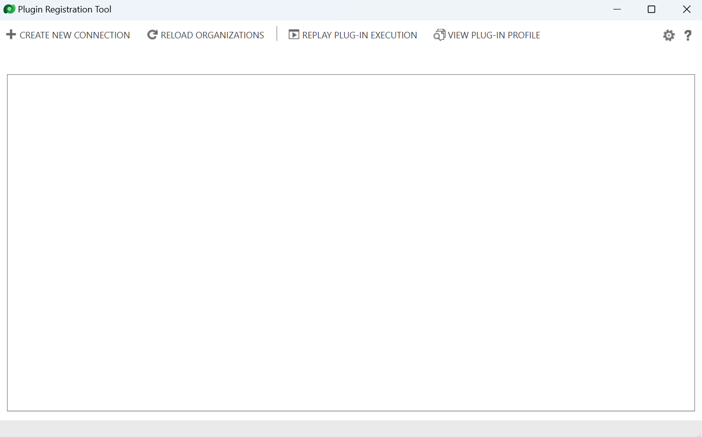
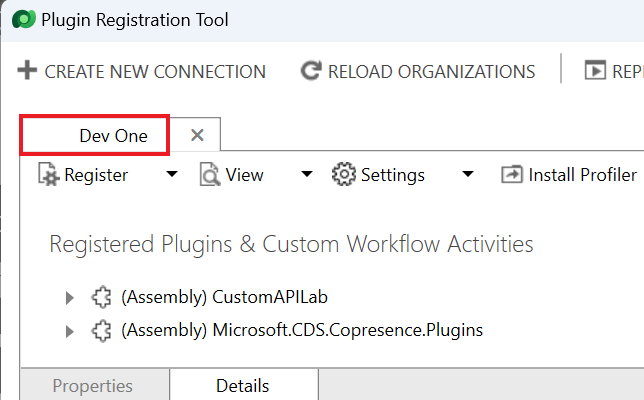

**실습 3 – 개발자 도구를 설치하고 사용하기**

**예상 소요 시간:** 15분

**목표:** 이 실습에서는 NuGet에서 몇 가지 개발자 도구를 설치하는 방법을
알아볼 것입니다.

**작업1: 개발자 도구를 설치하기**

이 작업에서 도구를 설치하려면 Power Platform CLI를 사용할 것입니다.

1.  **Command Prompt**를 시작하려면 VM의 **Start** 메뉴로 이동하고
    검색바에서 Command Prompt을 입력하고 **Open**를 선택하세요.

> 

2.  **Configuration Manager Tool**을 설치하려면 다음 명령을 실행하세요.

> +++pac tool cmt+++
>
> 

3.  Configuration Manager Tool을 설치하고 실행해야 합니다. Configuration
    Manager Tool을 닫으세요.

> 

4.  **Package Deployer Tool**을 설치하려면 다음 명령을 실행하세요.

> +++pac tool pd+++
>
> 

5.  Package deployer tool을 설치하고 실행해야 합니다. Package Deployer
    Tool을 닫으세요.

> 

6.  **Plugin Registration Tool**을 설치하려면 다음 명령을 실행하세요.

> +++pac tool prt+++
>
> 

7.  Plugin Registration을 설치하고 실행해야 합니다. Plugin Registration
    Tool을 닫지 마세요.

> 

**작업 2: Plug-in Registration Tool을 사용하여 등록된 플러그인을
살펴보기**

1.  **Create New Connection**을 선택하세요.

> 

2.  **Display list of available organizations**의 확인란을 선택하세요.

> 

3.  **Login**을 선택하세요**.** 

> 

4.  Dataverse 환경 자격 증명(예: Office 365 관리자 자격 증명)으로
    로그인하세요. **Next**을 선택하세요.

> 

5.  관리 테넌트 암호를 입력하고 **Sign in**을 클릭하세요.

> 

6.  이 경우 **Dev One** 환경이 이미 선택되어 있음을 확인할 수 있습니다.
    환경 목록이 나타나면 환경 **Dev One**을 선택하고 **Login**을 다시
    선택하세요.

> 

7.  시스템 플러그인 목록이 표시됩니다. 사용자 지정 플러그인이 있는 경우
    목록에서도 볼 수 있습니다. (Assembly)는 플러그인을 구현하는 .NET
    DLL입니다.

> **참고:** 전체 목록을 보려면 섹션을 확장해야 합니다.
>
> 

8.  **Microsoft.CDS.DataLakeDataProvider.Plugins**를 찾아 확장하세요.

> 

9.  각 자식 항목은 어셈블리에서 구현됩니다. 해당 개별 플러그인에 대한
    단계 등록을 확인하려면 항목 중 하나를 확장하세요.

> 

10. 단계 등록은 플러그인을 이벤트 핸들러로 이벤트에 연결합니다. 위의
    예제에서는 insightsstorevirtualentity 테이블에서 생성을 처리합니다.

> 

11. 단계를 두 번 클릭하면 어떤 메시지 및 엔터티, 등록된 메시지,
    플러그인이 호출될 파이프라인 단계, 실행이 동기식이나 비동기식인지
    여부 등을 포함한 단계 구성 세부 정보를 확인합니다.

> 

**요약:** 이 실습에서는 개발자 도구를 설치하는 방법을 알아보았습니다.
사용자 지정 플러그 인을 만들 때 Plugin Registration Tool을 사용하여
어셈블리를 로드하고 처리하려는 이벤트에 대한 단계를 등록했습니다.
