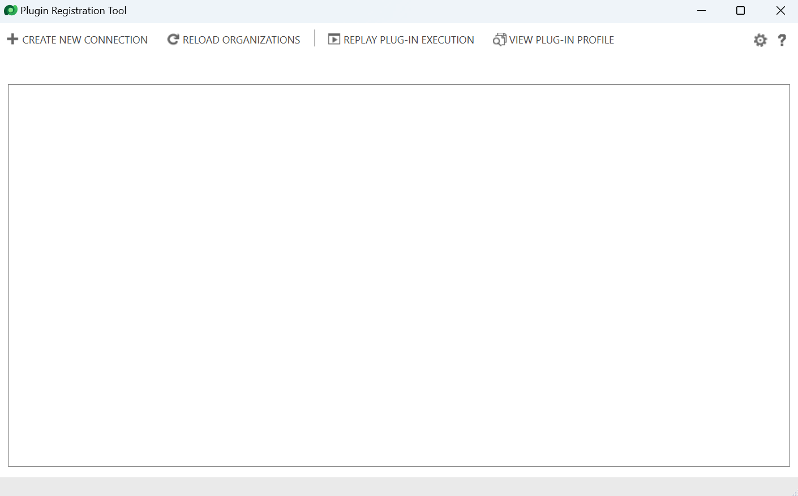
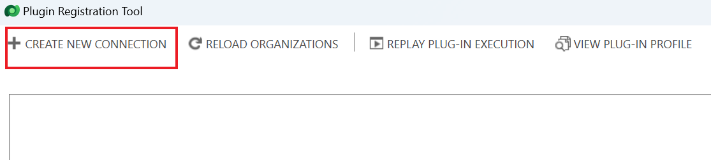
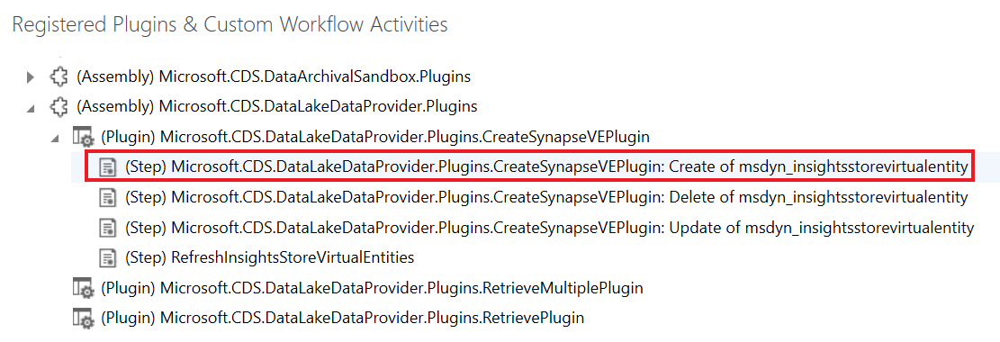

**Lab 3: Installieren und Verwenden von Entwicklertools**

**Geschätzte Dauer:**15 Minuten

**Ziele:** In diesem Lab lernen Sie, einige der Entwicklertools von
NuGet zu installieren.

**Aufgabe 1: Entwicklertools installieren**

In dieser Aufgabe verwenden Sie eine Power Platform-CLI, um Tools zu
installieren.

1.  Um **Command Prompt** zu starten, gehen Sie zum **Start** menü der
    VM, geben Sie „Command Prompt“ in das Suchfeld ein und wählen Sie
    „**Open**“ aus.

> 

2.  Führen Sie den folgenden Befehl aus, um das **Configuration Manager
    Tool** zu installieren.

> +++pac-Tool cmt+++
>
> 

3.  Das Configuration Manager Tool sollte installiert und gestartet
    sein. Schließen Sie das Configuration Manager Tool.

> 

4.  Führen Sie den folgenden Befehl aus, um das **Package Deployer
    Tool** zu installieren.

> +++Pac-Tool PD+++
>
> 

5.  Das Package Deployer Tool sollte installiert und gestartet sein.
    Schließen Sie das Package Deployer Tool.

> 

6.  Führen Sie den folgenden Befehl aus, um das **Plugin Registration
    Tool** zu installieren.

> +++pac tool prt+++
>
> 

7.  Die Plugin Registration sollte installiert und gestartet sein.
    Schließen Sie das Plugin Registration Tool nicht.

> 

**Aufgabe 2: Erkundung von registrierten plug-in mit dem
Plug-in-registration tool**

1.  Wählen Sie „**Create New Connection**“ aus.

> 

2.  Aktivieren Sie das Kontrollkästchen **Display list of available
    organizations**.

> 

3.  Wählen Sie **Login**.

> 

4.  Melden Sie sich mit Ihren
    Dataverse-Umgebungsanmeldeinformationen, d. h. Ihren Office
    365-Administratoranmeldeinformationen, an. Klicken Sie auf **Next**.

> 

5.  Geben Sie Ihr Mandantenadministratorkennwort ein und klicken Sie auf
    **Sign in**.

> 

6.  In diesem Fall sehen Sie, dass die **Dev One**-Umgebung bereits
    ausgewählt ist. Falls die Liste der Umgebungen angezeigt wird,
    wählen Sie Ihre Umgebung – **Dev One** – und klicken Sie erneut auf
    „**Login**“.

> 

7.  Sie sehen eine Liste der System-Plugins. Wenn Ihre Umgebung
    benutzerdefinierte Plugins enthält, werden diese ebenfalls in der
    Liste angezeigt. Die Assembly sind .NET DLLs, die die Plugins
    implementieren.

> **Notiz:** Sie müssen den Abschnitt erweitern, um die vollständige
> Liste anzuzeigen.
>
> 

8.  Suchen Sie nach **Microsoft.CDS.DataLakeDataProvider.Plugins** und
    erweitern Sie es.

> 

9.  Jedes der untergeordneten Elemente ist im assembly implementiert.
    Erweitern Sie eines der Elemente, um die Schrittregistrierungen für
    dieses einzelne Plug-in zu sehen.

> 

10. Die Schrittregistrierung verbindet das Plug-In als Ereignishandler
    mit dem Ereignis. Im obigen Beispiel wird dadurch eine Erstellung in
    der Tabelle „insightsstorevirtualentity“ verarbeitet.

> 

11. Doppelklicken Sie auf einen beliebigen Schritt, um die
    Konfigurationsdetails des Schritts anzuzeigen, einschließlich der
    Nachricht und Entität, bei der er registriert ist, der
    Pipeline-Phase, in der das Plug-In aufgerufen wird, ob die
    Ausführung synchron oder asynchron ist usw.

> 

**Zusammenfassung:** In diesem Lab haben Sie gelernt, wie Sie
Entwicklertools installieren. Wenn Sie Ihr eigenes benutzerdefiniertes
Plug-in erstellen, verwenden Sie das Plug-in-Registrierungstool, um die
Assembly zu laden und die Schritte für die zu verarbeitenden Ereignisse
zu registrieren.
