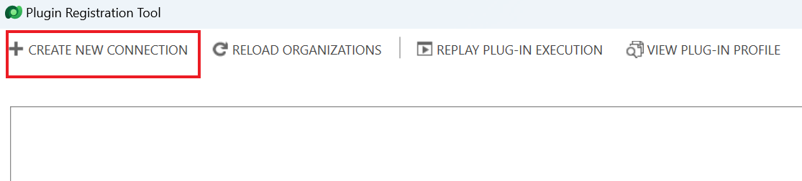
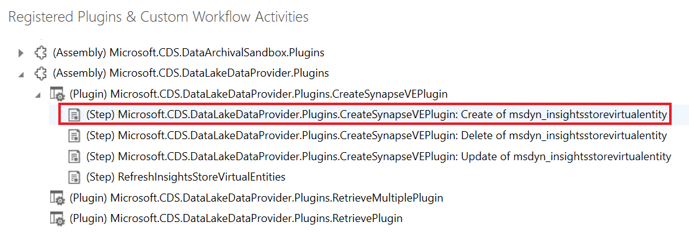

**Laboratório 3 - Instalar e usar ferramentas de desenvolvedor**

**Duração estimada:** 15 minutos

**Objetivo:** Neste laboratório, você aprenderá a instalar algumas das
ferramentas de desenvolvedor do NuGet.

**Tarefa 1: Instalar ferramentas de desenvolvedor**

Nesta tarefa, você usará uma CLI do Power Platform para instalar
ferramentas.

1.  Para iniciar o **Command Prompt**, vá ao menu **Start** da VM,
    digite Prompt de Comando na caixa de pesquisa e selecione **Open**.

> 

2.  Execute o comando abaixo para instalar a **Ferramenta**
    **Configuration Manager**.

> +++pac tool cmt+++
>
> 

3.  A Ferramenta Configuration Manager deve ser instalada e iniciada.
    Feche a Ferramenta Configuration Manager.

> 

4.  Execute o comando abaixo para instalar a **Ferramenta** **Package
    Deployer**.

> +++pac tool pd+++
>
> 

5.  A ferramenta Package Deployer deve ser instalada e iniciada. Feche a
    ferramenta Package Deployer.

> 

6.  Execute o comando abaixo para instalar a **Ferramenta Plugin
    Registration**.

> +++pac tool prt+++
>
> 

7.  O Plugin Registration deve ser instalado e iniciado. Não feche a
    Ferramenta Plugin Registration.

> 

**Tarefa 2: Explorar um plug-in registrado com a ferramenta plug-in
registration**

1.  Selecione **Create New Connection.**

> 

2.  Marque a caixa de seleção para **Display list of available
    organizations**.

> 

3.  Selecione **Login.** 

> 

4.  Entre com suas credenciais do ambiente Dataverse, ou seja,
    credenciais de administrador do Office 365. Clique em **Next**.

> 

5.  Digite a senha do seu administrador de locatário e clique em **Sign
    in**.

> 

6.  Neste caso, você pode ver que o ambiente **Dev One** já está
    selecionado. Caso a lista de ambientes apareça, selecione o seu
    ambiente – **Dev One** – e selecione **Login** novamente.

> 

7.  Você verá uma lista de plug-ins do sistema . Se você tiver plug-ins
    personalizados em seu ambiente, também os verá na lista. Os
    (Assembly) são DLLs .NET que implementam os plug-ins.

> **Observação:** Você precisa expandir a seção para ver a lista
> completa.
>
> 

8.  Localize **Microsoft.CDS.DataLakeDataProvider.Plugins** e expanda-o.

> 

9.  Cada um dos itens filhos é implementado no assembly. Expanda um dos
    itens para ver os registros de etapas daquele plug-in específico.

> 

10. O registro de etapas conecta o plug-in como um manipulador de
    eventos ao evento. No exemplo acima, isso está manipulando uma
    criação na tabela insightsstorevirtualentity.

> 

11. Clique duas vezes em qualquer etapa para ver os detalhes de
    configuração da etapa, incluindo a mensagem e a entidade em que ela
    está registrada, o estágio do pipeline em que o plug-in será
    invocado, se a execução é síncrona ou assíncrona, etc.

> 

**Resumo:** Neste laboratório, você aprendeu a instalar ferramentas de
desenvolvedor. Ao criar seu próprio plug-in personalizado, você usará a
Ferramenta Plugin Registration para carregar o assembly e registrar as
etapas dos eventos que deseja manipular.
