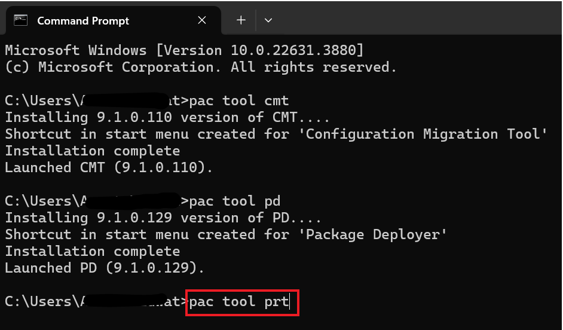
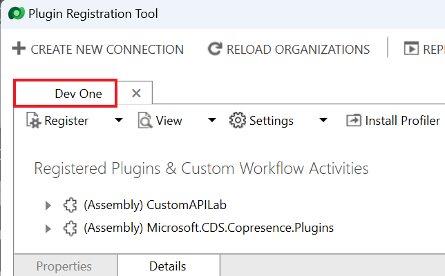

**實驗 3 - 安裝和使用開發人員工具**

**預計持續時間：** 15 分鐘

**目標：**在本實驗中，您將學習如何從 NuGet 安裝一些開發人員工具。

**任務 1：安裝開發人員工具**

在此任務中，您將使用 Power Platform CLI 安裝工具。

1.  要啟動**命令提示符**，請轉到 VM
    的“**Start**”菜單，在搜索框中鍵入“命令提示符”，然後選擇“**Open**”。

> 

2.  運行以下命令以安裝 **Configuration Manager Tool**。

> +++pac tool cmt+++
>
> 

3.  應安裝並啟動 Configuration Manager Tool。關閉 Configuration Manager
    工具。

> 

4.  運行以下命令以安裝 **Package Deployer Tool**。

> +++pac tool pd+++
>
> 

5.  應安裝並啟動 Package Deployer 工具。關閉 Package Deployer 工具。

> 

6.  運行以下命令以安裝 **Plugin Registration Tool**。

> +++pac tool prt+++
>
> 

7.  應安裝並啟動 Plugin Registration。不要關閉 Plugin Registration
    Tool。

> 

**任務 2：使用插件註冊工具瀏覽已註冊的插件**

1.  選擇 **Create New Connection** （創建新連接）。

> 

2.  選中 **Display list of available organizations**
    （顯示可用組織列表） 複選框。

> 

3.  選擇 **Login**（登錄）。 

> 

4.  使用您的 Dataverse 環境憑據（即 Office 365 管理員憑據）登錄。單擊
    **Next**。

> 

5.  輸入您的管理員租戶密碼，然後單擊 **Sign in** （登錄）。

> 

6.  在這種情況下，您可以看到 **Dev One**
    環境已被選中。如果顯示環境列表，請選擇您的環境 – **Dev
    One**，然後再次選擇 **Login**。

> 

7.  您將看到系統插件列表。如果您的環境中有自定義插件，您也會在列表中看到它們。（程序集）是實現插件的
    .NET DLL。

> **注意：** 您需要展開該部分才能查看完整列表。
>
> 

8.  找到 **Microsoft.CDS.DataLakeDataProvider.Plugins** 並展開它。

> 

9.  每個子項都在程序集中實現。展開其中一個項目以查看該單個插件的步驟註冊。

> 

10. 步驟註冊將插件作為事件處理程序連接到事件。在上面的示例中，這是在
    insightsstorevirtualentity 表上處理創建作。

> 

11. 雙擊任何步驟可查看步驟配置詳細信息，包括它註冊的消息和實體、調用插件的管道階段、執行是同步還是異步等。

> 

**摘要：**在本實驗中，您學習了如何安裝開發人員工具。在創建自己的自定義插件時，您將使用
Plugin Registration Tool 加載程序集並註冊要處理的事件的步驟。
