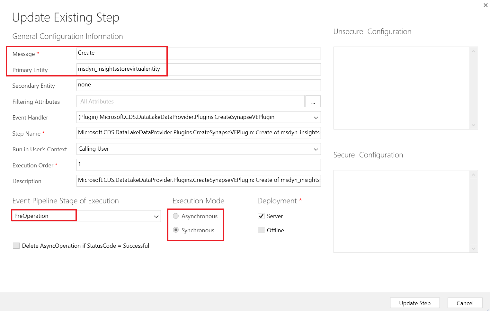

**Atelier 3 - Installer et utiliser des outils de développement**

**Durée estimée :** 15 min

**Objectif :** Dans cet atelier, vous allez apprendre à installer
certains des outils de développement de NuGet.

**Tâche 1 : Installer les outils de développement**

Dans cette tâche, vous allez utiliser une interface de Power Platform
CLI pour installer des outils.

1.  Pour lancer **Command Prompt** accédez au menu Démarrer de la
    machine virtuelle, tapez Invite de commande dans la zone de
    recherche et sélectionnez **Open**.

> 

2.  Exécutez la commande ci-dessous pour installer **l'outil
    Configuration Manager**.

> +++pac tool cmt+++
>
> 

3.  L'outil Configuration Manager doit être installé et lancé. Fermez
    l'outil Configuration Manager.

> 

4.  Exécutez la commande ci-dessous pour installer **Package Deployer
    Tool**.

> +++pac tool pd+++
>
> 

5.  L'outil de déploiement de packages doit être installé et lancé.
    Fermez l'outil de déploiement de packages.

> 

6.  Exécutez la commande ci-dessous pour installer **Plugin Registration
    Tool**.

> +++pac tool prt+++
>
> 

7.  L'enregistrement du plugin doit être installé et lancé. Ne fermez
    pas l'outil d'enregistrement du plugin.

> 

**Tâche 2 : Explorer un plug-in enregistré à l'aide de l'outil
d'enregistrement de plug-in**

1.  Sélectionnez **Create New Connection.**

> 

2.  Cochez la case Afficher la **Display list of available
    organizations**.

> 

3.  Sélectionnez **Log in .**

> 

4.  Connectez-vous avec vos informations d'identification
    d'environnement Dataverse, c'est-à-dire les informations
    d'identification d'administrateur Office 365. Cliquez sur **Next**.

> 

5.  Entrez votre mot de passe de locataire Admin et cliquez sur **Sign
    in** .

> 

6.  Dans ce cas, vous pouvez voir que l' environnement **Dev One** est
    déjà sélectionné. Si la liste des environnements s'affiche,
    choisissez votre environnement (**Dev One)** et sélectionnez à
    nouveau **log in** .

> 

7.  Une liste de plug-ins système s'affiche. Si vous avez des plug-ins
    personnalisés dans votre environnement, vous les verrez également
    dans la liste. Les (Assembly) sont des NET DLLs qui implémentent les
    plug-ins.

> **Remarque :** Vous devez développer la section pour voir la liste
> complète.
>
> 

8.  Localisez **Microsoft.CDS.DataLakeDataProvider.Plugins** et
    développez-le.

> 

9.  Chacun des éléments enfants est implémenté dans l'assembly.
    Développez l'un des éléments pour afficher les enregistrements
    d'étapes pour ce plug-in individuel.

> 

10. L'inscription d'étape connecte le plug-in en tant que gestionnaire
    d'événements à l'événement. Dans l'exemple ci-dessus, il s'agit de
    la gestion d'une création sur la table insightsstorevirtualentity.

> 

11. Double-cliquez sur n'importe quelle étape pour voir les détails de
    la configuration de l'étape, y compris le message et l'entité sur
    lesquels elle est enregistrée, l'étape du pipeline à laquelle le
    plugin sera appelé, si l'exécution est synchrone ou asynchrone, etc.

> 

**Résumé :** Dans cet atelier, vous avez appris à installer des outils
de développement. Lorsque vous créez votre propre plug-in personnalisé,
vous utilisez l'outil d'enregistrement de plug-in pour charger
l'assembly et enregistrer les étapes des événements que vous souhaitez
gérer.
