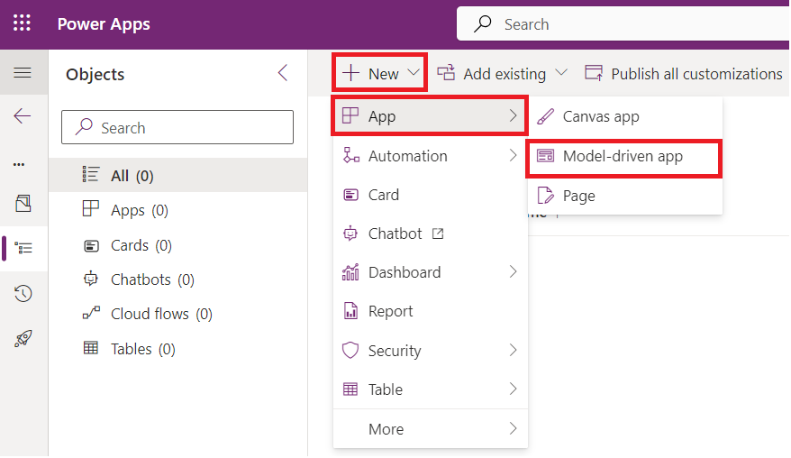
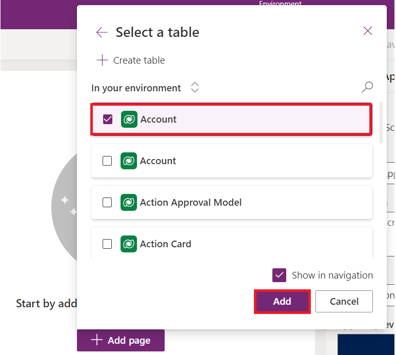
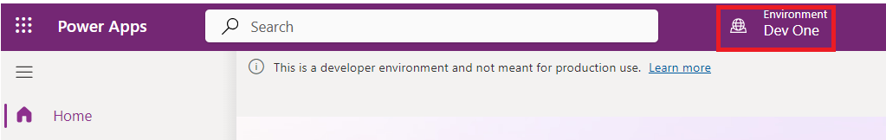

# **실습 4: 모델 기반 앱에 대한 첫 번째 클라이언트 스크립트를 작성하기**

**예상 소요 시간:** 30분

**목표:** 이 실습에서는 모델 기반 앱용 클라이언트 스크립트를 작성하는
방법과 코드를 웹 리소스로 업로드하는 방법을 알아볼 것입니다. 이 실습에서
클라이언트 스크립트는 모델 기반 양식의 계정 이름에서 Contoso에 대해
대/소문자를 구분하지 않는 검색을 수행하고, 있는 경우 계정 양식의
websiteurl, telephone1 및 description 열에 대한 값을 설정합니다.

**작업 1: 새 솔루션 및 모델 기반 앱을 생성하기**

1.  +++<https://make.powerapps.com/>+++를 사용하여 [Power
    Apps](https://make.powerapps.com/)로 이동하세요. **Dev One** 환경에
    있어야 합니다.

> 

2.  왼쪽 탐색 창에서 **Solutions**을 선택하고 **New solution**을
    선택하세요.

> 

3.  플라이아웃 대화 상자에서 **Display name** – +++First Client
    Script+++** Name** – +++FirstClientScript+++를 지정하세요.

> 

4.  **New Publisher** 대화상자를 열기 위해 **New Publisher**를
    클릭하세요.

> 

5.  이 실습에서는 다음 정의와 함께 게시자를 사용한 후 **Save**를
    선택하세요.

> **Display Name** – +++Example Publisher+++
>
> **Name** – +++ExamplePublisher+++
>
> **Prefix** – +++example+++
>
> 
>
> **Prefix** 값을 확인하세요. 이것은 귀하의 회사를 식별하는 것이어야
> 합니다. 이 경우 example를 사용하고 있습니다.

6.  New solution 대화상자에 있습니다. Publisher 필드의 드롭다운에서
    **Example Publisher (ExamplePublisher)**을 선택하고 **Create**를
    선택하세요.

> 

7.  솔루션에 새 model-driven app을 생성하기 위해
    **New | App | Model-driven app**을 선택하세요.

> 

8.  Model-driven app의 **name**을 +++**Account App**+++로 입력하고
    **Create**를 선택하세요.

> 

9.  Model driven app에서 **+Add page**를 선택하세요.

> 

10. 팝업이 표시되면 **Dataverse** **table**을 선택하세요.

> 

11. **Account** 테이블을 선택하고**Add**을 선택하세요.

> 
>
> **참고:** 이 실습에서는 Account table을 사용합니다. 아래 스크립트 및
> 지침은 Account table의 양식에 있는 필드를 예상합니다.

12. 이제 'Account App'이라는 model-driven app이 준비되었습니다.

> 

13. 오른쪽 상단 모서리에서 **Save**을 선택하세요.

> 

14. **Publish**를 선택하세요.

> 

15. **Back arrow**를 클릭하여 솔루션을 들어가세요.

> 

**작업 2: JavaScript 코드를 작성하기**

1.  Model-driven app은 JavaScript 편집자를 제공하지 않습니다. Notepad++
    Visual Studio Code 또는 Microsoft Visual Studio와 같은 JavaScript
    파일 편집을 특별히 지원하는 기능을 제공하는 외부 작성 도구를
    사용해야 합니다. 이 실습에서는 Visual Studio Code를 사용합니다.

2.  VM의 데스크톱으로 **new folder**를 생성하고 이름을 ‘**Client Script
    Lab**’으로 지정하세요.

3.  VM에 Visual Studio Code를 여세요. 열려면 VM의 데스크톱에서 지정된
    바로 가기를 사용하거나 **Start** 메뉴를 클릭하고 검색한 후 **Visual
    Studio Code**를 선택하세요.

> 

4.  위쪽 상단 모서리에서 **File** 탭을 선택한 후 **Open Folder**를
    선택하세요.

> 

5.  데스크톱에서 **Client Script Lab** 폴더를 선택하고 **Select
    folder**를 클릭하세요.

> 

6.  ‘**Do you trust the authors of the files in this folder?**’라는
    팝업이 보이면 ‘**Yes. I trust the authors**’를 클릭하세요.

> 

7.  **CLIENTSCRIPTLAB** 폴더 위에 마우스를 올려놓고 **New File**을
    선택하세요.

> 

8.  +++**Example-form-script.js**+++파일 이름을 지정하세요.

> 

9.  **Example-form-script.js** 파일에 다음 JavaScript 코드를 추가하세요.

> // A namespace defined for the sample code
>
> // As a best practice, you should always define
>
> // a unique namespace for your libraries
>
> var Example = window.Example || {};
>
> (function () {
>
> // Define some global variables
>
> var myUniqueId = "\_myUniqueId"; // Define an ID for the notification
>
> var currentUserName =
> Xrm.Utility.getGlobalContext().userSettings.userName; // get current
> user name
>
> var message = currentUserName + ": Your JavaScript code in action!";
>
> // Code to run in the form OnLoad event
>
> this.formOnLoad = function (executionContext) {
>
> var formContext = executionContext.getFormContext();
>
> // Display the form level notification as an INFO
>
> formContext.ui.setFormNotification(message, "INFO", myUniqueId);
>
> // Wait for 5 seconds before clearing the notification
>
> window.setTimeout(function () {
> formContext.ui.clearFormNotification(myUniqueId); }, 5000);
>
> }
>
> // Code to run in the column OnChange event
>
> this.attributeOnChange = function (executionContext) {
>
> var formContext = executionContext.getFormContext();
>
> // Automatically set some column values if the account name contains
> "Contoso"
>
> var accountName = formContext.getAttribute("name").getValue();
>
> if (accountName.toLowerCase().search("contoso") != -1) {
>
> formContext.getAttribute("websiteurl").setValue("https://www.contoso.com");
>
> formContext.getAttribute("telephone1").setValue("425-555-0100");
>
> formContext.getAttribute("description").setValue("Website URL, Phone
> and Description set using custom script.");
>
> }
>
> }
>
> // Code to run in the form OnSave event
>
> this.formOnSave = function () {
>
> // Display an alert dialog
>
> Xrm.Navigation.openAlertDialog({ text: "Record saved." });
>
> }
>
> }).call(Example);
>
> **참고:** Visual Studio Code를 사용하는 대신 이 코드를 텍스트 파일에
> 복사하여 이 이름으로 저장할 수 있습니다: Example-form-script.js.

10. **File** 탭을 선택하고 코드를 저장하기 위해 **Save**를 선택하세요.

> 

**작업 3: 웹 리소스로 코드를 업로드하기**

이제 코드가 준비되었으므로 솔루션에 업로드하세요.

1.  솔루션에서 **+New** | **More** | **Web resource**를 선택하세요.

> 

2.  **New web resource** 대화상자에서 **Choose file**를 클릭하세요. 

> 

3.  VM의 Desktop에 저장한 **Example-form-script.js** 파일을 선택하고
    **Open**를 클릭하세요.

> 

4.  **Display name** – +++Example Script+++, **Name** –
    +++example-form-script+++를 입력하고 **Type**은 **JavaScript
    (JS)**인지 확인한 후 **Save**를 선택하세요.

> 
>
> ** **
>
> **참고:**

- **Name**에 솔루션 게시자 사용자 지정 접두사와 일치하는 접두사가 있는
  방법에 주목하세요. 웹 리소스를 생성하는 다른 방법도 있지만 이러한
  방식으로 웹 리소스를 생성하면 웹 리소스가 솔루션의 일부가 됩니다.

&nbsp;

- 웹 리소스의 이름은 example_example-form-script입니다

**작업 4: 웹 리소스를 양식에 연결**

1.  솔루션에서 **Objects** | **Apps** |를 선택하고 **Account App**을
    선택 (열지 않음)하고 **Edit**를 클릭하세요.

> 

2.  **Account**를 확장하고 **Account form**를 선택하세요.

> 

3.  정보 양식 및 기타 양식이 표시되는 경우 정보 양식만 유지하고 다른
    양식은 제거하세요. 제거하려면 form 오른쪽에 있는 줄임표 (…)를
    클릭하고 **Remove**를 선택하세요.

> **참고:** 정보 form을 제거하지 마세요.
>
> 

4.  이제 **Information** form 오른쪽에 있는 줄임표 (…)를 클릭하고
    **Edit**을 선택하세요.

> 

5.  Unsaved changes 팝업이 나타내면 **Save and continue**를 선택하세요.

> 

6.  왼쪽 탐색에서 **Form Libraries**를 선택하고 **Add library**를
    클릭하세요.

> 

7.  **Add JavaScript Library** 대화상자에서 **Example Script**의
    이름으로 생성한 JavaScript 웹 리소스를 검색하세요. **Example
    Script** 웹 리소스를 선택하고 **Add**를 선택하세요.

> 

**작업 5: Form 및 필드 이벤트를 구성하기**

1.  **Events** 탭을 선택하세요.

> 

2.  **Configure form On Load event**하려면 **On Load** event handler에서
    **+ Event Handler**를 클릭하세요.

> 

3.  **Event Type**이** On Load**이고 and
    the** example_example-form-script library**가 선택되어 있는지
    확인하세요.

> 

4.  Function 필드에 함수 이름을 입력하게요. 이 경우
    +++**Example.formOnLoad**+++입니다.

> 

5.  **Pass execution context as first parameter**를 선택하고 **Done**을
    클릭하세요.

> 

6.  Form On Save 이벤트를 구성하려면 **On Save** event handler 를
    선택하고 **+Event Handler**를 클릭하세요.

> 

7.  **Event Type**은 **On Save**이고
    **example_example-form-script** 라이브러리가 선택되어 있는지
    확인하세요.

> 

8.  **Function** 필드에 함수 이름을 입력학세요. 이 경우
    +++**Example.formOnSave**+++입니다.

> 
>
> **참고:** 이 함수에 대한 **Pass execution context as first parameter**
> 사용하지 않기 때문에 선택할 필요가 없습니다.

9.  **Done**를 클릭하세요.

> 

10. Configure Field On Change 이벤트를 구성하려면 **Account Name** 필드
    및 **Events** 탭을 선택하세요.

> 

11. **On Change** event handler에서 **+ Event Handler**를 클릭하세요.

> 

12. **Event Type**은 **On
    Change**고 **example_example-form-script** 라이브러리가 선택되어
    있는지 확인하세요.

> 

13. **Function** 필드에 함수 이름을 입력학세요. 이 경우
    **Example.attributeOnChange**입니다.

> 

14. **Pass execution context as first parameter**를 선택하세요.
    **Done**를 클릭하세요.

> 

15. **Save** **and Publish**를 클릭하세요.

> 

16. **Back**을 선택하세요.

> 

17. Account App에 있습니다. **Save**를 선택하세요.

> 

18. **Publish**를 선택하세요.

> 

19. 앱이 게시될 때까지 기다렸다가 **Back**을 클릭하세요.

> 

**작업 6: 코드를 테스트하기**

브라우저를 새로 고침 모델 기반 앱 인스턴스에 변경 사항을 적용하는 것이
좋습니다

코드를 테스트하려면:

1.  +++<https://make.powerapps.com/>+++를 사용하여 Power Apps로
    이동하세요. **Dev One** 환경에 있는지 확인하세요.

> 

2.  왼쪽 탐색에서**Apps**을 선택하세요.

> 

3.  Model-driven app – **Account App** 두 번 클릭하거나 선택하고
    **Play**를 클릭하세요.

> 

4.  Form On Load 기능을 테스트하려면 목록에서 계정 기록을 클릭하여
    여세요. 예를 들어, **A. Datum Corporation (Sample)**를 클릭하세요.

> 

5.  알림이 나타나는지 확인하세요.

> 

6.  알림이 5초 후에 사라지는지 확인하세요.

7.  필드 On Change 기능을 테스트하려면 Account Name 목록에서 **Alpine
    Ski House (sample)**를 선택하세요.

> 

8.  **Main Phone**, **Website**, 및 **Description** 열에 값을 관찰하고
    이름에 "Contoso"가 포함되도록 Account Name을 편집하고 TAB 키를 눌러
    다음 열로 이동하세요.

> 

9.  **Main Phone**, **Website**, 및 **Description** 열로 설정된 예상
    값을 확인하세요columns.

> 

10. form On Save 기능을 테스트하려면. 새로 편집한 Contoso Alpine Ski
    House (Sample) 계정에서 **Save**을 클릭하세요.

> 

11. 경고 대화 상자에 코드에 구성한 메시지가 표시되는지 확인하세요.
    경고를 닫기 위해 **OK**를 클릭하세요.

> 

**요약:** 이 실습에서는 JavaScript 코드를 작성하고 웹 리소스로
업로드하고 모델 기반 앱의 양식에 연결하여 Contoso에 대한 대/소문자를
구분하지 않는 검색을 수행하고 계정 양식의 websiteurl, telephone1 및
description 열 (있는 경우)에 대한 값을 설정하는 방법을 알아보았습니다
