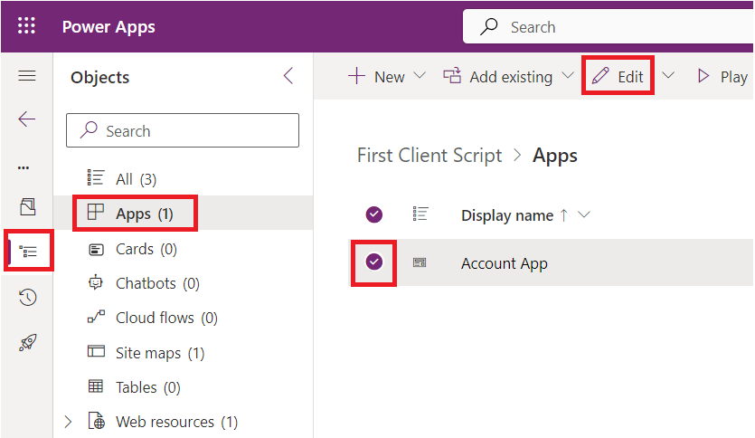
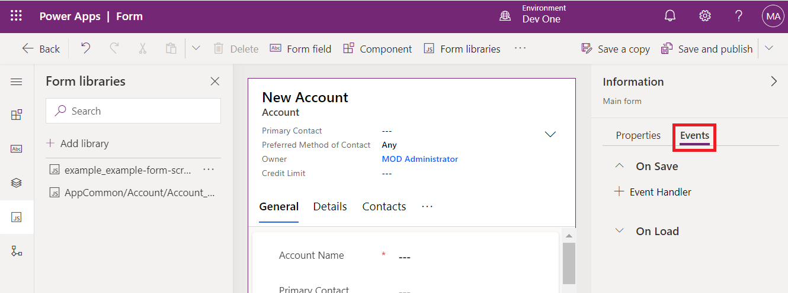
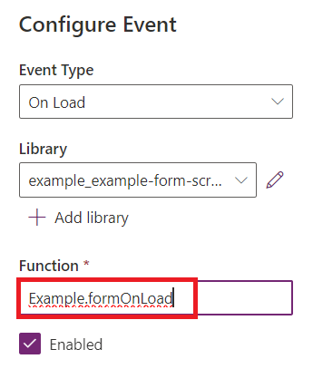

# **Lab 4: Schreiben Sie Ihr erstes Client-Skript für die modellgesteuerte App**

**Geschätzte Dauer:**30 Minuten

**Ziele:** In diesem Lab lernen Sie, wie Sie Clientskripts für die
modellgesteuerte App schreiben und Ihren Code als Webressource
hochladen. In diesem Lab, führt das Clientskript eine
Groß-/Kleinschreibungsunabhängige Suche nach Contoso im Kontonamen im
modellgesteuerten Formular durch und legt, falls vorhanden, Werte für
die Spalten „websiteurl“, „telephone1“ und „description“ im
Kontoformular fest.

**Aufgabe 1: Erstellen einer neuen Lösung und einer modellgesteuerten
App**

1.  Navigieren Sie zu [Power Apps](https://make.powerapps.com/) mit
    +++<https://make.powerapps.com/>+++. Stellen Sie sicher, dass Sie
    sich in der **Dev One**-Umgebung befinden.

> 

2.  Wählen Sie im linken Navigationsbereich **Solutions** und dann **New
    solution** aus.

> 

3.  Geben Sie im Flyout-Dialogfeld **Display name**– +++First Client
    Script+++ und **Name**– +++FirstClientScript+++ an.

> 

4.  Klicken Sie auf **New Publisher**, um das Dialogfeld „**New
    Publisher**“ zu öffnen.

> 

5.  In diesem Lab, verwenden wir einen Herausgeber mit der folgenden
    Definition und wählen dann **Save** aus.

> **Display Name** – +++Example Publisher+++
>
> **Name** – +++ExamplePublisher+++
>
> **Prefix** – +++example+++
>
> 
>
> Beachten Sie den **Prefix** wert. Dieser sollte Ihr Unternehmen
> identifizieren. In diesem Fall verwenden example.

6.  Sie befinden sich nun im Dialogfeld New solution. Wählen Sie
    **Example Publisher (ExamplePublisher)** im Dropdown-Menü des Felds
    Publisher und anschließend **Create** aus.

> 

7.  Um eine neue modellgesteuerte App in Ihrer Lösung zu erstellen,
    wählen Sie **New** | **App** | **Model-driven app**.

> 

8.  Geben Sie Ihrer modellgesteuerten App **name** als+++ **Account
    App**+++ und wählen Sie dann **Create** aus.

> 

9.  Wählen Sie in der modellgesteuerten App +**Add page** aus.

> 

10. Wählen Sie im angezeigten Popup die **Dataverse table** aus.

> 

11. Wählen Sie „**Account“ Tabelle** und dann **Add** aus.

> 
>
> **Notiz:** Für dieses Lab verwenden wir die Tabelle „Account“. Die
> folgenden Skripts und Anweisungen erwarten Felder, die in einem
> Formular für die Tabelle „Account“ zu finden sind.

12. Jetzt ist Ihre modellgesteuerte App mit dem Namen „Account App“
    fertig.

> 

13. Wählen Sie oben rechts **Save** aus.

> 

14. Wählen Sie **Publish** aus.

> 

15. Klicken Sie auf **back arrow**, um zur Lösung zurückzukehren.

> 

**Aufgabe 2: Schreiben Sie Ihren JavaScript-Code**

1.  Modellbasierte Apps bieten keinen JavaScript-Editor. Sie benötigen
    ein externes Authoring-Tool, das Funktionen speziell für die
    Bearbeitung von JavaScript-Dateien bietet, z. B. Notepad++, Visual
    Studio Code oder Microsoft Visual Studio. In diesem Lab, verwenden
    Sie Visual Studio Code.

2.  Gehen Sie zum Desktop der VM, erstellen Sie **new folder** und
    nennen Sie ihn „**Client Script Lab**“.

3.  Öffnen Sie Visual Studio Code auf Ihrer VM. Um es zu öffnen,
    verwenden Sie die angegebene Verknüpfung auf dem Desktop der VM oder
    klicken Sie auf das **Start** menü, suchen Sie und wählen Sie dann
    **Visual Studio Code**.

> 

4.  Wählen Sie die Registerkarte **File** in der oberen linken Ecke und
    dann **Open Folder**.

> 

5.  Wählen Sie den Ordner **Client Script Lab** auf dem Desktop aus und
    klicken Sie auf **Select folder.**

> 

6.  Wenn das Popup-Fenster „**Do you trust the authors of the files in
    this folder?**“ angezeigt wird, klicken Sie auf „**Yes. I trust the
    authors**“.

> 

7.  Bewegen Sie die Maus über den Ordner **CLIENTSCRIPTLAB** und wählen
    Sie **New File**.

> 

8.  Benennen Sie die Datei +++**Example-form-script.js**+++.

> 

9.  Fügen Sie den folgenden JavaScript-Code zur Datei
    **Example-form-script.js** hinzu.

> // A namespace defined for the sample code
>
> // As a best practice, you should always define
>
> // a unique namespace for your libraries
>
> var Example = window.Example || {};
>
> (function () {
>
> // Define some global variables
>
> var myUniqueId = "\_myUniqueId"; // Define an ID for the notification
>
> var currentUserName =
> Xrm.Utility.getGlobalContext().userSettings.userName; // get current
> user name
>
> var message = currentUserName + ": Your JavaScript code in action!";
>
> // Code to run in the form OnLoad event
>
> this.formOnLoad = function (executionContext) {
>
> var formContext = executionContext.getFormContext();
>
> // Display the form level notification as an INFO
>
> formContext.ui.setFormNotification(message, "INFO", myUniqueId);
>
> // Wait for 5 seconds before clearing the notification
>
> window.setTimeout(function () {
> formContext.ui.clearFormNotification(myUniqueId); }, 5000);
>
> }
>
> // Code to run in the column OnChange event
>
> this.attributeOnChange = function (executionContext) {
>
> var formContext = executionContext.getFormContext();
>
> // Automatically set some column values if the account name contains
> "Contoso"
>
> var accountName = formContext.getAttribute("name").getValue();
>
> if (accountName.toLowerCase().search("contoso") != -1) {
>
> formContext.getAttribute("websiteurl").setValue("https://www.contoso.com");
>
> formContext.getAttribute("telephone1").setValue("425-555-0100");
>
> formContext.getAttribute("description").setValue("Website URL, Phone
> and Description set using custom script.");
>
> }
>
> }
>
> // Code to run in the form OnSave event
>
> this.formOnSave = function () {
>
> // Display an alert dialog
>
> Xrm.Navigation.openAlertDialog({ text: "Record saved." });
>
> }
>
> }).call(Example);
>
> **Notiz:** Sie können diesen Code in eine Textdatei kopieren, anstatt
> Visual Studio Code zu verwenden, und ihn unter folgendem Namen
> speichern: Example-form-script.js.

10. Wählen Sie die Registerkarte **File** und dann **Save**, um den Code
    zu speichern.

> 

**Aufgabe 3: Laden Sie Ihren Code als Webressource hoch**

Nachdem Ihr Code fertig ist, müssen Sie ihn in Ihre Lösung hochladen.

1.  Wählen Sie in Ihrer Lösung +**New** | **More** | **Web resource**.

> 

2.  Klicken Sie im Dialogfeld **New web resource** auf **Choose file.**

> 

3.  Wählen Sie die Datei **Example-form-script.js** aus, die Sie zuvor
    auf dem Desktop der VM gespeichert haben, und klicken Sie auf
    **Open.**

> 

4.  Geben Sie **Display name**– +++Example Script+++, **Name**–
    +++example-form-script+++ ein, stellen Sie sicher, dass der
    **Type** **JavaScript (JS)** ist, und wählen Sie dann **Save** aus.

> 
>
> **Notiz:**

- Beachten Sie, dass **Name** ein Präfix hat, das mit dem
  Anpassungspräfix des Lösungsherausgebers übereinstimmt. Es gibt andere
  Möglichkeiten zum Erstellen von Webressourcen. Durch die Erstellung
  einer Webressource auf diese Weise wird sichergestellt, dass die
  Webressource Teil Ihrer Lösung ist.

&nbsp;

- Der Name der Webressource lautet example_example-form-script.

**Aufgabe 4: Verknüpfen Sie Ihre Webressource mit einem Formular**

1.  Wählen Sie in Ihrer Lösung **Objects** | **Apps** | **Account App**
    (nicht öffnen) auswählen und klicken Sie auf **Edit**.

> 

2.  Erweitern Sie **Account** und wählen Sie **Account form** aus.

> 

3.  Wenn Sie ein Informationsformular und andere Formulare sehen,
    behalten Sie nur das Informationsformular bei und entfernen Sie die
    anderen Formulare. Um sie zu entfernen, Klicken Sie auf die
    Auslassungspunkte (...) rechts neben dem Formular und wählen Sie
    **Remove.**

> **Notiz:** Informationsformular nicht entfernen.
>
> 

4.  Klicken Sie nun auf die Auslassungspunkte (...) rechts neben dem
    **Information** form und wählen Sie **Edit** aus.

> 

5.  Wenn das Popup „Unsaved changes“ angezeigt wird, wählen Sie **Save
    and continue** aus.

> 

6.  Wählen Sie in der linken Navigation **Form Libraries** aus und
    klicken Sie auf **Add library**.

> 

7.  Suchen Sie im Dialogfeld **Add JavaScript Library** nach der von
    Ihnen erstellten JavaScript-Webressource mit dem Namen **Example
    Script**. Wählen Sie die Webressource **Example Script** aus und
    klicken Sie auf **Add**.

> 

**Aufgabe 5: Formular- und Feldereignisse konfigurieren**

1.  Wählen Sie die Registerkarte **Events** aus.

> 

2.  Um das **Formular beim Load event zu konfigurieren**, wählen Sie den
    „**On Load** event handler“ und klicken Sie auf „+ **Event
    Handler**“.

> 

3.  Stellen Sie sicher, dass **Event Type On Load** ist und
    **example_example-form-script library** ausgewählt ist.

> 

4.  Geben Sie den Namen der funktion in das Feld **Function** ein. In
    diesem Fall +++**Example.formOnLoad**+++.

> 

5.  Wählen **Pass execution context as first parameter** aus und klicken
    Sie dann auf **Done**.

> 

6.  Um das Formular On Save event zu konfigurieren, wählen Sie **On
    Save** event handler und klicken Sie auf „+**Event Handler**“.

> 

7.  Stellen Sie sicher, dass **Event Type** **On Save** ist und
    **example_example-form-script** library ausgewählt ist.

> 

8.  Geben Sie den Namen der Funktion in das Feld **Function** ein. In
    diesem Fall +++**Example.formOnSave**+++.

> 
>
> **Notiz:** Es ist nicht notwendig, **Pass execution context as first
> parameter** für diese Funktion auszuwählen, da dieser nicht verwendet
> wird.

9.  Klicken Sie auf **Done.**

> 

10. Um das Feld On Change event zu konfigurieren, wählen Sie das Feld
    **Account Name** und die Registerkarte **Events** aus.

> 

11. Klicken Sie unter **On Change** event handler auf + **Event
    Handler**.

> 

12. Stellen Sie sicher, dass **Event Type** **On Change** ist und
    **example_example-form-script** library ausgewählt ist.

> 

13. Geben Sie den Namen der Funktion in das Feld **Function** ein. In
    diesem Fall **Example.attributeOnChange**.

> 

14. Wählen Sie **Pass execution context as first parameter** aus.
    Klicken Sie auf **Done.**

> 

15. Klicken Sie auf **Save** **and Publish**.

> 

16. Wählen Sie **Back**.

> 

17. Sie befinden sich in Ihrer Account App. Wählen Sie **Save**.

> 

18. Wählen Sie **Publish** aus.

> 

19. Warten Sie, bis die App veröffentlicht ist, und klicken Sie dann auf
    **Back**.

> 

**Aufgabe 6: Testen Sie Ihren Code**

Es wird empfohlen, Ihren Browser zu aktualisieren, damit die Änderungen
in Ihrer Instanz modellgesteuerter Apps wirksam werden.

So testen Sie Ihren Code:

1.  Navigieren Sie mit +++<https://make.powerapps.com/>+++ zu Power
    Apps. Stellen Sie sicher, dass Sie sich in der **Dev One**-Umgebung
    befinden.

> 

2.  Wählen Sie im linken Navigationsbereich **Apps** aus.

> 

3.  Doppelklicken Sie auf die modellgesteuerte App – **Account App**,
    die Sie gerade bearbeitet haben, oder wählen Sie sie aus und klicken
    Sie auf **Play.**

> 

4.  Um die Funktion On Load zu testen, klicken Sie auf einen beliebigen
    Kontodatensatz in der Liste, um ihn zu öffnen. Klicken Sie
    beispielsweise auf **A. Datum Corporation (Sample)**.

> 

5.  Überprüfen Sie, ob die Benachrichtigung angezeigt wird.

> 

6.  Stellen Sie sicher, dass die Benachrichtigung nach 5 Sekunden
    verschwindet.

7.  Zum Testen Feld On Change funktion, wählen Sie **Alpine Ski House
    (sample)** aus der Liste Account Name aus.

> 

8.  Beachten Sie die Werte für die Spalten „**Main Phone**, **Website**,
    und **Description**, bearbeiten Sie den Account Name, sodass
    „Contoso“ im Namen enthalten ist, und wechseln Sie durch Drücken der
    TAB-Taste zur nächsten Spalte.

> 

9.  Überprüfen Sie expected values in den Spalte **Main
    Phone**, **Website**, and **Description**.

> 

10. Um das from On Save function zu testen, klicken Sie im neu
    bearbeiteten Konto „Contoso Alpine Ski House (Sample) account“ auf
    „**Save**“.

> 

11. Überprüfen Sie, ob der Warndialog die von Ihnen im Code
    konfigurierte Meldung enthält. Klicken Sie auf „**OK**“, um die
    Warnung zu schließen.

> 

**Zusammenfassung:** In diesem Lab haben Sie gelernt, wie Sie
JavaScript-Code schreiben, ihn als Webressource hochladen und ihn mit
einem Formular in einer modellgesteuerten App verknüpfen, um eine Suche
ohne Berücksichtigung der Groß-/Kleinschreibung nach Contoso
durchzuführen und, falls vorhanden, Werte für die Spalten
„websiteurl, telephone1, and description“ im Kontoformular festzulegen.
