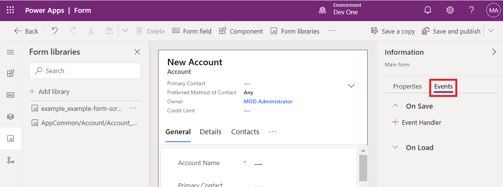
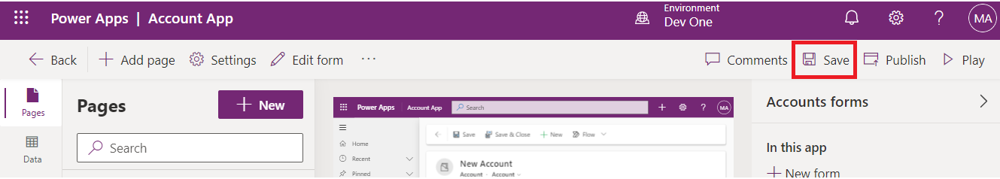
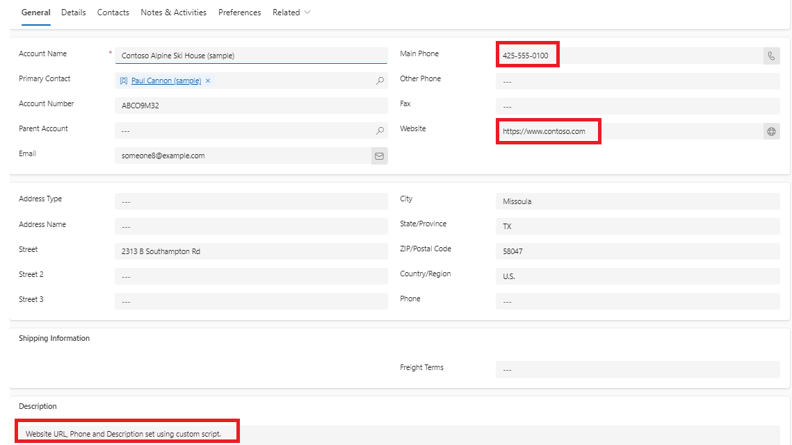

# **Lab 4: Scrivere il primo script client per l'app basata su modello**

**Durata stimata:** 30 min

**Obiettivo:** In questo lab imparerai come scrivere script client per
l'app basata su modello e come caricare il suoi codice come risorsa web.
In questo lab, lo script client eseguirà una ricerca senza distinzione
tra maiuscole e minuscole per Contoso nel nome dell'account nel modulo
basato su modello e, se presente, imposterà i valori per le colonne
websiteurl, telephone1 e description nel modulo dell'account.

**Attività 1: Creare una nuova soluzione e un'app basata su modello**

1.  Passa a [Power Apps](https://make.powerapps.com/) usando
    +++<https://make.powerapps.com/>+++. Assicurati di essere
    nell'ambiente **Dev One**.

> 

2.  Nel riquadro di spostamento a sinistra selezionare **Solutions** e
    quindi selezionare **New solution**.

> 

3.  Nella finestra di dialogo a comparsa specificare **Display name** –
    +++First Client Script+++, **Name** – +++FirstClientScript+++.

> 

4.  Fare clic su **New Publisher** per aprire la finestra di dialogo
    **New Publisher.**

> 

5.  In questo lab si userà un server di pubblicazione con la definizione
    seguente e quindi si selezionerà **Save**.

> **Display Name**- +++Example Publisher+++
>
> **Name** – +++ExamplePublisher+++
>
> **Prefix** – +++example+++
>
> 
>
> Si noti il valore **Prefix**. Questo dovrebbe essere qualcosa che
> identifica la tua azienda. In questo caso, stiamo usando l'esempio.

6.  A questo punto verrà visualizzata la finestra di dialogo Nuova
    soluzione. Seleziona **Example Publisher (ExamplePublisher)**
    dall'elenco a discesa del campo Editore, quindi seleziona
    **Create**.

> 

7.  Per creare una nuova app basata su modello nella soluzione,
    selezionare **New** | **App** | **Model-driven pp**.

> 

8.  Assegna il **name** all'app basata su modello come +++**Account
    App**+++ e quindi seleziona **Create**.

> 

9.  Nell'app basata su modello selezionare **+Add page**.

> 

10. Seleziona **Dataverse table** nella finestra popup visualizzata.

> 

11. Seleziona Tabella **Account** e quindi seleziona **Add**.

> 
>
> **Nota:** per questo lab, stiamo utilizzando la tabella Account. Gli
> script e le istruzioni seguenti prevedono che i campi si trovino in un
> modulo per la tabella Account.

12. Ora, la tua app basata su modello denominata "Account App" è pronta.

> 

13. Seleziona **Save** nell'angolo in alto a destra.

> 

14. Seleziona **Publish**.

> 

15. Fare clic sulla **back arrow** per tornare alla soluzione.

> 

**Attività 2: Scrivere il codice JavaScript**

1.  Le app basate su modello non forniscono un editor JavaScript. È
    necessario utilizzare uno strumento di creazione esterno che
    fornisca funzionalità per supportare in modo specifico la modifica
    dei file JavaScript, ad esempio Notepad++, Visual Studio Code o
    Microsoft Visual Studio. In questa esercitazione verrà utilizzato
    Visual Studio Code.

2.  Vai al desktop della VM, crea una **new folder** e denominala
    "**Client Script Lab**".

3.  Aprire Visual Studio Code nella macchina virtuale. Per aprirlo,
    utilizzare il collegamento indicato sul desktop della VM o fare clic
    sul menu **Start**, cercare e quindi selezionare **Visual Studio
    Code**.

> 

4.  Seleziona la scheda **File** nell'angolo in alto a sinistra, quindi
    seleziona **Open Folder.**

> 

5.  Seleziona la cartella **Client Script Lab** dal desktop e fai clic
    su **Select folder**.

> 

6.  Se ti imbatti nel pop-up che dice: "**Do you trust the authors of
    the files in this folder?**' quindi fare clic su '**Yes. I trust the
    authors**".

> 

7.  Passa il mouse sulla cartella **CLIENTSCRIPTLAB** e seleziona **New
    File**.

> 

8.  Assegna al file il nome +++**Example-form-script.js**+++.

> 

9.  Aggiungi il seguente codice JavaScript al file
    **Example-form-script.js**.

> // A namespace defined for the sample code
>
> // As a best practice, you should always define
>
> // a unique namespace for your libraries
>
> var Example = window.Example || {}; 
>
> (function () {
>
> // Define some global variabes
>
> var myUniqueId = "\_myUniqueId"; Define an ID for the notification
>
> var currentUserName =
> Xrm.Utility.getGlobalContext().userSettings.userName; // get current
> user name
>
> var message = currentUserName + ": Your JavaScript code in action!";
>
> Code to run in the form Onload event
>
> this.formOnLoad = function (executionContext) {
>
> var formContext = executionContext.getFormContext();
>
> // Display the form level notification as an INFO
>
> formContext.ui.setFormNotification(message, "INFO", myUniqueId);
>
> // Wait for 5 seconds before clearing the notification
>
> window.setTimeout(function () {
> formContext.ui.clearFormNotification(myUniqueId); }, 5000);
>
> }
>
> //Code to run in the column OnChange event
>
> this.attributeOnChange = function (executionContext) {
>
> var formContext = executionContext.getFormContext();
>
> //Automtically set some column values if the account name contains
> "Contoso"
>
> var accountName = formContext.getAttribute("name").getValue();
>
> if (accountName.toLowerCase().search("contoso") != -1) {
>
> formContext.getAttribute("websiteurl").setValue("https://www.contoso.com");
>
> formContext.getAttribute("telephone1").setValue("425-555-0100");
>
> formContext.getAttribute("description").setValue("Website URL, Phone
> and Description set using custom script.");
>
> }
>
> }
>
> // Code to run in the form OnSave event
>
> this.formOnSave = function () {
>
> //Display an alert dialog
>
> Xrm.Navigation.openAlertDialog({ text: "Record saved." });
>
> }
>
> }).call(Example);
>
> **Nota:** È possibile copiare questo codice in un file di testo invece
> di utilizzare Visual Studio Code e salvarlo con il nome:
> Example-form-script.js.

10. Seleziona la scheda **File** e quindi seleziona **Save** per salvare
    il codice.

> 

**Attività 3: Caricare il codice come risorsa Web**

Ora che il codice è pronto, è necessario caricarlo nella soluzione.

1.  Nella tua soluzione seleziona **+New** | **More** | **Web
    resource.**

> 

2.  Nella finestra di dialogo **New web resource**, fare clic su
    **Choose file.**

> 

3.  Seleziona il file **Example-form-script.js** che hai salvato in
    precedenza sul desktop della VM e fai clic su **Open**.

> 

4.  Digita il **Display name** – +++Example Script+++, **Name** –
    +++example-form-script+++, assicurati che il **Type** sia
    **JavaScript (JS)** e quindi seleziona **Save**.

> 
>
> ** **
>
> **Nota:**

- Si noti che il **name** ha un prefisso che corrisponde al prefisso di
  personalizzazione dell'autore della soluzione. Esistono altri modi per
  creare risorse Web, ma la creazione di una risorsa Web in questo modo
  garantisce che la risorsa Web faccia parte della soluzione.

&nbsp;

- Il nome della risorsa Web è example_example-form-script.

**Attività 4: Associare la risorsa Web a un modulo**

1.  Nella soluzione selezionare **Objects** | **Apps** | Seleziona (non
    per aprire) **Account App** e fai clic su **Edit**.

> 

2.  Espandere **Account** e selezionare il **Account form**.

> 

3.  Se vedi il modulo informativo e altri moduli. Conserva solo il
    modulo informativo e rimuovi gli altri moduli. Per rimuoverli, fare
    clic sui puntini di sospensione (**...**) a destra del modulo e
    selezionare **Remove**.

> **Nota:** non rimuovere il modulo informativo.
>
> 

4.  Ora, fai clic sui puntini di sospensione (**...**) a destra del
    modulo **Information** e selezionare **Edit**.

> 

5.  Se viene visualizzata la finestra popup Modifiche non salvate,
    selezionare **Save and continue**.

> 

6.  Nel menu di navigazione a sinistra, seleziona **Form Libraries** e
    fai clic su **Add Library**.

> 

7.  Nella finestra di dialogo **Add JavaScript Library**, cerca la
    risorsa Web JavaScript che hai creato per nome: **Example Script**.
    Selezionare la risorsa Web **Example Script** e fare clic su
    **Add**.

> 

**Attività 5: Configurare gli eventi del modulo e del campo**

1.  Seleziona la scheda **Events**.

> 

2.  Per configurare **Configure form on Load event**, selezionare **On
    Load** del gestore eventi e fare clic su **+ Event Handler**.

> 

3.  Assicurati che il **Event Type** sia **On Load** e che sia
    selezionata **example_example-form-script library** .

> 

4.  Digitare il nome della funzione nel campo Funzione. In questo caso
    +++**Example.formOnLoad**+++.

> 

5.  Selezionare **Pass execution context as first parameter**, quindi
    fare clic su **Done**.

> 

6.  Per configurare l'evento Form On Save, selezionare **On Save** del
    gestore eventi e fare clic su **+Event Handler**.

> 

7.  Assicurati che il **Event Type** sia **On Save** e che sia
    selezionata la libreria **example_example-form-script library**.

> 

8.  Digitare il nome della funzione nel campo **Function**. In questo
    caso +++**Example.formOnSave**+++.

> 
>
> **Nota:** non è necessario selezionare il **Pass execution context as
> first parameter** per questa funzione perché non lo utilizza.

9.  Fare clic su **Done.**

> 

10. Per configurare l'evento Campo in caso di modifica, selezionare il
    campo **Account Name** e la scheda **Events**.

> 

11. Nel gestore eventi **On Change** fare clic su **+Event Handler**.

> 

12. Assicurarsi che il **Event Type** sia **On Change** e che sia
    selezionata la libreria **example_example-form-script**.

> 

13. Digitare il nome della funzione nel campo **Function**. In questo
    caso**, Example.attributeOnChange**.

> 

14. Selezionare **Pass execution context as first parameter.** Fare clic
    su **Done.**

> 

15. Fare clic su **Save and Publish**.

> 

16. Seleziona **Back.**

> 

17. Sarai nell'app del suoi account. Seleziona **Save**.

> 

18. Seleziona **Publish**.

> 

19. Attendi la pubblicazione dell'app, quindi fai clic su **Back**.

> 

**Attività 6: Testare il codice**

Si consiglia di aggiornare il browser per rendere effettive le modifiche
nell'istanza delle app basate su modello.

Per testare il codice:

1.  Passa a Power Apps usando +++<https://make.powerapps.com/>+++.
    Assicurati di essere nell'ambiente **Dev One**.

> 

2.  Nell'area di navigazione a sinistra, seleziona **Apps**.

> 

3.  Fai doppio clic sull'app basata su modello – **Account App** che hai
    appena modificato o selezionala e fai clic su **Play**.

> 

4.  Per testare la funzione On Load del modulo, fare clic su qualsiasi
    record dell'account nell'elenco per aprirlo. Ad esempio, fare clic
    su **A. Datum Corporation (Sample).**

> 

5.  Verificare che la notifica venga visualizzata.

> 

6.  Verifica che la notifica scompaia in 5 secondi.

7.  Per testare la funzione On Change, selezionare **Alpine Ski House
    (sample)** dall'elenco Nome account.

> 

8.  Osservare i valori per le colonne **Main Phone**, **Website** e
    **Description** e modificare il nome dell'account in modo da
    includere "Contoso" nel nome e passare alla colonna successiva
    premendo TAB.

> 

9.  Verificare i valori previsti impostati sulle colonne **Main
    Phone**,**Website** e **Description**.

> 

10. Per testare il modulo On Funzione Salva. Fare clic su **Save**
    nell'account Contoso Alpine Ski House (esempio) appena modificato.

> 

11. Verificare che la finestra di dialogo di avviso contenga un
    messaggio configurato nel codice. Fare clic su **OK** per chiudere
    l'avviso.

> 

**Riepilogo:** in questo lab si è appreso come scrivere codice
JavaScript, caricarlo come risorsa Web e associarlo a un modulo nell'app
basata su modello per eseguire una ricerca senza distinzione tra
maiuscole e minuscole per Contoso e, se presente, impostare i valori per
le colonne websiteurl, telephone1 e description nel modulo dell'account.
