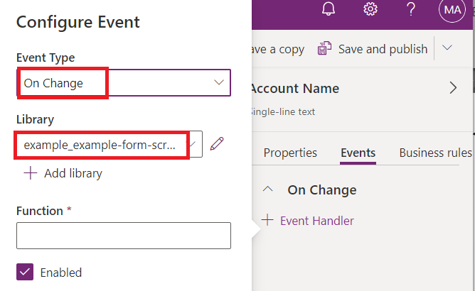
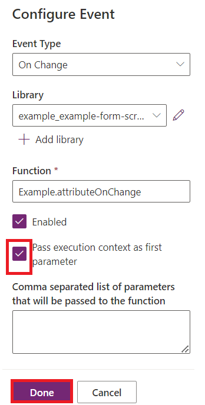
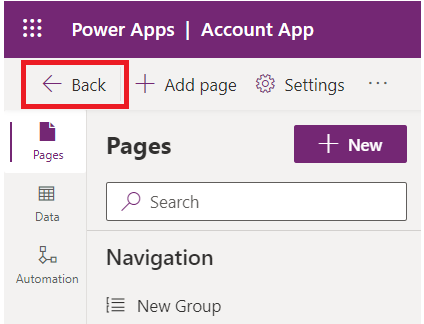

# **Laboratorio 4: Escriba su primer client script para la aplicación basada en modelos**

**Duración estimada:** 30 minutos

**Objetivo:** En este laboratorio, aprenderá a escribir client script
para la aplicación basada en modelos y subir su code como un recurso
web. En este laboratorio, el client script realizará un case-insensitive
search para Contoso en el nombre de cuenta de una manera basada en
modelo, y si está presente, establecerá valores
para websiteurl, telephone1, y columnas de descripción en el account
form.

**Tarea 1: Cree una nueva solución y un model-driven app**

1.  Navegue a [Power Apps](https://make.powerapps.com/) mediante
    +++<https://make.powerapps.com/>+++. Asegúrese de que está en el
    **Dev One** environment.

> 

2.  En el panel de navegación izquierdo, seleccione **Solutions** y
    luego seleccione **New solution**.

> 

3.  En el diálogo emergente, especifique **Display name** – +++First
    Client Script+++, **Name** – +++FirstClientScript+++.

> 

4.  Haga clic en **New Publisher** para abrir el diálogo **New
    Publisher**.

> 

5.  En este laboratorio, usaremos un publisher con la siguiente
    definición y seleccione **Save**.

> **Display Name** – +++Example Publisher+++
>
> **Name** – +++ExamplePublisher+++
>
> **Prefix** – +++example+++
>
> 
>
> Note el valor **Prefix**. Esto debe ser algo que identifica a su
> empresa. En este caso, usamos este ejemplo example.

6.  Ahora está en el diálogo New solution. Seleccione **Example
    Publisher (ExamplePublisher)** desde el dropdown del campo Publisher
    y luego seleccione **Create**.

> 

7.  Para crear una aplicación basada en el modelo en su solución,
    seleccione **New** | **App** | **Model-driven app**.

> 

8.  Dé el **nombre** a su aplicación basada en modelo +++**Account
    App**+++ y luego seleccione **Create**.

> 

9.  En la aplicación basada en modelo, seleccione **+Add page**.

> 

10. Seleccione **Dataverse table** en el popup que aparece.

> 

11. Seleccione la tabla **Account** y seleccione **Add**.

> 
>
> **Ojo:** para este laboratorio, usamos el Account table. Los scripts y
> las instrucciones esperan los campos en un formulario para la tabla
> Account.

12. Ahora, su aplicación basada en modelo que se llama ‘Account App’
    está lista.

> 

13. Seleccione **Save** desde la esquina superior derecha.

> 

14. Seleccione **Publish**.

> 

15. Haga clic en **back arrow** para volver a la solución.

> 

**Tarea 2: Escriba su JavaScript code**

1.  Las aplicaciones basadas en modelo no proporciona un JavaScript
    editor. Necesita usar un authoring tool externo que proporciona
    características para admitir la edición de JavaScript files,
    como Notepad++, Visual Studio Code, o Microsoft Visual Studio. En
    este laboratorio, use Visual Studio Code.

2.  Vaya al Desktop de VM, cree un **new folder** y nómbrelo ‘**Client
    Script Lab**’.

3.  Abra Visual Studio Code en su VM. Para abrirlo, use el shortcut en
    el Desktop de VM o haga clic en el **Start** menu, busque y
    seleccione **Visual Studio Code**.

> 

4.  Seleccione la pestaña **File** desde la esquina superior izquierda y
    seleccione **Open Folder**.

> 

5.  Seleccione la carpeta **Client Script Lab** desde Desktop y haga
    clic en **Select folder**.

> 

6.  Si ve un pop-up que dice, ‘**Do you trust the authors of the files
    in this folder?**’ y haga clic en ‘**Yes. I trust the authors**’.

> 

7.  Flote el mouse sobre la carpeta **CLIENTSCRIPTLAB** y
    seleccione **New File**.

> 

8.  Nombre el file +++**Example-form-script.js**+++.

> 

9.  Agregue el siguiente JavaScript code al **Example-form-script.js**
    file.

> // A namespace defined for the sample code
>
> // As a best practice, you should always define
>
> // a unique namespace for your libraries
>
> var Example = window.Example || {};
>
> (function () {
>
> // Define some global variables
>
> var myUniqueId = "\_myUniqueId"; // Define an ID for the notification
>
> var currentUserName =
> Xrm.Utility.getGlobalContext().userSettings.userName; // get current
> user name
>
> var message = currentUserName + ": Your JavaScript code in action!";
>
> // Code to run in the form OnLoad event
>
> this.formOnLoad = function (executionContext) {
>
> var formContext = executionContext.getFormContext();
>
> // Display the form level notification as an INFO
>
> formContext.ui.setFormNotification(message, "INFO", myUniqueId);
>
> // Wait for 5 seconds before clearing the notification
>
> window.setTimeout(function () {
> formContext.ui.clearFormNotification(myUniqueId); }, 5000);
>
> }
>
> // Code to run in the column OnChange event
>
> this.attributeOnChange = function (executionContext) {
>
> var formContext = executionContext.getFormContext();
>
> // Automatically set some column values if the account name contains
> "Contoso"
>
> var accountName = formContext.getAttribute("name").getValue();
>
> if (accountName.toLowerCase().search("contoso") != -1) {
>
> formContext.getAttribute("websiteurl").setValue("https://www.contoso.com");
>
> formContext.getAttribute("telephone1").setValue("425-555-0100");
>
> formContext.getAttribute("description").setValue("Website URL, Phone
> and Description set using custom script.");
>
> }
>
> }
>
> // Code to run in the form OnSave event
>
> this.formOnSave = function () {
>
> // Display an alert dialog
>
> Xrm.Navigation.openAlertDialog({ text: "Record saved." });
>
> }
>
> }).call(Example);
>
> **Ojo:** Puede copiar este code en un text file en vez de usar using
> Visual Studio Code y guárdelo con el nombre: Example-form-script.js.

10. Seleccione la pestaña **File** y seleccione **Save** para guardar el
    code.

> 

**Tarea 3: Suba su code como un web resource**

Ahora que su code está listo, necesita subirlo en su solución.

1.  En su solución, seleccione **+New** | **More** | **Web resource.**

> 

2.  En el diálogo **New web resource**, haga clic en **Choose file.** 

> 

3.  Seleccione **Example-form-script.js** file que acaba de guardar en
    el desktop de VM y haga clic en **Open**.

> 

4.  Tecle el **Display name** – +++Example Script+++, **Name** –
    +++example-form-script+++, asegure que **Type** es **JavaScript
    (JS)** y seleccione **Save**.

> 
>
> ** **
>
> **Ojo:**

- Note cómo el **Name** tiene un prefijo que coincide con el solution
  publisher customization prefix. Hay otras maneras de crear los web
  resources, pero crear un web resource así asegura que el Web Resource
  forma parte de su solución.

&nbsp;

- El nombre del resource es example_example-form-script.

**Tarea 4: Asocie su web resource a un formulario**

1.  En su solución, seleccione **Objects** | **Apps** | Seleccione (no
    para abrir) **Account App** y haga clic en **Edit**.

> 

2.  Expanda **Account** y seleccione el **Account form**.

> 

3.  Si ve el information form y otros formularios. Guarde solo el
    information form y quite otros formularios. Para quitarlos, haga
    clic en los tres puntos (**...**) a la derecha del formulario y
    seleccione **Remove**.

> **Ojo:** no quite el information form.
>
> 

4.  Ahora, haga clic en los tres puntos (**...**) a la derecha
    del **Information** form y seleccione **Edit**.

> 

5.  Si aparece el popup Unsaved changes, seleccione **Save and
    continue**.

> 

6.  En la navegación izquierda, seleccione **Form Libraries** y haga
    clic en **Add library**.

> 

7.  En el diálogo **Add JavaScript Library**, busque el JavaScript web
    resource que creó: **Example Script**. Seleccione el **Example
    Script** web resource y haga clic en **Add**.

> 

**Tarea 5: Configure form y field events**

1.  Seleccione la pestaña **Events**.

> 

2.  Para **Configure form On Load event**, seleccione **On Load** event
    handler y haga clic en **+ Event Handler**.

> 

3.  Asegure que, se seleccione** Event Type **is** On Load** y
    the** example_example-form-script library**.

> 

4.  Tecle el nombre de la función en el campo Function. En este
    caso +++**Example.formOnLoad**+++.

> 

5.  Seleccione **Pass execution context as first parameter** y haga clic
    en **Done**.

> 

6.  Para configurar Form On Save event, seleccione **On Save** event
    handler y haga clic en **+Event Handler**.

> 

7.  Asegure que **Event Type** es **On Save** y está seleccionado
    el **example_example-form-script** library.

> 

8.  Tecle el nombre de la función en el campo **Function**. En este
    caso +++**Example.formOnSave**+++.

> 
>
> **Ojo:** no es necesario elegir **Pass execution context as first
> parameter** para esta función porque no lo usa.

9.  Haga clic en **Done.**

> 

10. Para configurar el campo On Change event, seleccione el
    campo **Account Name** y la pestaña **Events**.

> 

11. En el **On Change** event handler, haga clic en **+ Event Handler**.

> 

12. Asegure que **Event Type** es **On Change** y está seleccionado
    el **example_example-form-script** library.

> 

13. Tecle el nombre de la función en el campo **Function**. En este
    caso **Example.attributeOnChange**.

> 

14. Seleccione **Pass execution context as first parameter**. Haga clic
    en **Done.**

> 

15. Haga clic en **Save** **and Publish**.

> 

16. Seleccione **Back**.

> 

17. Está en su Account App. Seleccione **Save**.

> 

18. Seleccione **Publish**.

> 

19. Espere a que se publica la aplicación y haga clic en **Back**.

> 

**Tarea 6: Pruebe su code**

Se recomienda actualizar su navegador para que se implementan los
cambios en su model-driven apps instance.

Para probar su code:

1.  Navegue a Power Apps mediante +++<https://make.powerapps.com/>+++.
    Asegure que está en **Dev One** environment.

> 

2.  En el área de navegación izquierda seleccione **Apps**.

> 

3.  Haga doble clic en el model-driven app – **Account App** que acaba
    de editar o selecciónelo y haga clic en **Play**.

> 

4.  Para probar la form On Load function, haga clic en cualquier account
    record en la lista para abrirlo. Por ejemplo, haga clic en **A.
    Datum Corporation (Sample)**.

> 

5.  Verifique que aparece la notificación.

> 

6.  Verifique que la notificación desaparece en 5 segundos.

7.  Para probar field On Change function, seleccione **Alpine Ski House
    (sample)** desde la lista Account Name list.

> 

8.  Observe los valores para las columnas **Main Phone**, **Website**,
    y **Description** y edite el Account Name para incluir "Contoso" en
    el nombre y siga a la siguiente columna al presionar TAB.

> 

9.  Verifique los valores esperados en las columnas **Main
    Phone**, **Website**, y **Description**.

> 

10. Para probar form On Save function, haga clic en **Save** en la
    cuenta recién editada Contoso Alpine Ski House (Sample).

> 

11. Verifique que sale el diálogo de alerta con un mensaje que configuró
    en su code. Haga clic en **OK** para cerrar la alerta.

> 

**Resumen:** En este laboratorio, ha aprendido cómo escribir un write
JavaScript code, para subirlo como un web resource y asiciarlo a un
formulario en model-driven app para realizar un case-insensitive search
para Contoso y si existe, establecer valores para las
columnas websiteurl, telephone1, y description en el account form.
