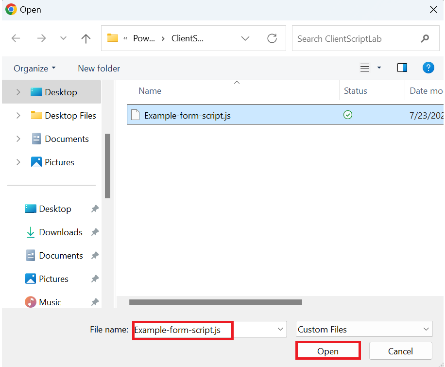
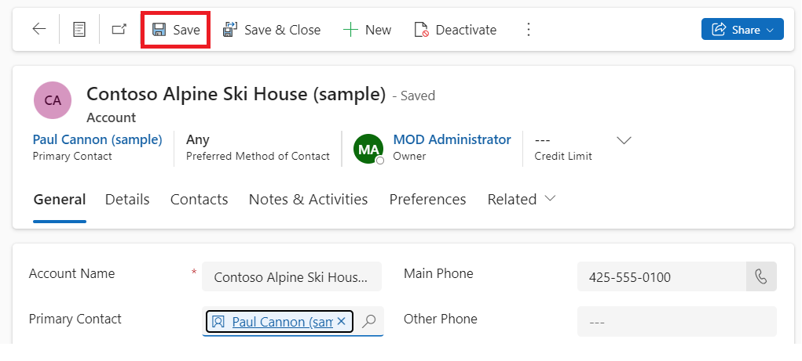

# **實驗 4：為模型驅動應用編寫第一個客戶端腳本**

**預計持續時間：** 30 分鐘

**目標：**在本實驗中，您將學習如何為模型驅動應用編寫客戶端腳本，以及如何將代碼作為
Web 資源上傳。在本實驗中，客戶端腳本將在模型驅動表單的帳戶名稱中對
Contoso 執行不區分大小寫的搜索，如果存在，則為帳戶表單中的
websiteurl、telephone1 和 description 列設置值。

**任務 1：創建新解決方案和模型驅動應用**

1.  使用 +++<https://make.powerapps.com/>+++導航到 Power
    Apps。確保您處於 **Dev One** 環境中。

> 

2.  在左側導航窗格中，選擇 “**Solutions**” ，然後選擇 “**New solution**”
    。

> 

3.  在彈出對話框中，指定 **顯示名稱** – +++First Client
    Script+++、**名稱** – +++FirstClientScript+++。

> 

4.  單擊 **New Publisher** 以打開 **New Publisher** 對話框。

> 

5.  在本實驗中，我們將使用具有以下定義的發佈者，然後選擇 **Save**
    （保存）。

> **顯示名稱 –** +++Example Publisher+++
>
> **名稱 –** +++ExamplePublisher+++
>
> **前綴 –** +++example+++
>
> 
>
> 請注意 **Prefix** 值。這應該是識別您公司的東西。在本例中，我們使用
> example。

6.  您現在將進入 New solution 對話框。從 Publisher 字段的下拉列表中選擇
    **Example Publisher （ExamplePublisher）**，然後選擇 **Create**。

> 

7.  若要在解決方案中創建新的模型驅動應用，請選擇 **New** | **App** | **Model-driven
    app**。

> 

8.  將模型驅動應用的**名稱**指定為 +++**Account App**+++，然後選擇
    **Create**。

> 

9.  在模型驅動應用中，選擇 **+Add page**。

> 

10. 在出現的彈出窗口中選擇 **Dataverse table**。

> 

11. 選擇 **Account** table （客戶表），然後選擇 **Add** （添加）。

> 
>
> **注意：**在本實驗中，我們使用 Account 表。下面的腳本和說明需要
> Account 表的表單中找到的字段。

12. 現在，名為 'Account App' 的模型驅動應用已準備就緒。

> 

13. 選擇 **Save** 從右上角。

> 

14. 選擇 **Publish**。

> 

15. 單擊**返回箭頭**返回解決方案。

> 

**任務 2：編寫 JavaScript 代碼**

1.  模型驅動應用不提供 JavaScript
    編輯器。您需要使用外部創作工具，該工具提供專門支持編輯 JavaScript
    文件的功能，例如 Notepad++、Visual Studio Code 或 Microsoft Visual
    Studio。在本實驗中，您將使用 Visual Studio Code。

2.  轉到 VM 的桌面，創建一個**新文件夾**並將其命名為 “**Client Script
    Lab**” 。

3.  在 VM 上打開 Visual Studio Code。要打開它，請使用 VM
    桌面上給定的快捷方式或單擊 “**Start**” 菜單，搜索並選擇 **Visual
    Studio Code**。

> 

4.  選擇 **File** 左上角的選項卡，然後選擇 **Open Folder**。

> 

5.  從 Desktop 中選擇 **Client Script Lab** 文件夾，然後單擊 **Select
    folder**。

> 

6.  如果您看到彈出窗口，上面寫著 “**Do you trust the authors of the
    files in this folder?**” ，然後單擊 “**Yes。I trust the authors**
    “。

> 

7.  將鼠標懸停在 **CLIENTSCRIPTLAB** 文件夾上，然後選擇 **New
    File**（新建文件）。

> 

8.  將文件命名為 +++**Example-form-script.js**+++。

> 

9.  將以下 JavaScript 代碼添加到 **Example-form-script.js** 文件中。

> // A namespace defined for the sample code
>
> // As a best practice, you should always define
>
> // a unique namespace for your libraries
>
> var Example = window.Example || {};
>
> (function () {
>
> // Define some global variables
>
> var myUniqueId = "\_myUniqueId"; // Define an ID for the notification
>
> var currentUserName =
> Xrm.Utility.getGlobalContext().userSettings.userName; // get current
> user name
>
> var message = currentUserName + ": Your JavaScript code in action!";
>
> // Code to run in the form OnLoad event
>
> this.formOnLoad = function (executionContext) {
>
> var formContext = executionContext.getFormContext();
>
> // Display the form level notification as an INFO
>
> formContext.ui.setFormNotification(message, "INFO", myUniqueId);
>
> // Wait for 5 seconds before clearing the notification
>
> window.setTimeout(function () {
> formContext.ui.clearFormNotification(myUniqueId); }, 5000);
>
> }
>
> // Code to run in the column OnChange event
>
> this.attributeOnChange = function (executionContext) {
>
> var formContext = executionContext.getFormContext();
>
> // Automatically set some column values if the account name contains
> "Contoso"
>
> var accountName = formContext.getAttribute("name").getValue();
>
> if (accountName.toLowerCase().search("contoso") != -1) {
>
> formContext.getAttribute("websiteurl").setValue("https://www.contoso.com");
>
> formContext.getAttribute("telephone1").setValue("425-555-0100");
>
> formContext.getAttribute("description").setValue("Website URL, Phone
> and Description set using custom script.");
>
> }
>
> }
>
> // Code to run in the form OnSave event
>
> this.formOnSave = function () {
>
> // Display an alert dialog
>
> Xrm.Navigation.openAlertDialog({ text: "Record saved." });
>
> }
>
> }).call(Example);
>
> **注：** 您可以將此代碼複製到文本文件中，而不是使用 Visual Studio
> Code，並使用名稱 Example-form-script.js 保存它。

10. 選擇 **File** 選項卡，然後選擇 **Save** 以保存代碼。

> 

**任務 3：將代碼作為 Web 資源上傳**

現在，您的代碼已準備就緒，您需要將其上傳到您的解決方案中。

1.  在您的解決方案中，選擇  **+New** | **More** | **Web resource。**

> 

2.  在 **New web resource** 對話框中，單擊 **Choose file**。 

> 

3.  選擇您之前在 VM 桌面上保存的 **Example-form-script.js**
    文件，然後單擊 **Open**（打開）。

> 

4.  鍵入 **顯示名稱** – +++Example Script+++，**名稱** –
    +++example-form-script+++，確保 **類型** 為 **JavaScript
    （JS）**，然後選擇 **Save**。

> 
>
> ** **
>
> **注意：**

- 請注意 **Name** （名稱）
  的前綴如何與解決方案發佈商自定義前綴匹配。還有其他方法可以創建 Web
  資源，但以這種方式創建 Web 資源可確保 Web 資源是解決方案的一部分。

&nbsp;

- Web 資源的名稱為 example_example-form-script。

**任務 4：將 Web 資源關聯到表單**

1.  在您的解決方案中，選擇 **Objects | Apps** |選擇 （not to open）
    **Account App**，然後單擊 **Edit**。

> 

2.  展開 **Account** 並選擇 **Account form**。

> 

3.  如果您看到信息表單和其他表單。僅保留信息表單並刪除其他表單。要刪除它們，請單擊表單右側的省略號
    （...），然後選擇 **Remove**。

> **注意：**請勿刪除信息表單。
>
> 

4.  現在，單擊 **Information** 表單右側的省略號 （...），然後選擇
    **Edit**。

> 

5.  如果出現 Unsaved changes 彈出窗口，請選擇 **Save and continue**。

> 

6.  在左側導航中，選擇 **Form Libraries**，然後單擊 **Add library**。

> 

7.  在“**Add JavaScript Library**” 對話框中，按名稱搜索您創建的
    JavaScript Web 資源：**Example Script**。選擇 **Example Script** Web
    資源，然後單擊 **Add**。

> 

**任務 5：配置表單和字段事件**

1.  選擇 **Events** 選項卡。

> 

2.  要**配置表單 On Load 事件**，請選擇 **On Load**
    事件處理程序，然後單擊 **+ Event Handler**。

> 

3.  確保 **Event Type** 為 **On Load** 並選擇了
    **example_example-form-script library**。

> 

4.  在 Function
    字段中鍵入函數的名稱。在本例中為 +++**Example.formOnLoad**+++。

> 

5.  選擇 **Pass execution context as first parameter**，然後單擊
    **Done**。

> 

6.  要配置 Form On Save 事件，請選擇 **On Save** 事件處理程序，然後單擊
    **+Event Handler**。

> 

7.  確保 **Event Type** 為 **On Save** 並選擇
    **example_example-form-script** 庫。

> 

8.  在 **Function**
    字段中鍵入函數的名稱。在本例中為 +++**Example.formOnSave**+++。

> 
>
> **注意：**沒有必要選擇 **Pass execution context as first parameter**
> 為函數，因為它不使用它。

9.  單擊 **Done。**

> 

10. 要配置 Field On Change 事件，請選擇 **Account Name** 字段和
    **Events** 選項卡。

> 

11. 在 **On Change** 事件處理程序下，單擊 **+ Event Handler**。

> 

12. 確保 **Event Type** 為 **On Change** 並選擇
    **example_example-form-script** 庫。

> 

13. 在 **Function** 字段中鍵入函數的名稱。在本例中為
    **Example.attributeOnChange**。

> 

14. 選擇 **Pass execution context as first
    parameter**（將執行上下文作為第一個參數傳遞）。單擊 **Done**。

> 

15. 單擊 **Save** **and Publish**。

> 

16. 選擇 **Back**。

> 

17. 您將進入您的帳戶應用程序。選擇 **Save**。

> 

18. 選擇 **Publish**。

> 

19. 等待應用程序發佈，然後單擊 **Back**。

> 

**任務 6：測試代碼**

建議您刷新瀏覽器，以使更改在模型驅動應用實例中生效。

要測試您的代碼：

1.  使用 +++<https://make.powerapps.com/>+++ 導航到 Power
    Apps。確保您處於 **Dev One** 環境中。

> 

2.  在左側導航區域中，選擇 **Apps**。

> 

3.  雙擊您剛剛編輯的模型驅動應用 – **客戶應用**，或選擇它並單擊
    **Play**。

> 

4.  要測試表單 On Load
    功能，請單擊列表中的任何客戶記錄以將其打開。例如，單擊 **A. Datum
    Corporation （Sample）**。

> 

5.  驗證通知是否顯示。

> 

6.  驗證通知是否在 5 秒後消失。

7.  要測試字段 On Change function，請從 Account Name 列表中選擇 **Alpine
    Ski House （sample）**。

> 

8.  觀察 **Main Phone**、**Website** 和 **Description** 列的值，編輯
    Account Name 以在名稱中包含 “Contoso” ，然後按 Tab 移動到下一列。

> 

9.  驗證設置為 **Main Phone**、**Website** 和 **Description**
    列的預期值。

> 

10. 測試表單 On Save 功能。在新編輯的 Contoso Alpine Ski House
    （Sample） 帳戶上單擊 **Save**。

> 

11. 驗證包含您在代碼中配置的消息的警報對話框。單擊 **OK** 關閉警報。

> 

**摘要：**在本實驗中，您學習了如何編寫 JavaScript 代碼，將其作為 Web
資源上傳，並將其關聯到模型驅動應用中的表單，以執行 Contoso
的不區分大小寫的搜索，如果存在，則為帳戶表單中的 websiteurl、telephone1
和 description 列設置值。
