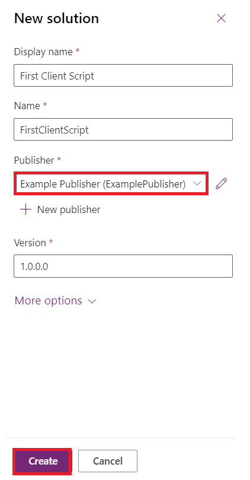
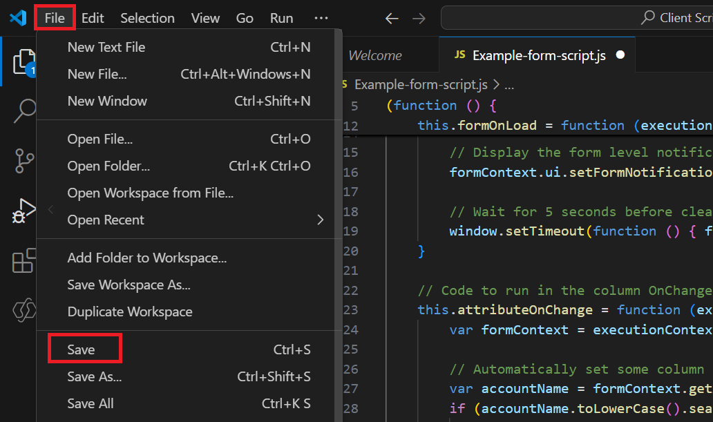
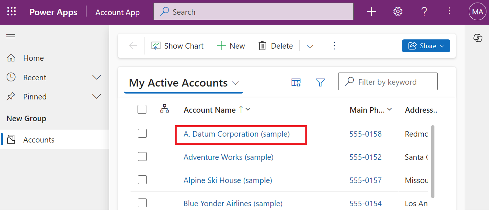

# **Laboratório 4: Escreva seu primeiro script de cliente para o aplicativo orientado por modelos**

**Duração estimada:** 30 minutos

**Objetivo:** Neste laboratório, você aprenderá a escrever um script de
cliente para o aplicativo orientado por modelo e a enviar seu código
como um recurso da web. Neste laboratório, o script do cliente realizará
uma busca sem distinção entre maiúsculas e minúsculas por Contoso no
nome da conta no formulário orientado por modelo e, se encontrado,
definirá valores para as colunas websiteurl, telephone1 e description no
formulário da conta.

**Tarefa 1: Criar uma nova solução e um aplicativo orientado a modelo**

1.  Acesse o [Power Apps](https://make.powerapps.com/) usando
    +++<https://make.powerapps.com/>+++. Certifique-se de estar no
    ambiente **Dev One.**

> 

2.  No painel de navegação esquerdo, selecione **Solutions** e, em
    seguida, **New solution**.

> 

3.  Na caixa de diálogo suspensa, especifique **Display name** –
    +++First Client Script+++, **Name** – +++FirstClientScript+++.

> 

4.  Clique em **Novo editor** para abrir a caixa de diálogo **Novo
    editor**.

> 

5.  Neste laboratório, usaremos um editor com a seguinte definição e
    então selecionaremos **Save**.

> **Display Name** – +++Example Publisher+++
>
> **Name** – +++ExamplePublisher+++
>
> **Prefix** – +++example+++
>
> 
>
> Observe o valor do **Prefix**. Ele deve ser algo que identifique sua
> empresa. Neste caso, estamos usando o exemplo.

6.  Agora você estará na caixa de diálogo New solution. Selecione
    **Example Publisher (ExamplePublisher)** no menu suspenso do campo
    Publisher e, em seguida, selecione **Create**.

> 

7.  Para criar um novo aplicativo orientado por modelos em sua solução,
    selecione **New** | **App** | **Model-driven app**.

> 

8.  Insira o **name** do seu aplicativo orientado por modelo como
    +++**Account App**+++ e então selecione **Create**.

> 

9.  No aplicativo orientado por modelo, selecione **+ Add page**.

> 

10. Selecione a **Dataverse table** no pop-up exibido.

> 

11. Selecione a tabela **Account** e depois **Add**.

> 
>
> **Observação:** Para este laboratório, estamos usando a tabela Conta.
> Os scripts e instruções abaixo assumem a presença de campos
> encontrados em um formulário da tabela Conta.

12. Agora, seu aplicativo orientado por modelos chamado, ‘Account App’
    está pronto.

> 

13. Selecione **Save** no canto superior direito.

> 

14. Selecione **Publish**.

> 

15. Clique na **seta voltar** para retornar à solução.

> 

**Tarefa 2: Escreva seu código JavaScript**

1.  Aplicativos orientados por modelo não oferecem um editor JavaScript.
    Você precisa usar uma ferramenta de criação externa que ofereça
    recursos específicos para a edição de arquivos JavaScript, como
    Notepad++, Visual Studio Code ou Microsoft Visual Studio. Neste
    laboratório, você usará o Visual Studio Code.

2.  Vá para o Desktop da VM, crie uma **new folder** e nomeie como
    ‘**Client Script Lab**’.

3.  Abra o Visual Studio Code na sua VM. Para abri-lo, use o atalho
    fornecido no Desktop da VM ou clique no menu **Start**, pesquise e
    selecione **Visual Studio Code**.

> 

4.  Selecione a aba **File** no canto superior esquerdo e depois
    selecione **Open Folder**.

> 

5.  Selecione a pasta **Client Script Lab** no Desktop e clique em
    **Select folder**.

> 

6.  Se você encontrar o pop-up que diz: ‘**Do you trust the authors of
    the files in this folder?’**,clique em ‘**Yes. I trust the
    authors’**.

> 

7.  Passe o mouse sobre a pasta **CLIENTSCRIPTLAB** e selecione **New
    File**.

> 

8.  Nomeie o arquivo +++**Example-form-script.js**+++.

> 

9.  Adicione o código JavaScript abaixo ao arquivo
    **Example-form-script.js**.

> // A namespace defined for the sample code
>
> // As a best practice, you should always define
>
> // a unique namespace for your libraries
>
> var Example = window.Example || {};
>
> (function () {
>
> // Define some global variables
>
> var myUniqueId = "\_myUniqueId"; // Define an ID for the notification
>
> var currentUserName =
> Xrm.Utility.getGlobalContext().userSettings.userName; // get current
> user name
>
> var message = currentUserName + ": Your JavaScript code in action!";
>
> // Code to run in the form OnLoad event
>
> this.formOnLoad = function (executionContext) {
>
> var formContext = executionContext.getFormContext();
>
> // Display the form level notification as an INFO
>
> formContext.ui.setFormNotification(message, "INFO", myUniqueId);
>
> // Wait for 5 seconds before clearing the notification
>
> window.setTimeout(function () {
> formContext.ui.clearFormNotification(myUniqueId); }, 5000);
>
> }
>
> // Code to run in the column OnChange event
>
> this.attributeOnChange = function (executionContext) {
>
> var formContext = executionContext.getFormContext();
>
> // Automatically set some column values if the account name contains
> "Contoso"
>
> var accountName = formContext.getAttribute("name").getValue();
>
> if (accountName.toLowerCase().search("contoso") != -1) {
>
> formContext.getAttribute("websiteurl").setValue("https://www.contoso.com");
>
> formContext.getAttribute("telephone1").setValue("425-555-0100");
>
> formContext.getAttribute("description").setValue("Website URL, Phone
> and Description set using custom script.");
>
> }
>
> }
>
> // Code to run in the form OnSave event
>
> this.formOnSave = function () {
>
> // Display an alert dialog
>
> Xrm.Navigation.openAlertDialog({ text: "Record saved." });
>
> }
>
> }).call(Example);
>
> **Observação:** Você pode copiar este código em um arquivo de texto em
> vez de usar o Visual Studio Code e salvá-lo com o nome:
> Example-form-script.js.

10. Selecione a aba **File** e depois selecione **Save** para salvar o
    código.

> 

**Tarefa 3: Carregue seu código como um recurso da web**

Agora que seu código está pronto, você precisa carregá-lo em sua
solução.

1.  Na sua solução, selecione **+ New** | **More** | **Web resource.**

> 

2.  Na caixa de diálogo **New web resource**, clique em **Choose
    file.** 

> 

3.  Selecione o arquivo **Example-form-script.js** que você salvou
    anteriormente no Desktop da VM e clique em **Open**.

> 

4.  Digite o **Display name** – +++Example Script+++, **Name** –
    +++example-form-script+++, certifique-se de que o **Type** é
    **JavaScript (JS)** e então selecione **Save**.

> 
>
> ** **
>
> **Observação:**

- Observe como o **Name** tem um prefixo que corresponde ao prefixo de
  personalização do publicador da solução. Existem outras maneiras de
  criar recursos web, mas criar um recurso web dessa forma garante que o
  Recurso Web faça parte da sua solução.

&nbsp;

- O nome do recurso da web é example_example -form-script.

**Tarefa 4: Associe seu recurso da web a um formulário**

1.  Na sua solução, selecione **Objects** | **Apps** | Selecionar (para
    não abrir) **Account App** e clique em **Edit**.

> 

2.  Expanda **Account** e selecione o **Account form**.

> 

3.  Se você vir o formulário de informações e outros formulários,
    mantenha apenas o formulário de informações e remova os outros
    formulários. Para removê-los, clique nas reticências ( **...** ) à
    direita do formulário e selecione **Remove**.

> **Nota:** Não remova o formulário de informações.
>
> 

4.  Agora, clique nas reticências ( **...** ) à direita do formulário de
    **Information** e selecione **Edit**.

> 

5.  Se a janela pop-up Alterações não salvas aparecer, selecione **Save
    and continue**.

> 

6.  Na navegação à esquerda, selecione **Form Libraries** e clique em
    **Add library**.

> 

7.  Na caixa de diálogo **Add JavaScript Library**, procure o recurso
    web JavaScript que você criou pelo nome: **Example Script**.
    Selecione o recurso web **Example Script** e clique em **Add**.

> 

**Tarefa 5: Configurar eventos de formulário e campo**

1.  Selecione a aba **Events**.

> 

2.  Para **Configure form On Load event**, selecione o manipulador de
    eventos **On Load** e clique em **+ Event Handler**.

> 

3.  Certifique-se de que o **Event Type** seja **On Load** e
    o** example_example-form-script library** é selecionado.

> 

4.  Digite o nome da função no campo Função. Neste caso,
    +++**Example.formOnLoad**+++.

> 

5.  Selecione **Pass execution context as first parameter** e clique em
    **Done**.

> 

6.  Para configurar o evento Form On Save, selecione o manipulador de
    eventos **On Save** e clique em **+Event Handler.**

> 

7.  Certifique-se de que o **Event Type** seja **On Save** e que a
    biblioteca **example_example-form-script** esteja selecionada**.**

> 

8.  Digite o nome da função no campo **Function**. Neste caso,
    +++**Example.formOnSave**+++.

> 
>
> **Nota:** Não é necessário selecionar **Pass execution context as
> first parameter** para essa função porque não é utilizado.

9.  Clique em **Done.**

> 

10. Para configurar On change no campo event, selecione o campo
    **Account Name** e a aba **Events**.

> 

11. No manipulador de eventos **On Change**, clique em **+ Event
    Handler**.

> 

12. Certifique-se de que o **Event Type** seja **On Change** e que a
    biblioteca **example_example-form-script esteja selecionada.**

> 

13. Digite o nome da função no campo **Function**. Neste caso,
    **Example.attributeOnChange**.

> 

14. Selecione **Pass execution context as first parameter**. Clique em
    **Done.**

> 

15. Clique em **Save** **and Publish**.

> 

16. Selecione **Back**.

> 

17. Você estará no seu aplicativo de conta. Selecione **Save**.

> 

18. Selecione **Publish**.

> 

19. Aguarde até que o aplicativo seja publicado e então clique em
    **Back**.

> 

**Tarefa 6: Teste seu código**

É recomendável que você atualize seu navegador para que as alterações
entrem em vigor na sua instância de aplicativos orientados por modelos.

Para testar seu código:

1.  Acesse o Power Apps usando +++<https://make.powerapps.com/>+++.
    Certifique-se de estar no ambiente **Dev One.**

> 

2.  Na área de navegação à esquerda, selecione **Apps**.

> 

3.  Clique duas vezes no aplicativo orientado por modelo – **Account
    App** que você acabou de editar ou selecione e clique em **Play**.

> 

4.  Para testar a função On Load, clique em qualquer registro de conta
    na lista para abri-lo. Por exemplo, clique em **A. Datum Corporation
    (Sample)**.

> 

5.  Verifique se a notificação aparece.

> 

6.  Verifique se a notificação desaparece em 5 segundos.

7.  Para testar a função do campo On Change, selecione **Alpine Ski
    House (sample)** na lista Nome da conta.

> 

8.  Observe os valores das colunas **Main Phone**, **Website** e
    **Description** e edite o Nome da conta para incluir "Contoso" no
    nome e vá para a próxima coluna pressionando TAB.

> 

9.  Verifique os valores esperados definidos para as colunas **Main
    Phone**, **Website** e **Description.**

> 

10. Para testar a função On save, clique em **Save** na conta
    recém-editada da Alpine Ski House (Sample).

> 

11. Verifique se a caixa de diálogo de alerta exibe uma mensagem que
    você configurou no seu código. Clique em **OK** para fechar o
    alerta.

> 

**Resumo:** Neste laboratório, você aprendeu como escrever código
JavaScript, como enviá-lo como um recurso da Web e como associá-lo a um
formulário em um aplicativo orientado por modelo para realizar uma busca
por Contoso, sem diferenciação entre maiúsculas e minúsculas e, se
encontrado, definir valores para as colunas websiteurl, telephone1 e
description no formulário da conta.
