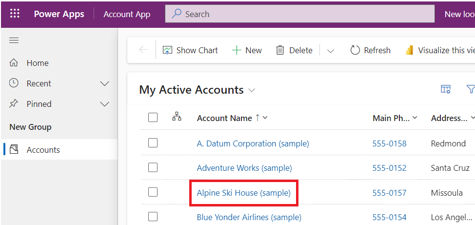
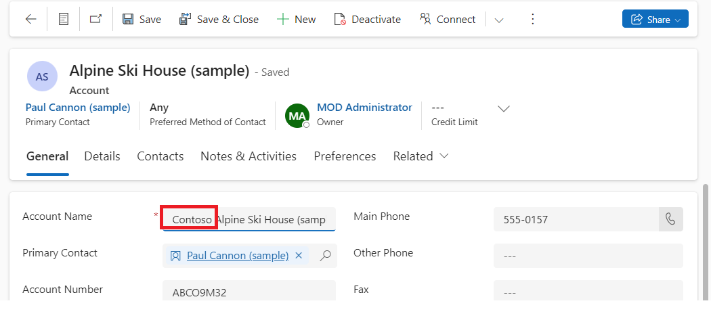

# **ラボ4：モデル駆動型アプリの最初のクライアントスクリプトを作成する**

**所要時間：**30 分

**目的：**このラボでは、モデル駆動型アプリのクライアントスクリプトの書き方と、コードをWebリソースとしてアップロードする方法を学習します。このラボでは、クライアントスクリプトを使用して、アカウント名に「Contoso」が含まれているかを大文字・小文字を区別せずに検索し、該当する場合は、アカウントフォームの「websiteurl」「telephone1」「description」列に値を設定します。

**タスク1： 新しいソリューションとモデル駆動型アプリを作成する**

1.  +++<https://make.powerapps.com/>+++で[Power
    Apps](https://make.powerapps.com/)をアクセスして**Dev One**
    環境にいることを確認します。

> 

2.  左のナビゲーションペインで **Solutions** を選択し、**New
    solution**をクリックします。

> 

3.  フライアウトダイアログで**Display name**を +++First Client
    Script+++, **Name**を+++FirstClientScript+++。

> 

4.  **New Publisher**にクリックして**New
    Publisher**ダイアログを開きます。

> 

5.  このラボでは以下のようにパブリッシャー情報を入力し、**Save**をクリックします。

> **Display Name** – +++Example Publisher+++
>
> **Name** – +++ExamplePublisher+++
>
> **Prefix** – +++example+++
>
> 
>
> **Prefix**の値に注目してください。これは、会社を識別するものにする必要があります。ここでは
> exampleを使用しています。

6.  新しいソリューションダイアログが表示されます。**Example Publisher
    (ExamplePublisher)**をパブリッシャーフィールドのドロップダウンから選択し、**Create**をクリックします。

> 

7.  ソリューション内で新しいモデル駆動型アプリを作成するには、**New** | **App** | **Model-driven
    app**を選択します。

> 

8.  モデル駆動型アプリの**name**を+++**Account App**+++
    に設定し、**Create**をクリックします。

> 

9.  モデル駆動型アプリ内で**+Add page**を選択します。

> 

10. ポップアップで**Dataverse table** を選択します。

> 

11. **Account** テーブルを選択し、**Add**をクリックします。

> 
>
> **注意：**このラボではアカウントテーブルを使用します。以下のスクリプトおよび指示では、アカウントテーブルのフォームにあるフィールドを前提としています。

12. これで「Account
    App」という名前のモデル駆動型アプリが作成されました。

> 

13. 右上の**Save**をクリックします。

> 

14. **Publish**をクリックします。

> 

15. **back arrow**をクリックして、ソリューションに戻ります。

> 

**タスク2：JavaScript コードを記述する**

1.  モデル駆動型アプリには JavaScript
    エディタが付属していません。JavaScript
    ファイルの編集に対応した外部のエディタNotepad++、Visual Studio
    Code、Microsoft Visual Studio
    などを使用する必要があります。このラボでは Visual Studio Code
    を使用します。

2.  VM のデスクトップで**new folder**を作成し、名前を「**Client Script
    Lab**」。

3.  Visual Studio Code
    をVMで開きます。そうするために、デスクトップのショートカットまたは**Start**
    メニューから**Visual Studio Code**を起動します。

> 

4.  左上の**File**タブを選択し、**Open Folder**をクリックします。

> 

5.  デスクトップ上の**Client Script Lab** フォルダーを選択し、**Select
    folder**をクリックします。

> 

6.  ‘**Do you trust the authors of the files in this folder?**’
    というポップアップが表示された場合は、‘**Yes. I trust the
    authors**’をクリックします。

> 

7.  **CLIENTSCRIPTLAB** フォルダー上にマウスを合わせて、**New
    File**を選択します。

> 

8.  ファイル名を+++**Example-form-script.js**+++に付けます。

> 

9.  以下のJavaScriptコードを**Example-form-script.js**ファイルに追加します。

> // A namespace defined for the sample code
>
> // As a best practice, you should always define
>
> // a unique namespace for your libraries
>
> var Example = window.Example || {};
>
> (function () {
>
> // Define some global variables
>
> var myUniqueId = "\_myUniqueId"; // Define an ID for the notification
>
> var currentUserName =
> Xrm.Utility.getGlobalContext().userSettings.userName; // get current
> user name
>
> var message = currentUserName + ": Your JavaScript code in action!";
>
> // Code to run in the form OnLoad event
>
> this.formOnLoad = function (executionContext) {
>
> var formContext = executionContext.getFormContext();
>
> // Display the form level notification as an INFO
>
> formContext.ui.setFormNotification(message, "INFO", myUniqueId);
>
> // Wait for 5 seconds before clearing the notification
>
> window.setTimeout(function () {
> formContext.ui.clearFormNotification(myUniqueId); }, 5000);
>
> }
>
> // Code to run in the column OnChange event
>
> this.attributeOnChange = function (executionContext) {
>
> var formContext = executionContext.getFormContext();
>
> // Automatically set some column values if the account name contains
> "Contoso"
>
> var accountName = formContext.getAttribute("name").getValue();
>
> if (accountName.toLowerCase().search("contoso") != -1) {
>
> formContext.getAttribute("websiteurl").setValue("https://www.contoso.com");
>
> formContext.getAttribute("telephone1").setValue("425-555-0100");
>
> formContext.getAttribute("description").setValue("Website URL, Phone
> and Description set using custom script.");
>
> }
>
> }
>
> // Code to run in the form OnSave event
>
> this.formOnSave = function () {
>
> // Display an alert dialog
>
> Xrm.Navigation.openAlertDialog({ text: "Record saved." });
>
> }
>
> }).call(Example);
>
> **注意：** You can copy this code into a text file instead of using
> Visual Studio Code and save it with the name: Example-form-script.js.

10. **File** タブから**Save**を選択して、コードを保存します。

> 

**タスク３：コードをWebリソースとしてアップロードする**

コードが準備できたら、それをソリューションにアップロードします。

1.  ソリューションでは**+New** | **More** | **Web
    resource**を選択します。

> 

2.  **New web resource** ダイアログで、**Choose file**をクリックします。

> 

3.  先ほどVMデスクトップに保存したファイルを選択し、**Open**をクリックします。

> 

4.  **Display name** に– +++Example Script+++を入力し、**Name** に–
    +++example-form-script+++入力し、**Type**は**JavaScript
    (JS)**で確認して**Save**を選択します。

> 
>
> ** **
>
> **注意：**

- **Name**
  のプレフィックスは、ソリューションパブリッシャーのカスタマイズプレフィックスと合わせていることを確認します。他にもWebリソースを作成する方法はありますが、この方法でWebリソースを作成することで、Webリソースがソリューションの一部として正しく管理されます。

&nbsp;

- Webリソース名は「example_example-form-script」になります。

**タスク４：ウェブリソースをフォームに関連付ける**

1.  ソリューション内で、**Objects** | **Apps** | を選択し、**Account
    App** を選択（開かない）してをクリックします。

> 

2.  **Account**を展開し、**Account form**を選択します。

> 

3.  Informationフォームと他のフォームが表示されている場合は、「Information」フォームのみを残し、他のフォームを削除します。削除するには、フォームの右側にある省略記号(**...**)をクリックして**Remove**を選択します。

> **注意：**フォームは削除しないでください。
>
> 

4.  なお、 **Information** フォームの右側の省略記号(**...**)
    をクリックして**Edit**を選択します。

> 

5.  「未保存の変更があります」というポップアップが表示された場合は、**Save
    and continue**を選択します。

> 

6.  左のナビゲーションから**Form Libraries** を選択し、**Add
    library**をクリックします。

> 

7.  **Add JavaScript Library** ダイアログで、**Example
    Script**という名前で作成されたJavaScript Web
    リソースを検索します。**Example
    Script**ウェブリソースを選択して**Add**をクリックします。

> 

**タスク5：フォームとフィールド イベントを構成する**

1.  **Events**タブを選択します。.

> 

2.  **Configure form On Load event**を構成するには、**On
    Load** イベントハンドラーを選択し、**+ Event
    Handler**をクリックします。

> 

3.  **Event Type **は** On
    Load**であり、**example_example-form-script library**が選択されていることを確認します。

> 

4.  Function名をFunction fieldに入力します。この場合は+++**Example.formOnLoad**+++です。

> 

5.  **Pass execution context as first parameter**
    を選択して、**Done**にクリックします。

> 

6.  On Save eventでフォームを構成するため、**On
    Save** でイベントハンドラーを選択して、**+Event
    Handler**をクリックします。

> 

7.  **Event Type** は**On Save**
    であること、**example_example-form-script**ライブラリ
    は選択していることを確認します。

> 

8.  **Function**フィールドにFunction名を入力してください。この場合は+++**Example.formOnSave**+++です。

> 
>
> **注意：** このFunctionでもう使用されないので、**Pass execution
> context as first parameter** として渡す必要はありません。

9.  **Done**にクリックします。

> 

10. フィールドをOn Changeイベントで構成するには、**Account Name** field
    を選択して、**Events** タブにクリックします。

> 

11. **On Change** イベントハンドラーの下で**+ Event
    Handler**をクリックします。

> 

12. **Event Type** は**On Change**
    であり、**example_example-form-script** ライブラリが選択されていることを確認します。

> 

13. **Function**フィールドにFunction名を入力してください。この場合は  
    **Example. attributeOnChange**です。

> 

14. **Pass execution context as first
    parameter**を選択して、**Done**にクリックします。

> 

15. **Save** **and Publish**を選択します。

> 

16. **Back**にクリックします。

> 

17. 自分のAccount Appに戻ります。**Save**にクリックします。

> 

18. **Publish**を選択します。

> 

19. アプリの発行が完了するまで待ち、その後**Back**をクリックします。

> 

**タスク６：自分のコードをテストする**

モデル駆動アプリのインスタンスに変更を有効にするには、ブラウザを変更することをお勧めします。

コードをテストするには：

1.  +++<https://make.powerapps.com/>+++でPower Appsに移動します。**Dev
    One** 環境にいることを確認します。

> 

2.  左ナビゲーションから**Apps**を選択します。

> 

3.  編集したモデル駆動アプリ– **Account App**
    をダブルクリッする、または選択して**Play**にクリックします。

> 

4.  フォームのOn Load
    functionをテストするため、リスト内の任意のアカウントレコードをクリックして開きます。例えば、**A.
    Datum Corporation (Sample)**をクリックします。

> 

5.  通知が表示されることを確認します。

> 

6.  通知が5秒後に消えることを確認します。

7.  フォームのOn Change functionをテストするには、Account
    Nameリストから**Alpine Ski House (sample)** を選択します。

> 

8.  **Main Phone**、**Website**と**Description** 列の値を確認し、Account
    Name に「Contoso」を含むよう編集し、TABキーで次の列に移動します。

> 

9.  **Main
    Phone**、**Website**と**Description** 列に期待される値が設定されていることを確認します。

> 

10. フォームのOn Save functionをテストするには、新しく編集されたContoso
    Alpine Ski House (Sample)
    accountのアカウントで**Save**をクリックします。

> 

11. コードで設定したメッセージ付きのアラートダイアログが表示されることを確認し、**OK**をクリックして閉じます。

> 

**まとめ：**このラボでは、JavaScript コードの作成方法、それを Web
リソースとしてアップロードする方法、さらにモデル駆動型アプリのフォームに関連付けて、Contoso
の文字列を含むかどうかを大文字小文字を区別せずに検索し、見つかった場合にアカウントフォームのwebsiteurl、telephone1、descriptionの各列に値を設定する方法を学習しました。
