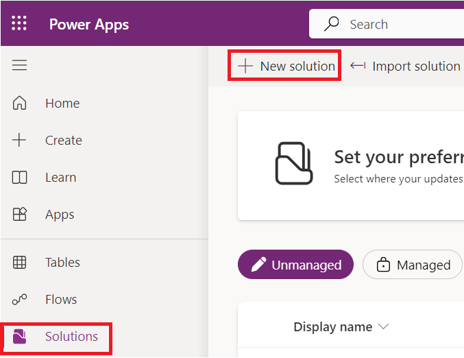

# **实验 4：为模型驱动应用编写第一个客户端脚本**

**预计持续时间：** 30 分钟

**目标：**在本实验中，您将学习如何为模型驱动应用编写客户端脚本，以及如何将代码作为
Web 资源上传。在本实验中，客户端脚本将在模型驱动表单的帐户名称中对
Contoso 执行不区分大小写的搜索，如果存在，则为帐户表单中的
websiteurl、telephone1 和 description 列设置值。

**任务 1：创建新解决方案和模型驱动应用**

1.  使用 +++<https://make.powerapps.com/>+++导航到 Power
    Apps。确保您处于 **Dev One** 环境中。

> 

2.  在左侧导航窗格中，选择 “**Solutions**” ，然后选择 “**New solution**”
    。

> 

3.  在弹出对话框中，指定 **显示名称** – +++First Client
    Script+++、**名称** – +++FirstClientScript+++。

> 

4.  单击 **New Publisher** 以打开 **New Publisher** 对话框。

> 

5.  在本实验中，我们将使用具有以下定义的发布者，然后选择 **Save**
    （保存）。

> **显示名称 –** +++Example Publisher+++
>
> **名称 –** +++ExamplePublisher+++
>
> **前缀 –** +++example+++
>
> 
>
> 请注意 **Prefix** 值。这应该是识别您公司的东西。在本例中，我们使用
> example。

6.  您现在将进入 New solution 对话框。从 Publisher 字段的下拉列表中选择
    **Example Publisher （ExamplePublisher）**，然后选择 **Create**。

> 

7.  若要在解决方案中创建新的模型驱动应用，请选择 **New** | **App** | **Model-driven
    app**。

> 

8.  将模型驱动应用的**名称**指定为 +++**Account App**+++，然后选择
    **Create**。

> 

9.  在模型驱动应用中，选择 **+Add page**。

> 

10. 在出现的弹出窗口中选择 **Dataverse table**。

> 

11. 选择 **Account** table （客户表），然后选择 **Add** （添加）。

> 
>
> **注意：**在本实验中，我们使用 Account 表。下面的脚本和说明需要
> Account 表的表单中找到的字段。

12. 现在，名为 'Account App' 的模型驱动应用已准备就绪。

> 

13. 选择 **Save** 从右上角。

> 

14. 选择 **Publish**。

> 

15. 单击**返回箭头**返回解决方案。

> 

**任务 2：编写 JavaScript 代码**

1.  模型驱动应用不提供 JavaScript
    编辑器。您需要使用外部创作工具，该工具提供专门支持编辑 JavaScript
    文件的功能，例如 Notepad++、Visual Studio Code 或 Microsoft Visual
    Studio。在本实验中，您将使用 Visual Studio Code。

2.  转到 VM 的桌面，创建一个**新文件夹**并将其命名为 “**Client Script
    Lab**” 。

3.  在 VM 上打开 Visual Studio Code。要打开它，请使用 VM
    桌面上给定的快捷方式或单击 “**Start**” 菜单，搜索并选择 **Visual
    Studio Code**。

> 

4.  选择 **File** 左上角的选项卡，然后选择 **Open Folder**。

> 

5.  从 Desktop 中选择 **Client Script Lab** 文件夹，然后单击 **Select
    folder**。

> 

6.  如果您看到弹出窗口，上面写着 “**Do you trust the authors of the
    files in this folder?**” ，然后单击 “**Yes。I trust the authors**
    “。

> 

7.  将鼠标悬停在 **CLIENTSCRIPTLAB** 文件夹上，然后选择 **New
    File**（新建文件）。

> 

8.  将文件命名为 +++**Example-form-script.js**+++。

> 

9.  将以下 JavaScript 代码添加到 **Example-form-script.js** 文件中。

> // A namespace defined for the sample code
>
> // As a best practice, you should always define
>
> // a unique namespace for your libraries
>
> var Example = window.Example || {};
>
> (function () {
>
> // Define some global variables
>
> var myUniqueId = "\_myUniqueId"; // Define an ID for the notification
>
> var currentUserName =
> Xrm.Utility.getGlobalContext().userSettings.userName; // get current
> user name
>
> var message = currentUserName + ": Your JavaScript code in action!";
>
> // Code to run in the form OnLoad event
>
> this.formOnLoad = function (executionContext) {
>
> var formContext = executionContext.getFormContext();
>
> // Display the form level notification as an INFO
>
> formContext.ui.setFormNotification(message, "INFO", myUniqueId);
>
> // Wait for 5 seconds before clearing the notification
>
> window.setTimeout(function () {
> formContext.ui.clearFormNotification(myUniqueId); }, 5000);
>
> }
>
> // Code to run in the column OnChange event
>
> this.attributeOnChange = function (executionContext) {
>
> var formContext = executionContext.getFormContext();
>
> // Automatically set some column values if the account name contains
> "Contoso"
>
> var accountName = formContext.getAttribute("name").getValue();
>
> if (accountName.toLowerCase().search("contoso") != -1) {
>
> formContext.getAttribute("websiteurl").setValue("https://www.contoso.com");
>
> formContext.getAttribute("telephone1").setValue("425-555-0100");
>
> formContext.getAttribute("description").setValue("Website URL, Phone
> and Description set using custom script.");
>
> }
>
> }
>
> // Code to run in the form OnSave event
>
> this.formOnSave = function () {
>
> // Display an alert dialog
>
> Xrm.Navigation.openAlertDialog({ text: "Record saved." });
>
> }
>
> }).call(Example);
>
> **注：** 您可以将此代码复制到文本文件中，而不是使用 Visual Studio
> Code，并使用名称 Example-form-script.js 保存它。

10. 选择 **File** 选项卡，然后选择 **Save** 以保存代码。

> 

**任务 3：将代码作为 Web 资源上传**

现在，您的代码已准备就绪，您需要将其上传到您的解决方案中。

1.  在您的解决方案中，选择  **+New** | **More** | **Web resource。**

> 

2.  在 **New web resource** 对话框中，单击 **Choose file**。 

> 

3.  选择您之前在 VM 桌面上保存的 **Example-form-script.js**
    文件，然后单击 **Open**（打开）。

> 

4.  键入 **显示名称** – +++Example Script+++，**名称** –
    +++example-form-script+++，确保 **类型** 为 **JavaScript
    （JS）**，然后选择 **Save**。

> 
>
> ** **
>
> **注意：**

- 请注意 **Name** （名称）
  的前缀如何与解决方案发布商自定义前缀匹配。还有其他方法可以创建 Web
  资源，但以这种方式创建 Web 资源可确保 Web 资源是解决方案的一部分。

&nbsp;

- Web 资源的名称为 example_example-form-script。

**任务 4：将 Web 资源关联到表单**

1.  在您的解决方案中，选择 **Objects | Apps** |选择 （not to open）
    **Account App**，然后单击 **Edit**。

> 

2.  展开 **Account** 并选择 **Account form**。

> 

3.  如果您看到信息表单和其他表单。仅保留信息表单并删除其他表单。要删除它们，请单击表单右侧的省略号
    （...），然后选择 **Remove**。

> **注意：**请勿删除信息表单。
>
> 

4.  现在，单击 **Information** 表单右侧的省略号 （...），然后选择
    **Edit**。

> 

5.  如果出现 Unsaved changes 弹出窗口，请选择 **Save and continue**。

> 

6.  在左侧导航中，选择 **Form Libraries**，然后单击 **Add library**。

> 

7.  在“**Add JavaScript Library**” 对话框中，按名称搜索您创建的
    JavaScript Web 资源：**Example Script**。选择 **Example Script** Web
    资源，然后单击 **Add**。

> 

**任务 5：配置表单和字段事件**

1.  选择 **Events** 选项卡。

> 

2.  要**配置表单 On Load 事件**，请选择 **On Load**
    事件处理程序，然后单击 **+ Event Handler**。

> 

3.  确保 **Event Type** 为 **On Load** 并选择了
    **example_example-form-script library**。

> 

4.  在 Function
    字段中键入函数的名称。在本例中为 +++**Example.formOnLoad**+++。

> 

5.  选择 **Pass execution context as first parameter**，然后单击
    **Done**。

> 

6.  要配置 Form On Save 事件，请选择 **On Save** 事件处理程序，然后单击
    **+Event Handler**。

> 

7.  确保 **Event Type** 为 **On Save** 并选择
    **example_example-form-script** 库。

> 

8.  在 **Function**
    字段中键入函数的名称。在本例中为 +++**Example.formOnSave**+++。

> 
>
> **注意：**没有必要选择 **Pass execution context as first parameter**
> 为函数，因为它不使用它。

9.  单击 **Done。**

> 

10. 要配置 Field On Change 事件，请选择 **Account Name** 字段和
    **Events** 选项卡。

> 

11. 在 **On Change** 事件处理程序下，单击 **+ Event Handler**。

> 

12. 确保 **Event Type** 为 **On Change** 并选择
    **example_example-form-script** 库。

> 

13. 在 **Function** 字段中键入函数的名称。在本例中为
    **Example.attributeOnChange**。

> 

14. 选择 **Pass execution context as first
    parameter**（将执行上下文作为第一个参数传递）。单击 **Done**。

> 

15. 单击 **Save** **and Publish**。

> 

16. 选择 **Back**。

> 

17. 您将进入您的帐户应用程序。选择 **Save**。

> 

18. 选择 **Publish**。

> 

19. 等待应用程序发布，然后单击 **Back**。

> 

**任务 6：测试代码**

建议您刷新浏览器，以使更改在模型驱动应用实例中生效。

要测试您的代码：

1.  使用 +++<https://make.powerapps.com/>+++ 导航到 Power
    Apps。确保您处于 **Dev One** 环境中。

> 

2.  在左侧导航区域中，选择 **Apps**。

> 

3.  双击您刚刚编辑的模型驱动应用 – **客户应用**，或选择它并单击
    **Play**。

> 

4.  要测试表单 On Load
    功能，请单击列表中的任何客户记录以将其打开。例如，单击 **A. Datum
    Corporation （Sample）**。

> 

5.  验证通知是否显示。

> 

6.  验证通知是否在 5 秒后消失。

7.  要测试字段 On Change function，请从 Account Name 列表中选择 **Alpine
    Ski House （sample）**。

> 

8.  观察 **Main Phone**、**Website** 和 **Description** 列的值，编辑
    Account Name 以在名称中包含 “Contoso” ，然后按 Tab 移动到下一列。

> 

9.  验证设置为 **Main Phone**、**Website** 和 **Description**
    列的预期值。

> 

10. 测试表单 On Save 功能。在新编辑的 Contoso Alpine Ski House
    （Sample） 帐户上单击 **Save**。

> 

11. 验证包含您在代码中配置的消息的警报对话框。单击 **OK** 关闭警报。

> 

**摘要：**在本实验中，您学习了如何编写 JavaScript 代码，将其作为 Web
资源上传，并将其关联到模型驱动应用中的表单，以执行 Contoso
的不区分大小写的搜索，如果存在，则为帐户表单中的 websiteurl、telephone1
和 description 列设置值。
