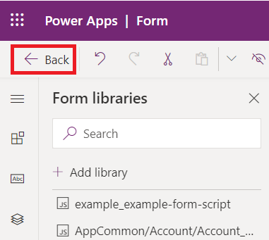
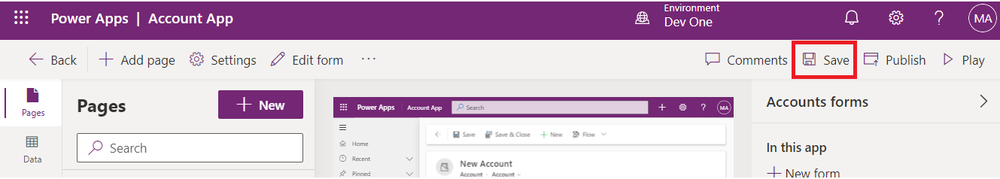

# **Atelier 4 : Écrire votre premier script client pour l'application pilotée par modèle**

**Durée estimée :** 30 min

**Objectif :** Dans cet atelier, vous allez apprendre à écrire un script
client pour l'application pilotée par modèle et à télécharger votre code
en tant que ressource Web. Dans cet atelier, le script client effectue
une recherche insensible à la casse pour Contoso dans le nom du compte
dans le formulaire piloté par modèle et, le cas échéant, définit des
valeurs pour les colonnes websiteurl, telephone1 et description dans le
formulaire de compte.

**Tâche 1 : Créer une solution et une application pilotée par modèle**

1.  Accédez à [Power Apps](https://make.powerapps.com/) à l'aide de
    +++<https://make.powerapps.com/>+++. Assurez-vous que vous êtes dans
    l' environnement **Dev One**.

> 

2.  Dans le volet de navigation de gauche, sélectionnez **Solutions**,
    puis **New solution**.

> 

3.  Dans la boîte de dialogue contextuelle, spécifiez **Display name** –
    +++First Client Script+++, **Name**– +++FirstClientScript+++.

> 

4.  Cliquez sur **New publisher** pour ouvrir la boîte de dialogue **New
    publisher**.

> 

5.  Dans cet atelier, nous allons utiliser un éditeur avec la définition
    suivante, puis sélectionner **Save**.

> **Display Name** – +++Exemple Éditeur+++
>
> **Nom** – +++ExamplePublisher+++
>
> **Préfix** – +++exemple+++
>
> 
>
> Notez la valeur **Préfix**. Il doit s'agir d'un élément qui identifie
> votre entreprise. Dans ce cas, nous utilisons l'exemple.

6.  Vous serez maintenant dans la boîte de dialogue Nouvelle solution.
    Sélectionnez **Example Publisher (ExamplePublisher)** dans la liste
    déroulante du champ Éditeur, puis sélectionnez **Create**.

> 

7.  Pour créer une application pilotée par modèle dans votre solution,
    sélectionnez **New** | **App** | **Model-driven app**.

> 

8.  Donnez le **name** à votre application pilotée par modèle sous la
    forme +++**Account App**+++, puis sélectionnez **Create**.

> 

9.  Dans l'application pilotée par modèle, sélectionnez **+Add page**.

> 

10. Sélectionnez **Dataverse table** dans la fenêtre contextuelle qui
    s'affiche.

> 

11. Sélectionnez **Account**, puis Sélectionnez **Add**.

> 
>
> **Remarque :** Pour cet atelier, nous utilisons la table Compte. Les
> scripts et les instructions ci-dessous attendent les champs trouvés
> dans un formulaire pour la table Compte.

12. Maintenant, votre application pilotée par modèle, nommée
    ‘Application de compte‘, est prête.

> 

13. Sélectionnez **Save** dans le coin supérieur droit.

> 

14. Sélectionnez **Publish**.

> 

15. Cliquez sur **back arrow** pour revenir à la solution.

> 

**Tâche 2 : Écrivez votre code JavaScript**

1.  Les applications pilotées par modèle ne fournissent pas d'éditeur
    JavaScript. Vous devez utiliser un outil de création externe qui
    fournit des fonctionnalités permettant de prendre en charge
    spécifiquement la modification de fichiers JavaScript, tels que
    Notepad++, Visual Studio Code ou Microsoft Visual Studio. Dans cet
    atelier, vous allez utiliser Visual Studio Code.

2.  Accédez au bureau de la machine virtuelle, créez un **new folder**
    et nommez-le ‘ **Client Script Lab’**.

3.  Ouvrez Visual Studio Code sur votre machine virtuelle. Pour
    l'ouvrir, utilisez le raccourci indiqué sur le bureau de la machine
    virtuelle ou cliquez sur **Start** , recherchez, puis sélectionnez
    **Visual Studio Code**.

> 

4.  Sélectionnez l'onglet **File** dans le coin supérieur gauche, puis
    sélectionnez **Open folder**.

> 

5.  Sélectionnez le dossier **Client Script Lab** dans Desktop et
    cliquez sur **Select** **folder**.

> 

6.  Si vous tombez sur la fenêtre contextuelle qui dit ‘**Do you trust
    the authors of the files in this folder?**' puis cliquez sur **‘Yes.
    I trust the authors.**’

> 

7.  Passez la souris sur le dossier **CLIENTSCRIPTLAB** et sélectionnez
    **New file**.

> 

8.  Nommez le fichier +++**Example-form-script.js**+++.

> 

9.  Ajoutez le code JavaScript ci-dessous au au fichier
    **Example-form-script.js**.

> // A namespace defined for the sample code
>
> // As a best practice, you should always define
>
> // a unique namespace for your libraries
>
> var Example = window.Example || {};
>
> (function () {
>
> // Define some global variables
>
> var myUniqueId = "\_myUniqueId"; // Define an ID for the notification
>
> var currentUserName =
> Xrm.Utility.getGlobalContext().userSettings.userName; // get current
> user name
>
> var message = currentUserName + ": Your JavaScript code in action!";
>
> // Code to run in the form OnLoad event
>
> this.formOnLoad = function (executionContext) {
>
> var formContext = executionContext.getFormContext();
>
> // Display the form level notification as an INFO
>
> formContext.ui.setFormNotification(message, "INFO", myUniqueId);
>
> // Wait for 5 seconds before clearing the notification
>
> window.setTimeout(function () {
> formContext.ui.clearFormNotification(myUniqueId); }, 5000);
>
> }
>
> // Code to run in the column OnChange event
>
> this.attributeOnChange = function (executionContext) {
>
> var formContext = executionContext.getFormContext();
>
> // Automatically set some column values if the account name contains
> "Contoso"
>
> var accountName = formContext.getAttribute("name").getValue();
>
> if (accountName.toLowerCase().search("contoso") != -1) {
>
> formContext.getAttribute("websiteurl").setValue("https://www.contoso.com");
>
> formContext.getAttribute("telephone1").setValue("425-555-0100");
>
> formContext.getAttribute("description").setValue("Website URL, Phone
> and Description set using custom script.");
>
> }
>
> }
>
> // Code to run in the form OnSave event
>
> this.formOnSave = function () {
>
> // Display an alert dialog
>
> Xrm.Navigation.openAlertDialog({ text: "Record saved." });
>
> }
>
> }).call(Example);
>
> **Remarque :** Vous pouvez copier ce code dans un fichier texte au
> lieu d'utiliser Visual Studio Code et l'enregistrer sous le nom :
> Example-form-script.js.

10. Sélectionnez l'onglet **File** puis Enregistrer pour **Save** le
    code.

> 

**Tâche 3 : Télécharger votre code en tant que ressource web**

Maintenant que votre code est prêt, vous devez le télécharger dans votre
solution.

1.  Dans votre solution, sélectionnez **+New** | **More** | **Web
    resource**

> 

2.  Dans la boîte de dialogue **New web resource**, cliquez sur **Choose
    file.**

> 

3.  Sélectionnez le fichier **Example-form-script.js**  que vous avez
    enregistré précédemment sur le bureau de la machine virtuelle et
    cliquez sur **Open**.

> 

4.  Tapez le **Display name** – +++Example from script+++, **Name** –
    +++example-form-script+++, assurez-vous que le **type** est
    **JavaScript (JS),** puis sélectionnez **Save**.

> 
>
> ** **
>
> **Note:**

- Notez que le **nom** a un préfixe qui correspond au préfixe de
  personnalisation de l'éditeur de solution. Il existe d'autres façons
  de créer des ressources Web, mais la création d'une ressource Web de
  cette façon garantit que la ressource Web fait partie de votre
  solution.

&nbsp;

- Le nom de la ressource Web est example_example-form-script.

**Tâche 4 : Associer votre ressource web à un formulaire**

1.  Dans votre solution, sélectionnez **Objects** | **Apps**
    | Sélectionnez (ne pas ouvrir) **account app** et cliquez sur
    **Edit**.

> 

2.  Développez **Account** et sélectionnez **Account form**.

> 

3.  Si vous voyez le formulaire d'information et d'autres formulaires.
    Conservez uniquement le formulaire d'information et supprimez les
    autres formulaires. Pour les supprimer, cliquez sur les points de
    suspension (**...**) à droite du formulaire et sélectionnez
    **Remove**.

> **Remarque :** Ne supprimez pas le formulaire d'information.
>
> 

4.  Maintenant, cliquez sur les points de suspension (**...**) à droite
    du formulaire d'**informations** et sélectionnez **Edit**.

> 

5.  Si la fenêtre contextuelle Modifications non enregistrées s'affiche,
    sélectionnez **Save and continue**.

> 

6.  Dans le volet de navigation de gauche, sélectionnez **Form
    Libraries** , puis cliquez sur **Add library**..

> 

7.  Dans la boîte de dialogue **Add JavaScript Library** , recherchez la
    ressource Web JavaScript que vous avez créée par son nom : **Exemple
    de script**. Sélectionnez la ressource Web **Example Script**  et
    cliquez sur **Add**.

> 

**Tâche 5 : Configurer les événements de formulaire et de champ**

1.  Sélectionnez l' onglet **Events**.

> 

2.  Pour **Configure form On Load event** ,sélectionnez Gestionnaire
    d'événements **On load** et cliquez sur **+ Event Handler**.

> 

3.  Assurez-vous que le **Event Type **est ** On Load** et que la
    **example_example-form-script library** est sélectionnée.

> 

4.  Tapez le nom de la fonction dans le champ Fonction. Dans ce cas
    +++**Example.formOnLoad**+++.

> 

5.  Sélectionnez **Pass execution context as first parameter**, puis
    cliquez sur **Done**.

> 

6.  Pour configurer l'événement Formulaire lors de l'enregistrement,
    sélectionnez Gestionnaire d'événements **On Save**  et cliquez sur
    **+ Event Handler**.

> 

7.  Assurez-vous que le **Event Type**  est **On Save** et que
    **example_example-form-script**  est sélectionnée.

> 

8.  Tapez le nom de la fonction dans le champ **Function**. Dans ce cas
    +++**Example.formOnSave**+++.

> 
>
> **Remarque :** Il n'est pas nécessaire de choisir **Pass execution
> context as first parameter** pour cette fonction, car elle ne
> l'utilise pas.

9.  Cliquez sur **Done.**

> 

10. Pour configurer l'événement Champ Lors du changement, sélectionnez
    le champ **Account Name**  et l' onglet **Events**.

> 

11. Sous le gestionnaire d' **événements On Change**  cliquez sur **+
    Event Handler**..

> 

12. Assurez-vous que le **Events type** est **On Change** et que la
    bibliothèque **example_example-form-script**  est sélectionnée.

> 

13. Tapez le nom de la fonction dans le champ **Function**. Dans ce cas,
    **Example.attributeOnChange**.

> 

14. Sélectionnez **Pass execution context as first parameter** Cliquez
    sur **Done.**

> 

15. Cliquez sur **Save** **and Publish**.

> 

16. Sélectionnez **Back**.

> 

17. Vous serez dans l'application de votre compte. Sélectionnez
    **Save**.

> 

18. Sélectionnez **Publish**.

> 

19. Attendez que l'application soit publiée, puis cliquez sur **Back**.

> 

**Tâche 6 : Tester votre code**

Il est recommandé d'actualiser votre navigateur pour que les
modifications prennent effet dans votre instance d'applications pilotées
par modèle.

Pour tester votre code :

1.  Accédez à Power Apps à l'aide de
    +++<https://make.powerapps.com/>+++. Assurez-vous que vous êtes dans
    l' environnement **Dev One**.

> 

2.  Dans la zone de navigation de gauche, sélectionnez **Apps**.

> 

3.  Double-cliquez sur l'application pilotée par modèle (**Account App**
    que vous venez de modifier ou sélectionnez-la et cliquez sur
    **Play**.

> 

4.  Pour tester la fonction de formulaire En Chargement, cliquez sur
    n'importe quel enregistrement de compte dans la liste pour l'ouvrir.
    Par exemple, cliquez sur **A. Datum Corporation (sample).**

> 

5.  Vérifiez que la notification s'affiche.

> 

6.  Vérifiez que la notification disparaît au bout de 5 secondes.

7.  Pour tester la fonction de champ Lors du changement, sélectionnez
    **Maison de ski alpin (exemple)** dans la liste Nom du compte.

> 

8.  Observez les valeurs des colonnes **Main Phone**, **Website**, et
    **Description,** puis modifiez le nom du compte pour inclure «
    Contoso » dans le nom, puis passez à la colonne suivante en appuyant
    sur TAB.

> 

9.  Vérifiez les valeurs attendues définies sur les **Main
    Phone**, **Website**, et colonnes **Description**.

> 

10. Pour tester la fonction de formulaire Lors de l'enregistrement.
    Cliquez sur **Save** dans le compte Contoso Alpine Ski House
    (exemple) récemment modifié.

> 

11. Vérifiez que la boîte de dialogue d'alerte avec un message que vous
    avez configuré dans votre code. Cliquez sur **OK** pour fermer
    l'alerte.

> 

**Résumé :** Dans cet atelier, vous avez appris à écrire du code
JavaScript, à le charger en tant que ressource web et à l'associer à un
formulaire dans une application pilotée par modèle pour effectuer une
recherche insensible à la casse pour Contoso et, le cas échéant, définir
des valeurs pour les colonnes websiteurl, telephone1 et description dans
le formulaire de compte.
