# **Lab 4: Use client script to hide a form section in model-driven app using Visual Studio Code**

**Estimated Duration:** 30 min

**Objective:** In this lab, you will learn how to write client script
for the model-driven app and how to upload your code as a web resource.
In this lab, client script will perform a case-insensitive search
for Contoso in the account name in the model-driven form, and if
present, set values for the websiteurl, telephone1,
and description columns in the account form.

### **Task 1: Create a new solution and a model-driven app**

1.  Navigate to Power Apps using
    +++**https://make.powerapps.com/**+++. Make sure you are in **Dev
    One** environment.

     

3.  In the left navigation pane, select **Solutions** and then
    select **New solution**.

     

3.  In the fly-out dialog, specify **Display name** – +++First Client
    Script+++, **Name** – +++FirstClientScript+++.

     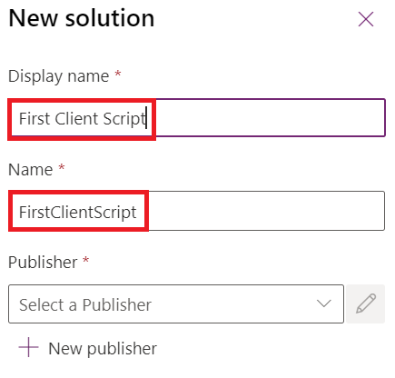

4.  Click **New Publisher** to open the **New Publisher** dialog.

     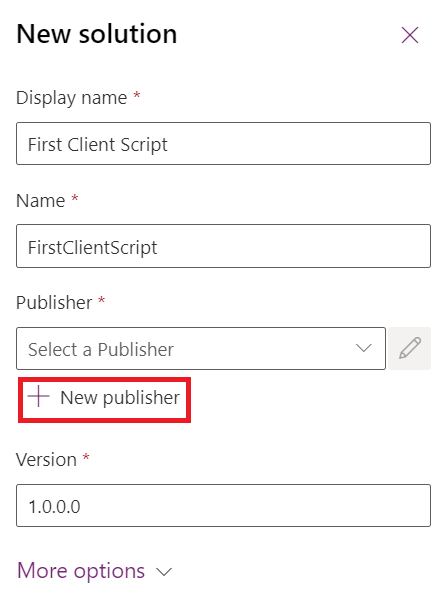

5.  In this lab, we will use a publisher with the following definition
    and then select **Save**.

     **Display Name** – +++Example Publisher+++
    
     **Name** – +++ExamplePublisher+++
    
     **Prefix** – +++example+++

     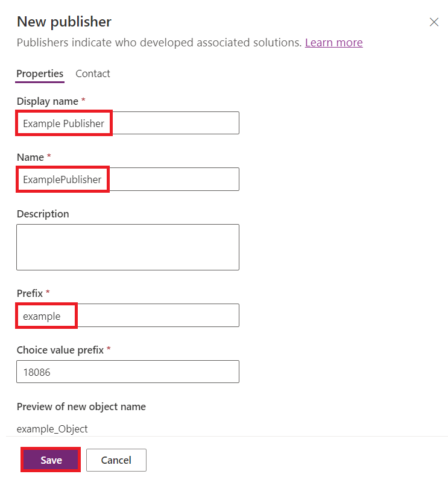

     Notice the **Prefix** value. This should be something that identifies your company. In this case, we are using example.

6.  You will be now on New solution dialog. Select **Example Publisher
    (ExamplePublisher)** from the dropdown of Publisher field and then
    select **Create**.

     

7.  To create a new model-driven app in your solution,
    select **New** | **App** | **Model-driven app**.

     

8.  Give the **name** to your model -driven app as +++**Account App**+++
    and then select **Create**.

     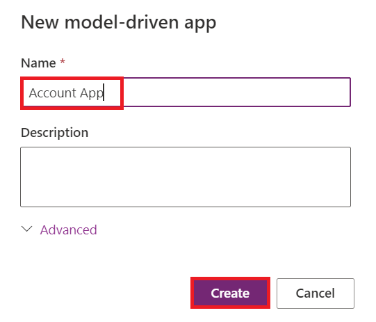

9.  In the model driven app, select **+Add page**.

     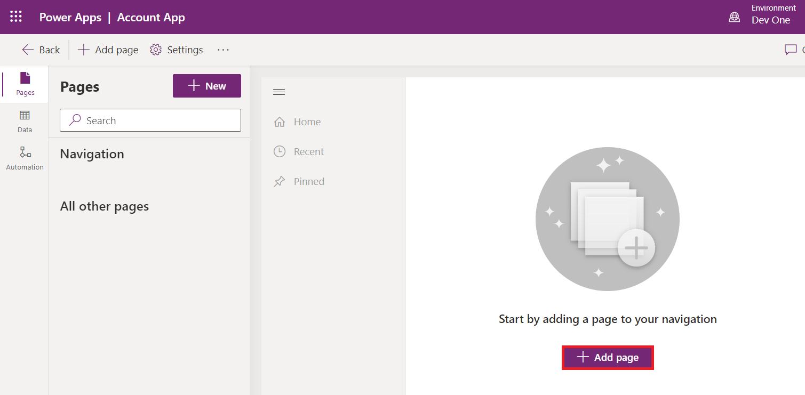

10. Select **Dataverse table** on the pop-up that appears.

     

11. Select **Account** table and then select **Add**.

     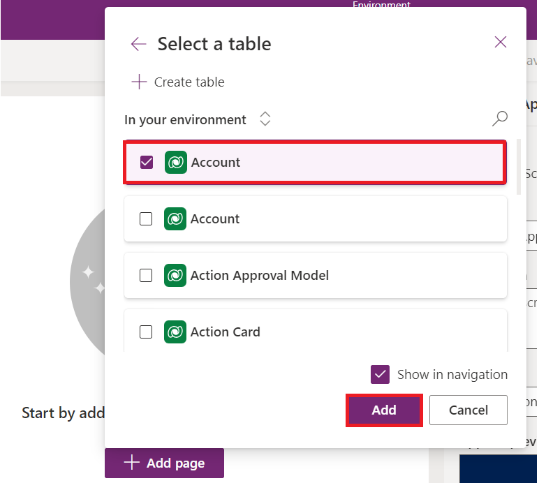

     **Note:** For this lab, we are using Account table. The scripts and instructions below expects fields found in a form for the Account table.

12. Now, your model-driven app which is named ‘Account App’ is ready.

     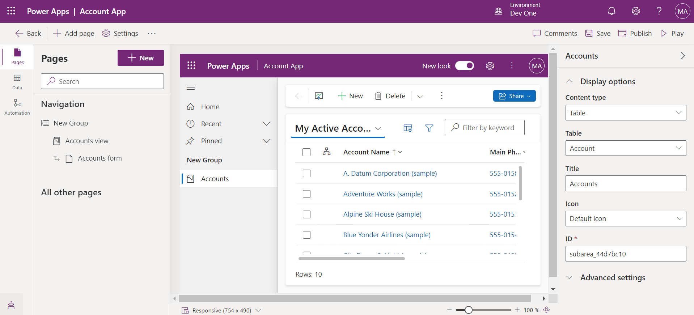

13. Select **Save** from the upper right corner.

     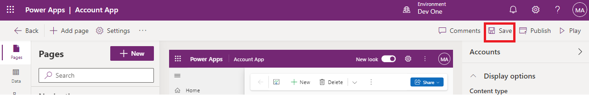

14. Select **Publish**.

     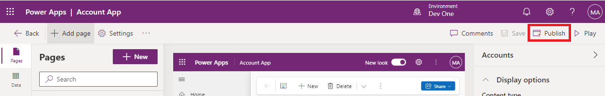

15. Click on **back arrow** to come back to the solution.

     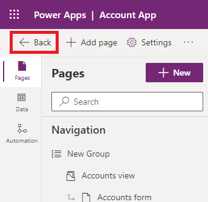

### **Task 2: Write your JavaScript code**

1.  Model-driven apps do not provide a JavaScript editor. You need to
    use an external authoring tool that provides features to
    specifically support editing JavaScript files, such as Notepad++,
    Visual Studio Code, or Microsoft Visual Studio. In this lab, you
    will use Visual Studio Code.

2.  Go to the VM’s Desktop, create a **new folder** and name it as
    ‘**Client Script Lab**’.

3.  Open Visual Studio Code on your VM. To open that, use the given
    shortcut on VM’s Desktop or click on **Start** menu, search and then
    select **Visual Studio Code**.

     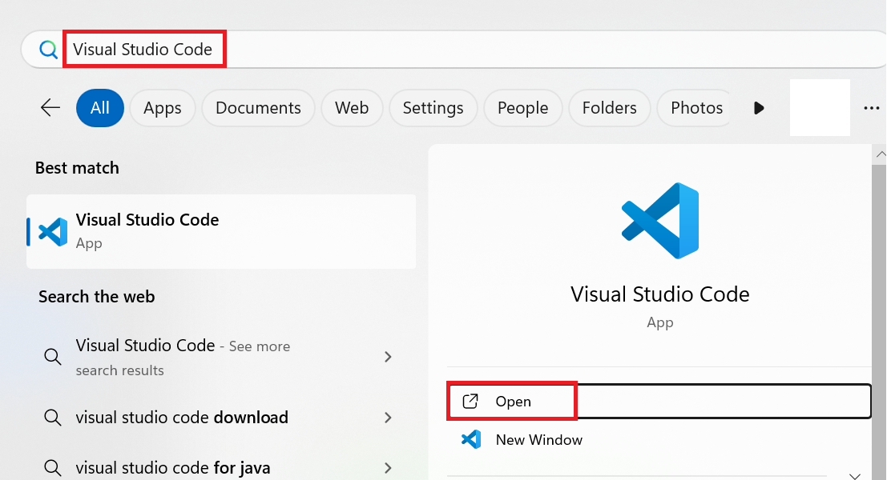

4.  Select **File** tab from the upper left corner and then select
    **Open Folder**.

     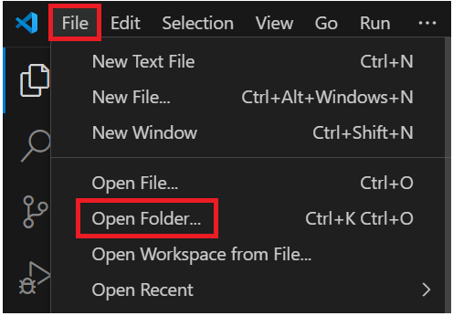

5.  Select the **Client Script Lab** folder from Desktop and click on
    **Select folder**.

     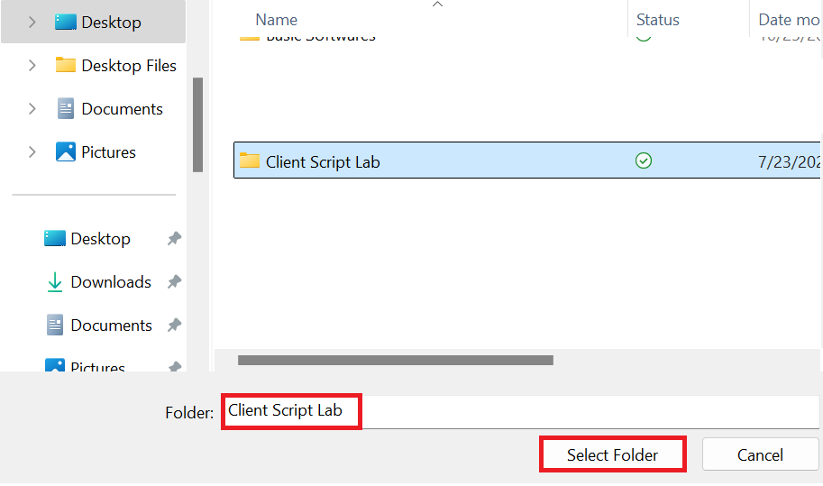

6.  If you come across the pop-up that says, ‘**Do you trust the authors
    of the files in this folder?**’ then click on ‘**Yes. I trust the
    authors**’.

     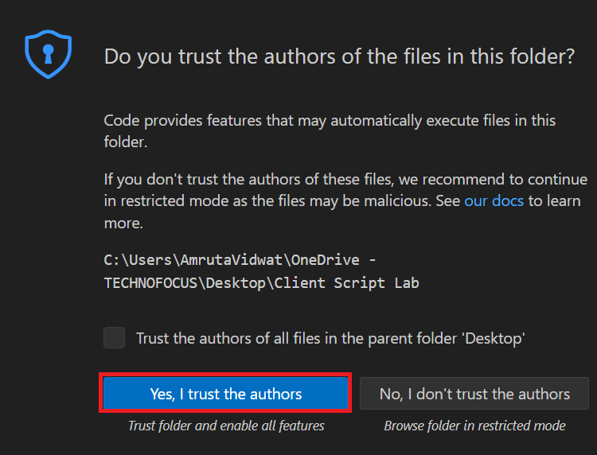

7.  Hover the mouse over **CLIENTSCRIPTLAB** folder and select **New
    File**.

     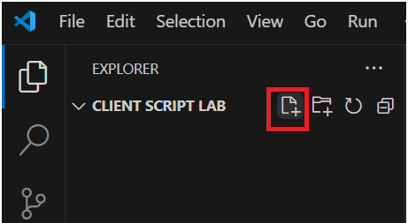

8.  Name the file +++**Example-form-script.js**+++.

     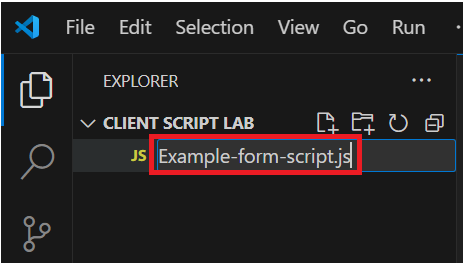

9.  Add the below JavaScript code to the **Example-form-script.js**
    file.

> ```
> // A namespace defined for the sample code
>
> // As a best practice, you should always define
>
> // a unique namespace for your libraries
>
> var Example = window.Example || {};
>
> (function () {
>
> // Define some global variables
>
> var myUniqueId = "\_myUniqueId"; // Define an ID for the notification
>
> var currentUserName =
> Xrm.Utility.getGlobalContext().userSettings.userName; // get current
> user name
>
> var message = currentUserName + ": Your JavaScript code in action!";
>
> // Code to run in the form OnLoad event
>
> this.formOnLoad = function (executionContext) {
>
> var formContext = executionContext.getFormContext();
>
> // Display the form level notification as an INFO
>
> formContext.ui.setFormNotification(message, "INFO", myUniqueId);
>
> // Wait for 5 seconds before clearing the notification
>
> window.setTimeout(function () {
> formContext.ui.clearFormNotification(myUniqueId); }, 5000);
>
> }
>
> // Code to run in the column OnChange event
>
> this.attributeOnChange = function (executionContext) {
>
> var formContext = executionContext.getFormContext();
>
> // Automatically set some column values if the account name contains
> "Contoso"
>
> var accountName = formContext.getAttribute("name").getValue();
>
> if (accountName.toLowerCase().search("contoso") != -1) {
>
> formContext.getAttribute("websiteurl").setValue("https://www.contoso.com");
>
> formContext.getAttribute("telephone1").setValue("425-555-0100");
>
> formContext.getAttribute("description").setValue("Website URL, Phone
> and Description set using custom script.");
>
> }
>
> }
>
> // Code to run in the form OnSave event
>
> this.formOnSave = function () {
>
> // Display an alert dialog
>
> Xrm.Navigation.openAlertDialog({ text: "Record saved." });
>
> }
>
> }).call(Example);
> ```

     **Note:** You can copy this code into a text file instead of using Visual Studio Code and save it with the name: Example-form-script.js.

10. Select **File** tab and then select **Save** to save the code.

     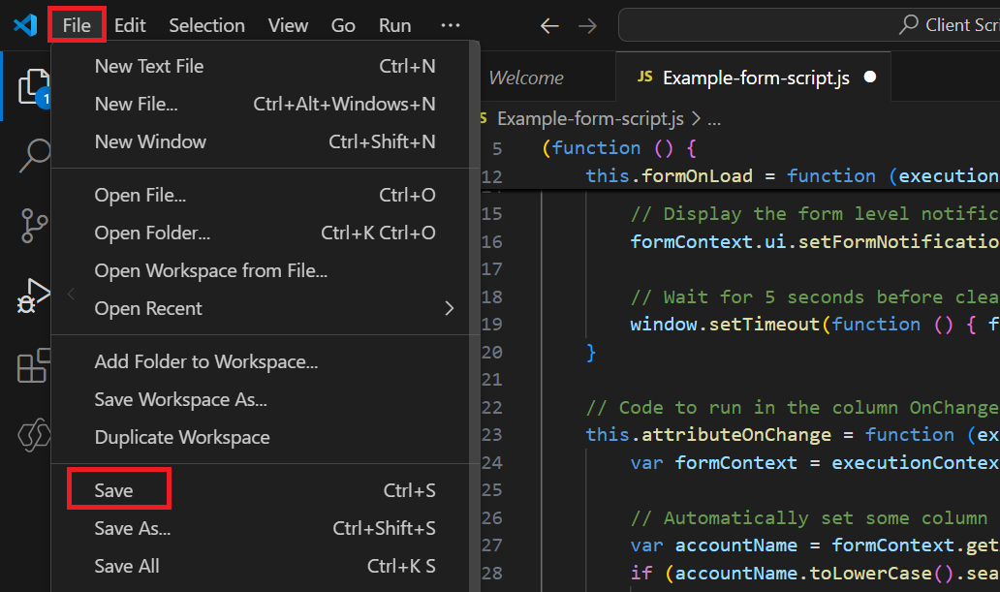

### **Task 3: Upload your code as a web resource**

Now that your code is ready, you need to upload it into your solution.

1.  In your solution select **+New** | **More** | **Web resource.**

     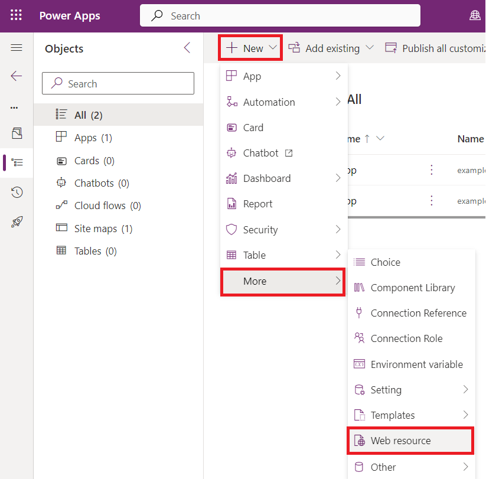

2.  In the **New web resource** dialog, click **Choose file.** 

     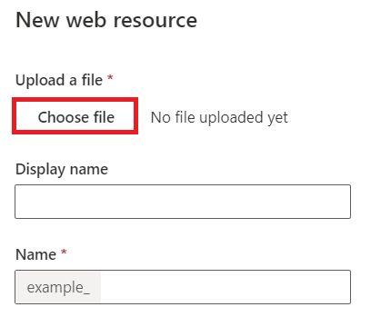

3.  Select the **Example-form-script.js** file you saved earlier on VM’s
    Desktop and click on **Open**.

     

4.  Type in the **Display name** – +++Example Script+++, **Name** –
    +++example-form-script+++, make sure the **Type** is **JavaScript
    (JS)** and then select **Save**.

     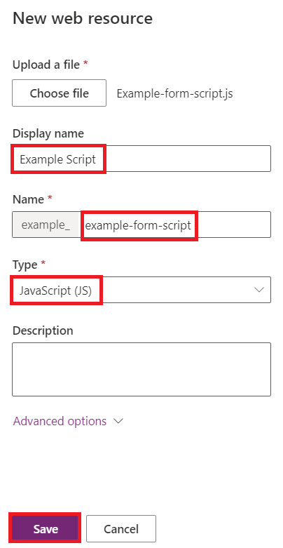

     ** **
    
    **Note:** - Notice how the **Name** has a prefix that matches the solution
      publisher customization prefix. There are other ways to create web
      resources, but creating a web resource this way ensures that the Web
      Resource is part of your solution.
    
    - The name of the web resource is **example_example-form-script**.

### **Task 4: Associate your web resource to a form**

1.  In your solution, select **Objects** | **Apps** | Select (not to
    open) **Account App** and click **Edit**.

     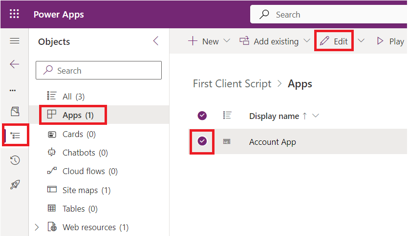

2.  Expand **Account** and select the **Account form**.

     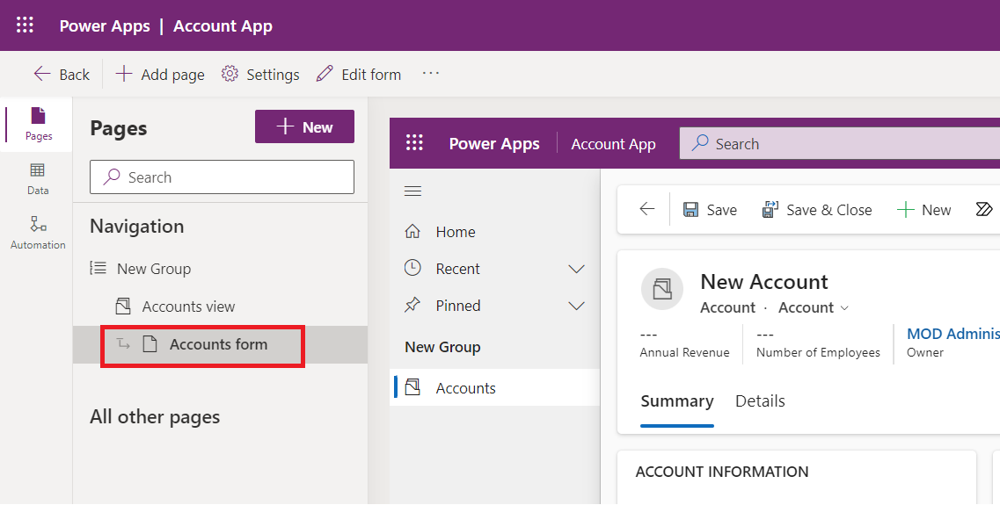

3.  If you see information form and other forms. Keep the information
    form only and remove other forms. To remove them, click the ellipses
    (**...**) to the right of the form and select **Remove**.

     **Note:** Do not remove information form.

     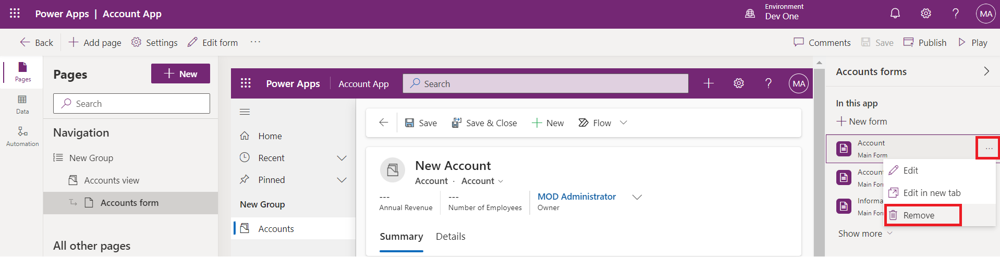

4.  Now, click the ellipses (**...**) to the right of
    the **Information** form and select **Edit**.

     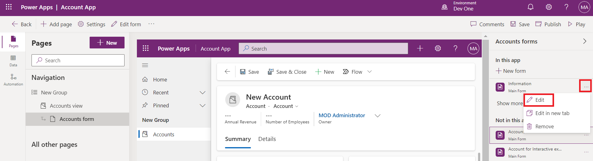

5.  If Unsaved changes pop-up appears, select **Save and continue**.

     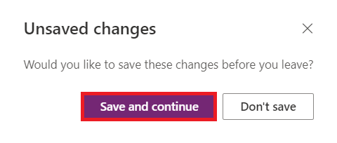

6.  In the left navigation, select **Form Libraries** and click **Add
    library**.

     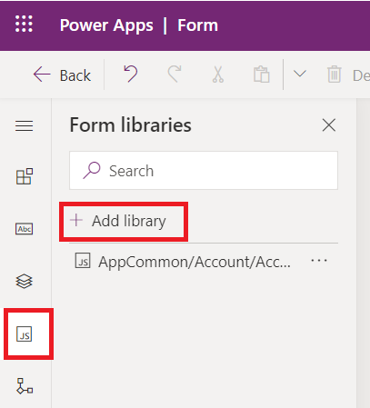

7.  In the **Add JavaScript Library** dialog, search for the JavaScript
    web resource you created by name: **Example Script**. Select
    the **Example Script** web resource and click **Add**.

     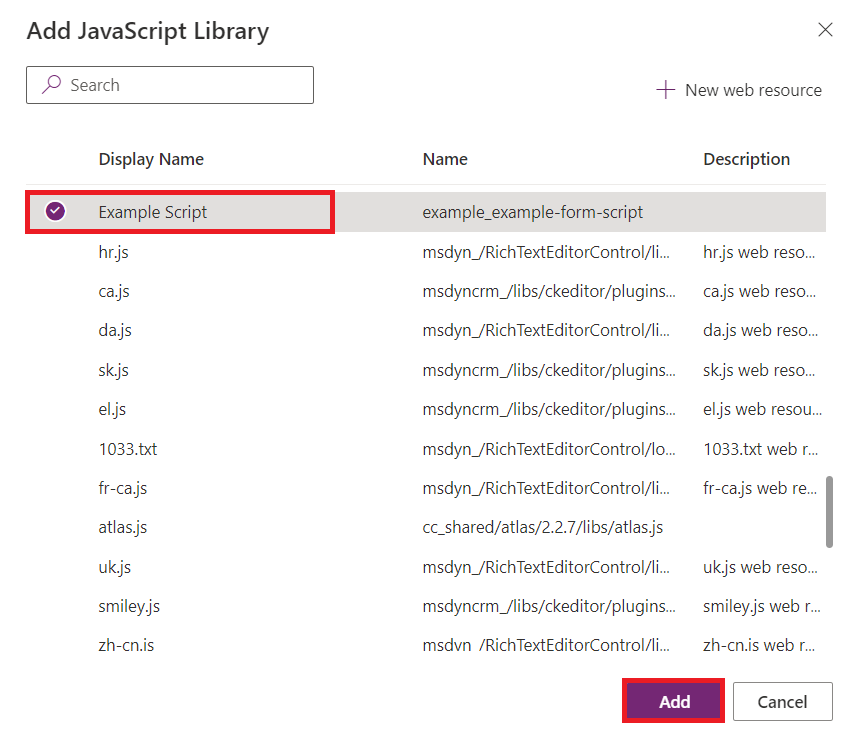

### **Task 5: Configure form and field events**

1.  Select the **Events** tab.

     

2.  To **Configure form On Load event**, select **On Load** event
    handler and click **+ Event Handler**.

     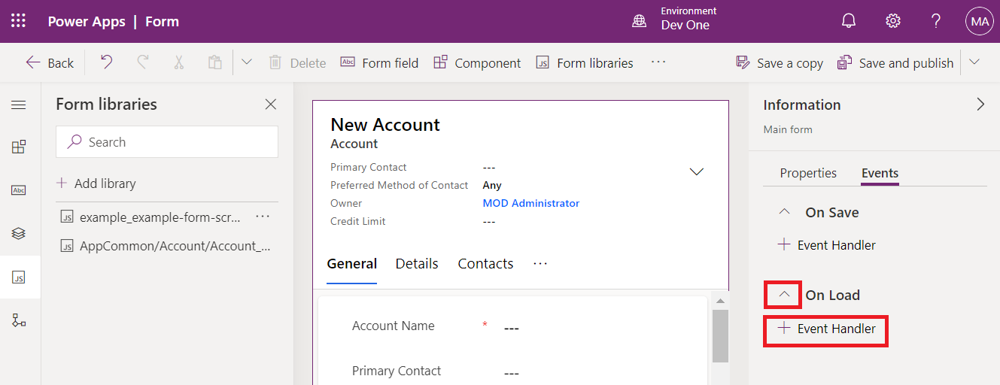

3.  Make sure that, the** Event Type **is** On Load** and
    the** example_example-form-script library** is selected.

     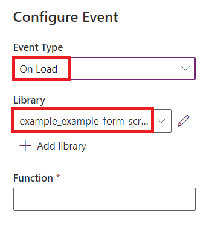

4.  Type the name of the function in the Function field. In this
    case +++**Example.formOnLoad**+++.

     

5.  Select **Pass execution context as first parameter** and then
    click **Done**.

     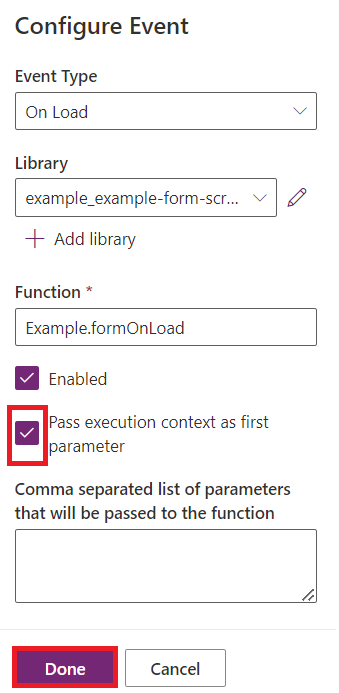

6.  To configure Form On Save event, select **On Save** event handler
    and click **+Event Handler**.

     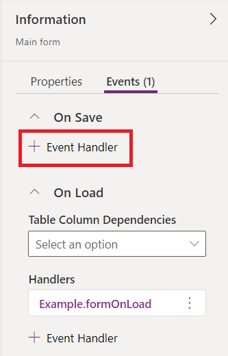

7.  Make sure that the **Event Type** is **On Save** and
    the **example_example-form-script** library is selected.

     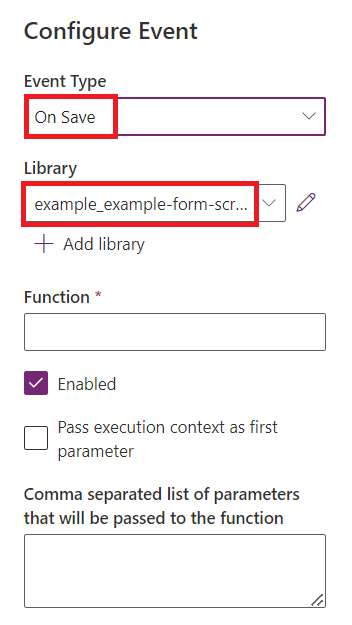

8.  Type the name of the function in the **Function** field. In this
    case +++**Example.formOnSave**+++.

     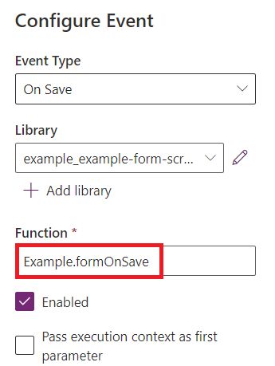

     **Note:** It is not necessary to elect **Pass execution context as first parameter** for this function because it doesn't use it.

9.  Click **Done.**

     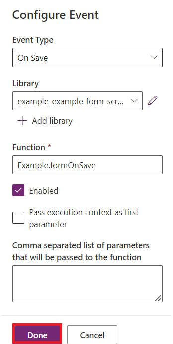

10. To Configure Field On Change event, select the **Account
    Name** field and the **Events** tab.

     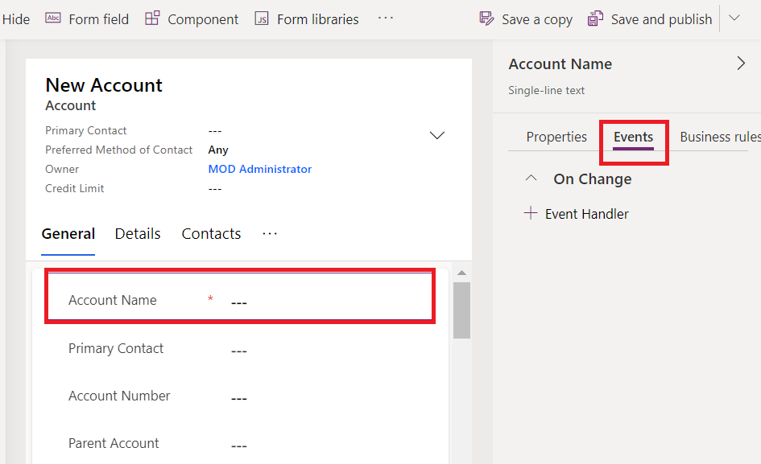

11. Under the **On Change** event handler, click **+ Event Handler**.

     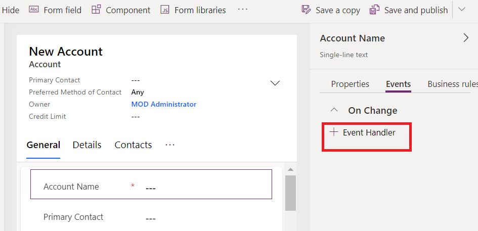

12. Make sure that the **Event Type** is **On Change** and
    the **example_example-form-script** library is selected.

     

13. Type the name of the function in the **Function** field. In this
    case +++**Example.attributeOnChange**+++.

     

14. Select **Pass execution context as first parameter**.
    Click **Done.**

     

15. Click on **Save** **and Publish**.

     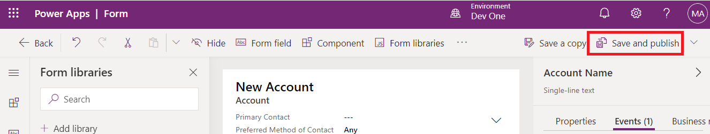

16. Select **Back**.

     

17. You will be in your Account App. Select **Save**.

     

18. Select **Publish**.

     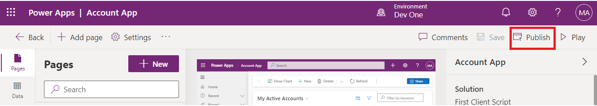

19. Wait till app gets published and then click on **Back**.

     

### **Task 6: Test your code**

It is recommended that you refresh your browser for the changes to take
effect in your model-driven apps instance.

To test your code:

1.  Navigate to Power Apps using +++**https://make.powerapps.com/**+++.
    Make sure you are in **Dev One** environment.

     

2.  In the left navigation area select **Apps**.

     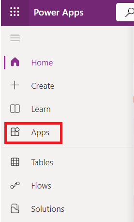

3.  Double-click the model-driven app – **Account App** you just edited
    or select it and click **Play**.

     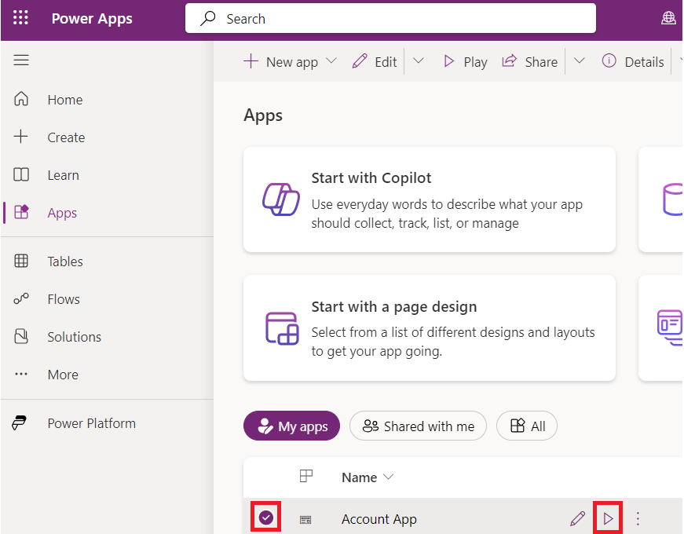

4.  To test form On Load function, click on any account record in the
    list to open it. For example, click on **A. Datum Corporation
    (Sample)**.

     

5.  Verify that the notification appears.

     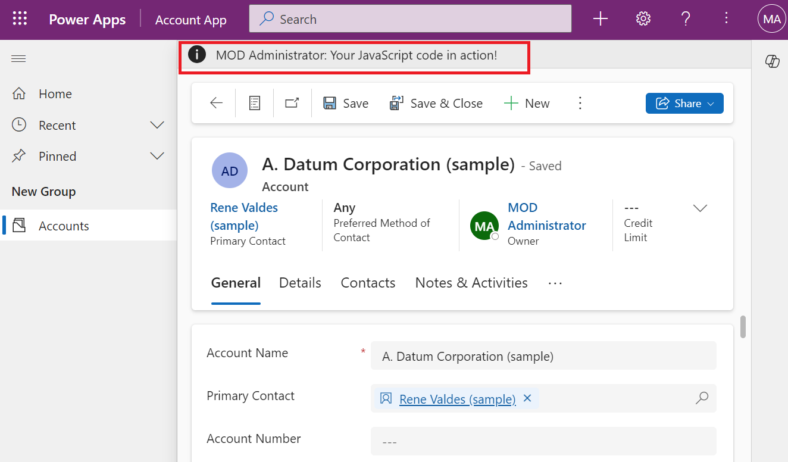

6.  Verify the notification disappears in 5 seconds.

7.  To test field On Change function, select **Alpine Ski House
    (sample)** from the Account Name list.

     

8.  Observe the values for **Main Phone**, **Website**,
    and **Description** columns and edit the Account Name to include
    "Contoso" in the name and move to the next column by pressing TAB.

     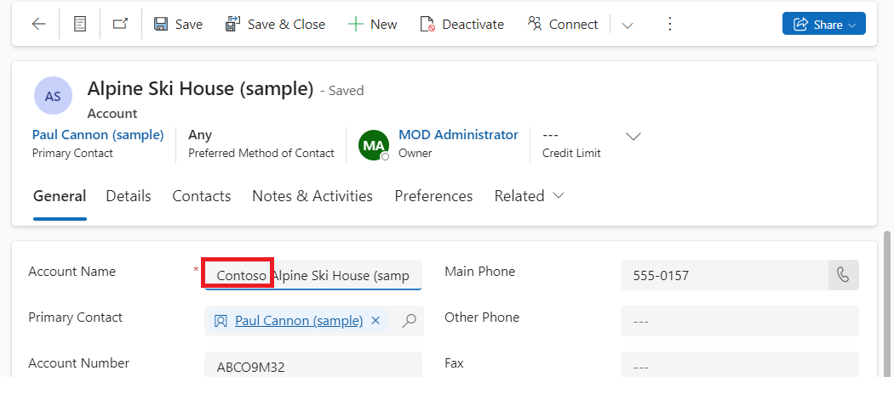

9.  Verify the expected values set to the **Main Phone**, **Website**,
    and **Description** columns.

     

10. To test form On Save function. Click **Save** on the newly edited
    Contoso Alpine Ski House (Sample) account.

     

11. Verify that the alert dialog with a message that you configured in
    your code. Click **OK** to close the alert.

     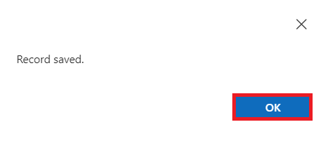

**Summary:** In this lab, you have learnt how to write JavaScript code,
to upload it as web resource and to associate it to a form in
model-driven app to perform a search case-insensitive search
for Contoso and if present, sets values for the websiteurl, telephone1,
and description columns in the account form.
