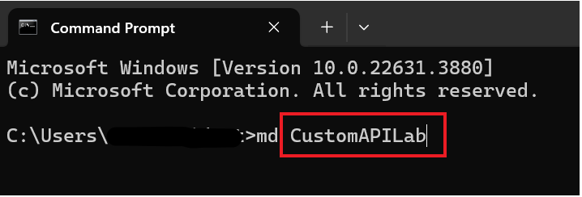
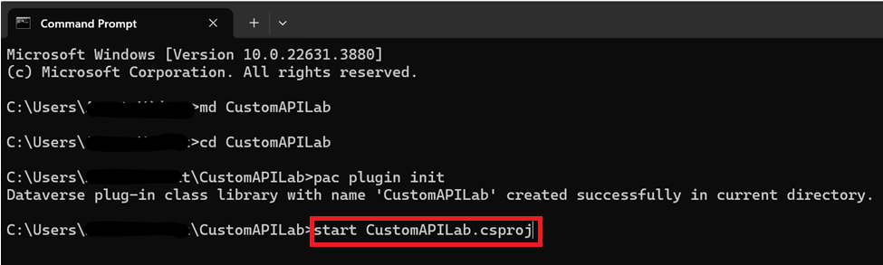
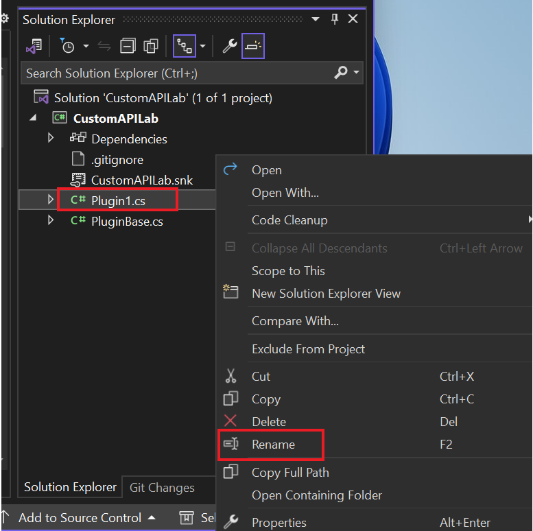
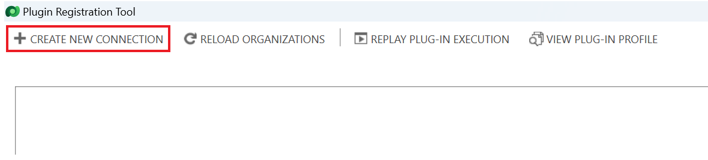
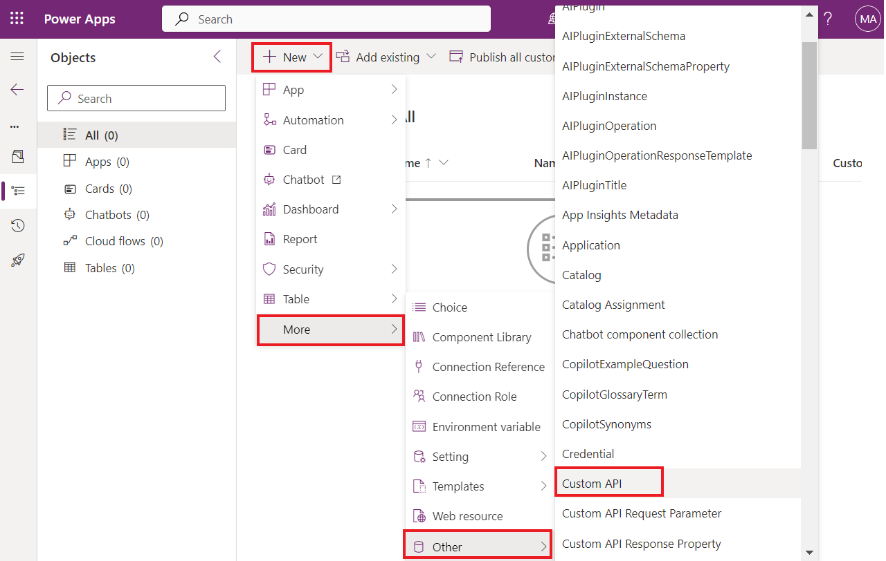
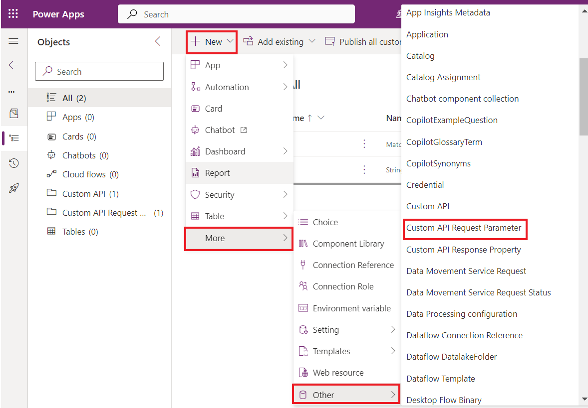

**실습 5: 사용자 지정 API를 생성하기**

**예상 소요 시간:** 35분

**목표:** 이 실습에서는 Dataverse 사용자 지정 API를 빌드하여 몇 가지
사용자 지정 논리를 실행하는 방법을 배울 것입니다. Power Automate
플로우의 단계에서 사용자 지정 API를 사용할 것입니다.

**작업 1: 사용자 지정 API 프로젝트를 생성하기**

1.  VM의 **Start** 메뉴를 클릭하고 검색 상자에 Command Prompt를 입력하고
    **Open**을 선택하세요.

> 

2.  **CustomAPILab**이라는 새 폴더를 생성하려면 다음 명령을 실행하세요.

> +++md CustomAPILab+++
>
> 

3.  디렉토리를 생성한 폴더로 변경하세요.

> +++cd CustomAPILab+++
>
> 

4.  이제 CustomAPIlAB 폴더에 있어야 합니다. 새 Dataverse 플러그인 클래스
    라이브러리를 초기화하려면 다음 명령을 실행하세요.

> +++pac plugin init+++
>
> 

5.  Dataverse 플러그인 클래스 라이브러리 생성이 성공해야 합니다.

> 

6.  Visual Studio의 프로젝트를 열려면 다음 명령을 실행하세요.

> +++start CustomAPILab.csproj+++
>
> 

7.  메시지가 표시되면 **Microsoft Visual Studio 2022**를 선택한 후
    **Just once**를 선택하세요.

> 

8.  Sign in to Visual Studio라는 메시지가 표시되는 경우 **Skip this for
    now**를 선택하세요.

> 

9.  Development settings을 **General**로 선택하고 color theme을
    **Dark**로 선택하고 **Start Visual Studio**를 선택하세요.

> **참고:** 프로젝트로 직접 이동하는 경으 이 단계를 무시하세요.
>
> 

10. Visual Studio에 프로젝트가 열립니다.

> 

11. Plugin1.cs 파일을 마우스 오른쪽 버튼으로 클릭하고 이름을
    **MatchPlugin.cs**로 바꾸세요.

> 

12. 파일 대화 상자의 이름을 바꾸려면 **Yes **를 선택하세요.

> 

13. CustomAPILab Project를 마우스 오른쪽 버튼을 클릭하고 **Manage NuGet
    Packages**를 선택하세요.

> 

14. **System.Text.RegularExpressions**를 검색하고 **Install**를
    선택하세요.

> 

15. Preview changes 창에서 Visual Studio에서 솔루션을 변경하기 위해
    **Apply**를 선택하세요.

> 

16. 사용 조건에 동의하려면 **I Accept**를 선택하세요.

> 

17. **MatchPlugin.cs** 파일을 여세요.

> 

18. 'using System;' 문 아래에 다음 문, 즉 3번 줄에 다음 문을 추가하세요.

> +++using System.Text.RegularExpressions;+++
>
> 

19. ExecuteDataversePlugin 메서드 내부와 var 컨텍스트 줄 뒤에 다음 줄을
    추가하세요. 이러한 줄은 사용자 지정 API 호출에 전달된 입력 매개
    변수에서 값을 가져옵니다.

> string input = (string)context.InputParameters\["StringIn"\];
>
> string pattern = (string)context.InputParameters\["Pattern"\];
>
> 

20. 추적 서비스를 가져오려면 뒤에 다음 줄을 추가하세요.

> ITracingService tracingService =
> (ITracingService)localPluginContext.ServiceProvider.GetService(typeof(ITracingService));
>
> 

21. 입력 값을 trace에 쓰려면 아래 줄을 추가하세요.

> tracingService.Trace("Provided input: " + input);
>
> 

22. Regex.Match 방법을 호출하려면 다음 줄을 추가하세요.

> var result = Regex.Match(input, pattern);
>
> 

23. 추적할 결과를 쓰세요.

> tracingService.Trace("Matching result: " + result.Success);
>
> 

24. 마지막으로 출력 매개 변수 Matched를 설정하려면 다음 줄을 추가하세요.

> context.OutputParameters\["Matched"\] = result.Success;
>
> 

25. 이제 실행 방법은 다음과 같습니다.

> 

26. **Build | Build Solution**을 선택하세요.

> 

27. 프로젝트가 성공적으로 빌드되어야 합니다.

> 

**작업 2: 사용자 지정 API 플러그인을 등록하기**

1.  Plugin Registration Tool을 시작하려면 command prompt를 열고 아래
    명령을 실행하세요.

> +++pac tool prt+++
>
> 

2.  **+ Create New Connection**을 선택하세요.

> 

3.  **Office 365**를 선택하고 자격 증명을 제공하고 **Login**을
    선택하세요.

> 

4.  **M365 Admin tenant Id**로 로그인하고 **Next**를 선택하세요.

> 

5.  **M365 Admin tenant Id’s** **password**를 입력하고 **Sign in**을
    선택하세요.

> 

6.  **Dev One** 환경이 선택되어 있는지 확인하세요.

7.  **Register | Register New Assembly**를 선택하세요.

> 

8.  1단계의 …를 선택하고 **CustomAPILab\bin\Debug\net462** 폴더로
    이동하세요.

> 

9.  **CustomAPILab.dll**를 선택하고 **Open**을 선택하세요.

> 

10. **Register Selected Plugins**를 선택하세요.

> 

11. 성공 메시지에서 **OK **을 선택하세요. 플러그인은 다음 작업에서
    생성한 상용자 지정 API에 연결할 준비가 되었습니다.

> 

**작업 3: 사용자 지정 API를 생성하기**

1.  +++ <https://make.powerapps.com/>+++를 사용하여 Power Apps 제작자
    포털로 이동하고 **Dev One** 환경에 있는지 확인하세요.

2.  왼쪽 탐색에서 **Solutions**를 선택하세요. **+ New Solution**을
    선택하세요.

> 

3.  Display Name에 +++**Custom API Lab**+++를 입력하세요.

4.  Publisher 드롭다운에서 **CDS Default Publisher**를 선택하세요.

5.  **Create**를 선택하세요. 이렇게 하면 구성 요소를 포함한 사용자 지정
    솔루션이 생성해집니다

> 

6.  **+ New | More | Other | Custom API**를 선택하세요.

> 

7.  다음 정보를 입력하세요:

    - **Unique Name:** +++contoso_match+++

    &nbsp;

    - **Name**: +++Match+++

    &nbsp;

    - **Display Name:** +++Match+++

    &nbsp;

    - **Description**: +++Match a string+++

    &nbsp;

    - **Binding Type**: +++Global+++

> 

8.  In Plugin Type에 검색 아이콘을 선택하고 플러그인
    **CustomAPILab.MatchPlugin**을 찾으세요.

> 

9.  **Save and Close**를 선택하세요.

> 

10. **Done**을 선택하세요.

> 

11. **+** **New | More| Other | Custom API Request Parameter**를
    선택하세요.

> 

12. **Custom API**에 대한 **Search** 아이콘을 선택하고 **Match** (사용자
    지정 API)를 선택하세요.

> 

13. 단순화를 위해 Unique Name, Name, Display Name 및 Description에 대한
    +++**StringIn**+++를 입력하세요.

> 

14. Type에 대한 **String**를 선택하세요

> 

15. **Save and Close**를 선택하세요.

> 

16. **Done**을 선택하세요.

> 

17. Custom API Request Parameter를 추가하려면 **+** **New | More| Other
    | Custom API Request Parameter**를 선택하세요.

> 

18. **Custom API**에 대한 **Search** 아이콘을 선택하고 **Match** (사용자
    지정 API)를 선택하세요.

> 

19. 단순화를 위해 Unique Name, Name, Display Name 및 Description에 대한
    **Pattern** 을 입력하세요.

> 

20. Type에 대한 **String**을 선택하세요.

> 

21. **Save and Close**를 선택하세요.

> 

22. **Done**을 선택하세요.

> 

23. **New | More | Other| Custom API Response Property**를 선택하세요.

> 

24. **Custom API**에 대한 **Search** 아이콘을 선택하고 **Match** (사용자
    지정 API)를 선택하세요.

> 

25. 단순화를 위해 **Unique Name**, **Name, Display
    Name** 및 **Description**에 대한 +++**Matched**+++를 입력하세요.

26. **Type**에 대한 **Boolean**를 선택하세요.

> 

27. **Save and Close**를 선택하세요.

> 

28. **Done**을 선택하세요.

> 

29. 솔루션 구성 요소 목록은 다음과 같습니다.

> 

**작업 4: Power Automate에서 사용자 지정 API를 사용하기**

1.  솔루션에서 **+ New | Automation | Cloud Flow | Instant**을
    선택하세요.

> 

2.  Flow name에 대한 +++**String match**+++를 입력하고 **Manually
    trigger a flow** 트리거를 선택하고 **Create**를 선택하세요.

> 

3.  **+ New Step**을 선택하세요.

> 

4.  Perform을 검색하고 **Perform an unbound action**을 선택하세요.

> 

5.  Action Name 목록에서 **contoso_match**를 찾아 선택하세요.

> 

6.  **StringIn**에서 **myemail@outlook.com** 이메일 주소를 입력하세요.
    여기에 유효한 간단한 이메일 주소를 입력할 수 있습니다.

> 

7.  Pattern에 다음 정규식을 입력합니다. 이것은 간단한 이메일 패턴입니다.
    다른 [*examples*](https://regexlib.com/DisplayPatterns.aspx/)가
    있습니다.

> +++^\w+@\[a-zA-Z\_\]+?\\\[a-zA-Z\]{2,3}$+++
>
> 

8.  플로우는 다음과 같습니다.

> 

9.  **Save**를 선택하세요.

> 

10. 저장이 완료되면 **Test**를 선택하세요.

> 

11. **Manually**를 선택하고 **Test**를 선택하세요.

> 

12. **Run flow**를 선택하세요.

> 

13. **Done**를 선택하세요.

> 

14. 플로우가 완료되면 **Perform an unbound action**을 선택하여 확장하고
    결과를 확인하세요.

> 
>
> 

**요약:** 이 실습에서는 사용자 지정 작업을 빌드하고 Power Automate
플로우에서 사용하는 방법을 배웠습니다. 이제 사용자 지정 API 작업
contoso_match 플랫폼 API를 사용하여 직접 후출할 수도 있습니다
