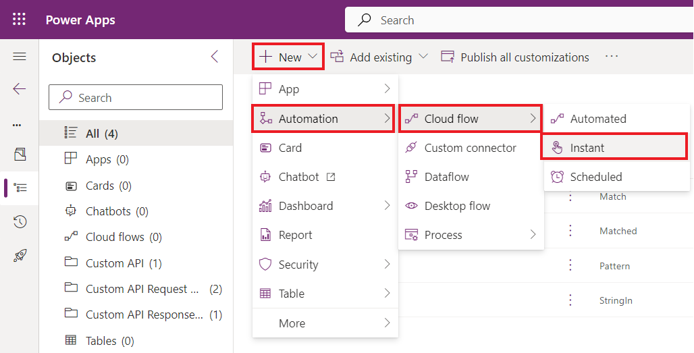

**Lab 5: Erstellen einer benutzerdefinierten API**

**Geschätzte Dauer:** 35 Minuten

**Ziele:** In diesem Lab werden Sie lernen, eine benutzerdefinierte
Dataverse-API zu erstellen, um eine benutzerdefinierte Logik
auszuführen. Anschließend werden Sie die benutzerdefinierte API von
einem Schritt in einem Power Automate-Ablauf aus verwenden.

**Aufgabe 1: Erstellen des benutzerdefinierten API-Projekts**

1.  Klicken Sie auf das **Start** menü der VM, geben Sie Command Prompt
    in das Suchfeld ein und wählen Sie dann **Open** aus.

> 

2.  Führen Sie den folgenden Befehl aus, um einen neuen Ordner mit dem
    Namen **CustomAPILab** zu erstellen.

> +++md CustomAPILab+++
>
> 

3.  Wechseln Sie das Verzeichnis in den erstellten Ordner.

> +++cd CustomAPILab+++
>
> 

4.  Sie sollten sich jetzt im Ordner CustomAPIlAB befinden. Führen Sie
    den folgenden Befehl aus, um eine neue Dataverse plugin class
    library zu initialisieren.

> +++pac plugin init+++
>
> 

5.  Die Erstellung von Dataverse plugin class library sollte erfolgreich
    sein.

> 

6.  Führen Sie den folgenden Befehl aus, um das Projekt in Visual Studio
    zu öffnen.

> +++start CustomAPILab.csproj+++
>
> 

7.  Wenn Sie dazu aufgefordert werden, wählen Sie **Microsoft Visual
    Studio 2022** und wählen Sie dann **Just once**.

> 

8.  Wenn Sie aufgefordert werden, sich bei Visual Studio anzumelden,
    wählen Sie auf der Anmeldeseite **Skip this for now** aus.

> 

9.  Wählen Sie **General** als Development settings, wählen Sie **Dark**
    als color theme und wählen Sie dann **Start Visual Studio** aus.

> **Notiz:** Ignorieren Sie diesen Schritt, wenn Sie direkt zum Projekt
> navigiert werden.
>
> 

10. Das Projekt sollte in Visual Studio geöffnet werden.

> 

11. Klicken Sie mit der rechten Maustaste auf die Datei Plugin1.cs und
    benennen Sie sie als **MatchPlugin.cs** um.

> 

12. Wählen Sie „**Yes**“ für den Dialog you're renaming a file.

> 

13. Klicken Sie mit der rechten Maustaste auf das CustomAPILab-Projekt
    und wählen Sie **Manage NuGet Packages** aus.

> 

14. Suchen Sie nach **System.Text.RegularExpressions** und wählen Sie
    **Install**.

> 

15. Wählen Sie im Fenster Preview changes, die Option „**Apply**“ aus,
    um Visual Studio das Vornehmen von Änderungen an der Lösung zu
    gestatten.

> 

16. Wählen Sie **I Accept**, um die Lizenzbedingungen zu akzeptieren.

> 

17. Öffnen Sie die Datei **MatchPlugin.cs**.

> 

18. Fügen Sie die folgende Anweisung unter der Anweisung „using System;“
    hinzu, d. h. in Zeile 3.

> +++using System.Text.RegularExpressions;+++
>
> 

19. Fügen Sie die folgenden Zeilen innerhalb
    ExecuteDataversePlugin-Methode und nach var context line hinzu.
    Diese Zeilen rufen den Wert aus input parameters ab, die beim Aufruf
    der benutzerdefinierten API übergeben wurden.

> string input = (string)context.InputParameters\["StringIn"\];
>
> string pattern = (string)context.InputParameters\["Pattern"\];
>
> 

20. Fügen Sie die folgende Zeile hinzu, um tracing service abzurufen.

> ITracingService tracingService =
> (ITracingService)localPluginContext.ServiceProvider.GetService(typeof(ITracingService));
>
> 

21. Fügen Sie die folgende Zeile hinzu, um input value in trace zu
    schreiben.

> tracingService.Trace("Provided input: " + input);
>
> 

22. Fügen Sie die folgende Zeile hinzu, um die Methode Regex.Match
    aufzurufen.

> var result = Regex.Match(input, pattern);
>
> 

23. Schreiben Sie das Ergebnis in trace.

> tracingService.Trace("Matching result: " + result.Success);
>
> 

24. Und schließlich fügen Sie die folgende Zeile hinzu, um den output
    parameter Matched festzulegen.

> context.OutputParameters\["Matched"\] = result.Success;
>
> 

25. Ihre Execute-Methode sollte jetzt wie folgt aussehen.

> 

26. Wählen Sie **Build | Build Solution** aus.

> 

27. Das Projekt sollte erfolgreich erstellt werden.

> 

**Aufgabe 2: Registrieren des benutzerdefinierten API-Plugins**

1.  Öffnen Sie die Eingabeaufforderung und führen Sie den folgenden
    Befehl aus, um das Plugin Registration Tool zu starten.

+++pac tool prt+++

> 

2.  Wählen Sie **+ Create New Connection**.

> 

3.  Wählen Sie **Office 365** aus, geben Sie Ihre Anmeldeinformationen
    ein und wählen Sie **Login** aus.

> 

4.  Melden Sie sich mit Ihrer **M365 Admin tenant Id** an und wählen Sie
    dann **Next** aus.

> 

5.  Geben Sie das Kennwort Ihrer **M365 Admin tenant Id’s** ein und
    wählen Sie dann **Sign in** aus.

> 

6.  Überprüfen Sie, ob die **Dev One**-Umgebung ausgewählt ist.

7.  Wählen Sie **Register | Register New Assembly**.

> 

8.  Wählen Sie unter Schritt 1 ... aus und navigieren Sie dann zum
    Ordner **CustomAPILab\bin\Debug\net462**.

> 

9.  Wählen Sie **CustomAPILab.dll** und dann **Open** aus.

> 

10. Wählen Sie **Register Selected Plugins** aus.

> 

11. Klicken Sie in der Erfolgsmeldung auf „**OK**“. Ihr Plug-In ist
    bereit für die Verbindung mit der benutzerdefinierten API, die wir
    in der nächsten Aufgabe erstellen werden.

> 

**Aufgabe 3: Erstellen der benutzerdefinierten API**

1.  Navigieren Sie mit zum Power Apps Maker-Portal mit +++
    <https://make.powerapps.com/>+++ und stellen Sie sicher, dass Sie
    sich in der **Dev One**-Umgebung befinden.

2.  Wählen Sie in der linken Navigation **Solutions** aus. Wählen Sie
    **+ New Solution** aus.

> 

3.  Geben Sie als Display Name +++**Custom API Lab**+++ ein.

4.  Wählen Sie **CDS Default Publisher** im Dropdown-Menü Publisher aus.

5.  Wählen Sie **Create**. Dadurch wird eine benutzerdefinierte Lösung
    erstellt, die unsere Komponenten enthält.

> 

6.  Wählen Sie **+ New | More | Other | Custom API**.

> 

7.  Geben Sie die folgenden Informationen ein:

    - **Unique Name:** +++contoso_match+++

    &nbsp;

    - **Name**: +++Match+++

    &nbsp;

    - **Display Name:** +++Match+++

    &nbsp;

    - **Description**: +++Match a string+++

    &nbsp;

    - **Binding Type**: +++Global+++

    &nbsp;

    - 

8.  Wählen Sie unter „Plugin Type“ das **Search** symbol aus und suchen
    Sie Ihr Plugin – **CustomAPILab.MatchPlugin**.

> 

9.  Wählen Sie **Save and Close**.

> 

10. Wählen Sie **Done** aus.

> 

11. Wählen Sie **+** **New | More| Other | Custom API Request
    Parameter**.

> 

12. Wählen Sie für **Custom API,** das **Search** symbol und wählen Sie
    **Match** (Ihre benutzerdefinierte API) aus.

> 

13. Geben Sie der Einfachheit halber +++**StringIn**+++ für Unique Name,
    Name, Display Name and Description ein.

> 

14. Wählen Sie **String** als Type aus.

> 

15. Wählen Sie **Save and Close**.

> 

16. Wählen Sie **Done** aus.

> 

17. Um weiteren Custom API Request Parameter hinzuzufügen, wählen Sie
    **+ New | More| Other | Custom API Request Parameter**.

> 

18. Wählen Sie für **Custom API**, das **Search** symbol und wählen Sie
    **Match** (your Custom API) aus.

> 

19. Geben Sie der Einfachheit halber **Pattern** für Unique Name, Name,
    Display Name and Description ein.

> 

20. Wählen Sie **String** als Type aus.

> 

21. Wählen Sie **Save and Close**.

> 

22. Wählen Sie **Done** aus.

> 

23. Wählen Sie **New | More | Other| Custom API Response Property.**

> 

24. Wählen Sie für **Custom API,** das **Search** symbol und wählen Sie
    **Match** (your Custom API) aus.

> 

25. Geben Sie der Einfachheit halber +++**Matched**+++ für **Unique
    Name**, **Name, Display Name** und **Description** ein.

26. Wählen Sie „**Boolean**“ für „**Type**“.

> 

27. Wählen Sie **Save and Close**.

> 

28. Wählen Sie **Done** aus.

> 

29. Ihre Lösungskomponentenliste sollte wie folgt aussehen.

> 

**Aufgabe 4: Benutzerdefinierte API von Power Automate verwenden**

1.  Wählen Sie in solution **+ New | Automation | Cloud Flow |
    Instant**.

> 

2.  Geben Sie +++**String match**+++ als Flow name ein, wählen Sie
    „**Manually trigger a flow** “ und dann „**Create**“ aus.

> 

3.  Wählen Sie **+ New Step** aus.

> 

4.  Suchen Sie nach perform und wählen Sie **Perform an unbound
    action**.

> 

5.  Suchen Sie in der Liste „Action Name“ nach „**contoso_match**“ und
    wählen Sie es aus.

> 

6.  Geben Sie die E-Mail-Adresse **myemail@outlook.com** in **StringIn**
    ein. Hier können Sie jede gültige einfache E-Mail-Adresse eingeben.

> 

7.  Geben Sie den folgenden regulären Ausdruck in Pattern ein. Dies ist
    ein einfaches E-Mail-Pattern. Andere
    [*examples*](https://regexlib.com/DisplayPatterns.aspx/)  sind
    verfügbar.

> +++^\w+@\[a-zA-Z\_\]+?\\\[a-zA-Z\]{2,3}$+++
>
> 

8.  Ihr Ablauf sollte wie folgt aussehen.

> 

9.  Wählen Sie **Save** aus.

> 

10. Wählen Sie nach Abschluss des Speichervorgangs „**Test**“ aus.

> 

11. Wählen Sie „**Manually**“ und dann „**Test**“ aus.

> 

12. Wählen Sie **Run flow** aus.

> 

13. Wählen Sie **Done** aus.

> 

14. Wählen Sie nach Abschluss Ihres Flows **Perform an unbound
    action** aus, um ihn zu erweitern und die Ergebnisse anzuzeigen.

> 
>
> 

**Zusammenfassung:** In diesem Lab, haben Sie gelernt, wie man eine
benutzerdefinierte Aktion erstellt und sie in einem Power
Automate-Ablauf verwendet. Die benutzerdefinierte API-Aktion
contoso_match ist jetzt auch für den direkten Aufruf über die
Plattform-API verfügbar.
