**Laboratorio 5: Cree un custom API**

**Duración estimada:** 35 minutos

**Objetivo:** En este laboratorio, aprenderá a construir un Dataverse
custom API para ejecutar un logic personalizado. Usará un API
personalizado en un paso en un Power Automate flow.

**Tarea 1: Cree un API project personalizado**

1.  Haga clic en el **Start** menu del VM, tecle Command Prompt en el
    search box y seleccione **Open**.

> 

2.  Ejecute el siguiente commad para crear una nueva carpeta
    llamada **CustomAPILab**.

> +++md CustomAPILab+++
>
> 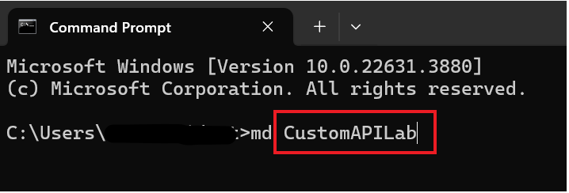

3.  Cambie el directory a la carpeta que acaba de crear.

> +++cd CustomAPILab+++
>
> 

4.  Debe estar en la carpeta CustomAPIlAB. Ejecute el siguiente command
    para iniciar un nuevo Dataverse plugin class library.

> +++pac plugin init+++
>
> 

5.  Dataverse plugin class library creation debería haber completado de
    forma exitosa.

> 

6.  Jecute el siguiente command para abrir el proyecto en Visual Studio.

> +++start CustomAPILab.csproj+++
>
> 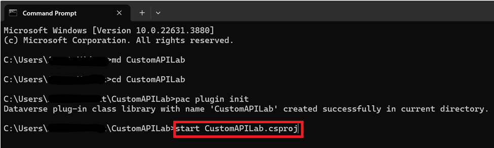

7.  Si se le pide, seleccione **Microsoft Visual Studio 2022** y
    seleccione **Just once**.

> 

8.  Si le pide iniciar sesión en Visual Studio, seleccione **Skip this
    for now** en la página sign in.

> 

9.  Seleccione **General** como Development settings elija **Dark** como
    el color theme y seleccione **Start Visual Studio**.

> **Ojo:** Ignore este paso si ya está en el proyecto.
>
> 

10. Se debe abrir el proyecto en Visual Studio.

> 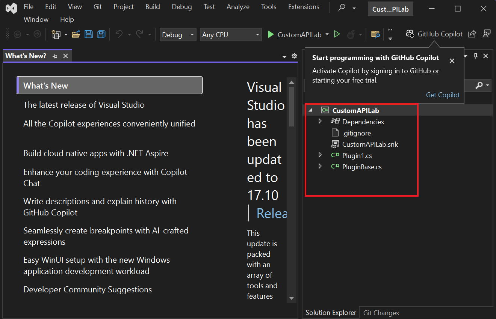

11. Haga clic derecho en Plugin1.cs file y renombre
    como **MatchPlugin.cs**.

> 

12. Seleccione **Yes** para el diálogo You are renaming a file.

> 

13. Haga clic derecho en el CustomAPILab Project y seleccione **Manage
    NuGet Packages**.

> 

14. Busque **System.Text.RegularExpressions** y seleccione **Install**.

> 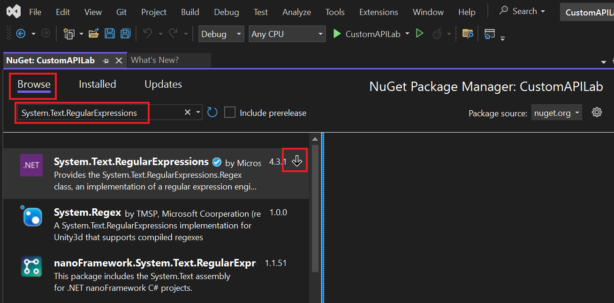

15. En la ventana Preview changes, seleccione **Apply** para permitir
    que Visual Studio haga cambios a la solución.

> 

16. Seleccione **I Accept** para aceptar los license terms.

> 

17. Abra el **MatchPlugin.cs** file.

> 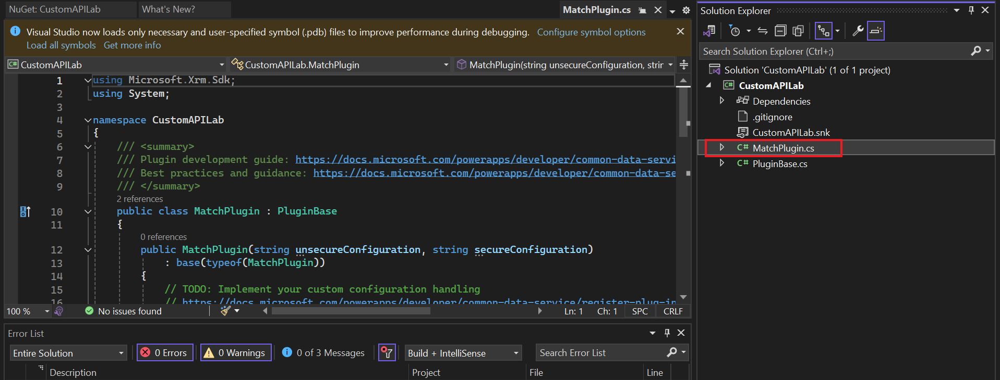

18. Agregue el siguiente statement debajo de ‘using System;’ statement
    i.e. en la línea 3.

> +++using System.Text.RegularExpressions;+++
>
> 

19. Agregue las siguientes líneas dentro del ExecuteDataversePlugin
    method y después de var context line. Estas líneas obtienen el valor
    del input parameters introducidos en API invocation personalizado.

> string input = (string)context.InputParameters\["StringIn"\];
>
> string pattern = (string)context.InputParameters\["Pattern"\];
>
> 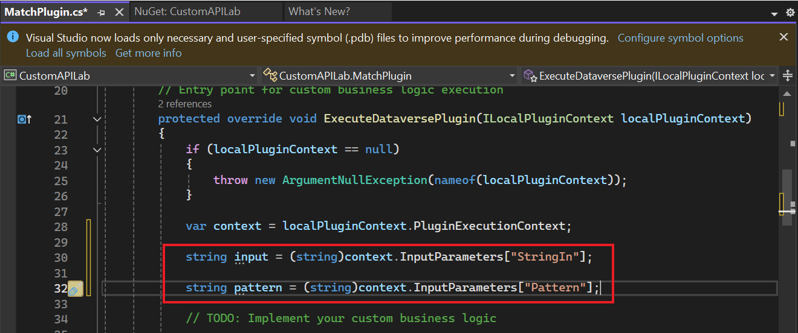

20. Agregue la siguiente línea para obtener el service.

> ITracingService tracingService =
> (ITracingService)localPluginContext.ServiceProvider.GetService(typeof(ITracingService));
>
> 

21. Agregue la siguiente línea para escribir el input value en trace.

> tracingService.Trace("Provided input: " + input);
>
> 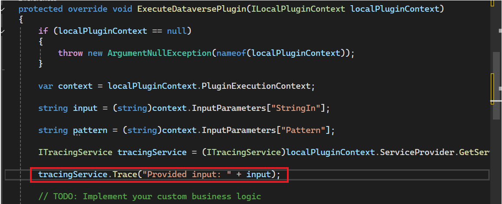

22. Agregue la siguiente línea para llamar el Regex.Match method.

> var result = Regex.Match(input, pattern);
>
> 

23. Escriba el result para trace.

> tracingService.Trace("Matching result: " + result.Success);
>
> 

24. Y finalmente, agregue la siguiente línea para establecer el output
    parameter Matched.

> context.OutputParameters\["Matched"\] = result.Success;
>
> 

25. Su execute method se debe ver así.

> 

26. Seleccione **Build | Build Solution**.

> 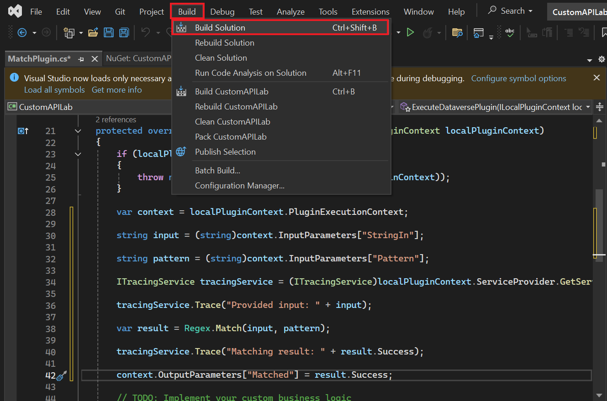

27. Se debe haber construido el proyecto.

> 

**Tarea 2: Registre el API plugin personalizado**

1.  Abra command prompt y ejecute el siguiente command para iniciar
    Plugin Registration Tool.

> +++pac tool prt+++
>
> 

2.  Seleccione **+ Create New Connection**.

> 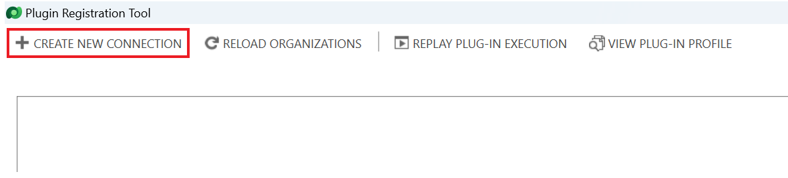

3.  Seleccione **Office 365**, proporcione sus credenciales y
    seleccione **Login**.

> 

4.  Inicie seción **M365 Admin tenant Id** y seleccione **Next**.

> 

5.  Introduzca su contraseña **M365 Admin tenant Id** y seleccione
    **Sign in**.

> 

6.  Averigüe que está seleccionado **Dev One** environment.

7.  Elija **Register | Register New Assembly**.

> 

8.  Seleccione ... en Step 1 y navegue a la
    carpeta **CustomAPILab\bin\Debug\net462**.

> 

9.  Seleccione **CustomAPILab.dll** y seleccione **Open**.

> 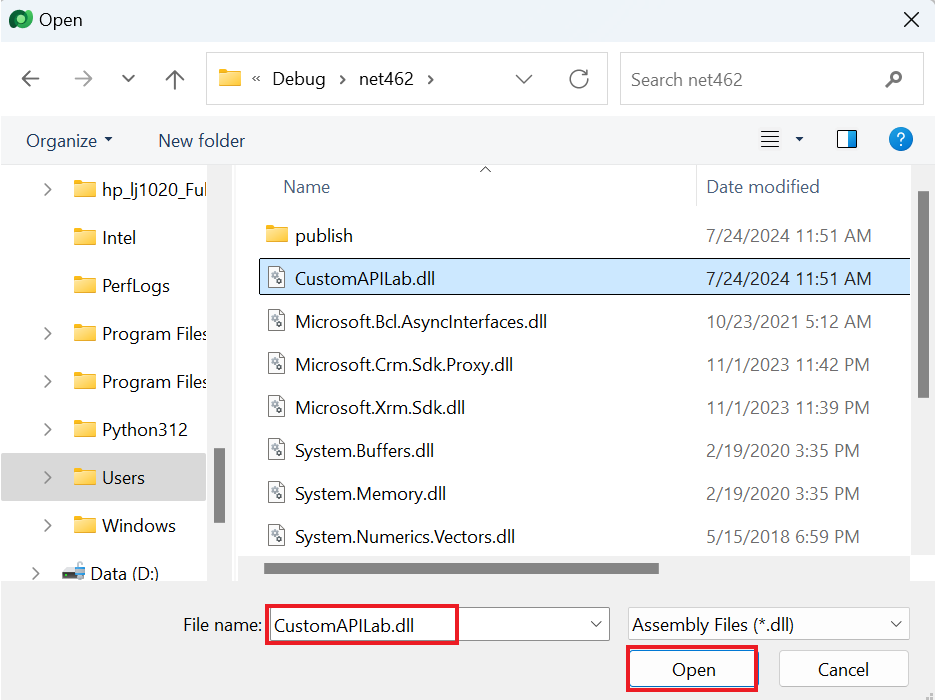

10. Seleccione **Register Selected Plugins**.

> 

11. Seleccione **OK** al mensaje de éxito. Su plugin está listo para
    conectar al custom API que vamos a crear en la próxima tarea.

> 

**Tarea 3: Cree el custom API**

1.  Navegue al Power Apps maker portal
    en +++<https://make.powerapps.com/>+++ y asegúerese que esté en
    **Dev One** environment.

2.  Seleccione **Solutions** en la navegación izquierda. Seleccione **+
    New Solution**.

> 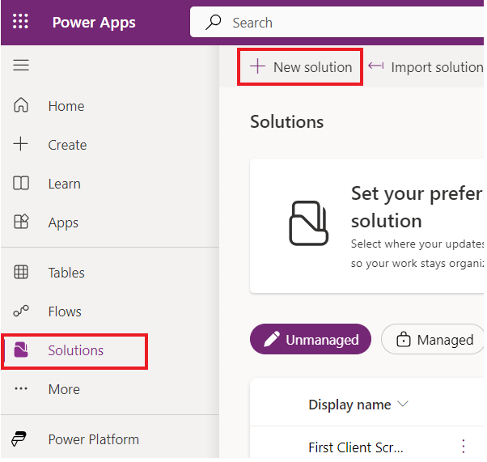

3.  Introduzca +++**Custom API Lab**+++ en el Display Name.

4.  Seleccione **CDS Default Publisher** en el menu de Publisher.

5.  Seleccione **Create**. Esto crea una solución personalizada que
    contenga nuestros componentes.

> 

6.  Seleccione **+ New | More | Other | Custom API.**

> 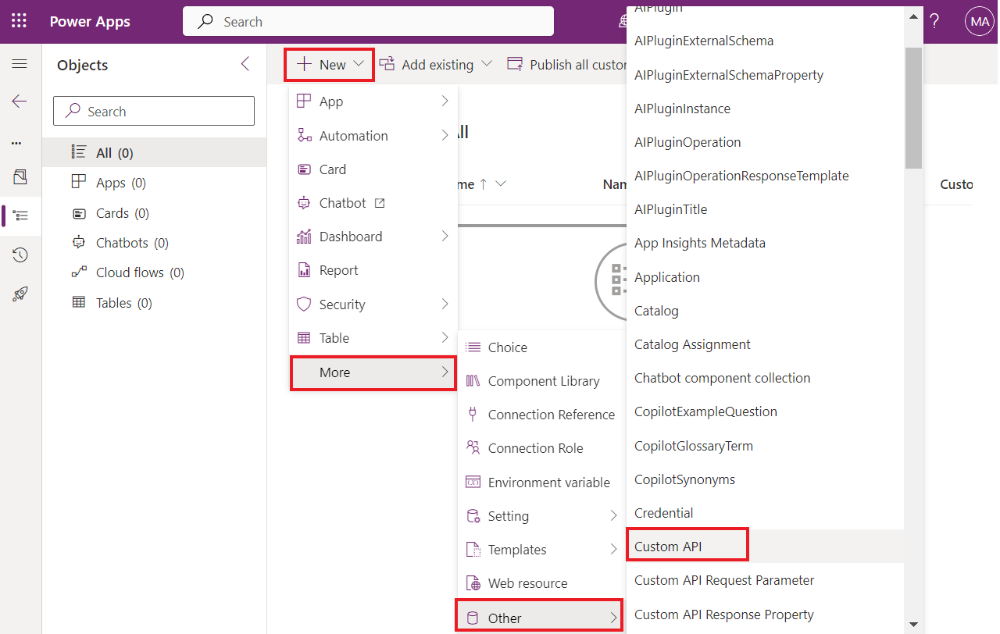

7.  Introduzca la siguiente información:

    - **Unique Name:** +++contoso_match+++

    &nbsp;

    - **Name**: +++Match+++

    &nbsp;

    - **Display Name:** +++Match+++

    &nbsp;

    - **Description**: +++Match a string+++

    &nbsp;

    - **Binding Type**: +++Global+++

> 

8.  En Plugin Type seleccione el ícono de búsqueda y ubique su plugin -
    **CustomAPILab.MatchPlugin**.

> 

9.  Seleccione **Save and Close**.

> 

10. Seleccione **Done**.

> 

11. Seleccione **+** **New | More| Other | Custom API Request
    Parameter**.

> 

12. Para **Custom API**, seleccione el ícono **Search** y
    seleccione **Match** (su Custom API).

> 

13. Introduzca +++**StringIn**+++ para Unique Name, Name, Display Name y
    Description para sencillez.

> 

14. Seleccione **String** para Type.

> 

15. Seleccione **Save and Close**.

> 

16. Seleccione **Done**.

> 

17. Para añadir otro, Custom API Request Parameter,
    Seleccione **+** **New | More| Other | Custom API Request
    Parameter**.

> 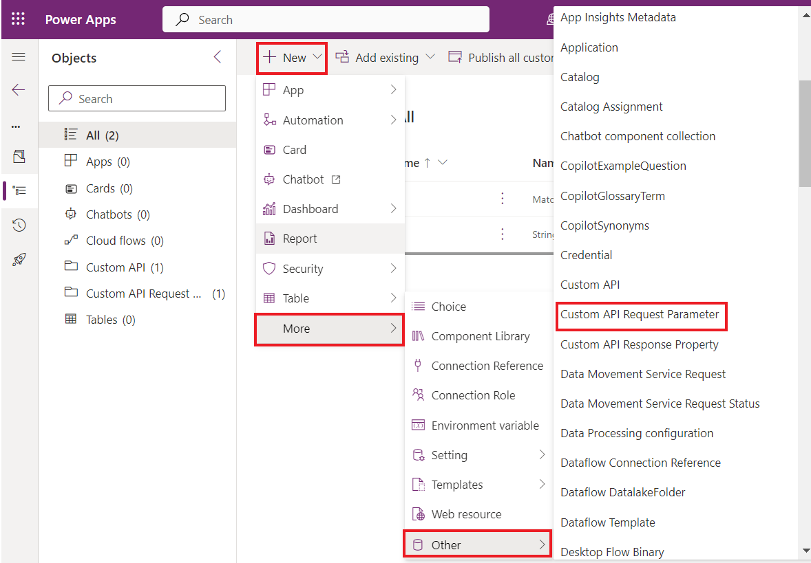

18. Para **Custom API**, seleccione el ícono **Search** y
    seleccione **Match** (su Custom API).

> 

19. Introduzca **Pattern** para Unique Name, Name, Display Name y
    Description para sencillez.

> 

20. Seleccione **String** para Type.

> 

21. Seleccione **Save and Close**.

> 

22. Seleccione **Done**.

> 

23. Seleccione **New | More | Other| Custom API Response Property**.

> 

24. Para **Custom API**, seleccione el ícono **Search** y
    seleccione **Match** (su Custom API).

> 

25. Introduzca +++**Matched**+++ como **Unique Name**, **Name, Display
    Name** y **Description** para sencillez.

26. Seleccione **Boolean** para **Type**.

> 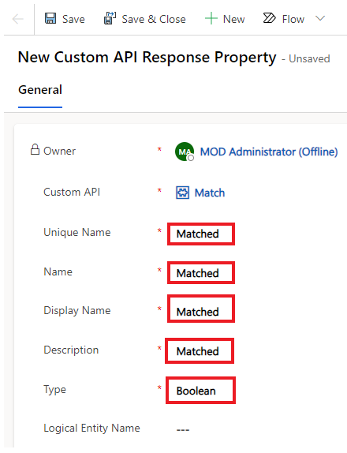

27. Seleccione **Save and Close**.

> 

28. Seleccione **Done**.

> 

29. Su solution component list se debe ver así.

> 

**Tarea 4: Use el custom API de Power Automate**

1.  En la solución, seleccione **+ New | Automation | Cloud Flow |
    Instant**.

> 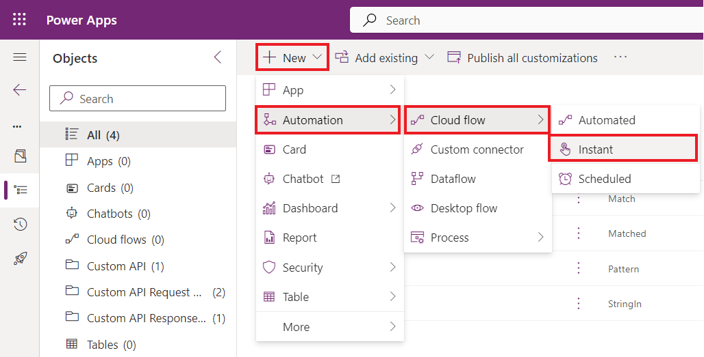

2.  Introduzca +++**String match**+++ para Flow name,
    seleccione **Manually trigger a flow** trigger, y
    seleccione **Create**.

> 

3.  Seleccione el **+ New Step**.

> 

4.  Busque perform y elija **Perform an unbound action**.

> 

5.  En Action Name list, ubique y seleccione **contoso_match**.

> 

6.  Introduzca el **myemail@outlook.com** email address en **StringIn**.
    Aquí, puede teclar cualquier email address sencillo.

> 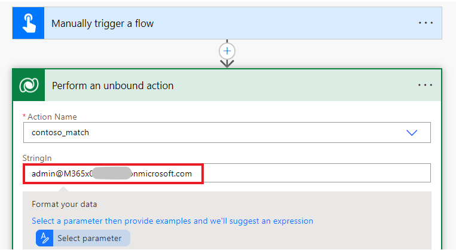

7.  Introduzca el siguiente following Regular expression en Pattern.
    Esto es un email pattern sencillo. Están disponibles
    otros [*examples*](https://regexlib.com/DisplayPatterns.aspx/).

> +++^\w+@\[a-zA-Z\_\]+?\\\[a-zA-Z\]{2,3}$+++
>
> 

8.  Se debe ver su flow así.

> 

9.  Seleccione **Save**.

> 

10. Después de que se guarde, seleccione **Test**.

> 

11. Seleccione **Manually**, y seleccione **Test**.

> 

12. Seleccione **Run flow**.

> 

13. Seleccione **Done**.

> 

14. Después de que complete el flow, seleccione el **Perform an unbound
    action** para expandir y ver resultados.

> 
>
> 

**Resumen:** En este laboratorio, ha aprendido a construir un custom
action y usarlo en un Power Automate flow. El custom API action
contoso_match también está disponible para llamar directamente mediante
el platform API.
