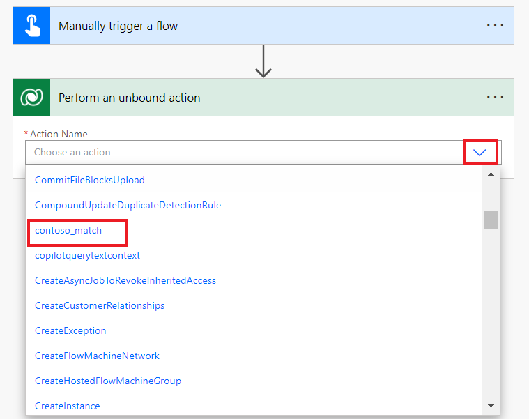

**Lab 5: Creare un'API personalizzata**

**Durata stimata:** 35 min

**Obiettivo:** In questo laboratorio imparerai a creare un'API
personalizzata Common Data Service per eseguire una logica
personalizzata. Utilizzerai quindi l'API personalizzata da un passaggio
in un flusso di Power Automate.

**Attività 1: Creare il progetto API personalizzato**

1.  Fare clic sul menu **Start** della VM, digitare Prompt dei comandi
    nella casella di ricerca e quindi selezionare **Open**.

> 

2.  Eseguire il comando seguente per creare una nuova cartella
    denominata **CustomAPILab**.

> +++md CustomAPILab+++
>
> 

3.  Cambia directory nella cartella che hai creato.

> +++cd CustomAPILab+++
>
> 

4.  A questo punto dovrebbe trovarsi nella cartella CustomAPIlAB. Esegui
    il comando seguente per inizializzare una nuova libreria di classi
    del plug-in Common Data Service.

> +++pac plugin init+++
>
> 

5.  La creazione della libreria di classi del plug-in Common Data
    Service dovrebbe essere riuscita.

> 

6.  Eseguire il comando seguente per aprire il progetto in Visual
    Studio.

> +++start CustomAPILab.csproj+++
>
> 

7.  Se richiesto, selezionare **Microsoft Visual Studio 2022** e quindi
    selezionare **Just once**.

> 

8.  Se viene richiesto di accedere a Visual Studio, selezionare **Skip
    this for now** nella pagina di accesso.

> 

9.  Selezionare **General** come Impostazioni di sviluppo, scegliere
    **Dark** come tema colore e quindi selezionare **Start** **Visual
    Studio**.

> **Nota:** Ignorare questo passaggio se si accede direttamente al
> progetto.
>
> 

10. Il progetto deve essere aperto in Visual Studio.

> 

11. Fare clic con il pulsante destro del mouse sul file Plugin1.cs e
    rinominarlo **MatchPlugin.cs**.

> 

12. Selezionare **Yes** per rinominare una finestra di dialogo di file.

> 

13. Fare clic con il pulsante destro del mouse sul progetto CustomAPILab
    e scegliere **Manage NuGet Packages**.

> 

14. Cerca **System.Text.RegularExpressions** e seleziona **Install**.

> 

15. Nella finestra Anteprima modifiche, selezionare **Apply** per
    consentire a Visual Studio di apportare modifiche alla soluzione.

> 

16. Selezionare **I Accept** per accettare le condizioni di licenza.

> 

17. Apri il file **MatchPlugin.cs**.

> 

18. Aggiungere la seguente istruzione sotto l'istruzione **'using
    System**;', ad esempio sulla riga n. 3.

> +++using System.Text.RegularExpressions;+++
>
> 

19. Aggiungi le righe seguenti all'interno del metodo
    ExecuteDataversePlugin e dopo la riga del contesto var. Queste righe
    ottengono il valore dai parametri di input passati alla chiamata API
    personalizzata.

> string input = (string)context.InputParameters\["StringIn"\];
>
> string pattern = (string)context.InputParameters\["Pattern"\];
>
> 

20. Aggiungere la riga seguente dopo per ottenere il servizio di
    tracciamento.

> ITracingService tracingService =
> (ITracingService)localPluginContext.ServiceProvider.GetService(typeof(ITracingService));
>
> 

21. Aggiungere la riga seguente per scrivere il valore di input nella
    traccia.

> tracingService.Trace("Provided input: " + input);
>
> 

22. Aggiungere la riga seguente dopo per chiamare il metodo Regex.Match.

> var result = Regex.Match(input, pattern);
>
> 

23. Scrivi il risultato per tracciare.

> tracingService.Trace("Matching result: " + result.Success);
>
> 

24. Infine, aggiungi la seguente riga per impostare il parametro di
    output Matched.

> context.OutputParameters\["Matched"\] = result.Success;
>
> 

25. Il metodo di esecuzione dovrebbe ora essere simile al seguente.

> 

26. Seleziona **Build | Build Solution**.

> 

27. Il progetto dovrebbe essere compilato correttamente.

> 

**Attività 2: Registrare il plug-in API personalizzato**

1.  Apri il prompt dei comandi ed esegui il comando seguente per avviare
    lo strumento di registrazione del plug-in.

> +++pac tool prt+++
>
> 

2.  Selezionare **+ Create New Connection**.

> 

3.  Seleziona **Office 365**, fornisci le tue credenziali e seleziona
    **Login**.

> 

4.  Accedere con **M365 Admin tenant Id** e quindi selezionare **Next**.

> 

5.  Immettere la **M365 Admin tenant Id’s password,** quindi selezionare
    **Sign in**.

> 

6.  Verificare che l'ambiente **Dev One** sia selezionato.

7.  Scegli **Register| Register New Assembly**.

> 

8.  Selezionare... nel passaggio 1 e quindi passare alla cartella
    **CustomAPILab\bin\Debug\net462**.

> 

9.  Seleziona **CustomAPILab.dll** quindi seleziona **Open**.

> 

10. Seleziona **Register Selected Plugins**.

> 

11. Selezionare **OK** per il messaggio di esito positivo. Il suoi
    plugin è pronto per connettersi all'API personalizzata che creeremo
    nella prossima attività.

> 

**Attività 3: Creare l'API personalizzata**

1.  Passa al portale per sviluppatori di Power Apps utilizzando
    +++<https://make.powerapps.com/>+++ e assicurati di essere nell'
    ambiente **Dev One**.

2.  Seleziona **Solutions** nel riquadro di spostamento a sinistra.
    Selezionare **+ New solution**.

> 

3.  Inserisci +++**Custom API Lab**+++ nel nome visualizzato.

4.  Selezionare **CDS Default Publisher** nell'elenco a discesa Editore.

5.  Seleziona **Create**. In questo modo viene creata una soluzione
    personalizzata che conterrà i componenti.

> 

6.  Seleziona **+ New | More | Other | Custom API.**

> 

7.  Inserisci le seguenti informazioni:

    - **Unique Name:** +++contoso_match+++

    &nbsp;

    - **Name**: +++Match+++

    &nbsp;

    - **Display Name :** +++Match+++

    &nbsp;

    - **Description**: +++Match a string+++

    &nbsp;

    - **Binding Type**: +++Global+++

> 

8.  In Tipo di plug-in selezionare l'icona di ricerca e individuare il
    plug-in**: CustomAPILab.MatchPlugin**.

> 

9.  Seleziona **Save and Close**.

> 

10. Seleziona **Done**.

> 

11. Seleziona **+ New | More | Other | Custom API Request Parameter**.

> 

12. Per **Custom** **API**, seleziona l'icona **Search** e seleziona
    **Match** (la tua API personalizzata).

> 

13. Immettere +++**StringIn**+++ per Nome univoco, Nome, Nome
    visualizzato e Descrizione per semplicità.

> 

14. Selezionare **String** per Tipo.

> 

15. Seleziona **Save and Close**.

> 

16. Seleziona **Done**.

> 

17. Per aggiungere un altro, Parametro di richiesta API personalizzato,
    selezionare **+ New | More | Other | Custom API Request Parameter**.

> 

18. Per **Custom API**, seleziona l'icona **Search** e seleziona
    **Match** (la tua API personalizzata).

> 

19. Immettere **Pattern** per Nome univoco, Nome, Nome visualizzato e
    Descrizione per semplicità.

> 

20. Selezionare **String** per Tipo.

> 

21. Seleziona **Save and Close**.

> 

22. Seleziona **Done**.

> 

23. Seleziona **New | More | Other | Custom API Response Property**.

> 

24. Per **Custom API**, seleziona l'icona **Search** e seleziona
    **Match** (la tua API personalizzata).

> 

25. Immettere +++**Matched**+++ per **Unique Name**, **Name, Display
    Name** e **Description** per semplicità.

26. Selezionare **Boolean** per **Type**.

> 

27. Seleziona **Save and Close.**

> 

28. Seleziona **Done**.

> 

29. L'elenco dei componenti della soluzione dovrebbe essere simile al
    seguente.

> 

**Attività 4: Utilizzare l'API personalizzata di Power Automate**

1.  Nella soluzione, seleziona **+ New | Automation | Cloud Flow |
    Instant**.

> 

2.  Immetti +++**String match**+++ per Nome flusso, seleziona **Manually
    trigger a flow** e seleziona **Create**.

> 

3.  Seleziona il **+New Step**.

> 

4.  Cerca perform (esegui) e scegli **Perform an unbound action** 

5.  Nell'elenco Nome azione individuare e selezionare **contoso_match**.

> 

6.  Inserisci **myemail@outlook.com** indirizzo e-mail in **StringIn**.
    Qui puoi digitare qualsiasi indirizzo e-mail semplice valido.

> 

7.  Immettere la seguente espressione regolare in Pattern. Questo è un
    semplice modello di email. Sono disponibili altri examples.

> +++^\w+@\[a-zA-Z\_\]+?\\\[a-zA-Z\]{2,3}$+++
>
> 

8.  Il flusso dovrebbe essere simile al seguente.

> 

9.  Seleziona **Save**.

> 

10. Al termine del salvataggio, selezionare **Test**.

> 

11. Seleziona **Manually**, quindi seleziona **Test**.

> 

12. Seleziona **Run flow**.

> 

13. Seleziona **Done**.

> 

14. Al termine del flusso, seleziona l'opzione **Perform an unbound
    action** per espandere e visualizzare i risultati.

> 
>
> 

**Riepilogo:** in questo lab hai appreso come creare un'azione
personalizzata e usarla da un flusso di Power Automate. L'contoso_match
di azione API personalizzata è ora disponibile anche per le chiamate
dirette utilizzando l'API della piattaforma.
