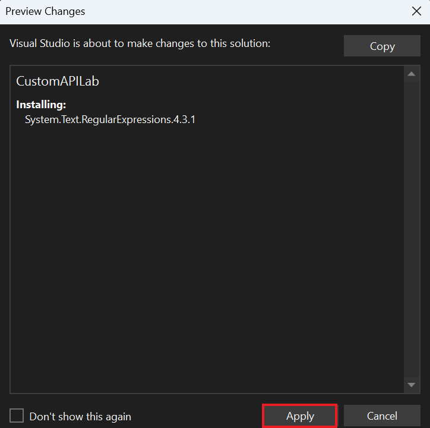
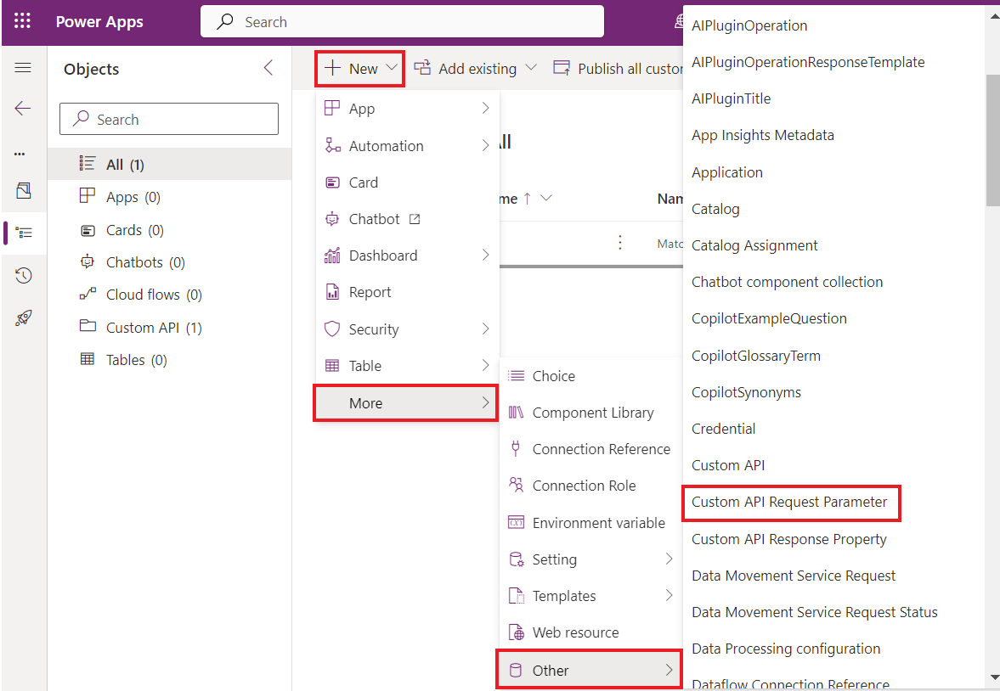

**实验 5：创建自定义 API**

**预计持续时间：** 35 分钟

**目标：**在本实验中，您将学习构建 Dataverse 自定义 API
来执行一些自定义逻辑。然后，您将使用 Power Automate
流中某个步骤中的自定义 API。

**任务 1：创建自定义 API 项目**

1.  单击 VM 的 “**Start**” 菜单，在搜索框中键入 “命令提示符” ，然后选择
    **“Open**” 。

> 

2.  运行以下命令以创建名为 **CustomAPILab** 的新文件夹。

> +++md CustomAPILab+++
>
> 

3.  将 directory 更改为您创建的文件夹。

> +++cd CustomAPILab+++
>
> 

4.  您现在应该位于 CustomAPIlAB 文件夹中。运行以下命令以初始化新的
    Dataverse 插件类库。

> +++pac plugin init+++
>
> 

5.  Dataverse 插件类库创建应该成功。

> 

6.  运行以下命令以在 Visual Studio 中打开项目。

> +++start CustomAPILab.csproj+++
>
> 

7.  如果询问，请选择 **Microsoft Visual Studio 2022**，然后选择 **Just
    once**。

> 

8.  如果系统要求您登录到 Visual Studio，请在登录页面上选择“**Skip this
    for now**”。

> 

9.  选择 “**General**” 作为 “开发设置” ，选择 **“Dar**k”
    作为颜色主题，然后选择 “**Start Visual Studio**” 。

> **注：** 如果您直接导航到项目，请忽略此步骤。
>
> 

10. 项目应在 Visual Studio 中打开。

> 

11. 右键单击 Plugin1.cs 文件并将其重命名为 **MatchPlugin.cs**。

> 

12. 选择 **Yes** （是） 以重命名文件对话框。

> 

13. 右键单击 CustomAPILab 项目，然后选择 **Manage NuGet Packages**。

> 

14. 搜索 **System.Text.RegularExpressions** 并选择 **Install**
    （安装）。

> 

15. 在 “预览更改”窗口中，选择 “**Apply**” 以允许 Visual Studio
    对解决方案进行更改。

> 

16. 选择 **I Accept** （我接受） 以接受许可条款。

> 

17. 打开 **MatchPlugin.cs** 文件。

> 

18. 在 'using System;' 语句下面添加以下语句，即第 3 行。

> +++using System.Text.RegularExpressions;+++
>
> 

19. 在 ExecuteDataversePlugin 方法内和 var
    上下文行之后添加以下行。这些行从自定义 API
    调用时传递的输入参数中获取值。

> string input = (string)context.InputParameters\["StringIn"\];
>
> string pattern = (string)context.InputParameters\["Pattern"\];
>
> 

20. 后面添加以下行以获取跟踪服务。

> ITracingService tracingService =
> (ITracingService)localPluginContext.ServiceProvider.GetService(typeof(ITracingService));
>
> 

21. 添加以下行以将输入值写入 trace。

> tracingService.Trace("Provided input: " + input);
>
> 

22. 在 After 后添加以下行以调用 Regex.Match 方法。

> var result = Regex.Match(input, pattern);
>
> 

23. 将结果写入 trace。

> tracingService.Trace("Matching result: " + result.Success);
>
> 

24. 最后，添加以下行以设置输出参数 Matched。

> context.OutputParameters\["Matched"\] = result.Success;
>
> 

25. 您的 execute 方法现在应如下所示。

> 

26. 选择 **Build | Build Solution**。

> 

27. 项目应该成功构建。

> 

**任务 2：注册自定义 API 插件**

1.  打开命令提示符并运行以下命令以启动插件注册工具。

> +++pac tool prt+++
>
> 

2.  选择 **+ Create New Connection**。

> 

3.  选择 **Office 365**，提供您的凭据，然后选择 **Login**。

> 

4.  使用 **M365 管理员租户 ID** 登录，然后选择 “**Next**”。

> 

5.  输入 **M365 管理员租户 ID 的密码**，然后选择 “**Sign in**” 。

> 

6.  检查是否选择了 **Dev One** 环境。

7.  选择 **Register | Register New Assembly**。

> 

8.  选择。。。在步骤 1 下，然后浏览到 **CustomAPILab\bin\Debug\net462**
    文件夹。

> 

9.  选择 **CustomAPILab.dll** 然后选择 **Open**。

> 

10. 选择 **Register Selected Plugins**（注册所选插件）。

> 

11. 选择 **OK**
    到成功消息。您的插件已准备好连接到我们将在下一个任务中创建的自定义
    API。

> 

**任务 3：创建自定义 API**

1.  使用 +++<https://make.powerapps.com/>+++ 导航到 Power Apps
    制作者门户，确保您位于 **Dev One** 环境中。

2.  选择 **Solutions** 在左侧导航栏中。选择 **+ New Solution**。

> 

3.  在 Display Name（显示名称）中输入 +++**Custom API Lab**+++。

4.  在 Publisher 下拉列表中选择 **CDS Default Publisher**。

5.  选择 **Create**。这将创建一个包含我们的组件的自定义解决方案。

> 

6.  选择 **+ New | More | Other | Custom API。**

> 

7.  输入以下信息：

    - **唯一名称：**+++contoso_match+++

    &nbsp;

    - **名称：**+++Match+++

    &nbsp;

    - **显示名称：**+++Match+++

    &nbsp;

    - **描述：**+++Match a string+++

    &nbsp;

    - **绑定类型：**+++Global+++

> 

8.  在 Plugin Type （插件类型） 中，选择搜索图标并找到您的插件 -
    **CustomAPILab.MatchPlugin**。

> 

9.  选择 **Save and Close** （保存并关闭）。

> 

10. 选择 **Done**。

> 

11. 选择 **+** **New | More| Other | Custom API Request Parameter**。

> 

12. 对于 **Custom API** （自定义 API），选择 **Search** （搜索）
    图标，然后选择 **Match** （您的自定义 API）。

> 

13. 为简单起见，请为“唯一名称”、“名称”、“显示名称”和“描述”输入
    +++**StringIn**+++。

> 

14. 为 Type （类型） 选择 **String** （字符串）。

> 

15. 选择 **Save and Close** （保存并关闭）。

> 

16. 选择 **Done**。

> 

17. 要再添加一个自定义 API 请求参数，请选择**+** **New | More| Other |
    Custom API Request Parameter**。

> 

18. 对于 **Custom API** （自定义 API），选择 **Search** （搜索）
    图标，然后选择 **Match** （您的自定义 API）。

> 

19. 为简单起见，请为 Unique Name、Name、Display Name 和 Description 输入
    **Pattern**。

> 

20. 为 Type （类型） 选择 **String** （字符串）。

> 

21. 选择 **Save and Close** （保存并关闭）。

> 

22. 选择 **Done**。

> 

23. 选择 **New | More | Other| Custom API Response Property**。

> 

24. 对于 **Custom API** （自定义 API），选择 **Search** （搜索）
    图标，然后选择 **Match** （您的自定义 API）。

> 

25. 为简单起见，请为“**唯一名称**”、“**名称**”、“**显示名称**”和“**描述**”输入
    +++**Matched**+++。

26. 为 **Type** （类型） 选择 **Boolean** （布尔值）。

> 

27. 选择 **Save and Close** （保存并关闭）。

> 

28. 选择 **Done**。

> 

29. 您的解决方案组件列表应如下所示。

> 

**任务 4：使用 Power Automate 中的自定义 API**

1.  在解决方案中，选择 **+ New | Automation | Cloud Flow | Instant**。

> 

2.  输入 +++**String match**+++ 作为 流名称，选择 **Manually trigger a
    flow** 触发器，然后选择 **Create**。

> 

3.  选择  **+ New Step**。

> 

4.  搜索 perform （执行） 并选择 **Perform an unbound action**
    （执行未绑定的作）。

> 

5.  在 Action Name 列表中，找到并选择 **contoso_match**。

> 

6.  在 **StringIn** 中输入 **myemail@outlook.com**
    电子邮件地址。在这里，您可以键入任何有效的简单电子邮件地址。

> 

7.  在 Pattern （模式）
    中输入以下正则表达式。这是一个简单的电子邮件模式。
    其他 [*examples*](https://regexlib.com/DisplayPatterns.aspx/) （示例）可用。

> +++^\w+@\[a-zA-Z\_\]+?\\\[a-zA-Z\]{2,3}$+++
>
> 

8.  您的流程应如下所示。

> 

9.  选择 **Save** （保存）。

> 

10. 保存完成后，选择 **Test**（测试）。

> 

11. 选择 **Manually**（手动），然后选择 **Test**（测试）。

> 

12. 选择 **Run flow**（运行流）。

> 

13. 选择 **Done**。

> 

14. 流程完成后，选择 **Perform an unbound action** （执行未绑定作）
    以展开并查看结果。

> 
>
> 

**摘要：**在本实验中，您学习了如何构建自定义作并从 Power Automate
流中使用它。自定义 API作contoso_match现在也可用于使用平台 API 直接调用。
