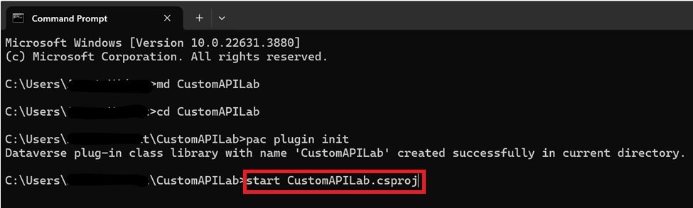
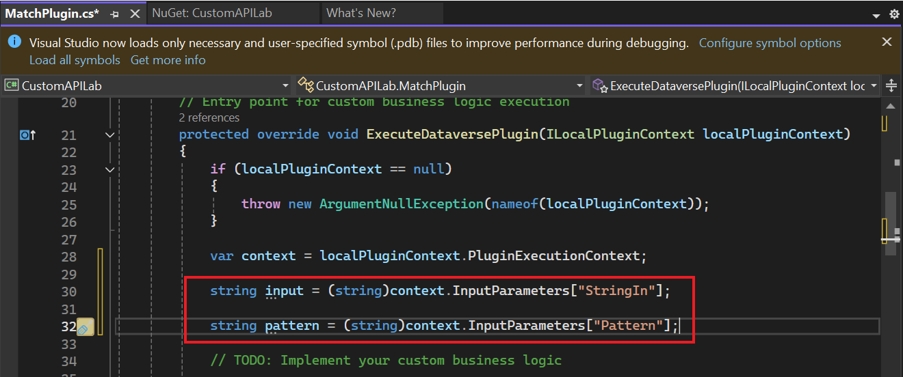
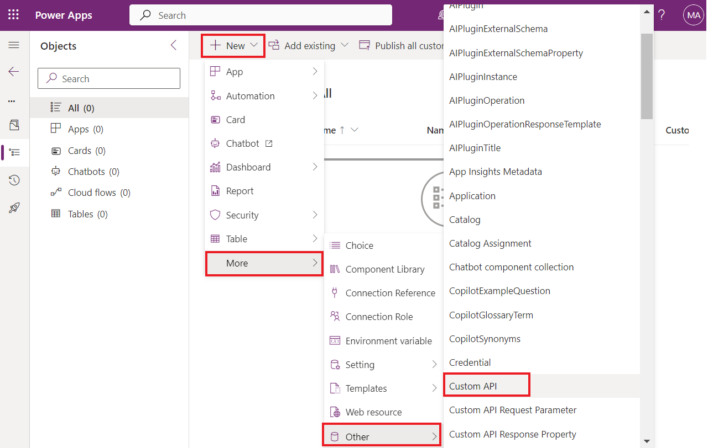

**Atelier 5 : Création d'une API personnalisée**

**Durée estimée :** 35 min

**Objectif :** Dans cet atelier, vous allez apprendre à créer une API
personnalisée Dataverse pour exécuter une logique personnalisée. Vous
utiliserez ensuite l'API personnalisée à partir d'une étape d'un Power
Automate flow.

**Tâche 1 : Créer le projet d'API personnalisé**

1.  Cliquez sur le menu **Start** de la machine virtuelle, tapez un
    prompt de commande dans la zone de recherche, puis sélectionnez
    **Open**.

> 

2.  Exécutez la commande ci-dessous pour créer un nouveau dossier nommé
    **CustomAPILab**.

> +++md CustomAPILab+++
>
> 

3.  Changez de répertoire pour le dossier que vous avez créé.

> +++cd CustomAPILab+++
>
> 

4.  Vous devez maintenant être dans le dossier CustomAPIlAB. Exécutez la
    commande ci-dessous pour initialiser une nouvelle bibliothèque de
    classes de plug-in Dataverse.

> +++plugin pac init+++
>
> 

5.  La création de la bibliothèque de classes du plugin Dataverse doit
    être réussie.

> 

6.  Exécutez la commande ci-dessous pour ouvrir le projet dans Visual
    Studio.

> +++start CustomAPILab.csproj+++
>
> 

7.  Si vous y êtes invité, sélectionnez **Microsoft Visual Studio
    2022**, puis une **just once**.

> 

8.  Si vous êtes invité à vous connecter à Visual Studio , sélectionnez
    **Skip this for now** sur la page de connexion.

> 

9.  Sélectionnez **General** comme Paramètres de développement,
    choisissez **Dark** comme thème de couleur, puis sélectionnez
    **Start Visual Studio**.

> **Remarque :** Ignorez cette étape si vous êtes directement dirigé
> vers le projet.
>
> 

10. Le projet doit s'ouvrir dans Visual Studio.

> 

11. Faites un clic droit sur le fichier Plugin1.cs et renommez-le
    **MatchPlugin.cs**.

> 

12. Sélectionnez **Yes** si vous renommez une boîte de dialogue de
    fichier.

> 

13. Faites un clic droit sur le projet CustomAPILab et sélectionnez
    **Manage NuGet Packages**.

> 

14. Recherchez **System.Text.RegularExpressions** et sélectionnez
    **Install**.

> 

15. Dans la fenêtre Aperçu des modifications, sélectionnez **Apply**
    pour permettre à Visual Studio d'apporter des modifications à la
    solution.

> 

16. Sélectionnez **I accept** pour accepter les termes du contrat de
    licence.

> 

17. Ouvrez le fichier **MatchPlugin.cs**.

> 

18. Ajouter l'instruction suivante sous l'affirmation « utilisation du
    système », c'est-à-dire sur la ligne n° 3.

> +++using System.Text.RegularExpressions;+++
>
> 

19. Ajoutez les lignes suivantes à l'intérieur de la méthode
    ExecuteDataversePlugin et après la ligne de contexte var. Ces lignes
    récupèrent la valeur des paramètres d'entrée passés lors de l'appel
    de l'API personnalisée.

> string input = (string)context.InputParameters\["StringIn"\];
>
> String pattern = (string)context.InputParameters\["Pattern"\];
>
> 

20. Ajoutez la ligne suivante après pour obtenir le service de traçage.

> ITracingService tracingService =
> (ITracingService)localPluginContext.ServiceProvider.GetService(typeof(ITracingService));
>
> 

21. Ajoutez la ligne ci-dessous pour écrire la valeur d'entrée dans
    trace.

> tracingService.Trace("Provided input: " + input);
>
> 

22. Ajoutez la ligne suivante après pour appeler la méthode Regex.Match.

> var result = Regex.Match(input, pattern);
>
> 

23. Écrivez le résultat à tracer.

> tracingService.Trace("Matching result: " + result.Success);
>
> 

24. Et enfin, ajoutez la ligne suivante pour définir le paramètre de
    sortie Matched.

> context.OutputParameters\["Matched"\] = résultat.Success;
>
> 

25. Votre méthode d'exécution doit maintenant ressembler à ce qui suit.

> 

26. Sélectionnez **Build | Build Solution**.

> 

27. Le projet doit se construire avec succès.

> 

**Tâche 2 : Enregistrer le plug-in API personnalisé**

1.  Ouvrez l la commande prompt et exécutez la commande ci-dessous pour
    lancer l'outil d'enregistrement du plugin.

> +++pac tool prt+++
>
> 

2.  Sélectionnez **+Create New Connection**.

> 

3.  Sélectionnez **Office 365**, fournissez vos informations
    d'identification et sélectionnez **Login**.

> 

4.  Connectez-vous à l'aide de votre **ID de M365 Admin tenant** puis
    sélectionnez **Next**.

> 

5.  Entrez le **mot de passe de votre ID M365 Admin tenant**, puis
    sélectionnez **sign in** .

> 

6.  Vérifiez que l' environnement **Dev One** est sélectionné.

7.  Choisissez **Register | Register New Assembly**

> 

8.  Choisir... sous l'étape 1, puis accédez au dossier
    **CustomAPILab\bin\Debug\net462**.

> 

9.  Sélectionnez **CustomAPILab.dll** puis Sélectionnez **Open**.

> 

10. Sélectionnez **Register Selected Plugins**.

> 

11. Sélectionnez **OK** pour le message de réussite. Votre plugin est
    prêt à se connecter à l'API personnalisée que nous allons créer dans
    la tâche suivante.

> 

**Tâche 3 : Créer l'API personnalisée**

1.  Accédez au portail du créateur Power Apps à l'aide de
    +++<https://make.powerapps.com/>+++ et assurez-vous que vous êtes
    dans l' environnement **Dev One**.

2.  Sélectionnez **Solutions** dans le volet de navigation de gauche.
    Sélectionnez **+ New solution**.

> 

3.  Entrez +++**Custom API Lab**+++ dans le nom d'affichage.

4.  Sélectionnez **CDS Default Publisher** dans la liste déroulante
    Publisher.

5.  Sélectionnez **Create**. Cela crée une solution personnalisée qui
    contiendra nos composants.

> 

6.  Sélectionnez **+ New | More | Other | Custom API.**

> 

7.  Entrez les informations suivantes :

    - **Nom unique :** +++contoso_match+++

    &nbsp;

    - **Nom** : +++Match+++

    &nbsp;

    - **Nom d'affichage :** +++Match+++

    &nbsp;

    - **Description** : +++Match a string+++

    &nbsp;

    - **Type de reliure** : +++Global+++

> 

8.  Dans Type de plugin, sélectionnez l'icône de recherche et localisez
    votre plugin - **CustomAPILab.MatchPlugin**.

> 

9.  Sélectionnez **Save and Close**.

> 

10. Sélectionnez **Done**.

> 

11. Sélectionnez **+ New | More| Other | Custom API Request Parameter.**

> 

12. Pour **Custom API**,sélectionnez l'icône **Search** , puis
    électionnez **Match** (votre API personnalisée).

> 

13. Entrez +++**StringIn**+++ pour Nom unique, Nom, Nom d'affichage et
    Description pour plus de simplicité.

> 

14. Sélectionnez **String** pour Type.

> 

15. Sélectionnez **Save and Close**.

> 

16. Sélectionnez **Done**.

> 

17. Pour en ajouter un autre, Paramètre de demande d'API personnalisé,
    sélectionnez **+ New | More| Other | Custom API Request Parameter**

> 

18. Pour **Custom API** , sélectionnez l'icône **Search** , puis
    sélectionnez **Match** (votre API personnalisée).

> 

19. Entrez **Pattern** pour Nom unique, Nom, Nom d'affichage et
    Description pour plus de simplicité.

> 

20. Sélectionnez **String** pour Type.

> 

21. Sélectionnez **Save and Close**.

> 

22. Sélectionnez **Done**.

> 

23. Sélectionnez **New | More | Other| Custom API Response Property**.

> 

24. Pour **Custom API**,sélectionnez l'icône **Search** , puis **Match**
    sélectionnez (votre API personnalisée).

> 

25. Entrez +++**Matched+++** pour **Unique Name**, **Name, Display
    Name** et **Description** pour plus de simplicité.

26. Sélectionnez **Boolean** pour **Type**.

> 

27. Sélectionnez **Save and Close.**

> 

28. Sélectionnez **Done**.

> 

29. La liste des composants de votre solution doit ressembler à ce qui
    suit.

> 

**Tâche 4 : Utiliser l'API personnalisée de Power Automate**

1.  Dans la solution, sélectionnez **+ New | Automation | Cloud Flow |
    Instant**.

> 

2.  Entrez +++**String match+++** pour Nom du flux, sélectionnez
    **Manually trigger a flow** , puis sélectionnez **Create**.

> 

3.  Sélectionnez **+ New Step**

> 

4.  Recherchez perform et choisissez **Perform an unbound action**.

> 

5.  Dans la liste Nom de l'action, recherchez et sélectionnez
    **contoso_match**.

> 

6.  Entrez **myemail@outlook.com** adresse e-mail dans **StringIn**.
    Ici, vous pouvez saisir n'importe quelle adresse e-mail simple
    valide.

> 

7.  Entrez l'expression régulière suivante dans Modèle. Il s'agit d'un
    modèle d'e-mail simple. D'autres
    [*exemples*](https://regexlib.com/DisplayPatterns.aspx/) sont
    disponibles.

> +++^\w+@\[a-zA-Z\_\]+?\\\[a-zA-Z\]{2,3}$+++
>
> 

8.  Votre flux doit ressembler à ce qui suit.

> 

9.  Sélectionnez **Save**.

> 

10. Une fois l'enregistrement terminé, sélectionnez **Test**.

> 

11. Sélectionnez **Manually**, puis sélectionnez **Test**.

> 

12. Sélectionnez **Run flow**.

> 

13. Sélectionnez **Done**.

> 

14. Une fois votre flux terminé, sélectionnez l'action **Perform an
    unbound action**  pour développer et afficher les résultats.

> 
>
> 

**Résumé :** Dans cet atelier, vous avez appris à créer une action
personnalisée et à l'utiliser à partir d'un Power Automate flow. Le
contoso_match d'action d'API personnalisé est désormais également
disponible pour l'appel direct à l'aide de l'API de la plateforme.
