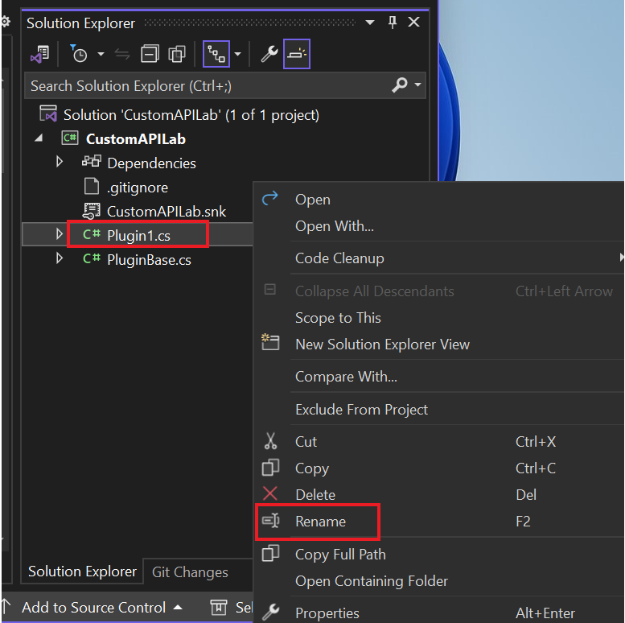
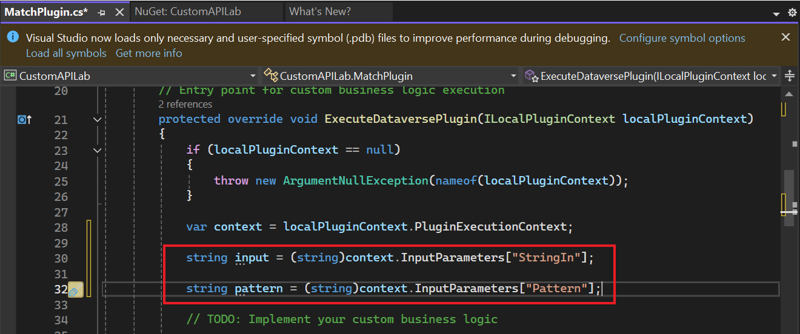
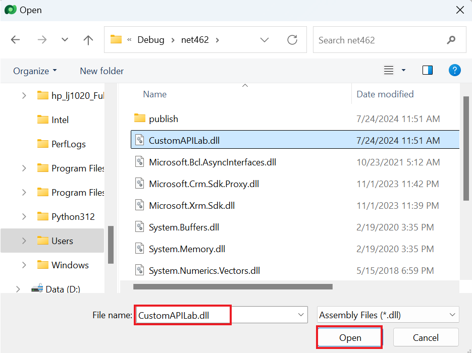
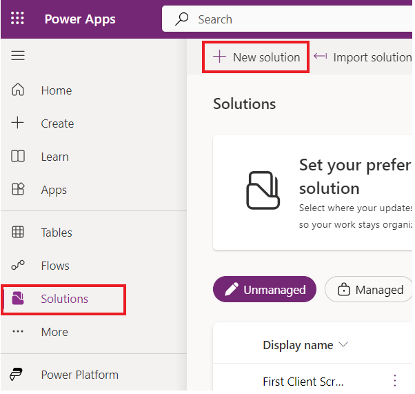
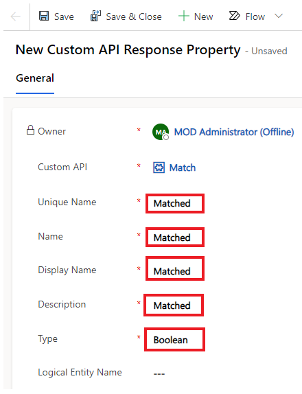
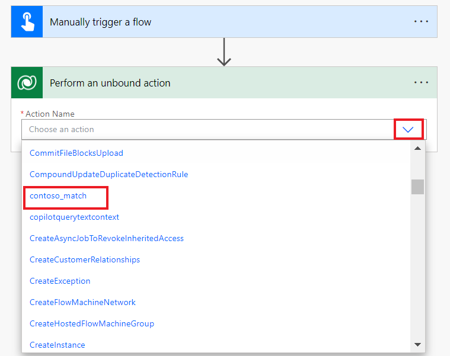

**Lab 5: Create a custom API**

**Estimated Duration:** 35 min

**Objective:** In this lab, you will learn to build a Dataverse custom
API to execute some custom logic. You'll then use the custom API from a
step in a Power Automate flow.

**Task 1: Create the custom API project**

1.  Click on the **Start** menu of the VM, type Command Prompt in the
    search box and then select **Open**.

> 

2.  Run the command below to create a new folder named **CustomAPILab**.

> +++md CustomAPILab+++
>
> 

3.  Change directory to the folder you created.

> +++cd CustomAPILab+++
>
> 

4.  You should now be in the CustomAPIlAB folder. Run the command below
    to initialize a new Dataverse plugin class library.

> +++pac plugin init+++
>
> 

5.  Dataverse plugin class library creation should be successful.

> 

6.  Run the command below to open the project in Visual Studio.

> +++start CustomAPILab.csproj+++
>
> 

7.  If asked, select **Microsoft Visual Studio 2022** and then select
    **Just once**.

> 

8.  If you are asked to sign in to Visual Studio , select **Skip this
    for now** on signing in page.

> 

9.  Select **General** as Development settings choose **Dark** as your
    color theme and then select **Start Visual Studio**.

> **Note:** Ignore this step if you are directly navigated to the
> project.
>
> 

10. The project should open in Visual Studio.

> 

11. Right click on the Plugin1.cs file and rename it **MatchPlugin.cs**.

> 

12. Select **Yes** to you're renaming a file dialog.

> 

13. Right click on the CustomAPILab Project and select **Manage NuGet
    Packages**.

> 

14. Search for **System.Text.RegularExpressions** and
    select **Install**.

> 

15. On Preview changes window, select **Apply** to allow Visual Studio
    to make changes to the solution.

> 

16. Select **I Accept** to accept the license terms.

> 

17. Open the **MatchPlugin.cs** file.

> 

18. Add the following statement below ‘using System;’ statement i.e. on
    the line no 3.

> +++using System.Text.RegularExpressions;+++
>
> 

19. Add the following lines inside the ExecuteDataversePlugin method and
    after the var context line. These lines get the value from the input
    parameters passed on the custom API invocation.

> string input = (string)context.InputParameters\["StringIn"\];
>
> string pattern = (string)context.InputParameters\["Pattern"\];
>
> 

20. Add the following line after to get the tracing service.

> ITracingService tracingService =
> (ITracingService)localPluginContext.ServiceProvider.GetService(typeof(ITracingService));
>
> 

21. Add the below line to write the input value into trace.

> tracingService.Trace("Provided input: " + input);
>
> 

22. Add the following line after to call the Regex.Match method.

> var result = Regex.Match(input, pattern);
>
> 

23. Write the result to trace.

> tracingService.Trace("Matching result: " + result.Success);
>
> 

24. And finally, add the following line to set the output parameter
    Matched.

> context.OutputParameters\["Matched"\] = result.Success;
>
> 

25. Your execute method should now look like the following.

> 

26. Select **Build | Build Solution**.

> 

27. The project should build successfully.

> 

**Task 2: Register the custom API plugin**

1.  Open command prompt and run the command below to launch the Plugin
    Registration Tool.

> +++pac tool prt+++
>
> 

2.  Select **+ Create New Connection**.

> 

3.  Select **Office 365**, provide your credentials and
    select **Login**.

> 

4.  Sign in with your **M365 Admin tenant Id** and then select **Next**.

> 

5.  Enter your **M365 Admin tenant Id’s** **password** and then select
    **Sign in**.

> 

6.  Check that **Dev One** environment is selected.

7.  Choose **Register | Register New Assembly**.

> 

8.  Select ... under the Step 1 and then browse to
    the **CustomAPILab\bin\Debug\net462** folder.

> 

9.  Select **CustomAPILab.dll** then select **Open**.

> 

10. Select **Register Selected Plugins**.

> 

11. Select **OK** to the success message. Your plugin is ready to
    connect to the custom API we'll create in the next task.

> 

**Task 3: Create the custom API**

1.  Navigate to Power Apps maker portal
    using +++<https://make.powerapps.com/>+++ and make sure you are in
    the **Dev One** environment.

2.  Select **Solutions** on the left navigation. Select **+ New
    Solution**.

> 

3.  Enter +++**Custom API Lab**+++ in the Display Name.

4.  Select **CDS Default Publisher** in the Publisher dropdown.

5.  Select **Create**. This creates a custom solution that will contain
    our components.

> 

6.  Select **+ New | More | Other | Custom API.**

> 

7.  Enter the following information:

    - **Unique Name:** +++contoso_match+++

    &nbsp;

    - **Name**: +++Match+++

    &nbsp;

    - **Display Name:** +++Match+++

    &nbsp;

    - **Description**: +++Match a string+++

    &nbsp;

    - **Binding Type**: +++Global+++

> 

8.  In Plugin Type select the search icon and locate your plugin -
    **CustomAPILab.MatchPlugin**.

> 

9.  Select **Save and Close**.

> 

10. Select **Done**.

> 

11. Select **+** **New | More| Other | Custom API Request Parameter**.

> 

12. For **Custom API**, select the **Search** icon and
    select **Match** (your Custom API).

> 

13. Enter +++**StringIn**+++ for Unique Name, Name, Display Name and
    Description for simplicity.

> 

14. Select **String** for Type.

> 

15. Select **Save and Close**.

> 

16. Select **Done**.

> 

17. To add one more, Custom API Request Parameter, Select **+** **New |
    More| Other | Custom API Request Parameter**.

> 

18. For **Custom API**, select the **Search** icon and
    select **Match** (your Custom API).

> 

19. Enter **Pattern** for Unique Name, Name, Display Name and
    Description for simplicity.

> 

20. Select **String** for Type.

> 

21. Select **Save and Close**.

> 

22. Select **Done**.

> 

23. Select **New | More | Other| Custom API Response Property**.

> 

24. For **Custom API**, select the **Search** icon and
    select **Match** (your Custom API).

> 

25. Enter +++**Matched**+++ for **Unique Name**, **Name, Display
    Name** and **Description** for simplicity.

26. Select **Boolean** for **Type**.

> 

27. Select **Save and Close**.

> 

28. Select **Done**.

> 

29. Your solution component list should look like the following.

> 

**Task 4: Use custom API from Power Automate**

1.  In the solution, select **+ New | Automation | Cloud Flow |
    Instant**.

> 

2.  Enter +++**String match**+++ for Flow name, select **Manually
    trigger a flow** trigger, and select **Create**.

> 

3.  Select the **+ New Step**.

> 

4.  Search for perform and choose **Perform an unbound action**.

> 

5.  In the Action Name list, locate and select **contoso_match**.

> 

6.  Enter **myemail@outlook.com** email address in **StringIn**. Here,
    you can type any valid simple email address.

> 

7.  Enter the following Regular expression in Pattern. This is a simple
    email pattern.
    Other [*examples*](https://regexlib.com/DisplayPatterns.aspx/) are
    available.

> +++^\w+@\[a-zA-Z\_\]+?\\\[a-zA-Z\]{2,3}$+++
>
> 

8.  Your flow should look like the following.

> 

9.  Select **Save**.

> 

10. After save is complete, select **Test**.

> 

11. Select **Manually**, then select **Test**.

> 

12. Select **Run flow**.

> 

13. Select **Done**.

> 

14. After your flow completes, select the **Perform an unbound
    action** to expand and see results.

> 
>
> 

**Summary:** In this lab, you have learnt how to build a custom action
and use it from a Power Automate flow. The custom API action
contoso_match is now also available for calling directly using the
platform API.
