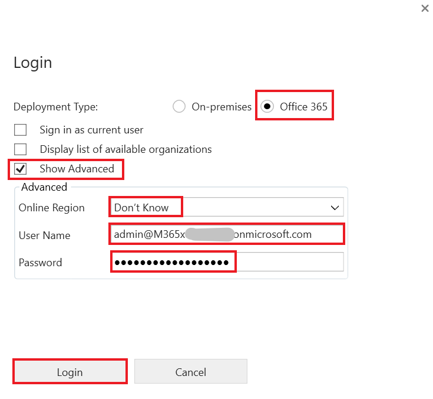

**실습 6 – 첫 번째 플러그인을 쓰기**

**예상 소요 시간:** 30분

**목표:** 이 시나리오에서 조직은 전화 번호 데이터가 일관된 형식으로
입력되었는지 확인해야 합니다. 이 목표를 달성하기 위해 Dataverse에
저장하기 전에 전화 번호에서 숫자가 아닌 모든 문자를 제거하는
생성/업데이트 시 실행되는 플러그인을 생성할 것입니다.

이 실습에서는 생성 및 업데이트 시 실행되는 플러그인을 생성하는 방법을
알아볼 것입니다. 이 플러그인은 전화 번호에서 숫자가 아닌 모든 문자를
제거합니다.

**작업 1: 새 솔루션 및 model-driven app을 생성하기**

1.  +++<https://make.powerapps.com/>+++를 사용하여 [Power
    Apps](https://make.powerapps.com/)을 이동하세요. **Dev One** 환경에
    있는지 확인하세요.

> 

2.  왼쪽 탐섹 창에서 **Solutions**을 선택하고 **New solution**을
    선택하세요.

> 

3.  플라이아웃 대화상자에서 **Display name** – +++Plugin
    Lab+++, **Name** – +++PluginLab+++, **Publisher** – CDS Default
    publisher를 지정하고 **Create**를 선택하세요.

> 

4.  솔루션에 새 model-driven app을 생성하려면
    **New** | **App** | **Model-driven app**을 선택하세요.

> 

5.  Model-driven app의 **Name**을 +++**Fundraiser**+++로 지정하고
    **Create**를 선택하세요.

> 

6.  Model-driven app에서 **+Add page**를 선택하세요.

> 

7.  나타나는 팝업에서 **Dataverse table**를 선택하세요.

> 

8.  **Contact** 테이블을 선택하고 **Add**를 선택하세요.

> 
>
> **참고:** 이 실습에서는 연락처 테이블을 사용합니다.

9.  이제 ‘Fundraiser’라는 model-driven app이 준비되었습니다.

> 

10. 오른쪽 상단 모서리에서 **Save**를 선택하세요.

> 

11. **Publish**를 선택하세요.

> 

12. **Back arrow**를 클릭하여 솔루션으로 돌아오세요.

> 

13. **Back arrow**를 클릭하면 모든 솔루션이 나열된 솔루션 페이지가
    표시됩니다.

> 

**작업 2: 플러그인을 생성하기**

1.  **Visual Studio 2022**를 시작하세요. 열려면 VM의 Start 메뉴를
    클릭하고 검색 상자에 Visual Studio를 입력한 후 **Open**을
    선택하세요.

> 

2.  **File | New | Project**를 선택하세요.

> 

3.  **Class Library (.NET Framework)**을 선택하고**Next**를 선택하세요.

> 

4.  **Project Name**에 대한 **D365PackageProject**를 입력하고 프로젝트를
    저장할 위치를 선택하세요.

> 

5.  **Framework**에 대한 **.NET Framework 4.7.1**를 선택하고
    **Create**를 선택하세요.

> 

6.  프로젝트를 마우스 오른쪽 버튼을 클릭하고 **Manage NuGet Packages**를
    선택하세요.

> 

7.  **Browse** 탭을 선택하고 **microsoft.crmsdk.coreassemblies**을
    검색하고 선택하고 **Install**을 선택하세요.

> 

8.  Preview changes 창에서 Visual Studio에서 솔루션을 변경하기 위해
    **Apply**를 선택하세요.

> 

9.  사용 조건에 동의하려면 **I Accept**을 선택하세요.

> 

10. NuGet package manager를 닫으세요.

> 

11. **Class1.cs** 마우스 오른쪽 버튼을 클릭하고 **Delete**를 선택하세요.

> 

12. Class1.cs 영구적으로 삭제하려면 **OK**를 선택하세요.

> 

13. 프로젝트를 마우스 오른쪽 버튼으로 클릭하고 **Add | Class**를
    선택하세요.

> 

14. 새 클래스의 이름을 **PreOperationFormatPhoneCreateUpdate**로
    지정하고 **Add**를 선택하세요.

> 

15. 다음과 같이 using 문을 새 클래스에 추가하세요:

> using Microsoft.Xrm.Sdk;
>
> using System.Text.RegularExpressions;
>
> 

16. 클래스를 **public**하려면, internal을 public으로 바꾸고 단계 끝에
    **IPlugin**을 입력하여 아래 이미지와 같이 IPlugin 인터페이스를
    추가하세요.

> 

17. IPlugin 인터페이스 위로 마우스를 가져가면 나타나는 빠른 작업
    아이콘을 클릭한 후 **Implement interface**을 선택하세요.

> 
>
> 이제 클래스가 다음 이미지와 같이 표시됩니다.
>
> 

**작업 3: 전화번호 형식을 지정하기**

1.  서비스 공급자로부터 실행 컨텍스트를 가져오세요. Execute 방법의
    예외를 다음 코드 조각으로 바꾸세요.

> IPluginExecutionContext context =
>
> (IPluginExecutionContext)serviceProvider.GetService(typeof(IPluginExecutionContext));
>
> 

2.  Target에 대한 입력 매개 변수를 확인하세요. Execute 방법에 다음 코드
    조각을 추가하세요.

> if (!context.InputParameters.ContainsKey("Target"))
>
> throw new InvalidPluginExecutionException("No target found");
>
> 

3.  Execute 방법에 다음 코드 조각을 추가하세요. 이 코드 조각은 입력 매개
    변수에서 대상 엔터티를 가져온 후 해당 속성에 telephone1 (연락처의
    경우 Business Phone, 계정의 경우 Phone)이 포함되어 있는지
    확인합니다.

> var entity = context.InputParameters\["Target"\] as Entity;
>
> if (!entity.Attributes.Contains("telephone1"))
>
> return;
>
> 

4.  Execute 함수에 다음 코드 조각을 추가하세요. 이 스니펫은 사용자가
    제공한 전화번호에서 숫자가 아닌 모든 문자를 제거합니다.

> string phoneNumber = (string)entity\["telephone1"\];
>
> var formattedNumber = Regex.Replace(phoneNumber, @"\[^\d\]", "");
>
> 

5.  telephone1을 서식이 지정된 전화번호로 설정하세요. Execute 방법에
    다음 코드 조각을 추가하세요.

> entity\["telephone1"\] = formattedNumber;
>
> 
>
> 이제 Execute 방법이 다음 이미지와 같이 표시됩니다.
>
> 

6.  프로젝트를 마우스 오른쪽 버튼으로 클릭하고 **Properties**을
    선택하세요.

> 

7.  **Signing** 탭을 선택하고 \<**New…\>** Key File을 선택하세요.

> 

8.  **Key file name** 필드에 +++**contoso.snk**+++를 입력하고 **Protect
    my key file with a password** 확인란의 선택을 취소한 후 **OK**를
    선택하세요.

> 

9.  **Properties** 탭을 닫으세요.

> 

10. **Build** 탭을 선택하고 **Build Project**를 클릭하세요.

> 

11. 빌드가 성공했는지 확인하세요.

> 

**작업 4: 플러그인 및 단계를 등록하기**

1.  VM의 **Start** 매뉴로 이동하고 검색 상자에 Plug-in registration
    tool을 입력하고 **Open**를 클릭하세요.

> 

2.  **Create New Connection**을 선택하세요.

> 

3.  **Office 365**를 선택하고 **Show Advanced** 확인란을 선택하고 온라인
    지역 필드에서 **Don’t Know**을 선택하고 자격 증명(M365 관리
    테넌트)을 제공한 후 **Login**을 선택하세요.

> 

4.  **Register**를 선택하고 **Register New Assembly**를 선택하세요.

> 

5.  1단계에서 …선택하고 생성한 클래스 라이브러리의 **Bin |
    Debug** 폴더로 이동하세요.

> 

6.  **D365PackageProject.dll**을 선택하고 **Open**을 선택하세요.

> 

7.  **Register Selected Plugins**을 선택하세요.

> 

8.  **OK**를 선택하세요.

> 

9.  새로 등록된 어셈블리 – **(Assembly) D365PackageProject**를
    확장하세요.

> 

10. 플러그인을 마우스 오른쪽 버튼으로 클릭하고 **Register New Step**을
    선택하세요.

> 

11. **Message**에 대한 **Create**를 선택하고 **Primary Entity**에 대한
    **contact**를 선택하세요.

> 

12. **Event Pipeline Stage of Execution**에 대한 **PreOperation**를
    선택하고 **Register New Step**을 선택하세요.

> 

13. Warning 페이지에서 **Close**를 선택하면 속성에 대한 필터가 감지되지
    않았음을 나타납니다.

> 

14. Error occurred while registering the step라는 오류 메시지가 표시되면
    세부 정보를 확인하려면 **No**를 선택하세요.

> 

15. 플러그인 아래에 생성 단계가 생성되었는지 확인하세요.

> 

16. 플러그인을 마우스 오른쪽 버튼으로 클릭하고 **Register New
    Step**을** **다시 선택하세요.

> 

17. **Message**에 대한 **Update**, **Primary Entity**에 대한
    **contact**를 선택하고 **Attributes** 조회를 선택하세요.

> 

18. **Select All** 확인란 선택을 취소하고 **Business Phone** 확인란을
    선택하고 **OK**를 선택하세요.

> 

19. **Event Pipeline Stage of Execution**에 대한 **PreOperation**을
    선택하고 **Register New Step**를 선택하세요.

> 

20. Error occurred while registering the step라는 오류 메시지가 표시되면
    세부 정보를 확인하려면 **No**를 선택하세요.

> 

21. 플러그인 아래에 생성 단계가 생성되었는지 확인하세요.

> 

**작업 5: 플러그인을 테스트하기**

1.  Maker Portal +++<https://make.powerapps.com/>+++로 이동하고 선택된
    **Dev One** 환경에 있는지 확인하세요.

2.  **Apps**을 선택하고 **Fundraiser** 애플리케이션을 시작하세요.

> 

3.  **+ New**를 선택하세요.

> 

4.  **First Name**에 +++**Test**+++, **Last Name**에
    +++**Contact**+++, **Business Phone**에 +++**(123)-555-0100**+++를
    입력하고 **Save**를 선택하세요.

> 

5.  레코드를 저장해야 하며 **Business Phone**에는 숫자 값만 표시되어야
    합니다.

> 

6.  **Business Phone**를 **001-123-555-0100**으로 변경하고 **Save**을
    클릭하세요. 레코드를 업데이트해야 하며 **Business Phone**에는 숫자
    값만 표시되어야 합니다.

> 

**요약:** 이 실습에서는 생성 및 업데이트 시 실행되는 플러그인을 생성하는
방법과 이 플러그인을 사용하여 전화 번호에서 숫자가 아닌 모든 문자를
제거하는 방법을 배웠습니다.
