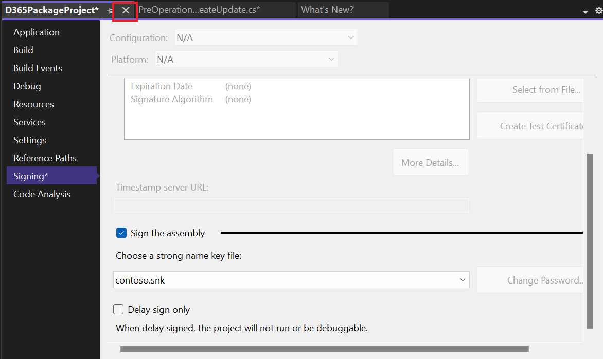

**Lab 6: Schreiben Sie Ihr erstes Plug-in**

**Geschätzte Dauer:** 30 Minuten

**Ziele:** In diesem Szenario muss eine Organisation sicherstellen, dass
Telefonnummerndaten in einem einheitlichen Format eingegeben werden. Um
dieses Ziel zu erreichen, erstellen Sie ein Plug-In, das beim
Erstellen/Aktualisieren ausgeführt wird und alle nicht numerischen
Zeichen aus einer Telefonnummer entfernt, bevor diese in Dataverse
gespeichert wird.

In diesem Lab lernen Sie, ein Plug-in zu erstellen, das beim Erstellen
und Aktualisieren ausgeführt wird. Dieses Plug-in entfernt alle nicht
numerischen Zeichen aus einer Telefonnummer.

**Aufgabe 1: Erstellen einer neuer Lösung und einer modellgesteuerten
App**

1.  Navigieren Sie zu [Power Apps](https://make.powerapps.com/) mit
    +++<https://make.powerapps.com/>+++. Stellen Sie sicher, dass Sie
    sich in der **Dev One**-Umgebung befinden.

> 

2.  Wählen Sie im linken Navigationsbereich „**Solutions**“ und dann
    „**New solution**“ aus.

> 

3.  Geben Sie im fly-out-Dialogfeld „**Display name**– +++Plugin
    Lab+++“, „**Name** – +++PluginLab+++“, „**Publisher** – CDS Default
    publisher“ an und wählen Sie dann „**Create**“ aus.

> 

4.  Um eine neue modellgesteuerte App in Ihrer Lösung zu erstellen,
    wählen Sie **New** | **App** | **Model-driven app**.

> 

5.  Geben Sie Ihrer modellgesteuerten App **Name** +++**Fundraiser**+++
    und wählen Sie dann „**Create**“ aus.

> 

6.  Wählen Sie in der modellgesteuerten App **+Add page**“ aus.

> 

7.  Wählen Sie im angezeigten Popup **Dataverse table** aus.

> 

8.  Wählen Sie die **Contact** Tabelle und dann „**Add**“ aus.

> 
>
> **Notiz:** Für dieses Lab verwenden wir die Contact Tabelle.

9.  Jetzt ist Ihre modellgesteuerte App mit dem Namen „Fundraiser“
    fertig.

> 

10. Wählen Sie oben rechts „**Save**“ aus.

> 

11. Wählen Sie „**Publish**“ aus.

> 

12. Klicken Sie auf **back arrow**, um zu Ihrer Lösung zurückzukehren.

> 

13. Klicken Sie auf **back arrow** und Sie gelangen auf die
    Lösungsseite, auf der alle Lösungen aufgelistet sind.

> 

**Aufgabe 2: Erstellen eines Plug-Ins**

1.  Starten Sie **Visual Studio 2022**. Um es zu öffnen, klicken Sie auf
    das Start menü der VM, geben Visual Studio in das Suchfeld ein und
    wählen Sie **Open**.

> 

2.  Wählen Sie **File | New | Project**.

> 

3.  Wählen Sie **Class Library (.NET Framework)** und dann **Next** aus.

> 

4.  Geben Sie **D365PackageProject** als **Project Name** ein und wählen
    Sie einen Speicherort für das Projekt aus.

> 

5.  Wählen Sie **.NET Framework 4.7.1** für **Framework** und wählen Sie
    dann **Create**.

> 

6.  Klicken Sie mit der rechten Maustaste auf project und wählen Sie
    **Manage NuGet Packages** aus.

> 

7.  Wählen Sie die Registerkarte **Browse**, suchen und wählen Sie
    **microsoft.crmsdk.coreassemblies** und wählen Sie dann **Install**.

> 

8.  Wählen Sie im Fenster Preview changes, die Option **Apply** aus, um
    Visual Studio das Vornehmen von Änderungen an der Lösung zu
    gestatten.

> 

9.  Wählen Sie **I Accept,** um die Lizenzbedingungen zu akzeptieren.

> 

10. Schließen Sie den NuGet package manager.

> 

11. Klicken Sie mit der rechten Maustaste auf **Class1.cs** und wählen
    Sie **Delete.**

> 

12. Wählen Sie „**OK**“, um Class1.cs dauerhaft zu löschen.

> 

13. Klicken Sie mit der rechten Maustaste auf das Project und wählen Sie
    dann **Add | Class**.

> 

14. Nennen Sie die neue class als
    **PreOperationFormatPhoneCreateUpdate** und wählen Sie „**Add**“
    aus.

> 

15. Fügen Sie using-Anweisungen in new class wie folgt ein:

> using Microsoft.Xrm.Sdk;
>
> using System.Text.RegularExpressions;
>
> 

16. Um class **public** zu machen, ersetzen Sie internal durch „public“
    und geben Sie am Ende des Schritts „**:** **IPlugin**“ ein, um die
    IPlugin-Schnittstelle hinzuzufügen, wie im folgenden Bild gezeigt.

> 

17. Bewegen Sie die Maus über die IPlugin-Schnittstelle, klicken Sie auf
    das angezeigte quick action icon und wählen Sie dann „**Implement
    interface**“ aus.

> 
>
> Ihr class sollte jetzt wie im folgenden Bild aussehen.
>
> 

**Aufgabe 3: Formatieren einer Telefonnummer**

1.  Rufen Sie execution context vom service provider ab. Ersetzen Sie
    die exception in der Execute-Methode durch den folgenden
    Codeausschnitt.

> IPluginExecutionContext context =
>
> (IPluginExecutionContext)serviceProvider.GetService(typeof(IPluginExecutionContext));
>
> 

2.  Überprüfen Sie input parameter für Target. Fügen Sie der
    Execute-Methode den folgenden Codeausschnitt hinzu.

> if (!context.InputParameters.ContainsKey("Target"))
>
> throw new InvalidPluginExecutionException("No target found");
>
> 

3.  Fügen Sie der Execute-Methode den folgenden Codeausschnitt hinzu.
    Dieser Codeausschnitt ruft die Zielentität aus input parameter ab
    und prüft anschließend, ob deren Attribute „telephone1“ (Business
    Phone for Contacts, Phone for Accounts) enthalten.

> var entity = context.InputParameters\["Target"\] as Entity;
>
> if (!entity.Attributes.Contains("telephone1"))
>
> return;
>
> 

4.  Fügen Sie das folgende Snippet zur Funktion Execute hinzu. Dieses
    Snippet entfernt alle nicht-numerischen Zeichen aus der vom Benutzer
    eingegebenen Telefonnummer.

> string phoneNumber = (string)entity\["telephone1"\];
>
> var formattedNumber = Regex.Replace(phoneNumber, @"\[^\d\]", "");
>
> 

5.  Setzen Sie „telephone1“ auf die formatierte Telefonnummer. Fügen Sie
    der Execute-Methode den folgenden Codeausschnitt hinzu.

> entity\["telephone1"\] = formattedNumber;
>
> 
>
> Die Execute-Methode sollte jetzt wie im folgenden Bild aussehen.
>
> 

6.  Klicken Sie mit der rechten Maustaste auf Project und wählen Sie
    „**Properties**“.

> 

7.  Wählen Sie die Registerkarte „**Signing**“ und wählen Sie
    \<**New…\>** Key file.

> 

8.  Geben Sie +++**contoso.snk** +++ in das Feld „**Key file name**“
    ein, deaktivieren Sie das Kontrollkästchen **Protect my key file
    with a password**, und wählen Sie dann „**OK**“ aus.

> 

9.  Schließen Sie die Registerkarte „**Properties**“.

> 

10. Wählen Sie die Registerkarte „**Build**“ und klicken Sie auf
    „**Build Project**“.

> 

11. Stellen Sie sicher, dass der Build erfolgreich ist.

> 

**Aufgabe 4: Registrieren eines Plug-Ins und Schritte**

1.  Gehen Sie zum **Start** menü der VM, geben Sie „Plug-In Registration
    Tool“ in das Suchfeld ein und klicken Sie auf „**Open**“.

> 

2.  Wählen Sie „**Create New Connection**“ aus.

> 

3.  Wählen Sie **Office 365** aus, aktivieren Sie das Kontrollkästchen
    „**Show Advanced**“, wählen Sie im Feld „Online Region“ die Option
    „**Don’t Know**“ aus, geben Sie Ihre Anmeldeinformationen ein (M365
    Admin tenant) und wählen Sie dann „**Login**“ aus.

> 

4.  Wählen Sie „**Register**“ und dann „**Register New Assembly**“ aus.

> 

5.  Wählen Sie unter Schritt 1 **...** aus und navigieren Sie dann zum
    Ordner **Bin | Debug,** der von Ihnen erstellten class library.

> 

6.  Wählen Sie „**D365PackageProject.dll**“ und dann „**Open**“ aus.

> 

7.  Wählen Sie **Register Selected Plugins** aus.

> 

8.  Wählen Sie **OK**.

> 

9.  Erweitern Sie die neu registrierte Assembly – **(Assembly)
    D365PackageProject**

> 

10. Klicken Sie mit der rechten Maustaste auf das Plug-In und wählen Sie
    **Register New Step** aus.

> 

11. Wählen Sie **Create** für **Message** und wählen Sie **contact** für
    **Primary Entity**.

> 

12. Wählen Sie **PreOperation** für **Event Pipeline Stage of
    Execution** und wählen Sie dann **Register New Step** aus.

> 

13. Wählen Sie **Close** auf der Warning Seite aus, auf der angegeben
    wird, dass keine Filter für Attribute erkannt wurden.

> 

14. Wenn Sie die Fehlermeldung „i.e. Error occurred while registering
    the step“ erhalten, wählen Sie „**No**“, um die Details anzuzeigen.

> 

15. Überprüfen Sie, ob der Schritt Create unter dem Plugin erstellt
    wurde.

> 

16. Klicken Sie mit der rechten Maustaste auf das Plug-In und wählen Sie
    erneut **Register New Step** aus.

> 

17. Wählen Sie **Update** für **Message**, wählen Sie **contact** für
    **Primary Entity**, und wählen Sie dann die **Attributes** lookup
    aus.

> 

18. Deaktivieren Sie das Kontrollkästchen „**Select All**“, aktivieren
    Sie das Kontrollkästchen „**Business Phone**“ und wählen Sie dann
    „**OK**“ aus.

> 

19. Wählen Sie „**PreOperation**“ für **Event Pipeline Stage of
    Execution** und wählen Sie dann **Register New Step** aus.

> 

20. Wenn Sie die Fehlermeldung „i.e. Error occurred while registering
    the step“ erhalten, wählen Sie „**No**“, um die Details anzuzeigen.

> 

21. Überprüfen Sie, ob der Schritt „Create“ unter dem Plugin erstellt
    wurde.

> 

**Aufgabe 5: Testen des Plug-Ins**

1.  Gehen Sie zu Ihrem Maker Portal +++<https://make.powerapps.com/>+++
    und stellen Sie sicher, dass Sie sich in der ausgewählten **Dev
    One**-Umgebung befinden.

2.  Wählen Sie „**Apps**“ und starten Sie die Anwendung
    „**Fundraiser**“.

> 

3.  Wählen Sie **+ New**.

> 

4.  Geben Sie +++**Test**+++ als **First Name**, +++**Contact**+++ als
    **Last Name,** +++**(123)-555-0100**+++ als **Business Phone** ein
    und wählen Sie dann **Save** aus.

> 
>
> Der Datensatz sollte gespeichert werden und das **Business
> Phone** sollte nur die numerischen Werte anzeigen.
>
> 

5.  Ändern Sie die **Business Phone** in **001-123-555-0100** und
    klicken Sie auf **Save**. Der Datensatz sollte aktualisiert sein,
    und die **Business Phone** sollte nur noch die numerischen Werte
    anzeigen.

> 

**Zusammenfassung:** In diesem Lab haben Sie gelernt, wie Sie ein
Plug-In erstellen, das beim Erstellen und Aktualisieren ausgeführt wird,
und wie Sie mit diesem Plug-In alle nicht numerischen Zeichen aus einer
Telefonnummer entfernen.
