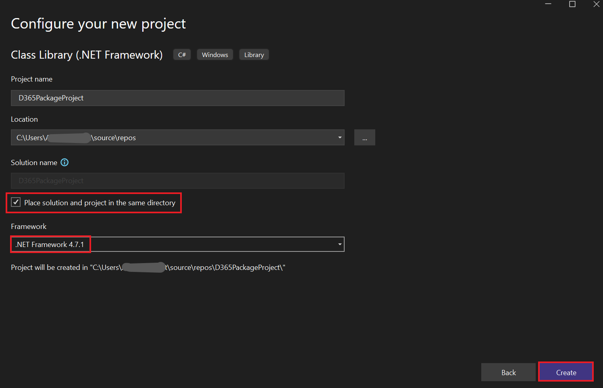
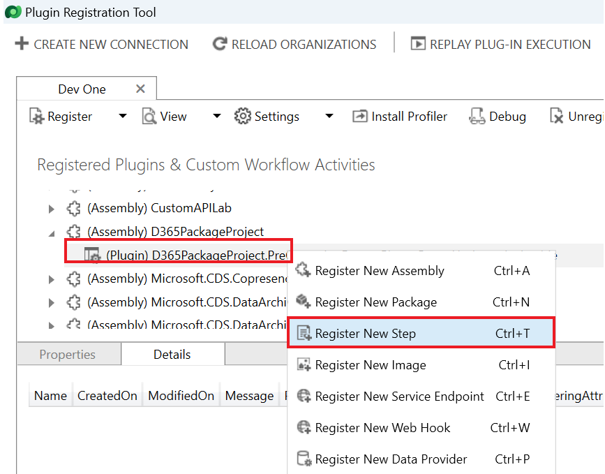

**ラボ６：最初のプラグインを作成する**

**所要時間:** 30 分

**目的:**
この件では、組織が電話番号データを一貫した形式で入力できるようにする必要があります。この目的を達成するために、作成・更新時に実行されるプラグインを作成し、Dataverse
に保存される前に電話番号から数値以外のすべての文字を削除します。

このラボでは、作成および更新イベントで実行されるプラグインの作成方法を学習します。このプラグインは電話番号から数字以外の文字を全て削除します。

**タスク1：新しいソリューションとモデル駆動型アプリの作成**

1.  +++<https://make.powerapps.com/>+++で[Power
    Apps](https://make.powerapps.com/)に移動します。 **Dev
    One**環境にいることを確認します。

> 

2.  左側のナビゲーション[ペイン](https://context.reverso.net/translation/japanese-english/%E3%83%8A%E3%83%93%E3%82%B2%E3%83%BC%E3%82%B7%E3%83%A7%E3%83%B3%E3%83%BB%E3%83%9A%E3%82%A4%E3%83%B3)から**Solutions** を選択して、**New
    solution**を選択します。

> 

3.  フライアウトダイアログで**Display name** に– +++Plugin
    Lab+++と、**Name**に – +++PluginLab+++、**Publisher**に – CDS
    Default publisher を入力して、**Create**を選択します。

> 

4.  ソリューション内で新しいモデル駆動型アプリを作成するため、**New** | **App** | **Model-driven
    app**を選択します。

> 

5.  駆動型アプリ**Name**に+++**Fundraiser**+++という名前を付けて、**Create**を選択します。

> 

6.  モデル駆動型アプリで**+Add page**を選択します。

> 

7.  表示されているポップアップで**Dataverse table**を選択します。

> 

8.  **Contact** テーブルを選択して、**Add**を選択します。

> 
>
> **注意：** このラボではContactテーブルを使用します。

9.  なお、「Funraiser」という名前のモデル駆動型アプリが完成します。

> 

10. 右上の**Save**をクリックします。

> 

11. **Publish**をクリックします。

> 

12. **back arrow**をクリックして、ソリューション画面に戻ります。

> 

13. **back arrow**
    をクリックして、全てのソリューションが表示されるページに戻ります。

> 

**タスク２：プラグインの作成**

1.  **Visual Studio
    2022**を起動します。VMのスタートメニューから検索ボックスにVisual
    Studio を入力して、**Open**にクリックします。

> 

2.   **File | New | Project**を選択します。

> 

3.  **Class Library (.NET
    Framework)** を選択して、**Next**にクリックします。

> 

4.  **Project
    Name**に**D365PackageProject** を入力して、保存先を選択します。

> 

5.  **Framework**に**.NET Framework
    4.7.1**を選択し、**Create**を選択します。

> 

6.  プロジェクトを右クリックし、**Manage NuGet Packages**を選択します。

> 

7.  **Browse**タブ を選択し、**microsoft.crmsdk.coreassemblies**を検討して選択します。そして**Install**を選択します。

> 

8.  プレビュー変更ウィンドウで**Apply** をクリックし、Visual
    Studioがソリューションに変更することを承認します。

> 

9.  **I Accept**にクリックして、ライセンス条項を同意するます。

> 

10. NuGet package managerを閉じます。

> 

11. **Class1.cs** を右クリックして**Delete**を選択します。

> 

12. **OK** にクリックして、Class1.csが完全に削除します。

> 

13. プロジェクトを右クリックし、**Add | Class**を選択します。

> 

14. 新しいクラス名を**PreOperationFormatPhoneCreateUpdate**と付けて、**Add**を選択します。

> 

15. 以下の usingステートメントを新しいクラスに追加します：

> using Microsoft.Xrm.Sdk;
>
> using System.Text.RegularExpressions;
>
> 

16. クラスを**public**にするには、internal をpublic
    に置き換え、手順の最後に**IPlugin** を入力して、下の画像に示すようにIPlugin
    インターフェースを追加します。

> 

17. IPlugin
    インターフェースの上にマウスを移動し、表示されるクイックアクションアイコンをクリックして、**Implement
    interface**を選択します。

> 
>
> クラスは次の画像のようになります。
>
> 

**タスク３：電話番号の整形**

1.  サービスプロバイダーから実行コンテキストを取り得します。Execute
    方法内の例外を次のスニペットに置き換えます。

> IPluginExecutionContext context =
>
> (IPluginExecutionContext)serviceProvider.GetService(typeof(IPluginExecutionContext));
>
> 

2.  Targetのinput
    parameterを確認します。Execute方法に次のスニペットを追加してください。

> if (!context.InputParameters.ContainsKey("Target"))
>
> throw new InvalidPluginExecutionException("No target found");
>
> 

3.  次のスニペットをExecute方法に追加します。このスニペットは、入力パラメーターからターゲットエンティティを取得し、次にその属性にtelephone1(Business
    Phone for Contacts, Phone for
    Accounts)が含まれているかどうかを確認します。

> var entity = context.InputParameters\["Target"\] as Entity;
>
> if (!entity.Attributes.Contains("telephone1"))
>
> return;
>
> 

4.  次のスニペットをExecute方法に追加します。これはユーザーから提供された電話番号から数値以外を削除します。

> string phoneNumber = (string)entity\["telephone1"\];
>
> var formattedNumber = Regex.Replace(phoneNumber, @"\[^\d\]", "");
>
> 

5.  整形済みの電話番号を
    telephone1に設定します。次のスニペットをExecute方法に追加します。

> entity\["telephone1"\] = formattedNumber;
>
> 
>
> Execute方法は現在、以下の画像のように見えます。
>
> 

6.  プロジェクトを右クリックし、**Properties**を選択します。

> 

7.  **Signing**タブを選択し、\<**New…\>** キーファイルを選択します。

> 

8.  **Key file name**に+++**contoso.snk**+++ と入力し、**Protect my key
    file with a password** からチェックを外して**OK**を選択します。

> 

9.  **Properties**タブを閉じます。

> 

10. **Build** タブを選択し、**Build Project**にクリックします。

> 

11. Buildが成功に完了することを確認します。

> 

**タスク４：プラグインの登録とステップス**

1.  VMの**Start**メニューを開き、検索ボックスにPlug-in Registration
    Toolと入力して**Open**をクリックします。

> 

2.  **Create New Connection**を選択します。

> 

3.  **Office 365**を選択し、**Show
    Advanced**チェックボックスをオンにします。Online Region
    フィールドで**Don’t Know**を選択し、「M365 Admin
    tenant」の資格情報を入力して、**Login**を選択します。

> 

4.  **Register**を選択し、次に **Register New Assembly**を選択します。

> 

5.  Selectステップ１の下にある**...**
    をクリックし、作成したクラスライブラリの**Bin |
    Debug** フォルダを参照します。

> 

6.  **D365PackageProject.dll**を選択し、**Open**をクリックします。

> 

7.  **Register Selected Plugins**を選択します。

> 

8.  **OK**をクリックします。

> 

9.  新しく登録されたアセンブリ－**(Assembly)
    D365PackageProject**を展開します。

> 

10. プラグインを右クリックし、**Register New Step** を選択します。

> 

11. **Message**に**Create** を選択し、**Primary
    Entity**に**contact**を選択します。

> 

12. **Event Pipeline Stage of
    Execution**に**PreOperation**を選択し、**Register New
    Step**にクリックします。

> 

13. 属性にフィルターが検出されなかったことを示す警告ページで、**Close**をクリックします。

> 

14. エラーメッセージつまり、ステップの登録中にエラーが発生しましたというメッセージが表示された場合は、**No**を選択して詳細を確認します。

> 

15. プラグインの下にCreate ステップが作成されていることを確認します。

> 

16. プラグインを右クリックして、再度 **Register New Step**を選択します。

> 

17. **Message**に**Update**を選択し、**Primary
    Entity**に**contact** を選択、**Attributes**のルックアップをクリックします。

> 

18. **Select All**チェックボックスをオフにし、**Business
    Phone**チェックボックスを選択し、**OK**にクリックします。

> 

19. **Event Pipeline Stage of
    Execution**に**PreOperation**を選択し、**Register New
    Step**にクリックします。

> 

20. 「ステップの登録中にエラーが発生しました。」、つまりエラーメッセージが出た場合は、**No**を選択して詳細を確認します。

> 

21. プラグインの下にステップが作成されていることを確認します。

> 

**タスク５：プラグインをテストする**

1.  +++<https://make.powerapps.com/>+++にクリックしてMakerポータルに移動し、**Dev
    One**環境にいることをを確認します。

2.  **Apps**を選択し、**Fundraiser** アプリケーションを起動します。

> 

3.  **+ New**にクリックします。

> 

4.  **First Name**に**+++Test+++**、**Last
    Name**に**+++Contact+++**、**Business
    Phone**に**+++(123)-555-0100+++**を入力し、**Save**をクリックします。

> 
>
> レコードが保存する必要であり、**Business
> Phone**は数値のみが表示されます。.
>
> 

5.  **Business Phone**
    を「**001-123-555-0100**」に変更して、**Save**をクリックします。レコードが更新され、**Business
    Phone**は数値のみが表示されます。

> 

**まとめ：**このラボでは、作成および
更新時に実行されるプラグインの作成方法と、そのプラグインを使用して電話番号から数字以外の文字を削除方法を学びました。
