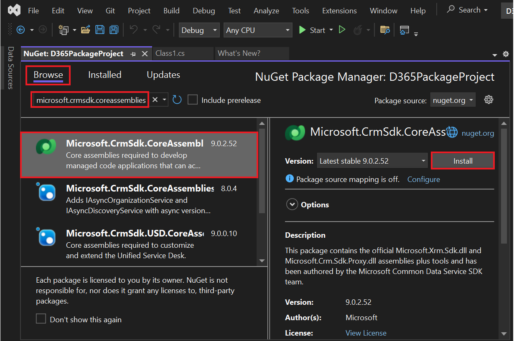

**实验 6 - 编写您的第一个插件**

**预计持续时间：** 30 分钟

**目标：**在这种情况下，组织需要确保以一致的格式输入电话号码数据。为了实现此目标，您将创建一个在创建/更新时运行的插件，该插件在保存到
Dataverse 之前从电话号码中去除所有非数字字符。

在本实验中，您将学习如何创建将在 create 和 update
上运行的插件。此插件将从电话号码中删除所有非数字字符。

**任务 1：创建新解决方案和模型驱动应用**

1.  使用 +++<https://make.powerapps.com/>+++ 导航到 Power
    Apps。确保您处于 **Dev One** 环境中。

> 

2.  在左侧导航窗格中，选择 “**Solutions**” ，然后选择 “**New solution**”
    。

> 

3.  在弹出对话框中，指定 **显示名称** – +++Plugin Lab+++， **名称** –
    +++PluginLab+++， **发布者** – CDS 默认发布者 ，然后选择
    **Create**。

> 

4.  若要在解决方案中创建新的模型驱动应用，请选择 **New** | **App** | **Model-driven
    app**。

> 

5.  将 **名称** 为您的模型驱动应用指定为 +++**Fundraiser**+++，然后选择
    **Create**。

> 

6.  在模型驱动应用中，选择 **+Add page**。

> 

7.  在出现的弹出窗口中选择 **Dataverse table**。

> 

8.  选择 **Contact** 表 ，然后选择 **Add**。

> 
>
> **注意：**在本实验中，我们使用联系人表。

9.  现在，名为 'Funraiser' 的模型驱动应用已准备就绪。

> 

10. 选择 **Save** 从右上角。

> 

11. 选择 **Publish**。

> 

12. 单击**后退箭头**返回您的解决方案。

> 

13. 单击**后退箭头**，您将进入列出所有解决方案的解决方案页面。

> 

**任务 2：创建插件**

1.  启动 **Visual Studio 2022**。要打开它，请单击 VM 的 Start
    菜单，在搜索框中键入 Visual Studio，然后选择 **Open**。

> 

2.  选择 **File | New | Project**。

> 

3.  选择 **Class Library（.NET Framework）**，然后选择 **Next**。

> 

4.  输入 **D365PackageProject** 作为**项目名称**，选择保存项目的位置，

> 

5.  为 **Framework** 选择 **.NET Framework 4.7.1**，然后选择
    **Create**。

> 

6.  右键单击项目，然后选择 **Manage NuGet Packages**。

> 

7.  选择 **Browse** 选项卡，搜索并选择
    **microsoft.crmsdk.coreassemblies**，然后选择 **Install**。

> 

8.  在 “预览更改” 窗口中，选择 “**Apply**” 以允许 Visual Studio
    对解决方案进行更改。

> 

9.  选择 **I Accept** （我接受） 以接受许可条款。

> 

10. 关闭 NuGet 包管理器。

> 

11. 右键单击 **Class1.cs** 和 **Delete**。

> 

12. 选择 **OK** 永久删除Class1.cs。.

> 

13. 右键单击项目，然后选择 **Add | Class**。

> 

14. 将新类命名为 **PreOperationFormatPhoneCreateUpdate**，然后选择
    **Add**。

> 

15. 将 using 语句添加到新类中，如下所示：

> using Microsoft.Xrm.Sdk;
>
> using System.Text.RegularExpressions;
>
> 

16. 要将类设为公共类，请将 internal 替换为
    **public**，并在步骤结束时键入 ： **IPlugin** 以添加 IPlugin
    接口，如下图所示。

> 

17. 将鼠标悬停在 IPlugin 界面上，单击出现的快速作图标，然后选择
    **Implement interface**。

> 
>
> 您的类现在应如下图所示。
>
> 

**任务 3：设置电话号码的格式**

1.  从服务提供商处获取执行上下文。将 Execute 方法中的 exception
    替换为以下代码段。

> IPluginExecutionContext context =
>
> (IPluginExecutionContext)serviceProvider.GetService(typeof(IPluginExecutionContext));
>
> 

2.  检查 Target 的输入参数。将以下代码段添加到 Execute 方法中。

> if (!context.InputParameters.ContainsKey("Target"))
>
> throw new InvalidPluginExecutionException("No target found");
>
> 

3.  将以下代码段添加到 Execute
    方法中。此代码段将从输入参数中获取目标实体，然后检查其属性是否包含
    telephone1（联系人的商务电话、客户的电话）。

> var entity = context.InputParameters\["Target"\] as Entity;
>
> if (!entity.Attributes.Contains("telephone1"))
>
> return;
>
> 

4.  将以下代码段添加到 Execute
    函数中。此代码段将从用户提供的电话号码中删除所有非数字字符。

> string phoneNumber = (string)entity\["telephone1"\];
>
> var formattedNumber = Regex.Replace(phoneNumber, @"\[^\d\]", "");
>
> 

5.  将 telephone1 设置为格式化的电话号码。将以下代码段添加到 Execute
    方法中。

> entity\["telephone1"\] = formattedNumber;
>
> 
>
> Execute 方法现在应如下图所示。
>
> 

6.  右键单击项目，然后选择 **Properties** （属性）。

> 

7.  选择 **Signing** 选项卡，然后选择 \<**New...**\> Key File。

> 

8.  在 **密钥文件名** 字段中输入 +++**contoso.snk**+++，清除
    **使用密码保护我的密钥文件** 复选框，然后选择 **OK**。

> 

9.  关闭 **Properties** 选项卡。

> 

10. 选择 **Build** 选项卡，然后单击 **Build Project**。

> 

11. 确保构建成功。

> 

**任务 4：注册插件和步骤**

1.  转到 VM 的 **Start** 菜单，在搜索框中键入 plug-in registration
    tool，然后单击 **Open**。

> 

2.  选择 **Create New Connection** （创建新连接）。

> 

3.  选择 **Office 365**，选中 **Show Advanced** 复选框，在 在线区域
    字段中，选择 **Don’t Know**，提供您的凭据 （M365
    管理员租户），然后选择 **Login**。

> 

4.  选择 **Register** （注册），然后选择 **Register New Assembly**
    （注册新程序集）。

> 

5.  选择。。。，然后浏览到 **Bin | Debug** 您创建的类库的文件夹。

> 

6.  选择 **D365PackageProject.dll**，然后选择 **Open**。

> 

7.  选择 **Register Selected Plugins**（注册所选插件）。

> 

8.  选择 **OK**。

> 

9.  展开新注册的程序集 – **(Assembly) D365PackageProject**。

> 

10. 右键单击该插件，然后选择 **Register New Step** （注册新步骤）。

> 

11. 为 **Message** 选择 **Create** （创建），然后为 **Primary Entity**
    （主要实体） 选择 **contact** （联系人）。

> 

12. 为 **Event Pipeline Stage of Execution** （事件管道执行阶段） 选择
    **PreOperation** （预作），然后选择 **Register New Step**
    （注册新步骤）。

> 

13. 在 Warning （警告） 页面上选择 **Close**
    （关闭），该页面指出未检测到属性上的过滤器。

> 

14. 如果您收到错误消息，即注册步骤时发生错误，请选择 **No**
    查看详细信息。

> 

15. 检查是否已在插件下创建创建步骤。

> 

16. 右键单击该插件，然后再次选择 **Register New Step** （注册新步骤）。

> 

17. 为 **Message** 选择 **Update**，为 **Primary Entity** 选择
    **contact**，然后选择 **Attributes** 查找。

> 

18. 清除 “**Select All**” 复选框，选中 “**Business Phone**”
    复选框，然后选择 “**OK**” 。

> 

19. 为 **Event Pipeline Stage of Execution** （事件管道执行阶段） 选择
    **PreOperation** （预作），然后选择 **Register New Step**
    （注册新步骤）。

> 

20. 如果您收到错误消息，即注册步骤时发生错误，请选择 **No**
    查看详细信息。

> 

21. 检查是否已在插件下创建创建步骤。

> 

**任务 5：测试插件**

1.  转到您的制作者门户 +++<https://make.powerapps.com/>+++，并确保你处于选中的
    **Dev One** 环境中。

2.  选择 **Apps** 并启动 **Fundraiser** 应用程序。

> 

3.  选择 **+ New**。

> 

4.  输入 +++**Test**+++ 作为**名字**，输入 +++**Contact**+++
    作为**姓氏**，输入 +++**（123）-555-0100**+++ 作为**Business
    Phone** ，然后选择 **Save**。

> 
>
> 应保存记录，并且 **Business Phone** 应仅显示数值。
>
> 

5.  将 **Business Phone** 更改为 **001-123-555-0100**，然后单击
    **Save**。应更新记录，并且 **Business Phone** 应仅显示数值。

> 

**摘要：**在本实验中，您学习了如何创建将在 create 和 update
上运行的插件，以及如何使用此插件从电话号码中去除所有非数字字符。
