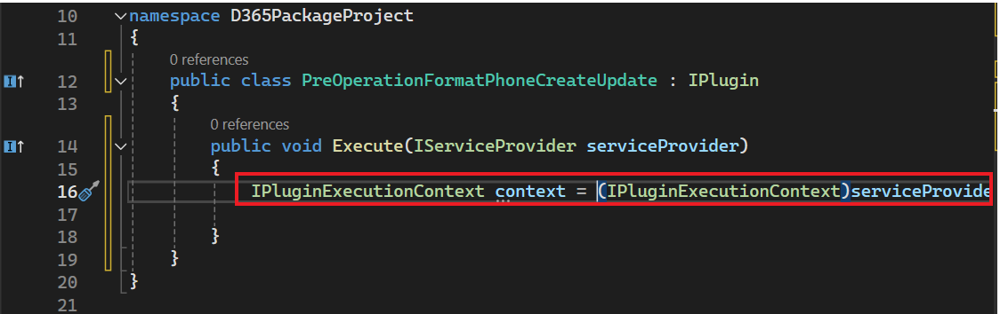

**Lab 6 - Scrivi il suoi primo plug-in**

**Durata stimata:** 30 min

**Obiettivo:** In questo scenario, un'organizzazione deve assicurarsi
che i data del numero di telefono vengano immessi in un formato
coerente. Per raggiungere questo obiettivo, creerai un plug-in da
eseguire durante la creazione/aggiornamento che elimina tutti i
caratteri non numerici da un numero di telefono prima di salvarlo in
Common Data Service.

In questa esercitazione verrà illustrato come creare un plug-in che
verrà eseguito durante la creazione e l'aggiornamento. Questo plug-in
eliminerà tutti i caratteri non numerici da un numero di telefono.

**Attività 1: Creare una nuova soluzione e un'app basata su modello**

1.  Passa a [Power Apps](https://make.powerapps.com/) usando
    +++<https://make.powerapps.com/>+++. Assicurati di essere nell'
    ambiente **Dev One**.

> 

2.  Nel riquadro di spostamento a sinistra selezionare **Solutions** e
    quindi selezionare **New solution**.

> 

3.  Nella finestra di dialogo a comparsa, specifica **Display name** –
    +++Plugin Lab+++, **Name** – +++PluginLab+++, **Publisher** – CDS
    Default publisher e quindi seleziona **Create**.

> 

4.  Per creare una nuova app basata su modello nella soluzione,
    selezionare **New** | **App** | **Model-driven** **app**.

> 

5.  Assegna il **Name** alla tua app basata su modello come
    +++**Fundraiser**+++ e quindi seleziona **Create**.

> 

6.  Nell'app basata su modello selezionare **+Add page**.

> 

7.  Seleziona **Dataverse table** nella finestra popup visualizzata.

> 

8.  Seleziona Tabella **contact**, quindi seleziona **Add**.

> 
>
> **Nota:** Per questo lab, stiamo utilizzando la tabella dei contatti.

9.  Ora, la tua app basata su modello denominata "**Fundraiser**" è
    pronta.

> 

10. Seleziona **Save** nell'angolo in alto a destra.

> 

11. Seleziona **Publish**.

> 

12. Fare clic sulla **back arrow** per tornare alla soluzione.

> 

13. Fai clic sulla **back arrow** e sarai sulla pagina della soluzione
    in cui sono elencate tutte le soluzioni.

> 

**Attività 2: Creare un plug-in**

1.  Avviare **Visual Studio 2022**. Per aprirlo, fai clic sul menu Start
    della VM, digita Visual Studio nella casella di ricerca e seleziona
    **Open**.

> 

2.  Seleziona **File | New | Project**.

> 

3.  Selezionare **Class Library(.NET Framework)** e selezionare
    **Next**.

> 

4.  Immettere **D365PackageProject** per **Project Name**, selezionare
    una posizione in cui salvare il progetto,

> 

5.  selezionare **.NET Framework 4.7.1** per **Framework** e quindi
    selezionare **Create**.

> 

6.  Fare clic con il pulsante destro del mouse sul progetto e scegliere
    **Manage NuGet Packages**.

> 

7.  Selezionare la scheda **Browse**, cercare e selezionare
    **microsoft.crmsdk.coreassemblies**, quindi selezionare **Install**.

> 

8.  Nella finestra Anteprima modifiche selezionare **Apply** per
    consentire a Visual Studio di apportare modifiche alla soluzione.

> 

9.  Selezionare **I Accept** per accettare le condizioni di licenza.

> 

10. Chiudere Gestione pacchetti NuGet.

> 

11. Fare clic con il pulsante destro del mouse su **Class1.cs** ed
    **Delete**.

> 

12. Selezionare **OK** per eliminare Class1.cs definitivamente.

> 

13. Fare clic con il pulsante destro del mouse sul progetto e quindi
    selezionare **Add | Class**.

> 

14. Assegnare alla nuova classe il nome
    **PreOperationFormatPhoneCreateUpdate** e selezionare **Add**.

> 

15. Aggiungere le istruzioni using alla nuova classe come indicato di
    seguito:

> using Microsoft.Xrm.Sdk;
>
> using System.Text.RegularExpressions;
>
> 

16. Per rendere **public** la classe, sostituire l'interno con pubblico
    e digitare**: IPlugin** alla fine del passaggio per aggiungere
    l'interfaccia IPlugin come mostrato nell'immagine seguente.

> 

17. Passa il mouse sull'interfaccia IPlugin, fai clic sull'icona di
    azione rapida che appare e quindi seleziona **Implement interface**.

> 
>
> La tua classe dovrebbe ora assomigliare all'immagine seguente.
>
> 

**Attività 3: Formattare un numero di telefono**

1.  Ottenere il contesto di esecuzione dal provider di servizi.
    Sostituire l'eccezione nel metodo Execute con il frammento di codice
    seguente.

> IPluginExecutionContext context =
>
> (IPluginExecutionContext)serviceProvider.GetService(typeof(IPluginExecutionContext));
>
> 

2.  Controllare il parametro di input per Target. Aggiungere il
    frammento di codice seguente al metodo Execute.

> if (!context. InputParameters.ContainsKey("Target"))
>
> throw new InvalidPluginExecutionException("No target found");
>
> 

3.  Aggiungere il frammento di codice seguente al metodo Execute. Questo
    frammento di codice otterrà l'entità di destinazione dal parametro
    di input e quindi verificherà se i relativi attributi contengono
    telephone1 (Telefono aziendale per i contatti, Telefono per gli
    account).

> Var entity= context.InputParameters\["Target"\] as Entity;
>
> if (!entity. Attributes.Contains("telephone1"))
>
> return;
>
> 

4.  Aggiungere il frammento di codice seguente alla funzione Execute.
    Questo frammento di codice rimuoverà tutti i caratteri non numerici
    dal numero di telefono fornito dall'utente.

> string phoneNumber = (string)entity\["telephone1"\];
>
> var formattedNumber = Regex.Replace(phoneNumber, @"\[^\d\]", "");
>
> 

5.  Impostare telephone1 sul numero di telefono formattato. Aggiungere
    il frammento di codice seguente al metodo Execute.

> entity\["telephone1"\] = formattedNumber;
>
> 
>
> Il metodo Execute dovrebbe ora essere simile all'immagine seguente.
>
> 

6.  Fare clic con il pulsante destro del mouse sul progetto e scegliere
    **Properties**.

> 

7.  Seleziona la scheda **Signing** e seleziona \<**New... \>** file
    chiave.

> 

8.  Immettere +++**contoso.snk**+++ nel campo **Key file name**,
    deselezionare la casella di **Protect my key file with a password**
    e quindi selezionare **OK**.

> 

9.  Chiudere la scheda **Properties**.

> 

10. Seleziona la scheda **Build** e fai clic su **Build Project.**

> 

11. Assicurarsi che la compilazione abbia esito positivo.

> 

**Attività 4: Registrare un plug-in e procedura**

1.  Vai al menu **Start** della VM, digita plug-in registration tool
    nella casella di ricerca e fai clic su **Open**.

> 

2.  Seleziona **Create New connection**.

> 

3.  Selezionare **Office 365,** selezionare la casella di **Show
    Advanced**, nel campo Area online selezionare **Don’t Know**,
    specificare le credenziali (tenant amministratore M365) e quindi
    selezionare **Login**.

> 

4.  Selezionare **Register,** quindi **Register New Assembly**.

> 

5.  Seleziona **...** nel passaggio 1 e quindi vai al **Bin | Debug**
    Cartella della libreria di classi creata.

> 

6.  Seleziona **D365PackageProject.dll**, quindi seleziona **Open**.

> 

7.  Seleziona **Register Selected Plugins**.

> 

8.  Selezionare **OK.**

> 

9.  Espandere l'assembly appena registrato: **(Assembly)
    D365PackageProject**.

> 

10. Fare clic con il pulsante destro del mouse sul plug-in e selezionare
    **Register New Step**.

> 

11. Seleziona **Create** per **Message** e seleziona **Contact** per
    **Primary Entity**.

> 

12. Selezionare **PreOperation** per **Event Pipeline Stage of
    Execution**, quindi selezionare **Register New Step**.

> 

13. Selezionare **Close** nella pagina Avviso che indica che non sono
    stati rilevati filtri sugli attributi.

> 

14. Se viene visualizzato il messaggio di errore, ad esempio si è
    verificato un errore durante la registrazione del passaggio,
    selezionare **No** per visualizzare i dettagli.

> 

15. Verifica che il passaggio di creazione sia stato creato nel plug-in.

> 

16. Fare clic con il pulsante destro del mouse sul plug-in e selezionare
    nuovamente **Register New Step**.

> 

17. Seleziona **Update** per **Message**, seleziona **Contact** per
    **Primary Entity**, quindi seleziona la ricerca **Attributes**.

> 

18. Deselezionare la casella di controllo **Select All**, selezionare la
    casella di controllo **Business Phone** e quindi selezionare **OK**.

> 

19. Selezionare **PreOperation** per **Event Pipeline Stage of
    Execution**, quindi selezionare **Register New Step**.

> 

20. Se viene visualizzato il messaggio di errore, ad esempio **Error
    occured while registering the step**, selezionare **No** per
    visualizzare i dettagli.

> 

21. Verifica che il passaggio di creazione sia stato creato nel plug-in.

> 

**Attività 5: Testare il plug-in**

1.  Vai al suoi Maker Portal +++<https://make.powerapps.com/>+++ e
    assicurati di essere nell'ambiente **Dev One** selezionato.

2.  Seleziona **Apps** e avvia l' applicazione **Fundraiser**.

> 

3.  Seleziona **+ New**.

> 

4.  Immettere +++**Test**+++ per **First** **Name**, +++**Contact**+++
    per **Last Name**, +++**(123)-555-0100+++** per **Business Phone**,
    quindi selezionare **Save**.

> 
>
> Il record deve essere salvato e il **Business Phone** deve mostrare
> solo i valori numerici.
>
> 

5.  Cambia il **Business phone** in **001-123-555-0100** e fai clic su
    **Save**. Il record deve essere aggiornato e il **Business Phone**
    deve mostrare solo i valori numerici.

> 

**Riepilogo:** in questa esercitazione si è appreso come creare un
plug-in che verrà eseguito durante la creazione e l'aggiornamento e come
eliminare tutti i caratteri non numerici da un numero di telefono
utilizzando questo plug-in.
