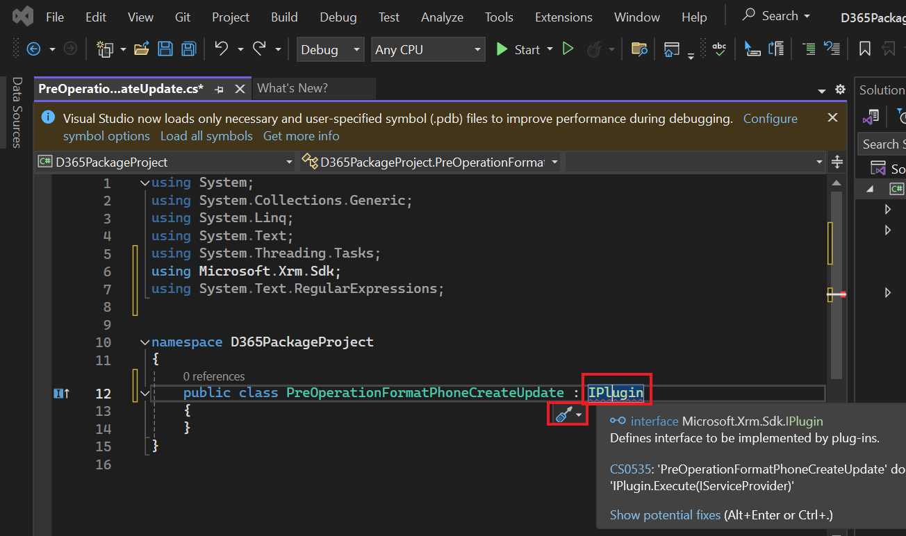

**Laboratório 6 - Escreva seu primeiro plug-in**

**Duração estimada:** 30 minutos

**Objetivo:** Nesse cenário, uma organização precisa garantir que os
dados do número de telefone sejam inseridos em um formato consistente.
Para atingir esse objetivo, você criará um plug-in para ser executado na
criação/atualização, que remove todos os caracteres não numéricos de um
número de telefone antes de salvá-lo no Dataverse.

Neste laboratório, você aprenderá a criar um plug-in que será executado
na criação e atualização. Este plug-in removerá todos os caracteres não
numéricos de um número de telefone.

**Tarefa 1: Criar uma nova solução e um aplicativo orientado por
modelo**

1.  Acesse o [Power Apps](https://make.powerapps.com/) usando
    +++<https://make.powerapps.com/>+++. Certifique-se de estar no
    ambiente **Dev One.**

> 

2.  No painel de navegação esquerdo, selecione **Solutions** e, em
    seguida, **New solution**.

> 

3.  Na caixa de diálogo suspensa, especifique **Display name** –
    +++Plugin Lab+++, **Name** – +++PluginLab+++, **Publisher** – CDS
    Default publisher e selecione **Create**.

> 

4.  Para criar um novo aplicativo orientado por modelo em sua solução,
    selecione **New** | **App** | **Model-driven app**.

> 

5.  Dê o **Name** ao seu aplicativo orientado por modelos como
    +++**Fundraiser**+++ e então selecione **Create**.

> 

6.  No aplicativo orientado por modelo, selecione **+ Add page**.

> 

7.  Selecione a **Dataverse table** no pop-up exibido.

> 

8.  Selecione a tabela **Contact** e depois **Add**.

> 
>
> **Observação:** Para este laboratório, estamos usando a tabela
> Contato.

9.  Agora, seu aplicativo baseado por modelo chamado “Funraiser” está
    pronto.

> 

10. Selecione **Save** no canto superior direito.

> 

11. Selecione **Publish**.

> 

12. Clique na **seta voltar** para retornar à sua solução.

> 

13. Clique na **seta voltar** e você será direcionado para a página de
    soluções, onde todas as soluções estão listadas.

> 

**Tarefa 2: Criar um plug-in**

1.  Inicie o **Visual Studio 2022.** Para abri-lo, clique no menu
    Iniciar da VM, digite Visual Studio na caixa de pesquisa e selecione
    **Open**.

> 

2.  Selecione **File | New | Project**.

> 

3.  Selecione **Class Library (.NET Framework)** e selecione **Next**.

> 

4.  Digite **D365PackageProject** para **Project Name**, selecione um
    local para salvar o projeto,

> 

5.  Selecione **.NET Framework 4.7.1** para **Framework** e, em seguida,
    selecione **Create**.

> 

6.  Clique com o botão direito do mouse no projeto e selecione **Manage
    NuGet Packages**.

> 

7.  Selecione a aba **Browse**, pesquise e selecione
    **microsoft.crmsdk.coreassemblies** e, em seguida, selecione
    **Install**.

> 

8.  Na janela Visualizar alterações, selecione **Apply** para permitir
    que o Visual Studio faça alterações na solução.

> 

9.  Selecione **I Accept** para aceitar os termos da licença.

> 

10. Feche o gerenciador de pacotes NuGet.

> 

11. Clique com o botão direito em **Class1.cs** e **Delete**.

> 

12. Selecione **OK** para excluir Class1.cs permanentemente.

> 

13. Clique com o botão direito do mouse no projeto e selecione **Add |
    Class**.

> 

14. Nomeie a nova classe **PreOperationFormatPhoneCreateUpdate** e
    selecione **Add**.

> 

15. Adicione as instruções using à nova classe da seguinte maneira:

> using Microsoft.Xrm.Sdk;
>
> using System.Text.RegularExpressions;
>
> 

16. Para tornar a classe **public**, substitua internal por public e
    digite: **IPlugin** no final da etapa para adicionar a interface
    IPlugin, conforme mostrado na imagem abaixo.

> 

17. Passe o mouse sobre a interface IPlugin, clique no ícone de ação
    rápida que aparece e selecione **Implement interface**.

> 
>
> Sua classe agora deve parecer com a imagem a seguir.
>
> 

**Tarefa 3: Formatar um número de telefone**

1.  Obtenha o contexto de execução do provedor de serviços. Substitua a
    exceção no método Execute pelo seguinte trecho.

> IPluginExecutionContext context =
>
> (IPluginExecutionContext)serviceProvider.GetService(typeof(IPluginExecutionContext));
>
> 

2.  Verifique o parâmetro de entrada para Target. Adicione o seguinte
    trecho ao método Execute.

> if (!context.InputParameters.ContainsKey("Target"))
>
> throw new InvalidPluginExecutionException("No target found");
>
> 

3.  Adicione o seguinte trecho ao método Execute. Este trecho obterá a
    entidade de destino do parâmetro de entrada e verificará se seus
    atributos contêm telephone1 (Telefone Comercial para Contatos,
    Telefone para Contas).

> var entity = context.InputParameters\["Target"\] as Entity;
>
> if (!entity.Attributes.Contains("telephone1"))
>
> return;
>
> 

4.  Adicione o seguinte trecho à função Execute. Este trecho removerá
    todos os caracteres não numéricos do número de telefone fornecido
    pelo usuário.

> string phoneNumber = (string)entity\["telephone1"\];
>
> var formattedNumber = Regex.Replace(phoneNumber, @"\[^\d\]", "");
>
> 

5.  Defina telephone1 como o número de telefone formatado. Adicione o
    seguinte trecho ao método Execute.

> entity\["telephone1"\] = formattedNumber;
>
> 
>
> O método Execute agora deve se parecer com a imagem a seguir.
>
> 

6.  Clique com o botão direito do mouse no projeto e selecione
    **Properties**.

> 

7.  Selecione a aba **Signing** e selecione \< **New …\>** Arquivo de
    Chave.

> 

8.  Digite +++**contoso.snk**+++ no campo **Key file name**, desmarque a
    caixa de seleção **Protect my key file with a password** e selecione
    **OK.**

> 

9.  Feche a aba **Properties**.

> 

10. Selecione a aba **Build** e clique em **Build Project**.

> 

11. Certifique-se de que a compilação seja bem-sucedida.

> 

**Tarefa 4: Registrar um plug-in e etapas**

1.  Vá para o menu **Start** da VM, digite ferramenta de registro de
    plug-in na caixa de pesquisa e clique em **Open**.

> 

2.  Selecione **Create New Connection**.

> 

3.  Selecione **Office 365,** marque a caixa de seleção **Show
    Advanced**, no campo Região Online, selecione **Don’t Know**,
    forneça suas credenciais (M365 Admin tenant) e selecione **Login.**

> 

4.  Selecione **Register** e depois **Register New Assembly**.

> 

5.  Selecione **...** em Etapa 1 e navegue até a pasta **Bin | Debug**
    da biblioteca de classes que você criou.

> 

6.  Selecione **D365PackageProject.dll** e depois selecione **Open**.

> 

7.  Selecione **Register Selected Plugins**.

> 

8.  Selecione **OK.**

> 

9.  Expanda o assembly recém-registrado – **(Assembly)
    D365PackageProject**.

> 

10. Clique com o botão direito do mouse no plug-in e selecione
    **Register New Step**.

> 

11. Selecione **Create** para **Message** e selecione **contact** para
    **Primary Entity**.

> 

12. Selecione **PreOperation** para o **Event Pipeline Stage of
    Execution** e, em seguida, selecione **Register New Step**.

> 

13. Selecione **Close** na página de Aviso que informa que nenhum filtro
    nos atributos foi detectado.

> 

14. Se você receber a mensagem de erro Error occurred while registering
    the step, selecione **No** para ver os detalhes.

> 

15. Verifique se a etapa de criação foi criada no Plug-in.

> 

16. Clique com o botão direito do mouse no plug-in e selecione
    **Register New Step** novamente.

> 

17. Selecione **Update** para **Message**, selecione **contact** para
    **Primary Entity** e, em seguida, selecione a pesquisa
    **Attributes**.

> 

18. Desmarque a caixa de seleção **Select All**, marque a caixa de
    seleção **Business Phone** e selecione **OK.**

> 

19. Selecione **PreOperation** para o **Event Pipeline Stage of
    Execution** e, em seguida, selecione **Register New Step**.

> 

20. Se você receber a mensagem de erro Error occurred while registering
    the step, selecione **No** para ver os detalhes.

> 

21. Verifique se a etapa de criação foi criada no Plug-in.

> 

**Tarefa 5: Teste o plug-in**

1.  Acesse seu Portal do Criador +++<https://make.powerapps.com/>+++ e
    certifique-se de que você está no ambiente **Dev One** selecionado.

2.  Selecione **Apps** e inicie o aplicativo **Fundraiser.**

> 

3.  Selecione **+ New**.

> 

4.  Digite +++**Test**+++ para **First Name**, +++**Contact**+++ para
    **Last Name**, +++**(123)-555-0100**+++ para **Business Phone** e
    então selecione **Save**.

> 
>
> O registro deve ser salvo e o **Business Phone** deve mostrar apenas
> os valores numéricos.
>
> 

5.  Altere o **Business Phone** para **001-123-555-0100** e clique em
    **Save**. O registro deverá ser atualizado e o **Business Phone**
    deverá exibir apenas os valores numéricos.

> 

**Resumo:** Neste laboratório, você aprendeu como criar um plug-in que
será executado na criação e atualização e como remover todos os
caracteres não numéricos de um número de telefone usando este plug-in.
